王树义

读完需要

18

分钟

速读仅需 6 分钟

横看成岭侧成峰，远近高低各不同。

***1***

**疑问**

读了我的《如何高效实践卡片式写作？》之后，有读者提出了疑问：

王老师，你所描述的卡片式写作，看来写篇博客或者写部小说，应该还可以。用来写学术论文不合适吧？

其观点的理据，在于学术论文往往是标准体例，分割划块的。

例如 Clayton Bingham 博士就在他的 Quora 问答里面给出了这张图。

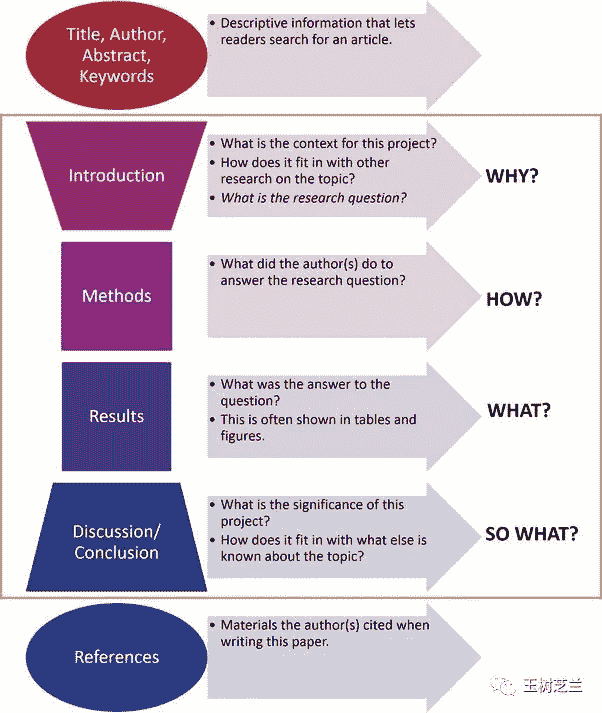

虽然不同学科，模块划分传统不尽相同，不过主体上大概也就是下面这几部分：

> *   引言；
>     
>     
> *   文献回顾；
>     
>     
> *   研究设计；
>     
>     
> *   研究结果与讨论；
>     
>     
> *   结论

这样看来，章节的要素，都是提前规划好的。那么显然是自顶向下的方法，更为适合啊。卡片法自底向上，显得舍近求远，效率想必是不高了？

你能提出这样的疑问，我很理解。也感谢你非常坦率地表述了自己的疑惑。

回答你的问题之前，我们先来看看，学术界有没有人用卡片法来创作学术论文和专著，以及效果如何。

***2***

**奇人**

让我理解卡片法的功效的，是个奇人。

这个人，生活在 20 世纪的德国，叫做尼古拉斯卢曼（Niklas Luhmann）。

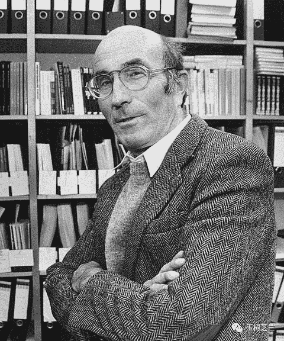

卢曼是一位社会学家。

他当年学的专业，可不是社会学，而是法律。毕业之后，他从事朝九晚五的公务员工作。

社会学，只是他的业余爱好。他会用笔记卡片记录自己读书心得，用卡片盒来编织自己的社会学见解之网。

谁也没想到，原本的业余爱好和独特的笔记方法，竟会改变他一生职业选择。

有一天，他把自己的稿子拿给社会学家 Helmut Schelsky 看。对方印象非常深刻，于是建议他到新成立的 Bielefeld 大学去做教授。

这是个好事儿，不过有个「小问题」。

在德国，要做教授，不仅需要有博士学位，而且还得获得「特许任教资格」（habilitation）。在欧洲上学的同学，可能对这个词儿比较熟悉。中国和美国的学生，可能都未必听说过这玩意儿。

为了表述严谨，我直接从维基百科把定义抄了下来：

特许任教资格是一个人在欧洲及亚洲的一些国家可以取得的最高的学术资格。在获得博士学位或其他同等学位后，特许任教资格需要候选人在其独立的学术成就的基础上撰写一篇专业性论文，然后提交并通过一个学术委员会的答辩，其过程像完成博士论文。但是其学术水平必须超过博士论文所应达到的水平。有时，学术著作的出版是答辩的前提条件。

对卢曼来说，这意味着，走向教职的路上，他还差一个博士学位，以及之后一部比博士论文难度更高、挑战更大的著作。

要是你，听见别人给你这种建议，你会怎么说？

（请认真思考 15 秒）

卢曼的答复是：

好啊！

对比一下，跟你的答案一致不？

他的做法，是到大学里边选修社会学课程，边写博士毕业论文。几乎同时，写用于申请 habilitation 的著作。其中最为困难的后两项，花了他多久呢？

不到一年。

完成博士毕业论文这种标准的学术著作，卢曼使用的方法，依然还是他的卡片盒。

这还不算，顺利任教以后，卢曼继续用他的卡片大法，创作论文和专著。30 年间，他出版了 58 部著作、数以百计的学术论文，这还不包含他的翻译作品。

最令人印象深刻的是，就连去世后，卢曼还出版了好几本著作。

......

吃惊吧？

其实讲起来，倒也没有那么诡异。临去世的时候，有几本书的手稿，卢曼已经用卡片建构得几乎完工了。可惜天不假年，他没有来得及给自己的学术大厦封顶，就驾鹤西去了。同事和朋友帮忙做了些整理工作，这些著作自然也就在卢曼去世后，以他的署名顺利出版了。

从这里，你可以非常清楚地看到，卢曼的工作，绝对不是单线程的。否则那几本著作，应该是一本本写完，而不会像这样好几本大部头同时铺开。

***3***

**秘笈**

看到这里，你会不会觉得，这种写作方法，简直就是学术界的秘密武器呢？

我们的概念里，往往很尊崇《老子》三六章里那句：

国之利器，不可以示人。

有意思的是，真正的写作大师，似乎从来也没有想过对自己的写作技法进行任何的保密处理。纳博科夫如此，卢曼也如此。

我曾经看过一部卢曼的纪录片。片中卢曼亲自给人展示，他是如何用卡片法来进行创意管理、素材积累和创作的。

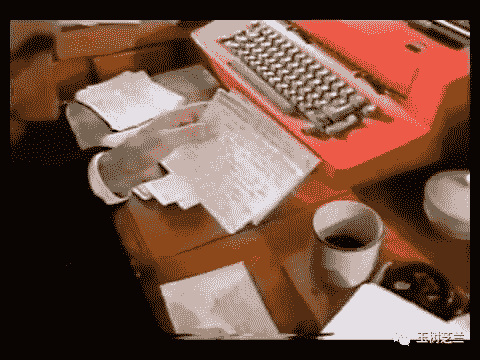

只不过，从导演到观众，当时估计没谁把卢曼的这部分介绍真正当回事儿。因为这一部分在整个儿影片中所占篇幅极短，几乎可以忽略。

卢曼过世以后，人们好像突然醒悟了过来：

这方法，好像很好用啊！

近年来，对于卢曼卡片式写作方法的研究，逐渐变得多了起来。

你说不对啊，从来没听说过啊！

也不奇怪。因为这些研究，主要都是德国人搞的。德语用户，比起英语和中文来，真的不算多。所以卢曼卡片创作的研究，也就大都在德语使用者内部自产自销了。

这些人，一直在推广 zettelkasten 这个概念。Zettelkasten 是德语，翻译成中文，约等于是「卡片盒」。

研究者们希望，对卢曼卡片盒的研究成果（包括流程、方法和软件工具）能够帮助到更多人。

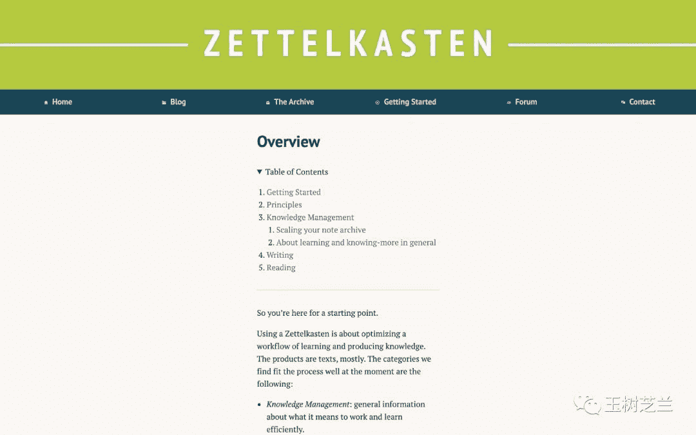

对，你发现了，他们还做了工具。

我尝试了一下，实话实说，觉得不怎么好用。至少这个工具对中文支持不是很完善。

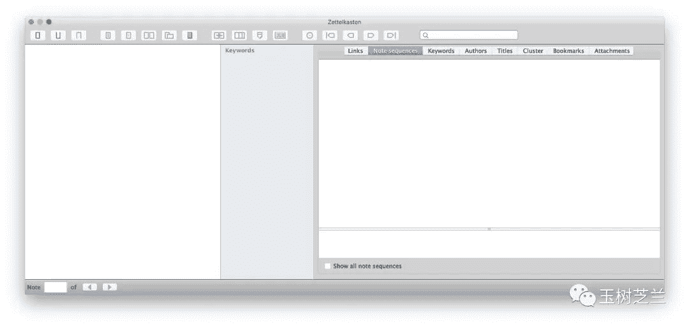不过你如果想尝试一下的话，链接在这里。欢迎你把测试的结果，通过留言或者私信的方式与我和其他读者交流分享。

***4***

**实质**

讲了这些，你大概能从感性上了解到，卡片盒方法不但适合学术写作，而且能够消除学术写作的痛苦，给你带来轻松和愉悦感，甚至使你变成高产学者。

但是回到最初的问题------学术文章，不就该是洋八股文体例吗？自顶向下、分割包围的方式岂不更是有效直击要害？

我们还是得回到史蒂芬平克那段话（选自《风格感觉》），去找寻渊源：

写作之难，在于把网状的思考，用树状的语法结构，转换成线性字符串。（"The Web, the Tree, and the String"）。

论文重要的，真的是最后形成的那几千或者几万线性文字吗？

如果你真的是这么想，恐怕是因为当年的升学考试作文，给你留下了难以抚平的创伤。尤其是题目后面括号里的那句：

字数不少于 800 字。

论文不是作文，更不是考试作文。论文的高下，不是看谁的字儿多，谁用的方法繁复，谁做的图表炫目......

在《[如何与导师有效沟通你的论文选题？](http://mp.weixin.qq.com/s?__biz=MzIyODI1MzYyNA%3D%3D&chksm=f389bb93c4fe32859369249715b6104144bea7a364122cc58a0daad9504c79d34e74c993ddf8&idx=1&lang=zh_CN&mid=2653540676&scene=21&sn=7ff14b24e2a1987141385b2dd4e6a738&token=831034875#wechat_redirect)》一文里，我曾经给你介绍过「认知差」的概念。

读者阅读你的论文前后，对于你所要探讨的问题，认知发生的变化。

论文是学术界的同步更新包，是「认知差」的载体。文献的发表，是为了在学术界的分布式知识网络进行沟通和升级。论文的深度，是看你能不能在这个刺刀见红的学术竞技场上找到有趣的问题，并且自圆其说。

在这里，选择比努力更重要，创意比内容更重要。

至于最终线性文字的格式，当然必要遵守规范。然而，对于一篇论文的价值衡量，其优先级并不高。

要达成这种竞争优势，你就得了解，尤其是批判式地理解其他学者说了什么。你得不断积累，像燕子衔泥一样，不断累积自己在领域中的见识、经验和判断。

而这种迭代式进步，恰恰是卡片式写作，这种自底向上、链接优先的工具，真正可以帮助你有效达成的。

你如同一位武学高手，紧守门户，不轻举妄动。眼睛时刻盯着对手的举动，当确认破绽出现的时候，一击而中。

翻译过来，便是在你长久积累构造的知识网络被某个新条件激活的时候，提出你自己的观点，设置你自己的议题。快速拼接成稿，发表出去，为别人提供认知差。

这些学术发表背后深层次本质特点，你倘若不能关注，反而只盯着期刊印刷论文上的分段标题和标准格式，是不利于进步的。武断判定，说卡片法不适合学术写作，是不是会让你与一种好的方法失之交臂呢？

***5***

**实践**

这样说，你可能觉得还不够接地气。好，咱们就来举个实际的例子。

在《[如何选研究题目？](https://mp.weixin.qq.com/s?__biz=MzIyODI1MzYyNA%3D%3D&idx=1&mid=2653540242&scene=21&sn=e7a3570ca46b59896b5b537ed99d35a9#wechat_redirect)》一文里面，我给你介绍过一种选择论文题目的方法——经典文献 PK，也称作「文献打架」法。

提出这种方法的是佐治亚理工的吴东军教授 (D.J. Wu）。

这里给你简要复习一下吴老师对「经典文献 PK」方法的说明：

例如一篇文献 A 提出某观点。可能一段时间以后另一篇文献 B 用坚实的证据把该观点驳斥得体无完肤。人们就倾向于新的文献 B 观点，奉为圭臬。但是文献 A 当初是怎么从审稿人的手底下滑过去的？它想必是有合理和可取之处的。于是你就可以从这样的文献间冲突出发，用更为全面的模型考虑在哪一种情况下，A 的论点依然会成立。从而对经典文献给予（有条件的）支持。

这种方法的好处，是因为 A 和 B 文献都是经典文献，这就相当于替你把研究的价值和必要性证明出来了。够巧妙吧？

相信你看完之后，会有一种强烈的冲动，也希望自己用这种方式来找出好研究问题。

可是，真正实践起来，你会发现，这事儿好像没有看起来那么简单。

为什么呢？

因为如果两篇文献，你都读过，观点刚好相反，你还都记忆犹新，并且能够准确说出二者之间的矛盾关系，那......别人就看不见吗？

这些条件同时出现，你算算概率。如果真的能被你碰到，就真是交了极大的好运。

一般情况下，这种学术界「低垂的果实」虽然存在，但是过于稀少。以守株待兔的方法，寄希望 RP 值爆发碰上，太难了。

那么，如何才能应用这个「经典文献 PK」方法呢？

你必须借助一种不对称的力量。

两篇文献内在蕴含矛盾，但是别人很难发现，想必它们之间的联系不是很近。你很有可能是从不同的渠道（例如不同领域的刊物、不同介质的载体......），分别读到这两篇文献。这中间，不仅有文献属性上的区别，更可能距离时间的间隔。

那你需要做的，就是在阅读第二篇文献的时候，敏锐地想起第一篇文献来。

你凭什么记得？

你的头脑，不会遗忘吗？

当然会。会遗忘才是正常的头脑。

曾经读过的内容，你会遗忘。

时间久远的笔记，你恐怕也早已忘记。

再见到他们的时候，甚至会怀疑——这难道是我写的？

但是，好消息是，你的「卡片盒」（笔记网络）不会遗忘。

对于你个人而言，阅读新文献，使之可以实质上更新你的知识系统，需要笔记作为中间环节。

新看了一篇文献之后，有可能有非常大的冲动，希望把一些东西记载下来。这时候你的头脑最为清晰，对知识的感受最强烈。

就如同《笑傲江湖》里面「秃笔翁」剑意被令狐冲的「独孤九剑」逼住，转而潇洒写狂草时的情绪与行为。

之前的文献给你带来的认知差，已被你用笔记的方式消化。

只有笔记加入到了卡片盒，形成知识的网络，你才可能在新的「认知安装包」（文献）到来的时候，将之融入你的系统，并且对原有的知识网络进行订正。

如果你秉持卡片式笔记法，时刻在记录新笔记，并且将其放入卡片盒中之前，眼睛扫一眼卡片盒当中存在的笔记网络，尝试添加、删除与更新，那么你就能比别人以更高的概率发现新的一篇阅读文献，与之前文献间存在的矛盾与冲突。

看「经典文献 PK」方法应用的困难，就这样轻而易举地被你的卡片盒解决了。

以上举的，还只是《[如何选研究题目？](https://mp.weixin.qq.com/s?__biz=MzIyODI1MzYyNA%3D%3D&idx=1&mid=2653540242&scene=21&sn=e7a3570ca46b59896b5b537ed99d35a9#wechat_redirect)》一文中列举的方法之一，至于该文列出的其他方法，你也可以充分展开联想，运用思考与研究能力，尝试举一反三，将它们与高效可行的工作方式结合起来，从而事半功倍，完成选题、研究与论文撰写工作。

顺便说一句，《[如何选研究题目？](https://mp.weixin.qq.com/s?__biz=MzIyODI1MzYyNA%3D%3D&idx=1&mid=2653540242&scene=21&sn=e7a3570ca46b59896b5b537ed99d35a9#wechat_redirect)》一文中我给你提到过挖掘前人文献末尾「工作展望」内容形成选题的困难。南京理工大学章成志教授，已经以 ACL 年会论文为数据来源，构建了「工作展望」语料库（ACLFWS-RC）。

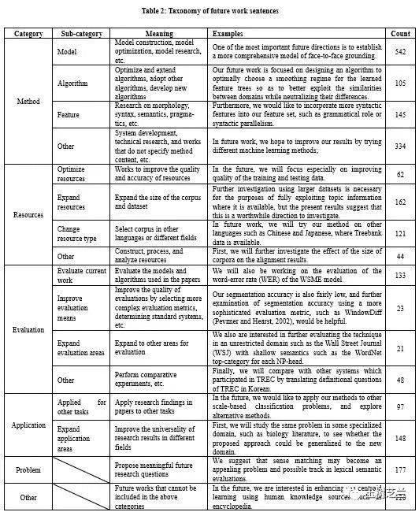

该研究成果已经被图情学界顶会之一 JCDL 2020 录用为长论文。不久的将来，你就能读到这篇文章，并且应用它来解决痛点，预判某个研究领域的发展方向了。

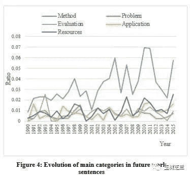

***6***

**路径**

读到这里，你可能会好奇：

王老师，你是通过什么途径了解到卢曼的卡片笔记写作法呢？

其实也是巧合。算是「信息偶遇」的一个例证吧。

经常看我文章的读者都知道，我一直喜欢用 Markdown 来写作。包括写公众号、论文，甚至是做幻灯。

这里面，经常会用到个 Markdown 文本包格式，叫做 TextBundle 。维护者专门做了个网站，宣传和推广这种格式。

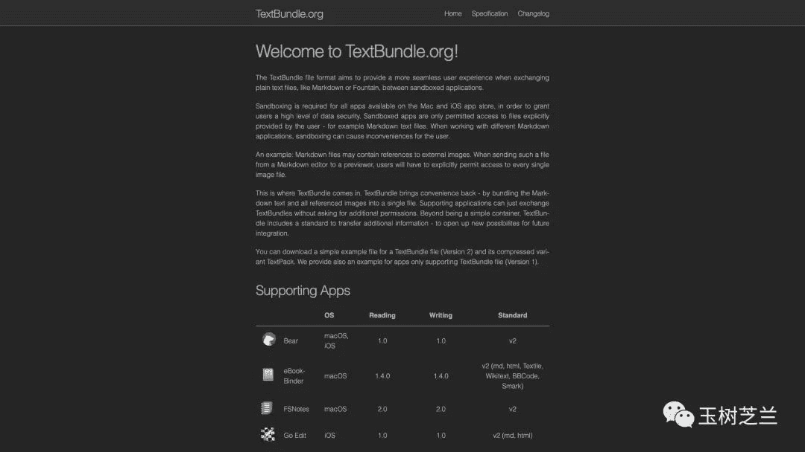

我时常会上他家网站看一眼，有没有新的软件支持这种格式，以便于我处理不同的 Markdown 写作和转换需求。

就在不久之前，我看到了其中有个开源的工具，叫做 Zettlr 。我觉得名字挺怪，同时支持 Textbundle 格式读写功能，又是个免费软件，就下载了下来。

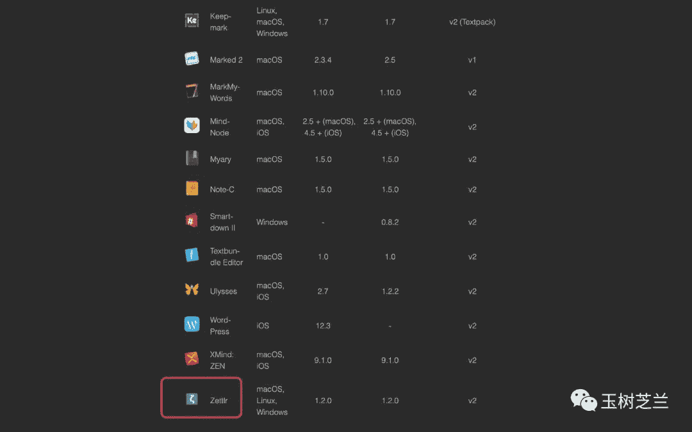

通过试用，我发现 Zettlr 中很大一部分功能，就是面向卡片盒方法的。

软件作者，还煞有介事地弄了个"卡片盒宣言"。第一次看时，让我啼笑皆非。

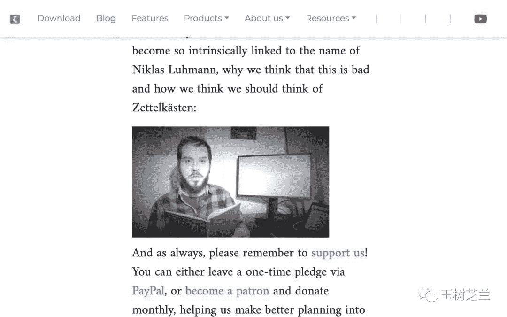

从这里，我顺藤摸瓜，找到了 Sönke Ahrens 的一本系统介绍卡片盒方法的书，叫做 "How to Take Smart Notes"。

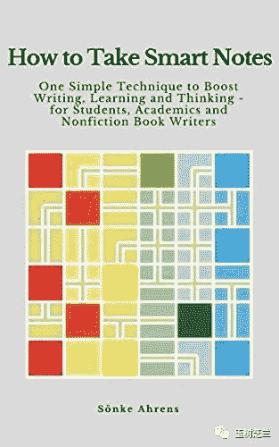

很可惜，至本文写作时（2020 年 3 月初），该书还没有中译本。我买的是 Kindle 上的英文版本，链接在这里。

书的作者 Sönke Ahrens ，本身就是位博士。他钻研卢曼的卡片盒方法，其实也是因为深感学术写作的痛点，希望能彻底改变原先令人很不愉快的研究和写作流程。令人唏嘘的是，原先的方法尽管效率低下，人们却普遍接受和传承下来。

Sönke Ahrens 的这本书，就是用卡片法写出来的。他自述，写作过程很愉快。

这种方法可以帮你把压抑、紧张和痛苦的学术大部头写作，真正转变成一种享受。如果你曾经或者正在被毕业论文折磨，是不是需要深入学习一下它呢？

***7***

**小结**

本文从一个读者提出的问题入手，为你谈了以下几点。

> *   卡片式写作适合学术创作。它注重构建网络，形成复杂知识复利，有效帮你为他人提供认知差；
>     
>     
> *   以「经典文献 PK」选题方法作为例子，咱们探讨了卡片法可以在你的研究选题中起到的重要作用；
>     
>     
> *   通过介绍卢曼的学术生涯，你可以管窥到卡片式写作可以给学者带来愉悦学术高产体验；
>     
>     
> *   如何通过线索的挖掘和有效的笔记方式，把信息偶遇的「运气」变成实实在在的收获。

感觉有用的话，请点“在看”，并且把它转发给你身边有需要的朋友。

*AI学习路线和优质资源，在后台回复"AI"获取*

