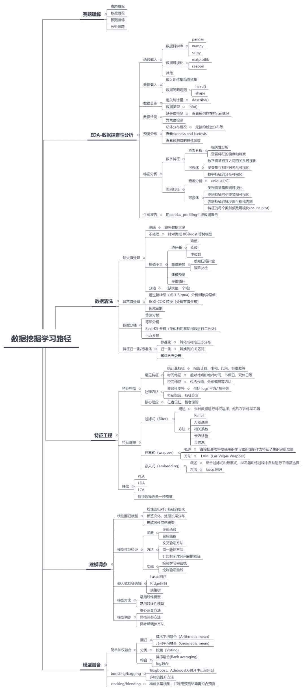

Datawhale学习

**主办：****Datawhale 天池**

寄语：本次数据挖掘专题组队学习，旨在理论结合实践，帮助学习者掌握数据挖掘相关知识，提升在实际场景中的数据分析、特征工程、建模调参和模型融合等技能。

这是Datawhale组织的第十一期学习。继上一期与交大伯禹、和鲸科技联合举办深度学习公益学习后，这期我们将与阿里天池联合举办数据挖掘专题学习，同时在天池开放了入门级数据挖掘赛事，对赛题理解、数据分析、特征工程、建模调参、模型融合进行了专题分享，做到以赛促学，在实际场景中实践数据挖掘知识。

## 关于开源

**开源目的**：Datawhale作为开源组织，更多是希望营造互促的学习氛围和纯粹的学习环境，所有学习内容和学习规划都将开源在Datawhale Github上，方便大家有监督和无监督学习，从而帮助到更多学习者成长。同时也希望成长后的学习者参与到开源贡献，进行迭代完善，形成良性循环。

**开源地址**：

https://github.com/datawhalechina/team-learning

**组队学习**：关于组队学习，顾名思义，就是一群志同道合的小伙伴聚集一起，一起学习，一起讨论，一起组队打boss，一起克服拖延症。其实没有老师，没有教学，有的是一群热爱学习和渴望改变的小伙伴，交流学习，互促共进。

事不宜迟，来看看这次有哪些学习内容吧。

## 开源内容

**开源贡献**：王茂霖、蜗牛车、陈泽、小雨姑娘

*   王茂霖

*   华中科技大学研究生, 长期混迹Tianchi

    github: https://github.com/mlw67

*   蜗牛车

*   东南大学硕士

    公众号：AI蜗牛车

    知乎：https://www.zhihu.com/people/seu-aigua-niu-che

*   陈泽

*   复旦大学计算机硕士

    知乎：阿泽 https://www.zhihu.com/people/is-aze

*   小雨姑娘

    数据挖掘爱好者，多次获得比赛TOP名次。

    知乎：小雨姑娘的机器学习笔记 https://zhuanlan.zhihu.com/mlbasic

**开源路线**：数据挖掘学习路径（14天学习）



***完整电子版（共100多页）***：如有需要，在Datawhale后台回复 **数据挖掘电子版** 获取

## 学习实践

Datawhale与天池开放了零基础入门数据挖掘赛事：「二手车交易价格预测」，让学习与实践结合。同时对于Datawhale组队学习中的优秀学习者，优秀队长，天池将颁发官方证书和礼品，在这里特别感谢天池爸爸的支持。

*详情页：https://tianchi.aliyun.com/competition/entrance/231784/information*

## 参与学习

**学习规则**

1.组织学习本身非盈利目的，避免非学习占用名额，需交9.9元督促金，完成所有学习后返还；

2.需要有一个CSDN或Github帐号；

3.按照任务安排进行学习，完成后写学习笔记blog；

4.每次任务截止之前在群内打卡(发blog链接)，遇到问题可在群内讨论；

5.未按时打卡的同学视为自动放弃，流出学习群。

**报名方式**

**3月19日 20:00** 在Datawhale社群（高校群和在职群）分享本次组队学习入群二维码。未在社群的小伙伴，可在公众号后台回复关键词“**在校**”或“**在职**”进Datawhale社群（已在社群的小伙伴请勿重复加入！）

## 最后

```
组队学习只是提供了好的学习环境，学习内容及资料都已开源在Datawhale Github上，未能参加也可以根据开源路线自行学习。组织不易，欢迎点个好看，留言自己的学习期望和对学习活动的建议，我们将邀请5位走心评论，直接给予名额。
开源学习路线：https://github.com/datawhalechina/team-learning 
```