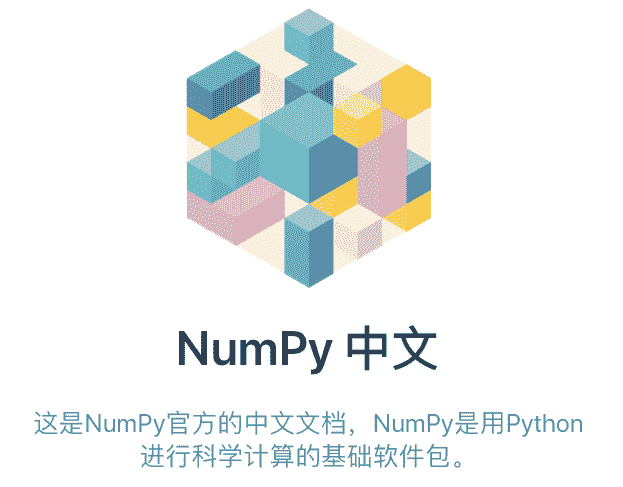
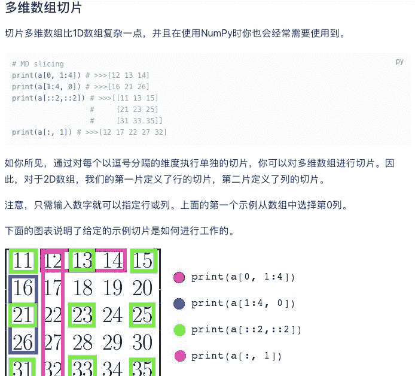
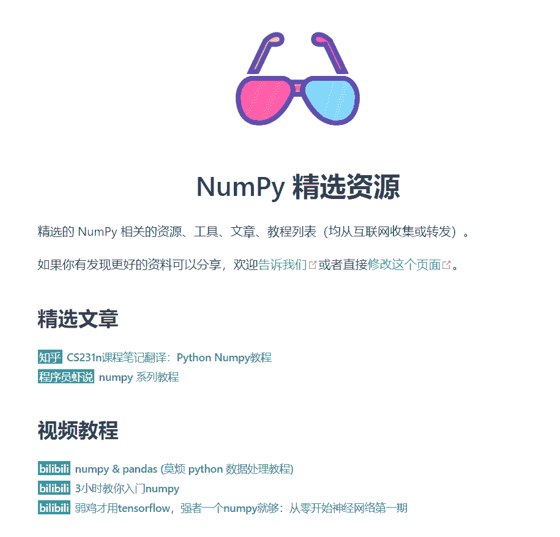
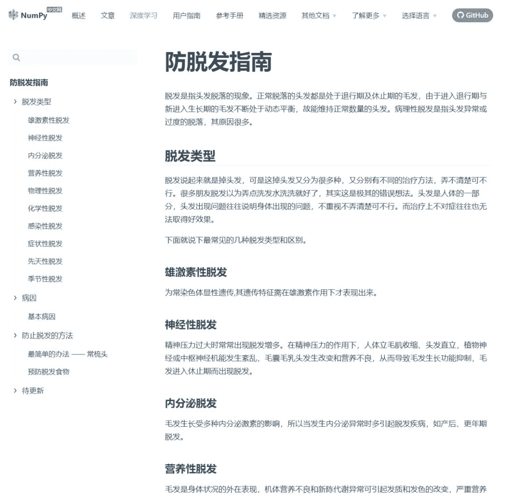

机器之心报道

**参与：一鸣、Jamin**

> NumPy 无疑是很多机器学习研究者和开发者的「白月光」。如此优秀的项目，没有中文版怎么行？近日，机器之心发现 NumPy 官方早在去年就已出了一个中文版网站，涵盖 NumPy 的一切。



在 Github 上一度蝉联最流行的机器学习和数据科学包 NumPy，已经有了非常之系统的中文文档，回想起当初细啃 NumPy 之时，不少人不得不徘徊于各大搜索引擎及平台反复查找，找到的文档也许还很不系统。现在，如果有什么和 NumPy 的问题，只需要浏览这份官方中文文档就足够了。它足够的系统、全面且亲民。亲民到什么程度呢？网站还独一份的配备了「防脱发指南」。

NumPy 是什么？它是大名鼎鼎的，使用 Python 进行科学计算的基础软件包，是 Python 生态系统中数据分析、机器学习、科学计算的主力军，极大简化了向量与矩阵的操作处理。除了计算外，它还包括了：

*   功能强大的 N 维数组对象。

*   精密广播功能函数。

*   集成 C/C+和 Fortran 代码的工具。

*   强大的线性代数、傅立叶变换和随机数功能

此次中文文档还强调了它两大特性：Ndarray 以及切片和索引，这两部分所涉及的功能在日常操作中是十分常见的。

*   Ndarray：一系列同类型数据的集合，以 0 下标为开始进行集合中元素的索引。ndarray 对象是用于存放同类型元素的多维数组。ndarray 中的每个元素在内存中都有相同存储大小的区域。

*   切片和索引：ndarray 对象的内容可以通过索引或切片来访问和修改，与 Python 中 list 的切片操作一样。ndarray 数组可以基于 0 - n 的下标进行索引，切片对象可以通过内置的 slice 函数，并设置 start, stop 及 step 参数进行，从原数组中切割出一个新数组。

官网地址：https://www.NumPy.org.cn

这个官方中文项目内容繁多，文章数量庞大。机器之心在这里节选了一些亮点内容，供读者参考。

**教程、文档应有尽有，中文版强调和深度学习联系**

**从原理开始，中文版增加理论介绍板块**

这个开源的官方中文版教程可以说是非常全面了。它从最基本的理解 NumPy 开始，教程层层推进，直到让用户掌握进阶的使用方法。

从内容来看，中文版不仅仅是官方英文版本的翻译，还额外增加了「文章」这一栏目。该栏目提供了对 NumPy 背后的矩阵运算原理的详细解释，使得使用者「知其然，也知其所以然」。这是英文版教程中没有的。

以下为这一部分的目录，从这里可以看到，这部分内容主要介绍 NumPy 的基本理论，以及涉及到其应用的理论部分，如数据分析、神经网络实现，以及在其他代码库中的接口等。

基础篇

*   理解 NumPy

*   NumPy 简单入门教程

*   Python NumPy 教程

*   创建 NumPy 数组的不同方式

*   NumPy 中的矩阵和向量

进阶篇

*   NumPy 数据分析练习

*   NumPy 神经网络

*   使用 NumPy 进行数组编程

*   NumPy 实现k均值聚类算法

*   NumPy 实现DNC、RNN和LSTM神经网络算法

其他篇

*   OpenCV中的图像的基本操作

*   MinPy：MXNet后端的NumPy接口

我们截取了这些文章的部分内容，可以看到，这里不仅仅会讲 NumPy 所实现的功能，还提供了原理的图解。



*对于多维数组的直观讲解（部分），可以看出官方提供了很好的理论解释和图示。*

**注意和深度学习的联系**

另一方面，NumPy 中文版教程注意到了深度学习近来的发展趋势，因此推出了结合 NumPy 和百度飞桨框架的深度学习教程。可以说，NumPy 不仅仅只是科学计算工具了，而是深度学习社区的重要组成部分。

如下为这一部分的内容，可以看到，神经网络相关的所有内容，包括原理和相关实现都涵盖到了。在这部分还有一个 7 日的深度学习入门课程，供小白用户参考。

深度学习基础教程

*   前言

*   线性回归

*   数字识别

*   图像分类

*   词向量

*   个性化推荐

*   情感分析

*   语义角色标注

*   机器翻译

*   生成对抗网络

七日入门深度学习（正在更新）

*   Day 1：初识深度学习

*   Day 1：如何快速入门深度学习？

*   Day 2：图像识别基础与实战

*   Day 3：目标检测基础与实践（一）

*   Day 3：目标检测实战-RCNN算法讲解

*   Day 3：目标检测实战-YOLOv3检测物体

以如下代码为例，这是一个线性回归神经网络构建的代码部分。可以看到，代码使用 NumPy 进行加载和预处理，并使用飞桨构建数据分批等的相关函数。

```
feature_names = [
    'CRIM', 'ZN', 'INDUS', 'CHAS', 'NOX', 'RM', 'AGE', 'DIS', 'RAD', 'TAX',
    'PTRATIO', 'B', 'LSTAT', 'convert'
]
feature_num = len(feature_names)
data = np.fromfile(filename, sep=' ') # 从文件中读取原始数据
data = data.reshape(data.shape[0] // feature_num, feature_num)
maximums, minimums, avgs = data.max(axis=0), data.min(axis=0), data.sum(axis=0)/data.shape[0]

for i in six.moves.range(feature_num-1):
   data[:, i] = (data[:, i] - avgs[i]) / (maximums[i] - minimums[i]) # six.moves可以兼容python2和python3

ratio = 0.8 # 训练集和验证集的划分比例
offset = int(data.shape[0]*ratio)
train_data = data[:offset]
test_data = data[offset:]

def reader_creator(train_data):  
    def reader():  
        for d in train_data:  
            yield d[:-1], d[-1:]  
    return reader

train_reader = paddle.batch(
    paddle.reader.shuffle(
        reader_creator(train_data), buf_size=500),
        batch_size=BATCH_SIZE)

test_reader = paddle.batch(
    paddle.reader.shuffle(
        reader_creator(test_data), buf_size=500),
        batch_size=BATCH_SIZE)
```

**用户文档和参考手册：覆盖 NumPy 的一切**

当然，最核心的部分当然是 NumPy 本身的文档了。中文版中对用户的使用文档和 NumPy 所有 API 都进行了翻译和整理工作，基本上用户需要的内容都可以在这里找到。

用户文档目录如下，这里还贴心地提供了和「竞品」Matlab 的比较，以及 NumPy 在 C 语言下的 API 使用方法。

*   NumPy 介绍

*   快速入门教程

*   NumPy 基础知识

*   其他杂项

*   与 Matlab 比较

*   从源代码构建

*   使用 NumPy 的 C-API

从这里可以看到，官方中文版真的是诚意满满。不仅提供原始文档的翻译，还加上了包括深度学习教程、其他来源的功能+原理解读材料。对于刚上手 NumPy 的人来说，这就是最佳的学习教程。不管是自学也好，还是用于开发也好，都是极好的。

**其他资源及文档**

如果读到这里你还不过瘾？没关系，官网还有相关配套的文章及视频，让你多样化地保持新鲜感：



另外，独有一份的防脱发指南让你入坑之时再无后顾之忧：



面向开发者还单独有一份开发者指南，这是一份详细的操作清单，如何合理的配置及使用开发环境等一系列问题都已被包含在内。

*   NumPy 行为准则

*   Git 教程

*   设置和使用您的开发环境

*   开发流程

*   NumPy 基准测试

*   NumPy C 风格指南

*   发布一个版本

*   NumPy 治理

NumPy 的用户数量庞大，开发者社区也非常繁荣。从包括 PyTorch、NumPy 等开源工具陆续推出中文版文档来看，中文世界在机器学习领域受到了更大的关注。

*AI学习路线和优质资源，在后台回复"AI"获取*

