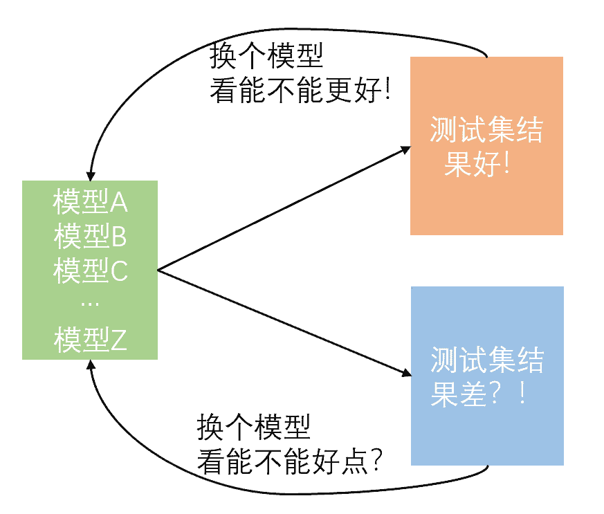
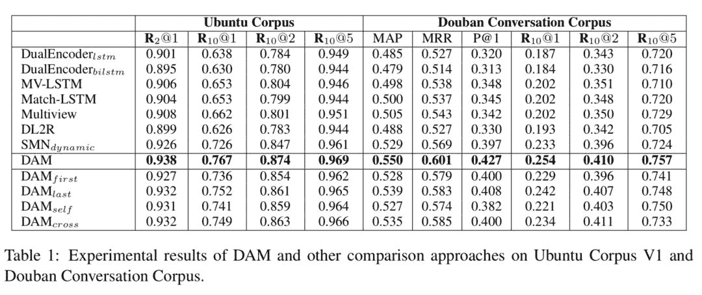

> 这是一篇写给萌新的“科学炼丹”手册。

# 前言

很多小伙伴现在已经把机器学习、深度学习的理论基础打好了，但是真正要解决一个现实中的算法问题的时候经常两手抓瞎，一顿毫无目的乱试，甚至认为模型表现不好一定是调参不够仔细。

新手最大的问题在于解决问题的逻辑不够清晰，喜欢使用“蛮力法”，因此很容易陷入一个

*“找到一份开源代码“*

*“跑了一下，调了调参“*

*”效果不好，下一个”*

*“效果好，拿去做集成"*

的死循环中。就像下图一样

倘若恰好碰到一份代码，让他的精度上了两个点，于是他开始吹嘘“这个模型太牛逼了，吊打XXXX”。而对于跑了一下没什么提升的算法，他就会说“肯定论文造假了，一点用都没有”。

然后以这种暴力搜索的方式解决问题久了之后，他开始对别人吹嘘

“害，俺们深度学习这一行，就是跑跑代码调调参，没有一点竞争力”

**自嘲的话语被奉为圭臬可能是深度学习领域的最大悲剧。**

今天跟大家分享一下我觉得应该了解的一些的炼丹常识，希望小伙伴们在看完本文后，可以帮助初学者提高炼丹能力和效率，走出无脑调参的怪圈。

具体来说，希望帮助大家实现下面几个目标：

*   **快**：以最快的速度解决一个算法问题

*   **准**：以最少的试错次数找出最优策略

*   **稳**：以最不容易出错的方式管理实验

# 准

在讲“快”之前，先来讲讲“准”字诀，因为准是最重要的问题，而且是快的前提。

## 调研做好，找准起点

接手一个算法问题后，如果时间很充裕，就可以先定位一下该算法问题所对口的学术会议或期刊：

比如你要解决query-doc相关性匹配的问题，那么你就要优先考虑SIGIR，CIKM等IR强相关的会议，而不是NLP的会议；

如果你要解决NLI、问答、对话这种语义匹配的问题，那么你就要优先考虑ACL、EMNLP、NAACL、COLING这种NLP会议，而不是IR会议了；

如果你把匹配模型做好了，想压缩一下变得更小更快，那就要优先考虑ICLR、NIPS这种更general的深度学习、神经网络会议了。

定位不出来算法问题的对口会议？最起码可以逛逛AAAI和IJCAI吧（虽然鱼龙混杂问题比较严重）

然后根据文章title，找几篇跟你的算法问题最接近的近两年的paper，慢慢调研。通过这些paper的**related work章节**和**实验章节**，还很容易追溯出更早的工作，类似下图这种（来自**@小鹿鹿鹿**的一篇paper），所以一般没有必要去手动调研更早期的paper。

于是很顺理成章的你就能找到这个算法问题的比较前沿的解法和比较经（简）典（单）的方法啦，进而就有了不错的baseline，迭代几版策略后说不定就出来一篇新paper。

不过，如果时间很不充裕，要解决的问题又比较简单（比如就是个典型的文本分类问题、序列标注问题等），在知乎上搜一下也经常能发现惊喜，实在不行还可以问小夕嘛(￣∇￣)当然了，问题太复杂的话更建议通过知乎私信右上角进行交流(//∇//)\

总之，非常不建议直接去github一个repo一个repo的蛮力调参，大量的宝藏方法是很难通过通用搜索引擎来找到的（虽然这种行为在比赛刷榜的时候随处可见）。

## 构建策略迭代闭环，找准努力方向

避免蛮力试错的第二步就是**构建完整的策略迭代闭环**。由于不同的问题有不同的限定，因此不存在一个绝对的流程可以恰好适合所有算法问题，一个我自己最常用的迭代闭环就是

**数据集分析 - 预处理策略 - 算法策略 - 模型评价 - case study**

对于小白，往往是在第三步和第四步陷入死循环，看不到前两个环节和最后一个环节。

对于大白，往往还能额外考虑一下预处理策略。

*1\. 数据集分析*

很多小白拿到数据集后就开始迫不及待的调参之路了，其实**在开始之前对数据集做个简单的分析，可能有助于大大降低你之后的体力劳动（提前排除不靠谱的策略和不敏感的超参数），并大大降低初次接触新任务时犯致命错误的概率**。

比如，简单统计一下样本长度分布，你就可以知道max sequence length这个参数的大体取值范围，没有必要把它当成一个正儿八经的超参数从小调到大；简单统计一下类别分布，你就不会在正负样本比9：1的情况下为一个90%的准确率沾沾自喜，误导决策；多扫几眼数据集，你就不会在初次接触文本风格相关任务时把英文单词统一小写了。

*2.预处理策略与算法策略*

这个环节不用太多赘述啦，最直接方法就是搬运上一节的调研结果，将一些paper中比较有效的策略搬过来进行验证。不过，尤其是注意一个**meaningful**的问题，即我搬运这个策略，甚至设计一个新的策略，目的是什么？要解决什么问题？毕竟很多paper中的策略的适用场景是很局限的，毫无目的的搬运可能会大大增加无用功。

*3.模型评价*

模型评价的问题在打比赛时一般不会遭遇，在比较成熟的算法任务中一般也被解决了。比如谈到文本分类，就能想到acc、f1等指标；谈到机器翻译，就能想到bleu等。然而有很多算法问题是很难找到一个 **无偏且自动** 的评价指标的。

一个典型的例子就是开放域对话生成问题。

虽然与机器翻译一样，这也是个生成问题，但是如果你沿用BLEU作为评价指标，那么BLEU对对话生成来说就是一个有偏的评价指标，你刷的再高也难以真实反映对话生成模型的质量（对话生成问题中不存在机器翻译中的强的对齐关系）。更糟糕的是，由于找不到无偏的自动指标，因此每迭代一次策略，就需要让一群人轰轰烈烈的标注打分，还要去检验是否存在异常标注者（说不定有个宝宝就耍脾气了给你乱打一通），这无疑是效率非常低的，纵然你代码写的再快，也会被评价问题所拖累。

业务中更是可能有一些模棱两可的算法任务，比如“小夕，来个更好的句子表示吧”，那么如何无偏的评价一个表示的好坏，就需要你在大规模开搞之前仔细设计清楚了。没有一个客观、无偏且自动的评价指标，策略迭代无疑会非常缓慢甚至到后期推翻重来。

*4.case study*

像accuracy、f1、bleu等标量型评价指标可以指导当前策略整体上好不好，但是却无法帮助你发现更细粒度的问题。很多小白在入行时，喜欢把各种花里胡哨的算法和各种不着边际的想法一顿乱试，以为有了模型评价指标就可以很轻松的评判一个算法“是不是有用”，以及可以因此纯拼体力的炼丹。

但！是！当你额外的做一下**case study**之后，可能你会突然发现，很多自己之前的尝试完全就是多余的：

*你以为数据不均衡问题很严重，case study才发现模型其实很轻松；
你以为推理问题离自己很遥远，case study才发现一大半的错例是推理问题导致的；
你以为领域问题不重要，case study才发现太多模型没见过的领域术语了；
你以为数据集很干净，case study却发现了大量错别字导致的错误决策；*

总之，在经验不足的情况下，通过case study可以帮助你排除大量的不必要尝试，并有助于发现当前策略的瓶颈，针对性的寻找策略和创新。

## 重视bug，找准翻车原因

小白经常在跑了一轮迭代闭环之后就受挫：“效果好差啊”。这里经常存在一个思维误区：“精度不够一定是算法/参数不好”。

比如，小白的觉得自己上了BERT能达到95% accuracy，结果跑了个baseline后发现acc只有70%，然后就开始1个点1个点的开始迭代策略。努力错了方向，自然最终结果也不会太好。

实际上在这种策略迭代过程的情况下，优先考虑是**存在bug**。比如用了BERT-uncased预训练模型，却忘了对输入文本进行lowercase处理；用了个char-level的模型，却给文本切了词；万事俱备后，bash脚本里却忘了载入预训练模型等。

有时候调参和使用一些算法策略可以缓解bug带来的影响，导致小白误以为继续卖力的调参和疯狂试错就一定能把这个鸿沟填平。实际上，比起算法和超参，bug往往致命的多。当然了，对于一些特殊的算法问题（比如众所周知的RL问题），超参数确实极其敏感，需要具体问题具体分析。

# 快

## 摆脱“洁癖”，提高写代码速度

**算法探索具有极强的不确定性**，很可能你写了半天的代码最后由于不work而完全废弃，因此，从代码风格上来说，一定要**避免把代码写成系统**，各种面向对象的封装技巧一顿乱怼是非常不必要的。允许一些“垃圾代码”的存在可以大大提高实验迭代的效率。

问题来了，假如你生产了一堆“垃圾代码片段”，该怎么高效利用它们呢？直接丢掉？还是复制粘贴重构代码？

最简单的方法是直接使用粘合剂“**Bash Script**”。即将功能零散的代码片段通过bash管道命令连接起来，这样还能通过“&”+wait命令的组合拳实现对大规模数据集的（多进程）并行处理。

对shell实在不熟悉的小伙伴也可以使用**jupyter notebook**来进行粘合。不过，**强烈建议每个NLP算法工程师熟练使用bash和vim**，相当多的数据处理和分析是不需要使用python的，习惯了之后这些bash命令和vim技巧会对炼丹效率有非常明显的提升。

而对于更加碎片化的小代码（比如边分析边修改逻辑生成一个小字典），则可以考虑使用**ipython**，完成任务后一条magic命令`%save`就让这些碎片代码变得可复用了。

不仅在生产代码上可以大大提速，在debug和调参问题上依然是有学问的。

## 分规模验证，快速完成实验

这个问题写出来时感觉很白痴，但是据我观察，大部分新手都存在这个问题。如果你给他100万规模的训练集，他就会拿整个训练集去调试；你给他1000万规模的训练集，他还是拿整个训练集去调试，甚至不忘抱怨“数据载入太费时间了，调试好花时间呀”。

亲，debug也是分阶段的呀....

**第一阶段**：调通代码。这时候象征性的挂几百条样本就够了，修正语法错误和严重的逻辑错误。

**第二阶段**：验证收敛性。很多bug不会报错，但会导致训练完全崩溃或者压根就没在训练。可以对几百条或者几千条样本进行训练，看看若干epoch之后训练loss是否能降低到接近0。

**第三阶段**：小规模实验。在万级或十万级别的小样本集上验证模型表现，分析超参数敏感性。这一阶段在数据规模不大时（比如几十万或一二百万）其实可有可无，当训练数据极其庞大时（十亿级甚至百亿级的话）还是必要的。有一些很细微的bug虽然不会影响收敛，却会显著影响最终模型的表现。此外也有助于发现一些离谱的超参数设置。

**第四阶段**：大规模实验。即，有多少训练数据，就上多少，甚至多训练几个epoch。进行到第四阶段时，应当绝对保证代码是高度靠谱的，基本无需调参的，否则试错代价往往难以承受。

## 理性调参，把算力和时间留给策略探索

初学者喜欢把什么都作为超参数来调。

*“文本截断长度不确定设置多少？挂10组实验调一调”
“官方代码里有个warmup不知道有啥用？挂10组实验调一调”
“听说batch size对性能有影响？挂10组实验调一调”
一切尽在调参中╮(╯▽╰)╭*

这种做法无疑是极其浪费时间和计算资源的，有的超参数完全可以算出来合理范围，有的取决于其他超参数和所处环境，有的与网络结构和预训练模型强耦合等等。因此，调参的第一步，也是最重要的一步是进行**超参数敏感性分析**，找到对当前任务性能影响最大的几个超参数之后再进行精调。

而要确定各个超参数的敏感性，一方面可以根据自身经验来定，一方面可以根据各paper中的取值（差异大的超参数可能是敏感超参，大家都取值相同的一般不敏感），实在不确定，跑两三组实验就够确定敏感性了，完全没有必要来个“网格搜索”。

篇幅原因，本文只讲通用的方法，一些细节性的魔性调参资料在网上有很多了，这里就不展开了。

# 稳

说完了“准”和“快”的问题，下面就到了最容易让初学者头疼的“稳”字问题啦。

很多初学者都出现过这种手忙脚乱的情况：

*“诶？明明我记得这个脚本能跑出来95%的准确率，再一跑怎么成92%了？”
“我的模型去哪了？？？”
“这个模型怎么训出来的来着。。”
“这俩策略有哪些diff来着”*

问题就出在了**实验管理和代码版本管理**上。

## 一个工具就稳了

顾名思义，实验管理就是要**记录下来每一次实验的策略名和对应的实验结果**，一般以表格的形式记录。这里可以用excel、markdown编辑器等记录，当然**更建议使用支持云端同步的工具来记录**（比如石墨文档、印象笔记或内网的相关工具等），以防电脑被偷、文件误删等意外导致的悲剧。

但是，有时候实验着急，对策略的描述不够仔细怎么办？比如某次实验同时改变了具体策略、还改了超参数、预训练模型等一堆东西，不能用一个名字概括全部，怎么办呢？

最简单的做法就是**与版本管理工具**配合，再也不用担心未来settings丢失、模型无法复现、模型无法追溯环境等问题了。

而要实现版本管理，也很简单，**Git**自然是不二之选。

> 萌新们注意啦，是GIt，不是GitHub！你可以不用GitHub，但是不能不用Git！

怎么用Git管理版本和实验迭代呢？

首先，务必保证训练日志、eval日志是**以文件的形式**存了下来，而不是打印到屏幕上变成过眼云烟了；此外，需要保证每一次运行时的settings（比如超参数、数据集版本、ckpt存储路径等）都能保存到日志文件中，且尽量封装一个run.sh来维护训练任务的启动环境。

之后就是看每个人自己的习惯啦。我个人的习惯是

*   主线策略每成功推进一步，就调用`git tag`打个tag。这里的tag即策略名，与实验管理的表格中的策略名对齐

*   如果要在某个策略的基础上尝试一个很不靠谱的探索，那么可以在当前策略的基础上拉一个分支出来，在这个分支上完成相应事情后切回主分支。当然啦，万一这个分支上的策略work了，就可以考虑将其转正，合入主分支并打上相关tag

更多git实现版本管理的命令见这里

这样将来你想review某个策略时，只需要切换到相应的tag下面或者分支下面就可以啦，完整复现整个环境，并能直接追溯出跑该策略时的一切相关设置，以及该策略下的各种调参结果。

最后，“准”字问题上还要考虑最后一种极端情况，就是整个实验环境被连根拔起╮(￣▽￣"")╭比如硬盘损坏之类的严重故障。因此一定要记得做好备份工作，即周期性的将环境中的关键代码push到github等远程仓库。当然了，对于ckpt、数据集这种大型文件，可以写入`.gitignore`文件中以免把仓库撑爆，这些大型文件的最佳归宿当然就是hadoop集群啦。

科研任务是可以通过开源数据集进行评估的，但业务算法的评估还是要以业务数据为准。

*AI学习路线和优质资源，在后台回复"AI"获取*

