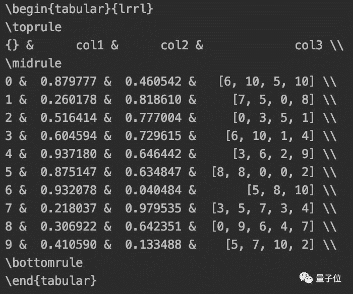

点击上方“**Datawhal****e**”，选择“星标”公众号

第一时间获取价值内容


作者 | Roman Orac

转自 | 量子位    编译 | 鱼羊 

数据分析，如何能错过 **Pandas** 。

现在，数据科学家 Roman Orac 分享了他在工作中相见恨晚的 Pandas 使用技巧。

了解了这些技巧，能让你在学习、使用 Pandas 的时候更加高效。


话不多说，一起学习一下~

## **  Pandas实用技巧**

用 Pandas 做数据分析，最大的亮点当属 DataFrame。不过，在展示成果的时候，常常需要把 DataFrame 转成另一种格式。

Pandas 在这一点上其实十分友好，只需添加一行代码。

**DataFrame 转 HTML**

如果你需要用 HTML 发送自动报告，那么 **to_html **函数了解一下。

比如，我们先设定这样一个 DataFrame：

```
import numpy as np
import pandas as pd
import random

n = 10
df = pd.DataFrame(
    {
        "col1": np.random.random_sample(n),
        "col2": np.random.random_sample(n),
        "col3": [[random.randint(0, 10) for _ in range(random.randint(3, 5))] for _ in range(n)],
    }
) 
```

用上 to_html，就可以将表格转入 html 文件：

```
df_html = df.to_html()
with open(‘analysis.html’, ‘w’) as f: f.write(df_html) 
```


与之配套的，是 **read_html** 函数，可以将 HTML 转回 DataFrame。

**DataFrame 转 LaTeX**

如果你还没用过 LaTeX 写论文，强烈建议尝试一下。

要把 DataFrame 值转成 LaTeX 表格，也是一个函数就搞定了：

```
df.to_latex() 
```

****

**DataFrame 转 Markdown**

如果你想把代码放到 GitHub 上，需要写个 README。

这时候，你可能需要把 DataFrame 转成 Markdown 格式。

Pandas 同样为你考虑到了这一点：

```
print(df.to_markdown()) 
```


注：这里还需要 tabulate 库

**DataFrame 转 Excel**

说到这里，给同学们提一个小问题：导师/老板/客户要你提供 Excel 格式的数据，你该怎么做？

当然是——

```
df.to_excel(‘analysis.xlsx’) 
```

需要注意的是，如果你没有安装过 **xlwt **和 **openpyxl **这两个工具包，需要先安装一下。

另外，跟 HTML 一样，这里也有一个配套函数：**read_excel**，用来将excel数据导入pandas DataFrame。

**DataFrame 转字符串**

转成字符串，当然也没问题：

```
df.to_string() 
```

## **5个鲜为人知的Pandas技巧**

此前，Roman Orac 还曾分享过 5 个他觉得十分好用，但大家可能没有那么熟悉的 Pandas 技巧。

**1、data_range**

从外部 API 或数据库获取数据时，需要多次指定时间范围。

Pandas 的 data_range 覆盖了这一需求。

```
import pandas as pd
date_from = “2019-01-01”
date_to = “2019-01-12”
date_range = pd.date_range(date_from, date_to, freq=”D”)
print(date_range) 
```

freq = “D”/“M”/“Y”，该函数就会分别返回按天、月、年递增的日期。


**2、合并数据**

当你有一个名为left的DataFrame：


和名为right的DataFrame：


想通过关键字“key”把它们整合到一起：


实现的代码是：

```
df_merge = left.merge(right, on = ‘key’, how = ‘left’, indicator = True) 
```

**3、最近合并（Nearest merge）**

在处理股票或者加密货币这样的财务数据时，价格会随着实际交易变化。

针对这样的数据，Pandas提供了一个好用的功能，**merge_asof**。

该功能可以通过最近的key（比如时间戳）合并DataFrame。

举个例子，你有一个存储报价信息的DataFrame。


还有一个存储交易信息的DataFrame。


现在，你需要把两个DataFrame中对应的信息合并起来。

最新报价和交易之间可能有10毫秒的延迟，或者没有报价，在进行合并时，就可以用上 merge_asof。

```
pd.merge_asof(trades, quotes, on=”timestamp”, by=’ticker’, tolerance=pd.Timedelta(‘10ms’), direction=‘backward’) 
```


**4、创建Excel报告**

在Pandas中，可以直接用DataFrame创建Excel报告。

```
import numpy as np
import pandas as pd

df = pd.DataFrame(np.array([[1, 2, 3], [4, 5, 6], [7, 8, 9]]), columns=["a", "b", "c"])

report_name =  example_report.xlsx
sheet_name =  Sheet1
writer = pd.ExcelWriter(report_name, engine= xlsxwriter )
df.to_excel(writer, sheet_name=sheet_name, index=False) 
```

不只是数据，还可以添加图表。

```
# define the workbook
workbook = writer.book
worksheet = writer.sheets[sheet_name]
# create a chart line object
chart = workbook.add_chart({ type :  line })
# configure the series of the chart from the spreadsheet
# using a list of values instead of category/value formulas:
#     [sheetname, first_row, first_col, last_row, last_col]
chart.add_series({
     categories : [sheet_name, 1, 0, 3, 0],
     values :     [sheet_name, 1, 1, 3, 1],
})
# configure the chart axes
chart.set_x_axis({ name :  Index ,  position_axis :  on_tick })
chart.set_y_axis({ name :  Value ,  major_gridlines : { visible : False}})
# place the chart on the worksheet
worksheet.insert_chart( E2 , chart)
# output the excel file
writer.save() 
```

注：这里需要 XlsxWriter 库


**5、节省磁盘空间**

Pandas在保存数据集时，可以对其进行压缩，其后以压缩格式进行读取。

先搞一个 300MB 的 DataFrame，把它存成 csv。

```
df = pd.DataFrame(pd.np.random.randn(50000,300))
df.to_csv(‘random_data.csv’, index=False) 
```

压缩一下试试：

```
df.to_csv(‘random_data.gz’, compression=’gzip’, index=False) 
```

文件就变成了136MB。


gzip压缩文件可以直接读取：

```
df = pd.read_csv(‘random_data.gz’) 
```

这一份Pandas技巧笔记，暂且说到这里。各位同学都做好笔记了吗？

Talk is cheap, show me the code。学会了，就用起来吧

*AI学习路线和优质资源，在后台回复"AI"获取*

