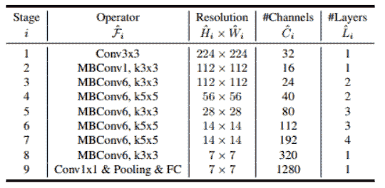
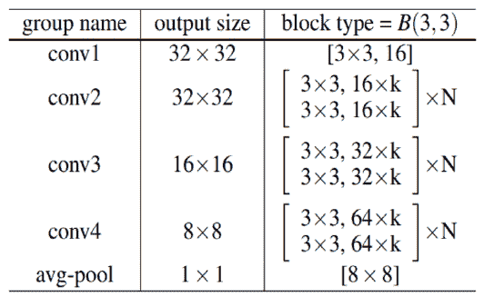

Datawhale

**作者：何新，Datawhale优秀学习者**

简介：何新，武汉理工大学硕士

https://github.com/whut2962575697

图像分类是计算机视觉和数字图像处理的一个基本问题。传统的图像分类方法通过人工设计提取图像特征，而基于深度学习的图像分类方法能够自动提取特征，其中卷积神经网络(CNN)近年来取得了惊人的成绩。

本文收集并评估了一些高效有用的图像分类训练技巧。使用这些技巧，在开源Fashion-MNIST数据集上达到了96.21%的Acc，为大家提供了一个简单有效的深度卷积神经网络的图像分类Baseline。

## 简介

******问题******

针对Fashion-MNIST数据集，设计、搭建、训练机器学习模型，能够尽可能准确地分辨出测试数据的标签。

******思路******

近年来，虽然许多start-of-art的方法都是通过设计复杂高效的网络结构来实现的，但是有些文献中对一些高效的数据增强方法以及训练技巧都简略的带过。

本文并未提出新颖的网络结构或者数据增强方法，而是对标准的Baseline使用了一些数据增强和训练的技巧得到了一个强Baseline。

******目标******

将得到的强Baseline在开源的Fashion-MNIST数据集对这些技巧进行了评估，并取得了96.21%的Acc。针对不同阶段的学习者，阅读文章后的收获：

*   深度学习入门学习者：希望你对当前一些优秀tricks和models有一定的了解；

*   深度学习竞赛者，希望提供一个简单高效图像分类技巧的工具集；

*   深度学习研究者：希望提供一个强Baseline，作为取得更高准确率的一个基准；

***Baseline详见：***

https://github.com/whut2962575697/image_classification

Datawhale后台回复关键词 图像分类 可打包下载baseline及数据集

## 数据集

******MNIST******

相信大家对经典的MNIST数据集都不陌生，它包含了大量的手写数字，可谓是算法工作者的必测数据集之一。有人曾调侃道："如果一个算法在MNIST不work, 那么它就根本没法用；而如果它在MNIST上work, 它在其他数据上也可能不work！"

***数据下载***：http://yann.lecun.com/exdb/mnist/

******Fashion-MNIST******

2017年8月27日，Fashion-MNIST图片库在GitHub上开源。与MINST手写数据集相比，其不同点与相同点如下

**不同点**：Fashion-MNIST不再是抽象符号，而是更加具象化的人类必需品：服装，共10大类：

**相同点**：Fashion-MNIST克隆了MNIST的所有外在特征

*   10个类别；

*   每张图像28x28的分辨率；

*   60000张训练图像和对应Label；

*   10000张测试图像和对应Label；

*   4个GZ文件名称都一样；

对于已有的MNIST训练程序，只要修改下代码中的数据集读取路径，或者残暴的用Fashion-MNIST数据集文件将MNIST覆盖，替换就瞬间完成了。

***数据下载***：https://github.com/zalandoresearch/fashion-mnist

## 模型配置

本文使用了开源的深度卷积神经网络resnet34作为baseline backone；同时通过消融实验，设计了数据增强方法；经过实验调试，对比了不同的backbone网络的性能，以及各种超参数对实验结果的影响，最终选择了最优的模型。

**网络结构**

**1\. ResNet**

自 AlexNet 以来，最先进的 CNN 架构已经越来越深。AlexNet 只有 5 个卷积层，而之后的 VGG 网络和 GoogleNet(代号 Inception_v1)分别有 19 层和 22 层。

但是，网络的深度提升不能通过层与层的简单堆叠来实现。由于梯度消失问题，深层网络很难训练。因为梯度反向传播到前面的层，重复相乘可能使梯度无穷小。结果就是，随着网络的层数更深，其性能趋于饱和，甚至开始迅速下降。

ResNet 的核心思想是引入一个所谓的**恒等快捷连接**（identity shortcut connection），直接跳过一个或多个层。考虑到Fashion-MNIST原始数据分辨率过小，过深过大的网络可能会导致发生过拟合(overfiting)现象，因此我们选择了一个参数量较少的深度模型resnet34作为此次的baseline backbone。其结构如下：

**2\. EfficientNet**

为了获得更好的精度，放大卷积神经网络是一种广泛的方法。目前通用的几种方法是放大CNN的深度、宽度和分辨率，在之前都是单独放大这三个维度中的一个，尽管任意放大两个或者三个维度也是可能的，但是任意缩放需要繁琐的人工调参，同时可能产生的是一个次优的精度和效率。

EfficientNet系统地研究了模型缩放，并发现平衡网络深度，宽度和分辨率可以提高性能。相比resnet，它可以用更少的参数获得更好的精度。在本次任务中，为了避免过拟合，我们选用EfficientNet b0作为一个backbone。其结构图如下所示：

**3\. WideresNet**

ResNet的跳连接，导致了只有少量的残差块学到了有用信息，或者大部分残差块只能提供少量的信息。WideResNet在ResNet的基础上减小深度，增加宽度。下图为其结构图，其中B(3,3)表示一个两个3x3卷积，k表示一个宽度因子，当k为1时卷积核个数和ResNetv2相等，k越大网络越宽。用WRN-n-k来表示一个网络，n表示卷积层的总数，k表示宽度因子。

**数据增强与训练技巧**

针对上面三个backbone网络，本文收集使用了一些开源的数据增强以及模型训练的技巧对baseline进行拓展。

**1\. Warmup Learning Rate&CosineAnnealingLR**

WarmUp策略已被证明对许多任务有效。与常见的递减学习率策略不同，WarmUp使用逐渐增加的学习率来初始化网络，并逐渐将其初始化为一个更好的搜索空间。当batch size较大时，这种方法可以避免在初始训练期间出现过拟合。当使用带有CosineAnnealing学习速率衰减的WarmUp策略时，效果通常很好。

**2\. Ranger optimizer**

Ranger优化器由RAdam和LookAhead机制组成。RAdam是经典Adam优化器的新变体。它会自动动态地调整自适应学习率，同时考虑到训练过程中的变化和动量的影响。它的性能优于传统的手动warmup。LookAhead减少了对大量超参数调整的需求，同时以最小的计算开销实现了针对不同深度学习任务的更快收敛。

**3\. RandomErasing**

随机擦除随机选择图像中的矩形区域，并使用随机值擦除其像素。在此过程中，将生成具有各种遮挡级别的训练图像，这会降低过度拟合的风险，并使模型对遮挡具有鲁棒性。

**4\. AutoAugment**

AutoAugment方法设计了一个数据增强搜索空间，其中一个策略由许多子策略组成，每个小batch aize中的每张图像都会随机选择一个子策略。同时，它基于搜索算法来找到最佳策略，以便神经网络对目标数据集产生最高的验证准确性。

**5\. MixUp**

MixUp将训练集中随机两个样本的图像和标签进行某种方式混合。通过这样做，mixup相当于对神经网络进行了正则化，使其在训练过程中具有更好的鲁棒性。

**6\. CutMix**

与Mixup的混合方式不同，cutmix在训练图像之间剪切并粘贴补丁，在该训练图像中，GT标签也按比例混合到补丁区域。通过有效地利用训练像素并保留区域丢失的正则化效果，CutMix优于最新的增强策略。

**7\. Test Time Augmentation(TTA)**

测试时增强（test timeaugmentation, TTA），可将准确率提高若干个百分点，测试时将原始图像造出多个不同版本，包括不同区域裁剪和更改缩放程度等，并将它们输入到模型中；然后对多个版本进行计算得到平均输出，作为图像的最终输出分数。这种技术很有效，因为原始图像显示的区域可能会缺少一些重要特征，在模型中输入图像的多个版本并取平均值，能解决上述问题。

## 实验框架

针对上面的backbone和技巧，本文开源了一个简单高效的图像分类框架，其支持多种backbone网络，包括(resnet,densenet,efficiennet,wrn)等等，同时支持cpu/gpu/multi-gpu(sync bn)，包含完整的日志系统与可视化系统。

**实现细节**

**1\. 数据处理**

由于原始数据为单通道图片，故有两种选择方案：

*   默认用1通道图片进行训练

*   将图片转换为3通道图片进行训练

使用默认的单通道图片进行训练无法使用预训练模型，所以比较好的方法是将图片转换为3通道图片进行训练。这样可以用到一些backbone在其他数据集上的预训练模型，这种迁移学习的方法能够加快网络收敛速度并在一定程度上提高性能。

**2\. 数据增强**

通过实验对比，选择了一个如下数据增强方案：

*   Resize 36x36

*   RandomCrop(随机) 32x32

*   RandomHorizontalFlip(随机水平翻转)

*   RandomEreasing(随机擦除)

*   AutoAugment

*   CutMix

*   Normalation 

**3\. 训练技巧**

本文对比使用了两种不同的训练方式：

*   WarmUp + CosineAnnealingLR(Adam)

*   Ranger Optimizer

**结果分析**

本节将在开源的Fashion-MNIST数据集上评估我们的模型。将分类精度Acc与F1-Score作为评估指标。通过比较baseline与其它backone区别后，在此基础上加上了之前讨论的一些技巧，结果如下图所示：

**1\. Analysis of Backbone**

评估了三个不同backbone resnet34, efficientnetb0与wrn40-4的性能。所有的模型均在Adam 优化器+warmup+ CosineAnnealingLR的机制下，数据增强方法均在标准的增强方法上加上RandomErasing ，AutoAugmnet以及CutMix。BatchSize均为128。由于resnet34与efficienntb0有开源的imagenet预训练模型，所以我们选择的resnet34,efficientnetb0均使用image net上的预训练模型进行迁移学习，而wrn40-4则从头开始训练。同时我们将wrn40-4中的激活函数换成Mish激活函数，发现对性能有提升。

**2\. Analysis of Data Augment**

评估了各种较新数据增强技巧的性能，包括random erasing, mixup, cutmix,mixup, autoaugmnet, augmix。所有的增强方法均在标准的数据增强方法（Resized, RandomCrop,RandomHorizontalFlip, Normalization）的基础上进行的。使用标准的数据增强时我们将原始图片先转化成三通道RGB图片，然而将28*28分辨率的图像resize为36*36，然后RandomCrop出32*32大小的patch，再以0.5的概率使用RandomHorizontalFlip。在使用Random Erasing时我们设置的擦除概率为0.5，最大擦除比例为0.4。

**3\. Analysis of WarmUp+ CosineAnnealingLR**

评估了Wramup 配合CosineAnnealingLR的学习方法对模型精度的影响。默认使用的优化器均为Adam,基础学习率为3e-4,warmup 10轮。 

**4\. Analysis of Ranger Optimizer + CosineAnnealingLR**

评估了Ranger Optimizer对模型性能的影像。由于Ranger优化器的lookahead机制，无需再在训练的开始阶段使用warmup。通过实验，我们发现Ranger优化器较Warmup+Adam收敛速度更快，同时精度更高。

**结果讨论**

通过实验比较与分析可以看出：

*   使用好的backbone能起到很好的作用，同时使用开源数据集预训练模型进行迁移学习能够加快收敛速度的同时提升精度。

*   数据增强方法同样重要，好的数据增强方法能够有效避免过拟合现象，让模型可以使用一些更强大的backbone，极其推荐CutMix方法。

*   训练策略也十分重要，在训练初始阶段使用WarmUp策略能够在开始阶段避免过拟合，这种方法对大部分视觉任务均有帮助，而采用LookAhead机制的Ranger在分类任务中能够更快的收敛，同时能够提升模型精度。

但是这种优化器不一定适用于所有的视觉任务，它在其他任务中的效果有待检验。

## 结论

本文收集了一些高效的数据增强与模型训练的技巧，并针对图像分类任务设计了一个强Baseline。为比较这些技巧在分类模型上的性能，设计了一系列的消融实验，最后在使用了一些比较好的数据增强方法和训练技巧后在Fashion Minist数据集上的ACC达到了96.21%。

当然，本文仅仅对一部分方法和技巧进行了评估，也将在此项工作的基础上对其他技巧进行后续评估。**大家有哪些不错的数据增强与模型训练的技巧呢？请留言区和大家互动吧！**

*AI学习路线和优质资源，在后台回复"AI"获取*

