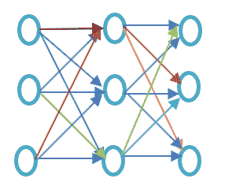
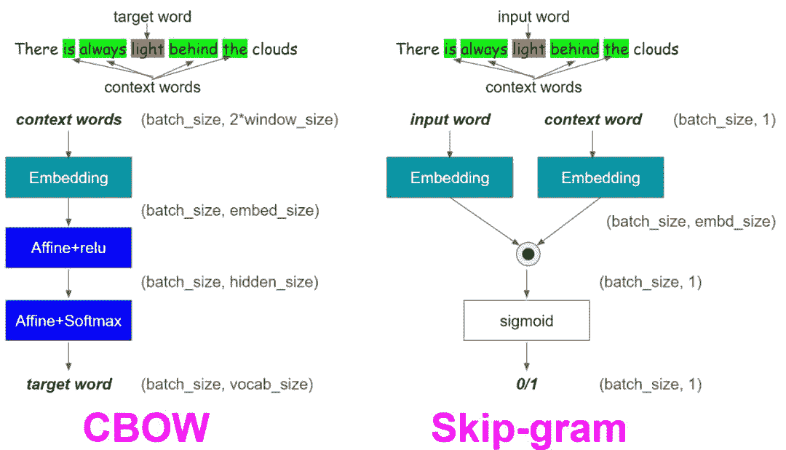
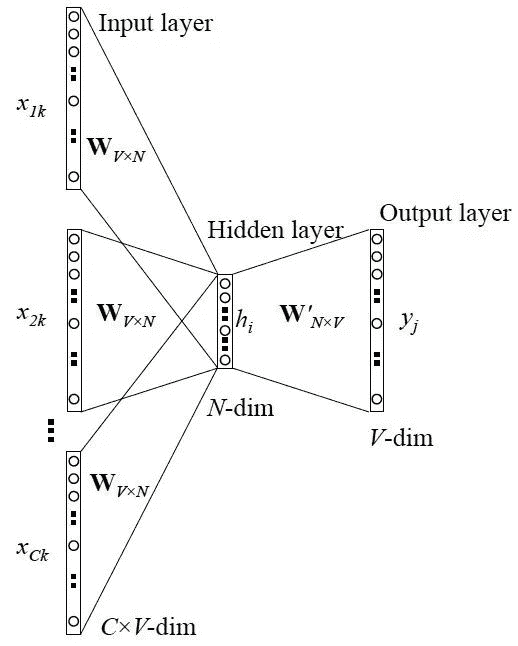
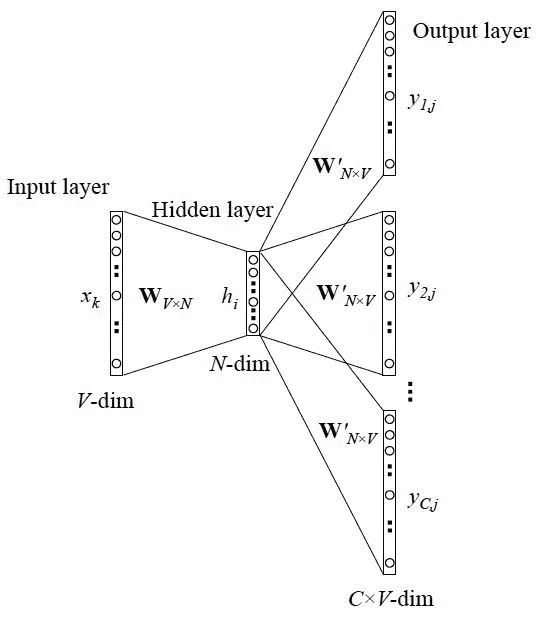

# 1  简介

本文我们主要介绍词嵌入中一种非常经典的算法，Word2Vec,早期Word2Vec主要被用在文本类的问题中,但是现在做比赛的朋友应该都发现了,几乎一半的传统数据竞赛都会用到Word2Vec,所以这边我们必须得好好看看Word2Vec究竟在学习什么,这样今后也可以举一反三更好地使用这些技术。

本文我们先简单介绍词嵌入模型，然后详细介绍Word2Vec,包括Word2Vec在做什么,为什么用Word2Vec(它与老的BOW模型比有什么创新) ,Word2Vec常见的两种框架以及选择,最后我们会给出基于Pytorch版本的Word2Vec的两种实现。

本文我们不会罗列太多的数学,主要讲框架以及实现,大家可以**思考将其如何的用到自己的问题中**,在词嵌入模型中,我们也会列举些许相关的应用。

# 2  什么是词嵌入(Word Embedding)

词嵌入(Word Embedding)是一类词的表示方法,它可以通过很多机器学习模型将原先不同的词转化为不同的实数向量，目前的Word Embedding的技术非常多，例如Google的Word2Vec,Stanford的Glove, Facebook的Fastext等等。

Word Embedding有的时候也被称作为分布式语义模型或向量空间模型等,所以从名字和其转换的方式我们就可以明白, Word Embedding技术可以将相同类型的词归到一起,例如苹果，芒果香蕉等，在投影之后的向量空间距离就会更近，而书本，房子这些则会与苹果这些词的距离相对较远。

# 3  什么时候使用词嵌入模型

目前为止，Word Embedding可以用到特征生成，文件聚类，文本分类和自然语言处理等任务，例如：

*   计算相似的词：Word Embedding可以被用来寻找与某个词相近的词。

*   构建一群相关的词：对不同的词进行聚类，将相关的词聚集到一起；

*   用于文本分类的特征：在文本分类问题中，因为词没法直接用于机器学习模型的训练，所以我们将词先投影到向量空间,这样之后便可以基于这些向量进行机器学习模型的训练；

*   用于文件的聚类

上面列举的是文本相关任务,当然目前词嵌入模型已经被扩展到方方面面。典型的，例如：

*   在微博上面,每个人都用一个词来表示,对每个人构建Embedding,然后计算人之间的相关性,得到关系最为相近的人;

*   在推荐问题里面,依据每个用户的购买的商品记录,对每个商品进行Embedding,就可以计算商品之间的相关性,并进行推荐;

*   在此次天池的航海问题中,对相同经纬度上不同的船进行Embedding，就可以得到每个船只的向量,就可以得到经常在某些区域工作的船只;

可以说,词嵌入为寻找物体之间相关性带来了巨大的帮助。现在基本每个数据竞赛都会见到Embedding技术。本文我们主要关注用的最多的Word2Vec模型。

# 4  什么是Word2Vec模型？

Word2vec是一种得到词表示的方法，它可以较好地捕捉句法和语义词汇的关系。如果仅从网络结构看的话，它就是一个两层的浅层网络。



即一个输入层+一个隐藏层+一个输出层。

相较于潜在语义分析模型,Word2vec是一种更好以及更加高效的方案。

# 5  Word2Vec在做什么？

Word2vec在向量空间中对词进行表示, 或者说词以向量的形式表示，在词向量空间中：**相似含义的单词一起出现，而不同的单词则位于很远的地方。这也被称为语义关系**。

神经网络不理解文本，而只理解数字。**词嵌入提供了一种将文本转换为数字向量的方法**。

Word2vec就是在重建词的语言上下文。那什么是语言上下文？在一般的生活情景中，当我们通过说话或写作来交流，其他人会试图找出句子的目的。例如，“印度的温度是多少”，这里的上下文是用户想知道“印度的温度”即上下文。

简而言之，句子的主要目标是语境。围绕口头或书面语言的单词或句子（披露）有助于确定上下文的意义。Word2vec通过上下文学习单词的矢量表示。

# 6  为什么用Word2Vec?

## 6.1  在词嵌入之前

关于为什么用Word2Vec好,这就要看在Word2Vec之前大家都在用什么方法,这些方法有什么不足,然后我们就能明白用Word2Vec的好处了。

## 6.2  潜在语义分析方法

潜在语义分析方法是在词向量之前用的最多的方法，它使用BOW(Bog of Words)的概念,每个词都被以编码的向量所表示,每个词都是一种稀疏的表示，其中向量的维度就是词汇表的大小。如果某个词出现了，那么我们就会对它进行计数。

```
from sklearn.feature_extraction.text import CountVectorizer
vectorizer = CountVectorizer()
data_corpus = ['guru99 is the best size for online tutorials. I love to visit guru99 .']
vocabulary = vectorizer.fit(data_corpus)
X          = vectorizer.transform(data_corpus)
print(X.toarray()) 
```

```
[[1 1 2 1 1 1 1 1 1 1 1]]
```

```
print(vocabulary.get_feature_names()) 
```

['best', 'for', 'guru99', 'is', 'love', 'online', 'size', 'the', 'to', 'tutorials', 'visit']

在潜在语义分析中，每一行（特征列）表示的是某个词,每个列表示的是词出现在在某个文本中的次数。

后来很多学者发现Countervector方法会忽律词在不同文本词库中的出现情况, 按理说如果某些词在不同的文本中都经常出现,那么应该降低此类词汇的重要性会更好。所以就出现了TFIDF方法。

*   TFIDF中,字词的重要性随着它在文件中出现的次数成正比增加，但同时会随着它在语料库中出现的频率成反比下降.

但是其实TFIDF也存在很多明显的问题，它的不足如下(参见wiki)：

> 对区别文档最有意义的词语应该是那些在文档中出现频率高，而在整个文档集合的其他文档中出现频率少的词语，所以如果特征空间坐标系取tf词频作为测度，就可以体现同类文本的特点。另外考虑到单词区别不同类别的能力，tf-idf法认为一个单词出现的文本频数越小，它区别不同类别文本的能力就越大。因此引入了逆文本频度idf的概念，以tf和idf的乘积作为特征空间坐标系的取值测度，并用它完成对权值tf的调整，调整权值的目的在于突出重要单词，抑制次要单词。但是在本质上idf是一种试图抑制噪声的加权，并且单纯地认为文本频率小的单词就越重要，文本频率大的单词就越无用，显然这并不是完全正确的。**idf的简单结构并不能有效地反映单词的重要程度和特征词的分布情况，使其无法很好地完成对权值调整的功能，所以tf-idf法的精度并不是很高**。

## 6.3  BOW方法的问题

不管是Countervector还是TFIDF,我们发现它们都是从全局词汇的分布来对文本进行表示,所以缺点也明显,

*   **它忽略了单个文本句子中词的顺序**, 例如 'this is bad' 在BOW中的表示和 'bad is this'是一样的;

*   **它忽略了词的上下文**,假设我们写一个句子,"He loved books. Education is best found in books".我们会在处理这两句话的时候是不会考虑前一个句子或者后一个句子是什么意思，但是他们之间是存在某些关系的

为了克服上述的两个缺陷，Word2Vec被开发出来并用来解决上述的两个问题。

# 7  Word2Vec如何工作？

Word2Vec通过学习与其相邻的上下文来进行预测，举例来说，我们要得到句子"He Loves Football"中Loves的词向量,这边我们假设：

```
loves =  Vin. P(Vout / Vin) is calculated
where,
Vin is the input word.
P is the probability of likelihood.
Vout is the output word. 
```

那么词"loves"在语料中移动每个单词。词与词之间的语法和语义便可以得到编码，这非常有助于帮助我们寻找相近与相似的词汇。

# 8  Word2Vec框架

Word2Vec解决的问题就是上面说的,此处我们介绍Word2Vec的两种框架,

1.  Continuous Bag of words (CBOW)

2.  Skip gram

我们都知道学习词的表示是无监督的，但是如果没有targets/labels,那么我们将很难去训练该模型，Skip-gram和CBOW将无监督的表示到有监督的形式,这样便可以用于模型训练了。其中，

*   CBOW,当前的词使用其周围的上下文(某个window size)的词进行预测，例如，如果$w_{i-1}$,$w_{i-2}$,$w_{i+1}$,$w_{i+2}$是给定的词或者是上下文，那么我们的模型需要预测出是$w_i$。

*   Skip-Gram则与CBOW相反,CBOW意味着它从单词中预测给定的序列或上下文。如果$w_i$是给定的，那么我用它去预测它的上下文$w_{i-1}$,$w_{i-2}$,$w_{i+1}$,$w_{i+2}$.

二者的区别大家可以参考下图：



## 8.1  CBOW

下面这个就是CBOW的图示，



我们假设V是词库的大小,N是隐藏层的大小,我们将输入定义为$\{x_{i-1},x_{i-1}, x_{i+1}, x_{i+2}\}$,那么我们就得到一个权重矩阵, 它的大小是$V * N$的.即,我们通过周围的词汇来对我们当前的词汇进行预测。

## 8.2  Skip-Gram

下面这个就是Skip-Gram的图示，



Skip-Gram模型和CBOW是相对的,我们通过当前的词汇去预测周围的词汇。

## 8.3  如何选择CBOW还是Skip-Gram

*   CBOW训练的时候要比Skip-Gram要快很多;

*   CBOW相较于Skip-Gram对于常见的词可以提供一个更好的表示；

*   Skip-Gram从需要少量的训练数据集中也可以表示稀有的单词或者短语；

## 8.4  词向量理解

Word2Vec是希望把词映射到词向量空间中,那么这中间就需要一个这样一个映射,这里怎么合理的理解？我们在训练时,先将原词映射到V维的空间,V是词库中不同词的个数。比如现在输入一个 x 的 one-hot encoder: [1,0,0,…,0]，对应一个简单的词，则在输入层到隐含层的权重更新时，只有对应 1 这个位置的权重被激活，这些权重的个数，跟隐含层节点数是一致的，从而这些权重组成一个向量 vx 来表示x，而因为每个词语的 one-hot encoder 里面 1 的位置是不同的，所以，**这个向量 vx 就可以用来唯一表示 x**。

# 9  代码展示

```
import torch
from torch.autograd import Variable
import torch.nn as nn
import torch.nn.functional as F
import torch.optim as optim

torch.manual_seed(1) 
```

构建映射,将词映射到整数上

```
CONTEXT_SIZE = 2  # 2 words to the left, 2 to the right
text = """We are about to study the idea of a computational process.
Computational processes are abstract beings that inhabit computers.
As they evolve, processes manipulate other abstract things called data.
The evolution of a process is directed by a pattern of rules
called a program. People create programs to direct processes. In effect,
we conjure the spirits of the computer with our spells.""".split()

split_ind = (int)(len(text) * 0.8)
vocab = set(text)
vocab_size = len(vocab)
print('vocab_size:', vocab_size)

w2i = {w: i for i, w in enumerate(vocab)}
i2w = {i: w for i, w in enumerate(vocab)} 
```

构建CBOW以及SkipGram所需的数据形式

```
# context window size is two
def create_cbow_dataset(text):
    data = []
    for i in range(2, len(text) - 2):
        context = [text[i - 2], text[i - 1],
                   text[i + 1], text[i + 2]]
        target = text[i]
        data.append((context, target))
    return data

def create_skipgram_dataset(text):
    import random
    data = []
    for i in range(2, len(text) - 2):
        data.append((text[i], text[i-2], 1))
        data.append((text[i], text[i-1], 1))
        data.append((text[i], text[i+1], 1))
        data.append((text[i], text[i+2], 1))
        # negative sampling
        for _ in range(4):
            if random.random() < 0.5 or i >= len(text) - 3:
                rand_id = random.randint(0, i-1)
            else:
                rand_id = random.randint(i+3, len(text)-1)
            data.append((text[i], text[rand_id], 0))
    return data

cbow_train = create_cbow_dataset(text)
skipgram_train = create_skipgram_dataset(text)
print('cbow sample', cbow_train[0])
print('skipgram sample', skipgram_train[0]) 
```

构建模型框架

```
class CBOW(nn.Module):
    def __init__(self, vocab_size, embd_size, context_size, hidden_size):
        super(CBOW, self).__init__()
        self.embeddings = nn.Embedding(vocab_size, embd_size)
        self.linear1 = nn.Linear(2*context_size*embd_size, hidden_size)
        self.linear2 = nn.Linear(hidden_size, vocab_size)

    def forward(self, inputs):
        embedded = self.embeddings(inputs).view((1, -1))
        hid = F.relu(self.linear1(embedded))
        out = self.linear2(hid)
        log_probs = F.log_softmax(out)
        return log_probs

class SkipGram(nn.Module):
    def __init__(self, vocab_size, embd_size):
        super(SkipGram, self).__init__()
        self.embeddings = nn.Embedding(vocab_size, embd_size)

    def forward(self, focus, context):
        embed_focus = self.embeddings(focus).view((1, -1))
        embed_ctx = self.embeddings(context).view((1, -1))
        score = torch.mm(embed_focus, torch.t(embed_ctx))
        log_probs = F.logsigmoid(score)

        return log_probs 
```

进行模型训练

```
embd_size = 100
learning_rate = 0.001
n_epoch = 30

def train_cbow():
    hidden_size = 64
    losses = []
    loss_fn = nn.NLLLoss()
    model = CBOW(vocab_size, embd_size, CONTEXT_SIZE, hidden_size)
    print(model)
    optimizer = optim.SGD(model.parameters(), lr=learning_rate)

    for epoch in range(n_epoch):
        total_loss = .0
        for context, target in cbow_train:
            ctx_idxs = [w2i[w] for w in context]
            ctx_var = Variable(torch.LongTensor(ctx_idxs))

            model.zero_grad()
            log_probs = model(ctx_var)

            loss = loss_fn(log_probs, Variable(torch.LongTensor([w2i[target]])))

            loss.backward()
            optimizer.step()

            total_loss += loss.data
        losses.append(total_loss)
    return model, losses

def train_skipgram():
    losses = []
    loss_fn = nn.MSELoss()
    model = SkipGram(vocab_size, embd_size)
    print(model)
    optimizer = optim.SGD(model.parameters(), lr=learning_rate)

    for epoch in range(n_epoch):
        total_loss = .0
        for in_w, out_w, target in skipgram_train:
            in_w_var = Variable(torch.LongTensor([w2i[in_w]]))
            out_w_var = Variable(torch.LongTensor([w2i[out_w]]))

            model.zero_grad()
            log_probs = model(in_w_var, out_w_var)
            loss = loss_fn(log_probs[0], Variable(torch.Tensor([target])))

            loss.backward()
            optimizer.step()

            total_loss += loss.data
        losses.append(total_loss)
    return model, losses

cbow_model, cbow_losses = train_cbow()
sg_model, sg_losses = train_skipgram() 
```

模型测试

```
def test_cbow(test_data, model):
    print('====Test CBOW===')
    correct_ct = 0
    for ctx, target in test_data:
        ctx_idxs = [w2i[w] for w in ctx]
        ctx_var = Variable(torch.LongTensor(ctx_idxs))

        model.zero_grad()
        log_probs = model(ctx_var)
        _, predicted = torch.max(log_probs.data, 1)
#         print(predicted,int(predicted[0]))
        predicted_word = i2w[int(predicted[0])]
        print('predicted:', predicted_word)
        print('label    :', target)
        if predicted_word == target:
            correct_ct += 1

    print('Accuracy: {:.1f}% ({:d}/{:d})'.format(correct_ct/len(test_data)*100, correct_ct, len(test_data)))

def test_skipgram(test_data, model):
    print('====Test SkipGram===')
    correct_ct = 0
    for in_w, out_w, target in test_data:
        in_w_var = Variable(torch.LongTensor([w2i[in_w]]))
        out_w_var = Variable(torch.LongTensor([w2i[out_w]]))

        model.zero_grad()
        log_probs = model(in_w_var, out_w_var)
        _, predicted = torch.max(log_probs.data, 1)
        predicted = predicted[0]
        if predicted == target:
            correct_ct += 1

    print('Accuracy: {:.1f}% ({:d}/{:d})'.format(correct_ct/len(test_data)*100, correct_ct, len(test_data)))

test_cbow(cbow_train, cbow_model)
print('------')
test_skipgram(skipgram_train, sg_model) 
```

# 10  参考文献

1.  tf-idf：https://zh.wikipedia.org/wiki/Tf-idf

2.  word2vec-pytorch：https://github.com/jojonki/word2vec-pytorch

3.  [NLP] 秒懂词向量Word2vec的本质：https://zhuanlan.zhihu.com/p/26306795

4.  Word Embedding Tutorial: word2vec using Gensim [EXAMPLE]:https://www.guru99.com/word-embedding-word2vec.html

5.  Implementing word2vec in PyTorch (skip-gram model)：https://towardsdatascience.com/implementing-word2vec-in-pytorch-skip-gram-model-e6bae040d2fb

6.  https://gist.github.com/mbednarski/da08eb297304f7a66a3840e857e060a0

7.  Tutorial: Build your own Skip-gram Embeddings and use them in a Neural Network：https://blog.cambridgespark.com/tutorial-build-your-own-embedding-and-use-it-in-a-neural-network-e9cde4a81296

*AI学习路线和优质资源，在后台回复"AI"获取*

