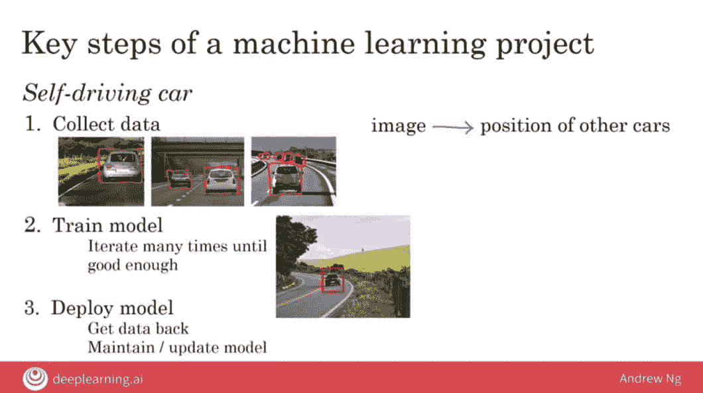

> 作者 | LeeMeng 
> 
> 整理 | NewBeeNLP

## 写在前面

> 在这个人机共存的年代，每个人都应该去尝试了解并运用人工智慧这个超能力，思考自己未来在这个变化快速的世界的定位 

曾经领导Google Brain 的吴恩达教授公开的Coursera 课程：**AI For Everyone**[1]非常有意义。这堂课不谈技术术语，专注在与非技术人士以及企业经理人说明 

*   **何谓AI **

*   **如何建立AI项目 **

*   **如何在企业内部建立AI基础 **

*   **AI与社会的关系 **

课程内容精要，总结了不少他多年在Google Brain、百度里领导AI 团队所累积的宝贵经验这堂课也提到了不少AI Transformation Playbook[2] 里头的内容。

虽然课程中很多时候是以CEO 或是企业管理者的角度说明AI 概念，但我认为每个人都可以用个人角度，从本课学到不少有用的建议以及思考框架。有了这些概念，可以帮助我们在这个变化快速的AI 潮流中掌握好自己手上的船舵并顺利航行

本文将列举出我认为本课中最值得记住的**10个AI观**，希望能让你学到些东西。

这篇不少概念是我自己的心得总结，而你在上完课后肯定会有其他重要见解。事实上，我会推荐你在阅读本文后就找时间实际去上这堂课，或是通过其他方式进一步了解AI

## 30秒AI大局观

以下就是10 个我认为AI For Everyone 这堂课传达的重要观念懒人包。如果你一秒钟几十万上下，可以只看这节就好：

*   讲到AI，我们通常是指狭义AI而非通用AI

*   多数AI应用是让机器学会一个对应关系

*   大数据、神经网络及运算能力是AI成功关键

*   只需花费你1秒的任务，大都可由AI自动化

*   对AI的态度不应过度乐观，但也不必太悲观

*   AI偏见难解，但或许比消除人类偏见简单

*   拥抱AI的最好方法是将其与领域专业结合

*   机器学习和资料科学的产出分别是系统和洞见

*   AI时代，你得思考未来自己想要扮演的角色

*   终身学习在这个年代前所未有的重要

是的，既然是AI For Everyone，自然没有什么特别深入的内容。但就像吴恩达教授在课程里头所说的，**我相信这些基本的核心思想可以引导我们在这个AI 时代更有方向且顺利地前进**。

本文接着会搭配课程PPT，针对上面提到的一些概念做点简单的补充说明，供你参考。

## AI For Everyone

#### 1、讲到AI，我们通常是指狭义AI而非通用AI

现在媒体整天报导的人工智能（Artifical Intelligence, AI）应用如：

*   智慧音响

*   自动驾驶

*   人脸辨识

*   图像分类

*   推荐系统

*   机器翻译

背后皆是狭义的AI（Artificial Narrow Intelligence, ANI）。

尽管很多AI 应用的表现甚至已经比人类还优秀，这些AI 基本上都专注在完成**「特定」**的任务；这跟科幻电影如魔鬼终结者里头，能跟人类以一样的方式思考并做**「任何」**事情的通用AI（Artificial General Intelligence, AGI）是有很大差异的。

尽管开发出AGI 是很多研究者的终极梦想，但事实上现行的科技离实现AGI 还有好一段距离。

#### 2、多数AI应用是让机器学会一个对应关系

大部分的机器学习以及AI 应用本质上都是让电脑学会一个映射函数（Mapping Function），帮我们将输入的数据A 对应到理想的输出B：

*   邮件分类：电子邮件->是否为垃圾邮件

*   语音辨识：音讯档案->文本

*   机器翻译：英文文本->中文文本要实现这种AI应用，最常被使用的方法是监督式学习（Supervised Learning）：给予机器大量的成对数据，告诉它什么样的A要对应到什么样的B，并让机器最后自己学会如何将任意的A转换成理想的B，达到自动化的目的。

#### 3、大数据、神经网络及运算能力是AI成功关键

要实现能帮助人类做复杂判断的AI技术有很多种，但近年真正让AI大红大紫的是深度学习（Deep Learning）以及人工神经网络（Artifical Neural Network）

值得一提的是，你或许常听到**「神经网络跟人脑运作方式相同」**的这种说法，但事实上如果你问相关人士对这种意见的看法的话，得到的答案常常是**「两者天差地远」**。

尽管神经网络的运作方式跟我们神奇的大脑不完全一致，搭配大量数据以及前面提到的监督式学习，越大的神经网络通常可以在特定任务有越好的表现。

虽然这样的现象令人振奋，但别忘记

*   大型神经网络的运作

*   大量数据的处理

这两件事情都意味着需要更大量的电脑运算能力。而很多时候一般人是没有这样的运算资源的。

值得庆幸的是，很多以深度学习为基础的AI常常有个很好的特性：透过迁移学习（Transfer Learning），我们能将事先已经用大量计算资源做训练，并在任务A表现优异的AI做些简单修改，就能让修改过后的AI'能在相似的任务B也表现不错。这时候就算你只有少量数据以及不多的计算资源，也能利用AI完成以往难以想像的任务。

#### 4、只需花费你1秒的任务，（未来）大都可由AI自动化

这项概念是吴恩达教授在课程里所提到的**「一秒原则」**，可以让你用来判断一个任务是否能用AI做自动化的准则。通过监督式学习以及大量成对A&B数据，我们可以让很多以往被认为非常复杂，但人脑仅需1秒钟就能解决的任务透过AI来自动化，让我们的生活更加轻松。

当然，这个简化的原则并不是放诸四海皆准，但可以做为一个不错的参考基准。

#### 5、对AI的态度不应过度乐观，但也不必太悲观

尽管我们已经清楚现代AI 的威力，仍需注意AI 并不是万能药，无法（完美地）解决或自动化所有人类的问题。

比方说有研究尝试把自然语言转成SQL，但短期内一个数据科学家自己写SQL查询数据可能还是比较有效率。尽管AI不能（完美地）做到任何事情，我们也不该对AI失望，断定下一个AI冬天必定会到来。现在可以肯定的是AI已经，而且也会继续改变我们未来以及下一代的生活型态。

最重要的是理性地理解AI 能做到什么，在能活用的时候善加利用它，同时不抱着**「AI 能解决所有问题」**的不切实际幻想。

#### 6、AI偏见难解，但或许比消除人类偏见简单

在利用监督式学习的方式训练AI 的时候，我们常常会使用现实世界的数据让机器学习。

好消息是因为现在数位化以及网际网络的发达，我们有非常多数据可以交给AI 学习；坏消息是这些数据时常反映了人类数十年甚至几个世纪的偏见。

用这些数据训练出来的AI 系统就像是面照妖镜，也会不可避免地学会这些偏见（Bias）。

知名的例子有：

*   以白人照片训练出来的人脸辨识系统在辨识深色肤色的人种时表现很差

*   自动化雇用的AI系统对女性存有偏见

*   银行的自动信用评比AI系统对某些族群产生偏见

以下则是另一个课堂中提出的例子：上例或许称不上歧视，但很明显是偏见，一种长久存在于人类社会的性别偏见。

因为很多时候这些AI 系统是学习一种统计关系，因此在此例中，AI 只是忠诚地呈现我们社会的用字习惯罢了。

要消除AI的这些偏见并不容易，但仔细想想，这可能比消除人们脑中数十年的偏见要来的简单，而且振奋人心。这件事情当然不简单，但却非常值得一试。

当然，你可以选择不思考这些AI伦理、偏见问题，相信建立AI系统的这些工程师们立意良善以及够细心，能帮我们将AI系统里的偏见移除，并让其做出最合适的判断。

尽管如此，意识到再厉害的AI系统内部也可能存在如同人类的偏见，进而导致各种不公平的社会问题这件事情也是很有帮助的。

#### 7、拥抱AI的最好方法是将其与领域专业结合

想要学习AI，不需要打掉重练。虽然现在AI 相关领域十分热门，究其根本也就只是一种工具/技术。而且AI技术接下来会越来越平民化，上手的门槛会越来越低。

因此比起现在转行当AI 工程师，你要先做的应该是想办法利用自己工作累积的领域知识（Domain Knowledge）以及洞见（Insight），找出能应用AI 改善的地方，进而创造出专属于你或企业的竞争优势。

#### 8、机器学习和数据科学的产出分别是系统和洞见

机器学习（Machine Learning, ML）以及数据科学（Data Science, DS）这两个词汇常常结伴出现，且依照不同企业其定义都有所不同。因此，不在这块领域里的人常常不知道两者的差异。

一般来说，在企业内的ML项目大都分为3 个阶段：

*   收集数据

*   训练模型

*   部署模型

而DS 项目的步骤则为：

*   收集数据

*   分析数据

*   建议行动/假说

两者皆需原始数据作为输入，且皆有机会使用AI / ML技术来解决、分析问题，但最终的产出形式时常不同。

总结来说，ML项目较注重在软件工程方面，且最终希望产出一个以AI为基础的线上系统；DS项目的结果则可能是一份帮助经营者做重大投资决策的PPT报告。

#### 9、AI时代，你得思考未来自己想要扮演的角色

AI 目前正是显学，不少人决定进入这块领域，而现在跟AI 相关的职业就有好多种，比方说：

*   数据科学家

*   机器学习工程师

*   机器学习研究者

*   软件工程师

*   数据工程师

*   AI项目管理者

等等。而且随着AI 的影响力持续扩大，未来可能还会出现新的相关职业。我们在这边不会一一列出每个职业的工作内容。

#### 10、终身学习在这个年代前所未有重要

如同课程中吴恩达教授所说的，你并不需要取得一个AI master 才能开始进行AI 项目。很多时候利用线上课程或是网络上的深度学习资源就可以开始你的第一个AI项目了。

事实上，学习AI For Everyone 这堂课就是一个不错的开始。网络上也有很多优质的博客或教学文章等待你的探索。

AI 领域近年发展神速，要学习AI，用上一代**「读几年书，出来用一辈子」**的概念是行不通的。台大电机系的李宏毅教授就曾说过：**「在深度学习的领域，超过五年就是远古时代了」**！

因此如果你决定踏上学习AI 的这条路，就做好跟我一起终身学习的心理准备吧！

## 结语

看到这里，相信你已经了解AI For Everyone 里头10 个最重要的概念了，恭喜！

这些概念大多是我将课程里头撷取出的核心概念，佐以自己的心得感想。希望阅读完此文的你有学到点东西，或是获得些启发。

### 本文参考资料

[1]

AI For Everyone: https://www.coursera.org/learn/ai-for-everyone

[2]

AI Transformation Playbook: https://landing.ai/ai-transformation-playbook/

*AI学习路线和优质资源，在后台回复"AI"获取*

