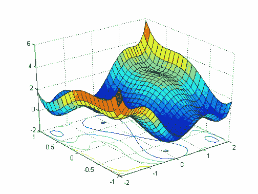
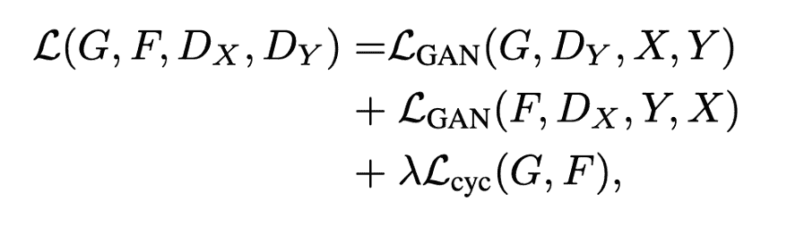

**导读**

损失函数在**模型的性能**中起着关键作用。选择正确的损失函数可以帮助你的模型学习如何将注意力集中在数据中的正确特征集合上，从而获得**最优和更快的收敛**。

> **计算机视觉**是计算机科学的一个领域，主要研究从数字图像中自动提取信息。

在过去的十年中，在**深度学习**方面的创新，大量数据的方便获取以及GPU的使用已经将**计算机视觉**领域推到了聚光灯下。它甚至开始在一些任务中实现“超人”的性能，比如**人脸识别**和**手写文本识别**。(事实上，如今登机的自动人脸验证已经变得越来越普遍了。)

近年来，我们在**网络架构**、**激活函数**、**损失函数**等计算机视觉领域看到了许多创新。

损失函数在**模型的性能**中起着关键作用。选择正确的损失函数可以帮助你的模型学习如何将注意力集中在数据中的正确特征集合上，从而获得**最优和更快的收敛**。

这篇文章的主要目的是总结一些重要的损失函数在计算机视觉中的使用。

你可以在这里：https://github.com/sowmyay/medium/blob/master/CV-LossFunctions.ipynb找到这里讨论的所有损失函数的PyTorch实现。

# Pixel-wise损失函数

顾名思义，这种损失函数计算预测图像和目标图像的像素间损失。损失函数，如**MSE或L2损失、MAE或L1损失、交叉熵损失**等，大部分都可以应用于在目标变量的每一对像素之间进行预测。

由于这些损失函数分别对每个像素向量的类预测进行评估，然后对所有像素进行平均，因此它们断言图像中的每个像素都具有相同的学习能力。这在图像的语义分割中特别有用，因为模型需要学习像素级的密集预测。

在**U-Net**等模型中也使用了这些损失函数的变体，在用于图像分割时采用加权的像素级交叉熵损失来处理**类间不平衡**问题。

> 类不平衡是像素级分类任务中常见的问题。当图像数据中的各种类不平衡时，就会出现这种情况。由于像素方面的损失是所有像素损失的平均值，因此训练会被分布最多的类来主导。

# Perceptual损失函数

Johnson et al (2016)，Perceptual损失函数用于比较看起来相似的两个不同的图像，就像相同的照片，但移动了一个像素或相同的图像使用了不同的分辨率。在这种情况下，虽然图像非常相似，pixel-wise损失函数将输出一个大的误差值。而Perceptual损失函数比较图像之间的高级感知和语义差异。

考虑一个图像分类网络如VGG，已经在ImageNet的数以百万计的图像数据集上训练过，第一层的网络往往提取底层的特征(如线，边缘或颜色渐变)而最后的卷积层应对更复杂的概念(如特定的形状和模式)。根据Johnson等人的观点，这些在前几层捕获的低层次特征对于比较非常相似的图像非常有用。

例如，假设你构建了一个网络来从输入图像重构一个超分辨图像。在训练期间，你的目标图像将是输入图像的超分辨率版本。你的目标是比较网络的输出图像和目标图像。为此，我们将这些图像通过一个预先训练好的VGG网络传递，并提取VGG中前几个块的输出值，从而提取图像的底层特征信息。这些低级的特征张量可以通过简单的像素级损失来进行比较。

用于图像分类的预训练的损失网络

## Perceptual损失的数学表示

其中，V_j(Y)表示VGG网络第j层在处理图像Y时的激活情况，其形状为(C_j, H_j, W_j)。我们使用L2损失的平方，根据图像的形状归一化，比较了ground truth图像Y和预测图像Y^的激活情况。

如果你想使用VGG网络的多个特征映射作为你的损失计算的一部分，只需为多个j添加L_j值。

# 内容-风格损失函数—神经网络风格转换

> 风格转换是将图像的语义内容转换成不同风格的过程。风格转换模型的目标是，给定一个内容图像(C)和一个风格图像(S)，生成包含C的内容和S的风格的输出图像。

在这里，我们将讨论content-style损失函数的最简单实现之一，该函数用于训练这种风格的转换模型。后来的研究中使用了许多内容-风格损失函数的变体。下一节将讨论一个这样的损失函数，称为“纹理损失”。

## 内容/风格损失的数学表示

已经发现，CNNs在较高的层次上捕获内容的信息，而较低的层次更关注单个像素值。

因此，我们使用一个或多个CNN顶层，计算原始内容图像(C)和预测输出(P) 的激活图。

同样，通过计算预测图像(P)和风格图像(S)的下一级特征图的L2距离，可以计算出风格损失，得到的损失函数定义为：

alpha和beta是超参数。

> 注意：只有减少样式和内容损失的优化会导致高像素化和噪声输出。为了解决这个问题，我们引入了total variation loss来保证生成的图像的空间连续性和平滑性。

# 纹理损失

Gatys et al (2016)首次引入的用于图像风格转换的风格损失组件。纹理损失是一种引入的损失函数，是对感知损失的改进，特别适用于捕获图像的风格。Gatys et al发现，我们可以通过查看激活或特征图(来自VGG网络)内的值的空间相关性来提取图像的风格表示。这是通过计算*Gram矩阵*来实现的：

Gram矩阵(对于VGG网络的l层)是向量化特征映射F_i和F_j(在l层)的内积，它捕捉了特征在图像不同部分同时出现的趋势。

# 纹理损失的数学表示

这里，G^l^和A^l^分别是模型输出的l层和目标图像的l层的风格样式表示。N~l~是层l中不同特征映射的数量，M~l~是层l(i)中特征映射的容量（也就是通道的宽和高）。最后，E~l~是图层l的纹理损失。

网络的纹理损失是所有纹理损失的加权和，表示为：

这里**a**是原始图像，**x**是预测图像。

> 注意：虽然这里的数学看起来有点复杂，但请理解纹理损失只是应用在特征图的gram矩阵上的感知损失。

# 拓扑感知损失函数

Mosinska等人(2017)介绍了最近文献中另一个有趣的损失函数，即拓扑感知损耗函数。这可以被认为是感知损失的延伸，应用于分割mask预测。

Mosinska等人认为，在图像分割问题中使用的像素级损失，如交叉熵损失，只依赖于局部测度，而不考虑拓扑结构的特征，如连接组件或孔的数量。因此，传统的分割模型如U-Net往往会对薄的结构进行错误的分类。这是因为对薄层像素的错误分类在像素损失方面的代价很低。作为对像素损失的改进，他们建议引入一个惩罚项，该惩罚项基于VGG-19网络生成的特征图(类似于感知损失)，以考虑拓扑信息。

(c)使用像素级丢失检测神经元膜后获得的分割，(d)利用拓扑损耗检测细胞膜后得到的分割

这种方法在从卫星图像中进行道路分割时也特别有用，例如，树木的遮挡。

## 拓扑感知损失的数学表示

这里，在RHS上，l(m,n)表示VGG19网络第n层的第m个feature map。Mu是衡量像素损失和拓扑损失相对重要性的标量。

# 对比损失/三元组损失

Triplet loss是由Florian Schroff等人在FaceNet(2015)中提出的，其目的是在有限的小数据集(如办公室中的人脸识别系统)上构建一个人脸识别系统。传统的CNN人脸识别架构在这种情况下总是失败。

Florian Schroff et al关注的事实是，在人脸识别的小样本空间中，我们不仅要正确识别匹配的人脸，还要准确区分两个不同的人脸。为了解决这个问题，FaceNet的论文引入了一个名为“Siamese网络”的概念。

在Siamese网络中，我们通过网络传递一个图像A，并将其转换成一个更小的表示，称为嵌入。现在，在不更新网络的任何权值或偏差的情况下，我们对不同的图像B重复这个过程并提取其嵌入。如果图像B与图像A中的人是同一个人，那么它们相应的嵌入必须非常相似。如果它们属于不同的人，那么它们相应的嵌入一定是非常不同的。

> 重申一下，Siamese网络的目标是确保一个特定的人的图像(锚点)与同一个人的所有其他图像(positive)的距离要比与任何其他人的图像(negative)的距离更近。

为了训练这样一个网络，他们引入了**三元组损失函数**。考虑一个三元组：[anchor, positive, negative] 。三元组损失定义为：

1.  定义距离度量d=L2范数

2.  计算anchor图像与positive图像的嵌入距离=d(a, p)

3.  计算anchor图像嵌入到negative图像的距离=d(a, n)

4.  三元组损失= d(a, p) - d(a, n) + offset

## 三元组的数学表示

这里， *x^a^* -> anchor, x^p^ -> positive，x^n^ -> negative

注：为了快速收敛，必须选取正确的三元组进行损失计算。FaceNet的论文讨论了实现这一目标的两种方法——离线三元组生成和在线三元组生成。关于这个话题的详细讨论我们将留到以后讨论。

# GAN损失

> 由Ian Goodfellow等人(https://arxiv.org/abs/1406.2661)(2014)首先提出的生成式对抗网络是目前最流行的图像生成任务解决方案。GANs的灵感来自博弈论，并使用一个对抗的方案，使它可以用无监督的方式训练。

GANs可以被看作是一个两个人的游戏，我们让生成器(比如产生一个超分辨率的图像)与另一个网络 —— 判别器进行较量。判别器的任务是评估一个图像是来自原始数据集(真实图像)还是来自另一个网络(假图像)。判别器模型像任何其他深度学习神经网络一样k可以被更新，生成器使用判别器作为损失函数，这意味着生成器的损失函数是隐式的，是在训练过程中学习的。对于典型的机器学习模型，收敛可以看作是在训练数据集上让所选损失函数最小化。在GAN中，收敛标志着双人博弈的结束，是寻求生成器和判别器损失之间的平衡。

对于GAN来说，生成器和判别器是两个参与者，它们轮流更新各自的模型权值。在这里，我们将总结一些用于GAN网络的损失函数

## 1\. Min-Max损失函数

然而，在实践中发现，这种生成器的损失函数会饱和。也就是说，如果它不能像判别器学习得那么快，判别器赢了，游戏就结束了，模型就不能得到有效的训练。

## 2\. 不饱和的GAN损失

不饱和GAN损失是一种改进的生成器损失，以克服饱和的问题，使用了一个微妙的变化。该生成器不是最小化所生成图像的负判别器概率的对数，而是最大化所生成图像的判别器概率的对数。

## 3\. 最小均方GAN损失

由Xudong Mao, et al (2016)提出，当生成的图像与真实图像非常不同时，这种损失函数特别有用，因为此时会导致梯度非常小或梯度消失，进而导致模型很少或没有更新。

## 4\. Wasserstein GAN损失

Martin Arjovsky等人(2017)。他们观察到，传统GAN的目的是最小化真实图像和生成图像的实际概率分布和预测概率分布之间的距离，即所谓的Kullback-Leibler (KL)散度。相反，他们建议在Earth-Mover’s distance上对问题进行建模，该模型根据将一个分布转换成另一个分布的成本来计算两个概率分布之间的距离。

使用Wasserstein损失的GAN涉及到将判别器的概念改变为一个更改评估器，比生成器模型更新得更频繁(例如，更新频率是生成器模型的五倍)。评估器用实际的数字而不是预测概率来给图像打分。它还要求模型的权重保持较小。该得分的计算使得真假图像的得分之间的距离最大程度地分离。Wasserstein的损失的好处是，它提供了一个有用几乎无处不在的梯度，允许模型的继续训练。

## 5\. 循环一致性损失

> 图像到图像的转换是一个图像合成的任务，需要对给定的图像进行有控制的修改，生成一个新的图像。例如，把马转换成斑马(或反过来)，把绘画转换成照片(或反过来)，等等。

juno - yan Zhu et al (2018)介绍。训练用于图像到图像转换的模型通常需要大量成对的样本数据集，这些样本很难找到。CycleGAN是一种不需要配对实例的自动训练技术。这些模型以一种无监督的方式进行训练，使用来自源和目标域的图像集合，这些图像不需要以任何方式关联。

CycleGAN是GAN体系结构的扩展，它同时训练两个生成器模型和两个判别器模型。一个生成器从第一个域获取图像作为第二个域的输入和输出图像，另一个生成器从第二个域获取图像作为输入并生成第一个域的图像。然后使用判别器模型来确定生成的图像是否可信，并相应地更新生成器模型。

> 循环一致性是指第一个生成器输出的图像可以用作第二个生成器的输入，而第二个生成器的输出应该与原始图像匹配。反之亦然。

CycleGAN通过增加额外的损失来测量第二个生成器生成的输出与原始图像之间的差异，从而趋向于循环一致性。该损失作为正则化项用于生成模型，指导新领域的图像生成过程向图像转换方向发展。

https://machinelearningmastery.com/loss-and-loss-functions-for-training-deep-learning-neural-networks/

*AI学习路线和优质资源，在后台回复"AI"获取*

