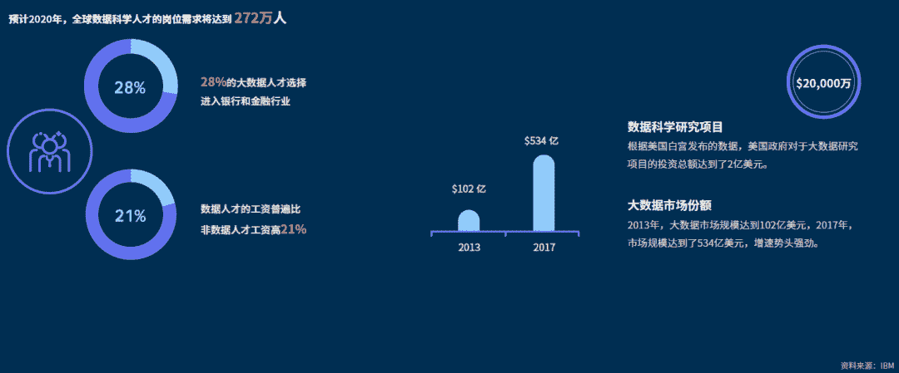

Datawhale原创

**联合发布：和鲸科技、腾云大学、AWS、Datawhale**

寄语：为什么要加快推进高校的数据科学教育？数据科学的知识体系包括哪些内容？数据科学人才的成长路径及教育方法论？我们希望用这份白皮书给出答案。

2019年3月28日，写过一篇数据人才的文章《[深入了解数据人才 | 中国数据人才白皮书](http://mp.weixin.qq.com/s?__biz=MzIyNjM2MzQyNg%3D%3D&chksm=e870d268df075b7ebe5135f12bbaf9991a028f3529a3d2f9fd7dcbf274a3dbaec3638a422aeb&idx=1&mid=2247484197&scene=21&sn=7715f9ee9152cc09adc6fa09149aad4e#wechat_redirect)》。时隔一年，对于大家更加关心的：为什么数据科学开始被重视，如何成为顶级的数据人才，什么是科学有效的教育方法论呢？这些答案，在今天发布的这份《数据科学教育白皮书》上，我们将为你提供经过调研、分析及实践后的完整报告，希望对你的未来决策及成长发展有所帮助。

## 摘要

自1974年，Peter Naur首次提出“数据学”和“数据科学”的概念，在即今为止的46年中，大众产业在**数据赋能**下进入快速迭代的周期中。如何在产业转型升级中把握人才的教育方向和实践路径，已经不仅仅是学科发展和高校建设的发展指标，背后更多的是城市竞争力与国家战略考量。

数据的流通带来了信息分发效率的高效提升，数据科学将作为**通用目的技术**(general purpose technologies)，一方面**重组**传统流程和模式，认知学习与团队协作方式产生变化；另一方面，数据科学是具有**社会泛化效应**的增长技术引擎，作为时代支撑性技术会引起跨领域的产业转型和升级。因此，有关数据科学的应用价值及需要关注**垂直创新价值**，同时也要关注**生态创新价值**。

数据科学教育项目有别于传统学科项目，需要具有**协同性、整合性、敏捷性和生态化**的特征，要完整的打造一体化的数据科学教育项目，需要完成4个阶段任务以构建完整的教育流程：

*   **数据科学知识体系的掌****握**，完备的数据理论知识体系和技能理论、数据治理；

*   **阶梯式实践路径与实战项目**：分析管理云端化平台化；认知数据科学项目的负责性；团队协同与分工；

*   **真实行业场景中创造业务价值**：真实场景价值；创新落地；多元背景团队的协同；

*   **开放生态的深度连接**：生态玩家的有机结合；立体化流程搭载。

以下完整高清的白皮书PDF，可在Datawhale后台回复关键词 **数据科学白皮书** 获取

## 全球视角下的高校数据科学项目

**美国欧洲高校数据科学项目部署形成第一梯队**

**结论**：高校数量是发展基数，中国有待加强单位高校数据科学项目比。

世界范围内，美国领先高校开设的数据科学项目总量第一。占比全美洲的高校项目的98.38%，在保持3039所高校数量的绝对优势下，教育领先世界水平。

英国以45个项目，45.10%的项目占比领先欧洲，欧洲项目总量排名前五的国家合计占比，达到了76.47%欧洲国家整体推动数据科学项目力度领先，全球高效数据科学项目分布率平均达到了22.6%。

中国以93个项目58.49%的项目占比领先亚洲。日本以37.74%的项目占比位居第二。考虑学校数量以及国家土地面积，日本的数据科学推广力度稍强于国内。高校数据科学项目分布率达到了7.8%，高于中国的3.5%。

在进入榜单的其他国家中，新西兰的高校中数据科学，项目推广程度最广，32所高校共是16个项目，占比达到了55.5%，高效数据科学项目分布率达到了18.8%。

**数据科学项目赋能城市发展与国家竞争力**

**结论**：高校项目与城市排名呈现关联，中国仍须向欧美看齐，加大智能与信息投入。

全球城市经济竞争力指数20强，竞争激烈，全球综合中心和科技中心总体提升。从替代弹性，聚焦城市，智能时代和信息时代四大层次指标出发，在中美欧三大经济体的城市竞争力指数中，美国城市发展指数潜力最大，美国欧盟远超中国。

在全球城市可持续化的Top100的城市中，美国有33个城市入围，合计占比达到了33.41%。总量前五的国家中，入围城市总数占比达到了68.37%。

**数据科学项目开发水平背后是学校教育竞争力**

**结论1**：高校实力与数据科学项目推动力挂钩

在全美Top100的高校评级中，根据国际化水平、教育水平、收入水平以及研究水平综合评定的排名划分，通过聚类分析可以看出高校评级的高低与数据科学项目数量存在一定的关联性。

**结论2：**美国世界百强高校在数据科学项目的研制和推行仍旧保持领先

在全美高校推进的数据科学项目中，59.95%的项目是校园线下项目，32.13%的项目是线上授课。同时，开设一门数据科学项目的高校占据了28.06%，开设两门/三门的高校分别占据了23.02%和22.78%。

**结论3**：在线授课被用于学位培养计划

在全美高校的数据科学项目中，学位培养计划添加了大量有关数据科学的内容，纯线上项目中，学位项目占据了69.7%的比重。

**国内教育投入与日俱增**

人才的培育与输送是数据科学赋能的直接供能。

**结论1**：数据科学与大数据相关专业在全国范围内积极开设。

截至2019年3月25日，全国34个行省级行政区中有29个省级行政区的481所（截至2019年6月15日全国普通高等本科学校总数为1265所）院校成功新增备案数据科学与大数据技术专业，其中有个别院校开设了两个不同学位的数据科学与大数据技术专业。

我国高职院校对大数据专业人才的培养相应度同样保持高水平。据统计，2017年获批64所职业院校；2018年获批212所职业院校；2019年获批460所职业院校；2020年获批619所职业院校。迄今为止，全国共有1355所职业院校成功申报了大数据技术应用专业。

**结论2**：学科交叉融合，构建协同共生的学科体系

前沿技术与商业场景之间存在的认知偏差阻碍了数据科学价值的释放，在数字化趋势下日益完善的社会教育体系和不断催生的符合工作能力要求，继高等教育之后也催化了大批数据科学人才的诞生。数据竞赛日渐成为人才成长过程中进行理论实践和能力锻炼的重要选择。

**存量大且增速快是我国数据科学人才核心优势**

我国数据科学人才增速显著提升，从供给层面为数据科学的价值流通奠定了良好的基础。

**结论**：我国数据科学人才处于稳定发展水平

根据剑桥大学发布的2019年AI全景报告，中国和美国的人工智能生态已经相对较为成熟，国家数据科学人才的流失率处于相对较低的水平且人才的增长率处于相对较为稳定的水平。

自2014年以来，中国在深度学习领域发表的论文数量开始领跑全球，这一趋势一直维持至今。

## 数据科学教育的新范式

**数据科学教育流程中的价值点**

白皮书以理论学习、实践训练、项目实战、行业运用和科研研究作为数据科学教育流程中的关键节点，指出了每个关键节点需要把握的价值点与学习收获。

**数据科学教育的痛点**

白皮书从经验师资、实践训练、实训机构、行业应用、就业科研和生态搭建几方面分析了目前中国数据科学教育的痛点。系统地分析了从学科背景、工具平台到人才发展方面存在的各类问题。

**数据科学教育的新范式**

通过对数据科学教育流程中的价值点与技能的精准理解，深刻剖析了其存在的痛难点后，白皮书提出了：基于综合考虑内外部协同的，包含知识体系、实践路径和项目实战、行业应用、科学教育生态的数据科学教育的新范式。

下面，将从以下五个方面对数据科学教育新范式中的关键要素进行解读。

**打通教育全流程的模式：数据科学SaaS平台和专业人才社区**

介绍了教育的新范式后，白皮书对以“数据科学SaaS平台”和“专业人才社区”为基础的模式进行了详细解读，深入分析该模式是怎样打通教育全流程的。   

**第一阶段：数据科学知识体系的掌握**

第一阶段，数据科学是一门复合且专业性极强的学科，在数据科学的高校教育中往往会遇到学科背景局限和高校相对资源禀赋匮乏的情况。数据科学作为通用目的技术赋能其他应用场景，因此针对交叉学科的培养、课程大纲设置的科学性、以及教学方式的适用性等带来诸多挑战。高校中针对交叉学科背景的建设的基础较弱，成熟度有待加强。同时，高校基础资源相对分散，教学路径较为固化，也为数据科学教育的推广带来难度，因此，一套科学的教纲、知识天梯和流程模块尤为关键。

白皮书对目前较为科学的数据科学学习项目，进行了归纳，具体如下：

**第二阶段：阶梯式实践路径和实战项目**

数据科学作为实操性极强的学科需要科学的实践路径与工具的掌握。但正因为数据科学的知识体系较为庞杂。因此在实际教学过程中，往往会出现教学平台(工具)的资源缺口和真实数据与案例沉淀缺失的问题。基于此，云端化和协同化的数据科学实操，是在以科学的，循序渐进的实践路径中的重要支撑。

实训机制是以让学生完成完整的数据科学项目为导向设置的实践类型，国外已有很多高校开设实训营以培养学生达到能用数据科学方法解决实际项目的目标。在现阶段，国内高校中，依然存在着实训统一工具管理困难、流程设置的科学性、目标与成绩评估和管理等问，以项目为导向的数据科学教育要注重“CBL+Design Thinking+全流程云端工具”，实现“理论知识+数据资源+人才潜力”的汇总，把握真实问题、真实业务、创造真实价值。

**1\. 理论的积累需要通过合理的实践路径进行知识强化**

结合真实数据进行数据科学学习路径的实践与研讨。

**2\. 实践带来多维度的认知强化有利于知识的留存与应用**

云端化和平台化让实践学习更具整合性协同性和敏捷性。

**3\. 基于挑战任务的学习是数据科学教育的进阶阶段**

“设计思维”+“基于挑战的学习”+云端工具，是数据科学人才复合成长的必要管道。

**4\. 不同岗位人才需要培养不同的数据科学能力集**

**5\. 完整的数据科学项目需要结合背景进行合理的项目分工**

不同的技术背景存在工作导向性的区别，数据科学家在数据清洗和模型应用生产投入相对多的时间。

**6\. 数据科学项目要保持较高的敏捷迭代能力以提升场景可持续化**

数据科学项目的推动与落地，要经过10个关键节点，详情如下图所示：

1.  初步探索：进行目标认知，信息共享以及筛选甄别；

2.  仔细检查：针对具体业务/场景问题进行评估机会；

3.  项目展示：前期研究发现展示和合适项目推荐；

4.  数据收集：以被认可的方法论进行数据收集，同时保障安全性；

5.  数据检查：分析初始数据以验证初步假设；

6.  数据清洗&处理：清洗数据为处理做准备；

7.  建模：根据检查阶段提出的问题集创建模型；

8.  预测：使用数据训练并评估积极学习和AI模型；

9.  可视化：以合理清晰的方式展现研究成果；

10.  可持续化：根据最初的假设和研究成果，迭代新的数据科学项目。

**7\. 数据科学教育需要敏捷、高效和可协同的平台支撑**

数据科学平台，需要协同管理、数据管理、友好界面和资源调度的综合能力。

**第三阶段：真实行业场景中创造业务价值**

通用目的技术是一种能够赋能泛产业转型升级的底层技术，数据科学教育的真正价值也在于能够帮助学生明确场景的可改造型、技术的可落地性以及技术的可迭代性。但在现阶段的国内数据科学教育中，依然存在着场景探索缺失的问题，缺失真实场景用于实践、数据难获取以及缺失行业导师的指导解读。数据科学教育需要充分挖掘不同的应用场景，要梳理一套完整的、科学的和可复用的价值流程，基于流程化的教育管理完成对于学生场景认知的教育，立足于真实的业务场景，完成创造真实价值的落地闭环。

**1\. 数据科学项目在人文社科的应用--市场营销**

数据科学研究应用的落脚点依赖于数据的储备，商科是主要场景之一。

**2\. 数据科学项目在人文社科的应用--心理健康**

数据科学对病情诊断、治疗方案转换以及对心理疾病的可预防等方面产出了重大的贡献。

**3\. 数据科学项目在人文社科的应用--金融科技**

银行业的六大板块都可以借助数据科学来更深入地了解客户并制定针对性更强的价值主张。

**4\. 数据科学项目在理工科的应用--石油工程**

实时数据采集、智能分析、决策优化、全面互联共同改造石油工程场景。

**5\. 从数据到价值，需要一整套场景化内外协作机制**

数据科学项目既是数据产出价值的过程，同时也是多方协作的过程。

**第四阶段：开放生态的深度连****接**

数据科学教育在国内仍旧处于迅速发展的阶段，关于教育生态的资源整合以及学生就业发展选择的路径中，同样存在诸多痛点。如何更好的衔接科学研究与普适学习？如何在把握教育方向的前提下提高科研效率？如何提高教育生态中资源整合的效率？都成为亟需解决的问题

背靠协同共享的学习机制，充分调动教育生态中的伙伴资源，打造“数据池+人才池+平台算力支撑家+协作共享机制”的闭环，可以加速数据科学的落地场效果。

**1\. 数据科学教育生态版图**

数据科学教育的工业级应用需要生态赋能。

**2\. 数据科学开源软件生态版图**

开源软件逐渐细分且发展迅速，并在企业界普及，数据科学教育需要保持开放、融入生态。

**3\. 以产业发展为落脚点，数据科学的教育需考虑生态建设**

数据科学是跨行业、长周期的通用目的技术。

**4\. 数据科学对于教育及大众产业的底层供能效应已经凸显**

围绕金融、互联网、教育、通信和零售等进行赋能转型，就业市场成数据科学产学研供需匹配的直接对话窗口。

**5\. 开源学习依赖于知识迭代速度、学习主动性和教育成本**

基于终生学习倡议下的开源学习三要素：

*   强化迭代速度的知识更新

*   填鸭式学习的模式改变

*   可触达的优质学习内容

**6\. 开源学习的应用案例-《动手学深度学习》在线训练营**

28天开源学习；170篇优质内容分享；2465名学习者；9家企业共同助力窗口。

**7\. 协同共享的学习机制可以为生态中不同背景群体提供支持**

数据池+人才池+平台算力支撑+协作共享机制=数据科学教育落脚于工业级应用

## 参考文献

联合发布

Heywhale和鲸

TDU：腾云大学

亚马逊：AWS

开源组织：Datawhale

*完整高清PDF，在后台回复"****数据科学白皮书****"获取*

如果你觉得有价值，欢迎点个**在看 **