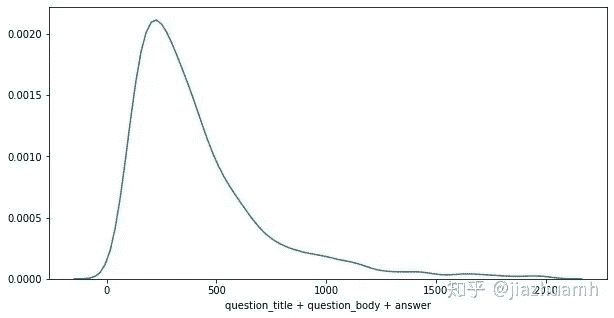
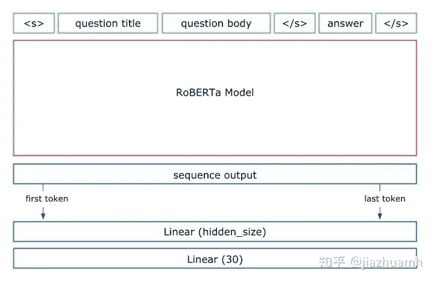

**一、背景介绍**

很早就想入坑 kaggle NLP 类比赛，记得最初是跟着教程跑入门赛 Bag of Words Meets Bags of Popcorn，被一步步的文本预处理搞得心累，再加上 kaggle 上 NLP 类比赛也不多，所以一直没有正儿八经打一场。后来 BERT 横空出世，文本预处理已不再重要，NLP 类比赛变得像传统挖掘类比赛一样简单，现成的开源框架加上 kaggle 平台上免费的 GPU 资源，似乎已经没什么障碍了。

这次的比赛是年前放出的 Google QUEST Q&A Labeling，正好赶上过年放假，差不多有两周左右的时间可以全力投入。不过对于新手而言，还是有点晚，错过了组队的时机，只能一个人撸，吭呲吭呲累够呛，最终也只拿了个银牌。

因为是第一次打 NLP 类比赛，经验更多的是来自平台的 winner solutions。这些方法在多个比赛中被广泛应用，不一定在所有场景下都有效，但绝对值得一试。另外，本文总结的内容比较浅，更适合像我这样的新手，高手的话随意看看就好，当然也很乐意接受各位的指点。

2018年 BERT 问世，迅速统治了 kaggle NLP类比赛。鉴于 BERT 及其后继者在 NLP 多个任务上简单且有效，这里的总结也就局限在如何使用 BERT 类模型打比赛。

**二、BERT使用框架**

BERT 类模型的使用方法是预训练 + finetune，为方便理解，放一张简图：

 绿色的数据部分，主要包括对数据进行采样，转换成 BERT 输入的格式。NLP 类比赛中的数据大致可分为文本数据和非文本数据，文本数据为主，一般以句子、段落或篇章的形式存在；非文本数据是指数值变量或分类变量，这类变量的处理方法与传统挖掘类比赛一样，因为不是重点，不需要太复杂的处理或转换，并且一般只是作为补充信息被整合到 BERT 模型中，我们不妨称它们为 meta 特征。

粉色的是模型部分，我把它拆成了两块 Encoder 和 Classifier，在实际使用中其实是放在同一个神经网络里的。拆开表示主要是因为 Encoder 部分就是我们所谓的预训练语言模型，不论是网络结构还是权重都是现成的，我们直接拿来用，基本不需要做改动；而 Classifier 部分是随着任务的不同而改变的，它一般是一层或多层全连接网络(FCNN)。大致的流程是文本特征(也可以有 meta 特征)经过 Encoder 层会被编码成向量表示(Vector Representation)，再通过 Classifier 得到最终的预测结果。

meta 特征既可以以 special tokens 的方式和文本特征一起进入 Encoder 进行编码；也可以不过 Encoder 而在 Classifier 部分进行 Embedding，然后与文本的 Vector Representation 进行融合后作为 Classifier 的输入。

清楚这个流程后，我们就对图中不同部分用到的方法进行总结。

**2.1 Encoder**

都是基于 transformer 结构的预训练语言模型，包括了 Bert 及其后继者 Bert-WWM、Roberta、XLNet、Albert 等，统称为 BERT 家族。它们不仅在结构上很相似，而且在使用方法上更是高度一致，可以在 huggingface/transformers 全家桶中直接调用。

这里只是从使用角度简单介绍一下 BERT 家族里几个常用的模型，想进一步了解原理的小伙伴可以在网上搜索，有很多详细的解读，也可以直接看原始论文。考虑到 Bert 是基础，很有代表性，对它有一定的了解是很有必要的，这里推荐一个博客。

### **Bert**

Bert 是一种基于 Transformer Encoder来构建的预训练语言模型，它是通过 Masked Lanauge Model(MLM) 和 Next Sentence Prediction(NSP) 两个任务在大规模语料上训练得到的。

开源的 Bert 模型分为 base 和 large，它们的差异在模型大小上。大模型有更大的参数量，性能也有会几个百分点的提升，当然需要消耗更多的算力，BERT 家族其他模型也类似。

### **Bert-WWM**

模型结构与 Bert 完全一样，只是在 MLM 训练任务上做了一个小的改进。Bert 在做 MLM 采用的是 token 级别的 mask，而 Bert-WWM 则采用了词级别的mask，更加合理一些。

### **Roberta**

Bert 的优化版，模型结构与 Bert 完全一样，只是在数据量和训练方法上做了改进。简单说就是更大的数据量，更好的训练方式，训练得更久一些。

*   相比原生 Bert 的16G训练数据，RoBerta 训练数据量达到了161G；

*   去除了 NSP 任务，研究表明 NSP 任务太过简单，不仅不能提升反倒有损模型性能；

*   MLM 换成 Dynamic Masking LM；

*   更大的 Batch size 以及其他超参数的调优；

### **XLNet**

XLNet 对 Bert 做了较大的改动，二者在模型结构和训练方式上都有不小的差异。

*   Bert 的 MLM 在预训练时有 MASK 标签，但在使用时却没有，导致训练和使用时出现不一致；并且 MLM 不属于 Autoregressive LM，不能做生成类任务。XLNet 采用 PML(Permutation Language Model) 避免了 MASK 标签的使用，且属于 Autoregressive LM，可以做生成任务。

*   Bert 使用的 Transformer 结构对文本的长度有限制，为更好地处理长文本，XLNet 采用升级版的 Transformer-XL。

### **Albert**

Albert 的目的是想对 Bert 瘦身，希望用更简单的模型，更少的数据，得到更好的结果。它主要从以下两个方面减少模型的参数量：

*   对 Vocabulary Embedding 进行矩阵分解，将原来的矩阵`V x E`分解成两个矩阵`V x H`和`H x E`（`H << E`）。

*   跨层参数共享，每层的 attention map 有相似的pattern，可以考虑共享。

效果是 70% 参数量的削减，模型性能损失 < 3%，但有很多文章指出 Albert 的计算量并没有减少太多，并且如果达到超过 Bert 性能，需要使用更大的模型以及相应的算力。

这些模型的性能在不同的数据集上有差异，需要试了才知道哪个表现更好，但总体而言 XLNet 和 Roberta 会比 Bert 效果略好，large 会比 base 略好，更多情况下，它们会被一起使用，最后做 ensemble。

**2.2 数据转换**

我们拿到 raw features 之后一般要进行一些处理和转换才能喂到模型中，这对于挖掘类比赛是重中之重，也就是所谓的特征工程。在 NLP 比赛中，raw features 主要甚至全部是文本特征，重点变成了如何对文本建模，这也是 NLP 与其他类比赛的最大区别。幸运的是 BERT 的出现极大地简化了文本的预处理，我们只需要将文本转换成一种适合 BERT 的格式就可以了。


Bert 的输入格式如下：

```
tokens     : [CLS] Sentence 1 [SEP] Sentence 2 [SEP]
input_ids  :  101     3322     102     9987     102
segment_ids:   0        0       0        1       1 
```

### **文本特征**

单句或者句子对(或叫上下句)经过 Word Piece Tokenize 后变成 tokens，然后通过一个词表(vocab)被映射成 input_ids。上下句信息会被编码成 segment_ids，连同 input_ids 一起进入 Bert，经过多层 transformer 被转换成 Vector Representation，文本信息也就被编码到向量中了。

需要注意的是 tokens 总长度的限制(Seq Length)：一方面是硬性限制，即不能超过 512；另一方面是资源限制，GPU 显存消耗会随着 Seq Length 的增加而显著增加。下面表格是 Google 给出的在单个 Titan X GPU(12G RAM) 上 Bert 的资源消耗情况。


真实的数据集中，每条数据的文本长度是不相同的，一般呈现长尾分布，需要简单的分析然后确定一个 Seq Length。以 Google QUEST Q&A Labeling 比赛为例，文本特征包括 question_title、question_body 和 answer，tokenize 后分布如下：

 

*   使用 `question_title + question_body + answer` 的方式，则有75%左右的样本满足512的长度限制，另外25%需要做truncate处理；

*   使用 `question_title + question_body` 和 `answer` 分开编码的方式，则有92%左右的样本满足512的长度限制，不过这时候需要使用两个 Bert；

常用的截断的策略有三种：

*   pre-truncate

*   post-truncate

*   middle-truncate (head + tail)

有研究对比了三种策略的效果，head + tail 最优，这也符合我们的直觉，一般文章或段落的开头结尾往往会包含重要信息，截掉中间部分信息丢失最少。当然，这也不是绝对的，建议三种方法都尝试，比较后挑选，或者都保留，后期做融合。另外，也可以根据具体的场景自定义截断策略，比如在上面的例子中，可以通过设定 question_title 不超过 50，question_body 不超过 200，answer 不超过 200 等。

### **meta 特征**

meta 特征更多地是作为一种附加信息被整合到模型中，并且未必能获得效果的提升，所以不是必须的。整合途径有两种，最上面的示意图中也有提到。

### **在 Bert 输入端，通过添加 special tokens**

拿 Google QUEST Q&A Labeling 比赛举例，比如对于每条问答数据，有一个类别信息，类别可以是 culture、science 等，可以设计两个 special tokens `[CAT=CULTURE]` 和 `[CAT=SCIENCE]` 加入到文本中：

```
tokens     : [CLS] [CAT=CULTURE] question [SEP] answer [SEP]
input_ids  :  101       1          3322    102   9987   102
segment_ids:   0        0           0       0      1     1 
```

当然，新增的 special tokens 需要相应地在词表中添加，实现方法也很简单，具体可以查看相关框架的文档。

### **在 Bert 输出端，直接做 embedding**

另一种方式是直接在 Bert 的输出端对 meta 特征进行 embedding，然后与文本特征的 Vector Representation 进行融合。

实现方法也非常简单，下面是一个简单的代码示意：

```
emb = nn.Embedding(10, 32)    # 初始化一个 Embedding 层

meta_vector = emb(cat)    # 将类别编码成 vector

logits = torch.cat([txt_vector, meta_vector], dim=-1)    # 文本向量和类别向量融合 
```

两种方式都可以尝试，我个人的感受是第二种方式影响会更明显一些(不一定是提高，也可能是损伤模型效果)。第一种方式会在 Bert 输入端为新添加的 special tokens 随机始化一个 embedding 向量，然后通过一个很深的 transformer 网络，如果训练数据很少的话，很难训练充分，只相当于添加了一些随机噪声，几乎看不出对影响。

**2.3 Vector Representation**

文本特征经过 Encoder 编码后变成了啥？以12层的 bert-base 为例，我们得到了 transformer 12层的 hidden states，每一层的维度为 B x L x H (B 表示 batch size，L 表示 Seq Length，H 表示 Hidden dim)。一般认为最后一层的第一个 token (也即 [CLS]) 对应的向量可以作为整个句子(或句子对)的向量表示，也即，包含了从文本中提取的有效信息。但在比赛中可以看到各种花式操作，并且都得到了明显的效果提升，比如：

*   取最后一层所有 token 对应的向量做融合；

*   取所有层的第一个 token 对应的向量做融合；

*   取最后四层的所有 token 对应的向量，加权重(可学习)融合；

kaggle 上有个帖子反对直接无脑使用 [CLS] 作为句子的向量表示，给出了一些尝试或改进的方向，值得一看：Let's Complicate Things [Bert]。

这里直接贴出一些 winner solutions 里用到的结构，大家在使用过程中可以适当借鉴，也可以自定义一些适合自身任务的结构。

  

**2.4 Classifier**

一般为一层或多层的全连接网络，最终把特征的向量表示映射到 label (target) 维度上。这部分比较灵活，可以做很多尝试，比如使用不同的激活函数、Batch Normalization、dropout、使用不同的损失函数甚至根据比赛 metric 自定义损失函数等。这里列出一些广泛使用的小技巧：

### **Multi-Sample Dropout**

使用连续的dropout，可以加快模型收敛，增加泛化能力，详细见论文，代码实现如下：

```
dropouts = nn.ModuleList([
    nn.Dropout(0.5) for _ in range(5)
])

for j, dropout in enumerate(dropouts):
    if j == 0:
        logit = self.fc(dropout(h))
    else:
        logit += self.fc(dropout(h)) 
```

### **辅助任务**

多任务学习在 NLP 领域也很常见，通过设计一些与目标任务相关的辅助任务，有时也可以获得不错的提升。在 Jigsaw Unintended Bias in Toxicity Classification 比赛中，1st place solution 就采用了辅助任务的方法。


图中 `Target` 是比赛要预测的目标，`is male mentioned`、`is christian mentioned` 等是一些辅助目标，通过这些辅助目标提供的监督信号，也可以对模型的训练和最终效果提供帮助。

**2.5 采样**

找不到一个合适的定义，把所有跟采样、数据增强等相关的内容都放在这里。

虽然没有太多深度学习的比赛经验，但通过之前的 Predicting Molecular Properties 比赛，我有一种强烈的感觉：当一种神经网络框架很强大时(比如 transformer 结构)，对网络结构的小的改进(比如在 classifier 中增加几层全连接层、改变一下激活函数、使用dropout等)收益都是非常小的，这时候大的提升点往往是在数据层面。

### **预训练语言模型**

BERT 是在大规模开放语料上做 LM 预训练得到的比较通用的模型。如果比赛数据规模比较大，或者领域比较特殊，或者有途径可以获得同类型的外部数据，那么在这些数据上进一步做 LM 预训练，往往会取得不错的效果提升。huggingface/transformers 提供了现成的 LM 预训练代码，使用起来也非常方便。

### **文本扩增**

数据扩增相当于获得了更多的训练数据，可以显著提高模型泛化能力，在 CV 领域普遍使用。NLP 中，文本扩增比较常用且有效的方法是基于翻译的，叫做 back translation。原理非常简单，是将文本翻译成另一种语言，然后再翻译回来，比如：

原始文本

Take care not to believe your own bullshit, see On Bullshit.

EN -> DE -> EN

Be careful not to trust your own nonsense, see On Bullshit.

EN -> FR -> EN

Be careful not to believe your own bullshit, see On Bullshit.

EN -> ES -> EN

Be careful not to believe in your own shit, see Bullshit.

因为 Google 翻译已经做到了很高的准确率，所以 back translation 基本不会出现太大的语义改变，不过需要有办法搞到 Google 翻译的 api，目前似乎没有免费可用的了。

### **Hard negative sampling**

在 NLP 问答任务中，需要从一篇文章中寻找答案，一种常用的建模方法是将文章分割成多个 segment，分别与问题构成句子对，然后做二分类。这时候只有一个正样本，其他都是负样本，如果不对负样本做下采样的话，数据集会非常庞大，并且模型看到的多数都是负例。下采样可以减小数据集规模，从而节省模型训练的时间和资源消耗，这样才有可能尝试更多的模型和策略。那么该使用什么样的下采样策略呢？最简单的可以直接随机下采样，当然有更好的选择，这里推荐使用 hard negative sampling， 它的思想是保留那些对模型而言比较“难”的负样本，这样可以增加难度，迫使模型学到更多有用的特征。

对负样本“难易”程度的衡量多是基于一些启发式规则，比如与正样本比较接近的可能更有迷惑性，因此可以通过定义句子间距离，保留那些与正样本“距离”比较近的负样本。再比如可以先用一个简单、运算量小的模型对训练集做预测，把那些容易预测错的负样本作为“难”的保留下来。

### **Pseudo-labeling**

伪标注是一种半监督方法，在众多比赛中被验证有效而广泛使用，步骤如下：

```
1\. 训练集上训练得到 model1；
2\. 使用 model1 在测试集上做预测得到有伪标签的测试集；
3\. 使用训练集+带伪标签的测试集训练得最终模型 model2； 
```

伪标签数据可以作为训练数据而被加入到训练集中，是因为神经网络模型有一定的容错能力。需要注意的是伪标签数据质量可能会很差，在使用过程中要多加小心，比如不要用在 validation set 中。

**2.6 Ensemble**

打比赛的小伙伴对 Ensemble 应该不会陌生，在经验分享中看到有人只靠从 Public Kernal 中筛选一些得分高的模型，稍做修改后融合在一起就能拿到铜牌，足见 Ensemble 的威力。

在挖掘类比赛中经常见到复杂的 Ensemble 策略，多个模型做 blending，然后再 stacking 好几层，以至于有时候自己都搞不清最终的提交是由哪些模型融合而来的。但在 NLP 比赛中，Ensemble 会简单很多，一个重要的原因是深度模型都很大，最终提交会有资源限制，没法跑太多模型。常用的 Ensemble 策略其实就是多个模型的输出求 average(算数平均、几何平均或秩平均)。

因为深度模型消耗的运算资源大，并且结果有很大的随机性，因此出现了一些适合深度模型的 Ensemble 方法。

### **SWA**

SWA(Stochastic Weight Averaging) 通过对训练过程中多个时间点的模型权重求平均达到集成的效果，基本不增加运算量，详细原理可以参考论文。


pytorch 也提供了支持，参考 Stochastic Weight Averaging in PyTorch

### **Checkpoint / Seed / Fold average**

因为深度模型的随机性，同样的模型结构，使用不同的随机种子、KFold 分割、训练过程中的检查点，都可以做 average 提升模型的泛化能力。

**三、 结束语**

说是总结，其实更像是收集了一堆 tricks，至于有没有效，可能真的要试了才知道。突然想到有位 kaggle 大佬分享比赛经验时写道：

During our search of the solution space ...

打 NLP 比赛确实更像是搜索解空间，不断寻找下一个更优解，直到比赛结束。这样看来，快速撸出一个 baseline，建立可靠的 local validation 系统，然后不断尝试并验证新想法，收获好成绩似乎也有迹可循。希望这篇总结能提供一个狭窄的“解空间”，帮助大家在下一个比赛中搜索到更优解。

最后，祝大家在打怪升级过程中收获知识与快乐，Happly Kaggling！

*数据竞赛年鉴合集，在后台回复"2019"获取*

