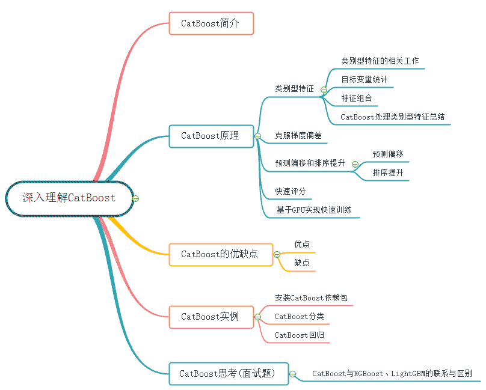
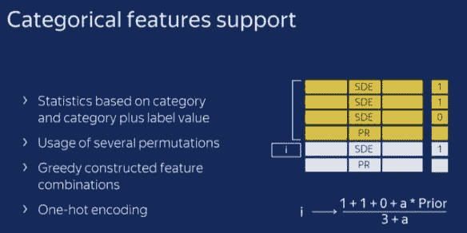
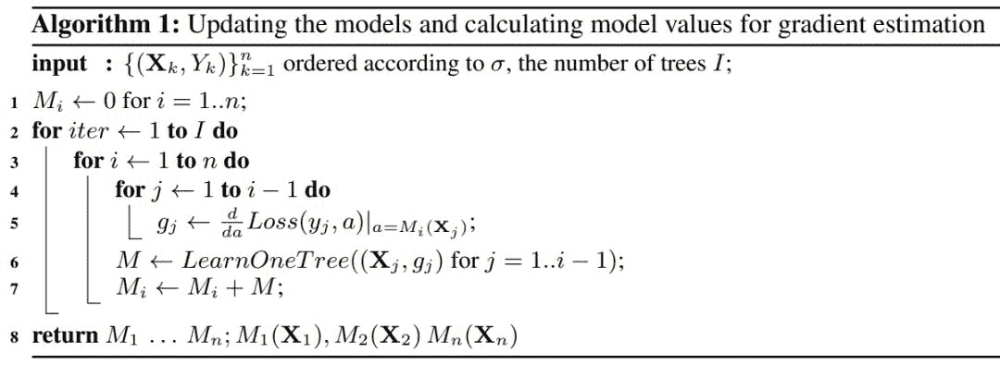

**本文主要内容概览：**



# 1\. CatBoost简介

CatBoost是俄罗斯的搜索巨头Yandex在2017年开源的机器学习库，是Boosting族算法的一种。CatBoost和XGBoost、LightGBM并称为GBDT的三大主流神器，都是在GBDT算法框架下的一种改进实现。XGBoost被广泛的应用于工业界，LightGBM有效的提升了GBDT的计算效率，而Yandex的CatBoost号称是比XGBoost和LightGBM在算法准确率等方面表现更为优秀的算法。

CatBoost是一种基于对称决策树（oblivious trees）为基学习器实现的参数较少、支持类别型变量和高准确性的GBDT框架，主要解决的痛点是高效合理地处理类别型特征，这一点从它的名字中可以看出来，CatBoost是由Categorical和Boosting组成。此外，CatBoost还解决了梯度偏差（Gradient Bias）以及预测偏移（Prediction shift）的问题，从而减少过拟合的发生，进而提高算法的准确性和泛化能力。

与XGBoost、LightGBM相比，CatBoost的创新点有：

*   嵌入了自动将类别型特征处理为数值型特征的创新算法。首先对categorical features做一些统计，计算某个类别特征（category）出现的频率，之后加上超参数，生成新的数值型特征（numerical features）。

*   Catboost还使用了组合类别特征，可以利用到特征之间的联系，这极大的丰富了特征维度。

*   采用排序提升的方法对抗训练集中的噪声点，从而避免梯度估计的偏差，进而解决预测偏移的问题。

*   采用了完全对称树作为基模型。

# 2\. 类别型特征

## 2.1 类别型特征的相关工作

所谓类别型特征，即这类特征不是数值型特征，而是离散的集合，比如省份名（山东、山西、河北等），城市名（北京、上海、深圳等），学历（本科、硕士、博士等）。在梯度提升算法中，最常用的是将这些类别型特征转为数值型来处理，一般类别型特征会转化为一个或多个数值型特征。

如果某个**类别型特征基数比较低（low-cardinality features）**，即该特征的所有值去重后构成的集合元素个数比较少，一般利用One-hot编码方法将特征转为数值型。One-hot编码可以在数据预处理时完成，也可以在模型训练的时候完成，从训练时间的角度，后一种方法的实现更为高效，CatBoost对于基数较低的类别型特征也是采用后一种实现。

显然，在**高基数类别型特征（high cardinality features）** 当中，比如 user ID，这种编码方式会产生大量新的特征，造成维度灾难。一种折中的办法是可以将类别分组成有限个的群体再进行One-hot编码。一种常被使用的方法是根据目标变量统计（Target Statistics，以下简称TS）进行分组，目标变量统计用于估算每个类别的目标变量期望值。甚至有人直接用TS作为一个新的数值型变量来代替原来的类别型变量。重要的是，可以通过对TS数值型特征的阈值设置，基于对数损失、基尼系数或者均方差，得到一个对于训练集而言将类别一分为二的所有可能划分当中最优的那个。在LightGBM当中，类别型特征用每一步梯度提升时的梯度统计（Gradient Statistics，以下简称GS）来表示。虽然为建树提供了重要的信息，但是这种方法有以下两个缺点：

*   增加计算时间，因为需要对每一个类别型特征，在迭代的每一步，都需要对GS进行计算；

*   增加存储需求，对于一个类别型变量，需要存储每一次分离每个节点的类别；

为了克服这些缺点，LightGBM以损失部分信息为代价将所有的长尾类别归为一类，作者声称这样处理高基数类别型特征时比One-hot编码还是好不少。不过如果采用TS特征，那么对于每个类别只需要计算和存储一个数字。

因此，采用TS作为一个新的数值型特征是最有效、信息损失最小的处理类别型特征的方法。TS也被广泛应用在点击预测任务当中，这个场景当中的类别型特征有用户、地区、广告、广告发布者等。接下来我们着重讨论TS，暂时将One-hot编码和GS放一边。

## 2.2 目标变量统计（Target Statistics）

CatBoost算法的设计初衷是为了更好的处理GBDT特征中的categorical features。在处理 GBDT特征中的categorical features的时候，最简单的方法是用 categorical feature 对应的标签的平均值来替换。在决策树中，标签平均值将作为节点分裂的标准。这种方法被称为 Greedy Target-based Statistics , 简称 Greedy TS，用公式来表达就是：

这种方法有一个显而易见的缺陷，就是通常特征比标签包含更多的信息，如果强行用标签的平均值来表示特征的话，当训练数据集和测试数据集数据结构和分布不一样的时候会出条件偏移问题。

一个标准的改进 Greedy TS的方式是添加先验分布项，这样可以减少噪声和低频率类别型数据对于数据分布的影响：

其中   是添加的先验项，    通常是大于     的权重系数。添加先验项是一个普遍做法，针对类别数较少的特征，它可以减少噪声数据。对于回归问题，一般情况下，先验项可取数据集label的均值。对于二分类，先验项是正例的先验概率。利用多个数据集排列也是有效的，但是，如果直接计算可能导致过拟合。CatBoost利用了一个比较新颖的计算叶子节点值的方法，这种方式（oblivious trees，对称树）可以避免多个数据集排列中直接计算会出现过拟合的问题。

当然，在论文《CatBoost: unbiased boosting with categorical features》中，还提到了其它几种改进Greedy TS的方法，分别有：Holdout TS、Leave-one-out TS、Ordered TS。我这里就不再翻译论文中的这些方法了，感兴趣的同学可以自己翻看一下原论文。

## 2.3 特征组合

值得注意的是几个类别型特征的任意组合都可视为新的特征。例如，在音乐推荐应用中，我们有两个类别型特征：用户ID和音乐流派。如果有些用户更喜欢摇滚乐，将用户ID和音乐流派转换为数字特征时，根据上述这些信息就会丢失。结合这两个特征就可以解决这个问题，并且可以得到一个新的强大的特征。然而，组合的数量会随着数据集中类别型特征的数量成指数增长，因此不可能在算法中考虑所有组合。为当前树构造新的分割点时，CatBoost会采用贪婪的策略考虑组合。对于树的第一次分割，不考虑任何组合。对于下一个分割，CatBoost将当前树的所有组合、类别型特征与数据集中的所有类别型特征相结合，并将新的组合类别型特征动态地转换为数值型特征。CatBoost还通过以下方式生成数值型特征和类别型特征的组合：树中选定的所有分割点都被视为具有两个值的类别型特征，并像类别型特征一样被进行组合考虑。

## 2.4 CatBoost处理Categorical features总结

*   首先会计算一些数据的statistics。计算某个category出现的频率，加上超参数，生成新的numerical features。这一策略要求同一标签数据不能排列在一起（即先全是 之后全是 这种方式），训练之前需要打乱数据集。

*   第二，使用数据的不同排列（实际上是 个）。在每一轮建立树之前，先扔一轮骰子，决定使用哪个排列来生成树。

*   第三，考虑使用categorical features的不同组合。例如颜色和种类组合起来，可以构成类似于blue dog这样的特征。当需要组合的categorical features变多时，CatBoost只考虑一部分combinations。在选择第一个节点时，只考虑选择一个特征，例如A。在生成第二个节点时，考虑A和任意一个categorical feature的组合，选择其中最好的。就这样使用贪心算法生成combinations。

*   第四，除非向gender这种维数很小的情况，不建议自己生成One-hot编码向量，最好交给算法来处理。



# 3\. 克服梯度偏差

对于学习CatBoost克服梯度偏差的内容，我提出了三个问题：

*   为什么会有梯度偏差？

*   梯度偏差造成了什么问题？

*   如何解决梯度偏差？

CatBoost和所有标准梯度提升算法一样，都是通过构建新树来拟合当前模型的梯度。然而，所有经典的提升算法都存在由有偏的点态梯度估计引起的过拟合问题。在每个步骤中使用的梯度都使用当前模型中的相同的数据点来估计，这导致估计梯度在特征空间的任何域中的分布与该域中梯度的真实分布相比发生了偏移，从而导致过拟合。为了解决这个问题，CatBoost对经典的梯度提升算法进行了一些改进，简要介绍如下。

许多利用GBDT技术的算法（例如，XGBoost、LightGBM），构建下一棵树分为两个阶段：选择树结构和在树结构固定后计算叶子节点的值。为了选择最佳的树结构，算法通过枚举不同的分割，用这些分割构建树，对得到的叶子节点计算值，然后对得到的树计算评分，最后选择最佳的分割。两个阶段叶子节点的值都是被当做梯度或牛顿步长的近似值来计算。在CatBoost中，第一阶段采用梯度步长的无偏估计，第二阶段使用传统的GBDT方案执行。既然原来的梯度估计是有偏的，那么怎么能改成无偏估计呢？

设   为构建   棵树后的模型，   为构建   棵树后第   个训练样本上面的梯度值。为了使得   无偏于模型  ，我们需要在没有   参与的情况下对模型   进行训练。由于我们需要对所有训练样本计算无偏的梯度估计，乍看起来对于   的训练不能使用任何样本，貌似无法实现的样子。我们运用下面这个技巧来处理这个问题：对于每一个样本  ，我们训练一个单独的模型   ，且该模型从不使用基于该样本的梯度估计进行更新。我们使用   来估计   上的梯度，并使用这个估计对结果树进行评分。用伪码描述如下，其中   是需要优化的损失函数，   是标签值，   是公式计算值。



# 4\. 预测偏移和排序提升

## 4.1 预测偏移

对于学习预测偏移的内容，我提出了两个问题：

*   什么是预测偏移？

*   用什么办法解决预测偏移问题？

预测偏移（Prediction shift）是由梯度偏差造成的。在GDBT的每一步迭代中, 损失函数使用相同的数据集求得当前模型的梯度, 然后训练得到基学习器, 但这会导致梯度估计偏差, 进而导致模型产生过拟合的问题。CatBoost通过采用排序提升 （Ordered boosting） 的方式替换传统算法中梯度估计方法，进而减轻梯度估计的偏差，提高模型的泛化能力。下面我们对预测偏移进行详细的描述和分析。

**首先来看下GBDT的整体迭代过程：**

GBDT算法是通过一组分类器的串行迭代，最终得到一个强学习器，以此来进行更高精度的分类。它使用了前向分布算法，弱学习器使用分类回归树（CART）。

假设前一轮迭代得到的强学习器是   , 损失函数是   ，则本轮迭代的目的是找到一个CART回归树模型的弱学习器   ，让本轮的损失函数最小。式（1）表示的是本轮迭代的目标函数   。

GBDT使用损失函数的负梯度来拟合每一轮的损失的近似值，式（2）中   表示的是上述梯度。

通常用式（3）近似拟合   。

最终得到本轮的强学习器，如式（4）所示：

**在这个过程当中，偏移是这样发生的：**

根据   进行随机计算的条件分布   与测试集的分布   发生偏移，这样由公式（3）定义的基学习器   与公式（1）定义的产生偏差，最后影响模型   的泛化能力。

## 4.2 排序提升

为了克服预测偏移问题，CatBoost提出了一种新的叫做Ordered boosting的算法。


由上图的Ordered boosting算法可知，为了得到无偏梯度估计, CatBoost对每一个样本   都会训练一个单独的模型   ，模型   由使用不包含样本 的训练集训练得到。我们使用   来得到关于样本的梯度估计，并使用该梯度来训练基学习器并得到最终的模型。

Ordered boosting算法好是好，但是在大部分的实际任务当中都不具备使用价值，因为需要训练   个不同的模型，大大增加的内存消耗和时间复杂度。在CatBoost当中，我们以决策树为基学习器的梯度提升算法的基础上，对该算法进行了改进。

前面提到过，在传统的GBDT框架当中，构建下一棵树分为两个阶段：选择树结构和在树结构固定后计算叶子节点的值。CatBoost主要在第一阶段进行优化。在建树的阶段，CatBoost有两种提升模式，Ordered和Plain。Plain模式是采用内建的ordered TS对类别型特征进行转化后的标准GBDT算法。Ordered则是对Ordered boosting算法的优化。两种提升模式的具体介绍可以翻看论文《CatBoost: unbiased boosting with categorical features》。

# 5\. 快速评分

CatBoost使用对称树（oblivious trees）作为基预测器。在这类树中，相同的分割准则在树的整个一层上使用。这种树是平衡的，不太容易过拟合。梯度提升对称树被成功地用于各种学习任务中。在对称树中，每个叶子节点的索引可以被编码为长度等于树深度的二进制向量。这在CatBoost模型评估器中得到了广泛的应用：我们首先将所有浮点特征、统计信息和独热编码特征进行二值化，然后使用二进制特征来计算模型预测值。

# 6\. 基于GPU实现快速训练

*   **密集的数值特征。** 对于任何GBDT算法而言，最大的难点之一就是搜索最佳分割。尤其是对于密集的数值特征数据集来说，该步骤是建立决策树时的主要计算负担。CatBoost使用oblivious 决策树作为基模型，并将特征离散化到固定数量的箱子中以减少内存使用。就GPU内存使用而言，CatBoost至少与LightGBM一样有效。主要改进之处就是利用了一种不依赖于原子操作的直方图计算方法。

*   **类别型特征。** CatBoost实现了多种处理类别型特征的方法，并使用完美哈希来存储类别型特征的值，以减少内存使用。由于GPU内存的限制，在CPU RAM中存储按位压缩的完美哈希，以及要求的数据流、重叠计算和内存等操作。通过哈希来分组观察。在每个组中，我们需要计算一些统计量的前缀和。该统计量的计算使用分段扫描GPU图元实现。

*   **多GPU支持。** CatBoost中的GPU实现可支持多个GPU。分布式树学习可以通过数据或特征进行并行化。CatBoost采用多个学习数据集排列的计算方案，在训练期间计算类别型特征的统计数据。

# 7\. CatBoost的优缺点

## 7.1 优点

*   **性能卓越：** 在性能方面可以匹敌任何先进的机器学习算法；

*   **鲁棒性/强健性：** 它减少了对很多超参数调优的需求，并降低了过度拟合的机会，这也使得模型变得更加具有通用性；

*   **易于使用：** 提供与scikit集成的Python接口，以及R和命令行界面；

*   **实用：** 可以处理类别型、数值型特征；

*   **可扩展：** 支持自定义损失函数；

## 7.2 缺点

*   对于类别型特征的处理需要大量的内存和时间；

*   不同随机数的设定对于模型预测结果有一定的影响；

# 8\. CatBoost实例

本篇文章所有数据集和代码均在我的GitHub中，地址：https://github.com/Microstrong0305/WeChat-zhihu-csdnblog-code/tree/master/Ensemble%20Learning/CatBoost

## 8.1 安装CatBoost依赖包

```
pip install catboost 
```

## 8.2 CatBoost分类

### （1）数据集

这里我使用了 2015 年航班延误的 Kaggle 数据集，其中同时包含类别型变量和数值变量。这个数据集中一共有约 500 万条记录，我使用了 1% 的数据：5 万行记录。数据集官方地址：https://www.kaggle.com/usdot/flight-delays#flights.csv 。以下是建模使用的特征：

*   **月、日、星期：** 整型数据

*   **航线或航班号：** 整型数据

*   **出发、到达机场：** 数值数据

*   **出发时间：** 浮点数据

*   **距离和飞行时间：** 浮点数据

*   **到达延误情况：** 这个特征作为预测目标，并转为二值变量：航班是否延误超过 10 分钟

**实验说明：** 在对 CatBoost 调参时，很难对类别型特征赋予指标。因此，同时给出了不传递类别型特征时的调参结果，并评估了两个模型：一个包含类别型特征，另一个不包含。如果未在cat_features参数中传递任何内容，CatBoost会将所有列视为数值变量。注意，如果某一列数据中包含字符串值，CatBoost 算法就会抛出错误。另外，带有默认值的 int 型变量也会默认被当成数值数据处理。在 CatBoost 中，必须对变量进行声明，才可以让算法将其作为类别型变量处理。

### （2）不加Categorical features选项的代码

```
import pandas as pd, numpy as np
from sklearn.model_selection import train_test_split, GridSearchCV
from sklearn import metrics
import catboost as cb

# 一共有约 500 万条记录，我使用了 1% 的数据：5 万行记录
# data = pd.read_csv("flight-delays/flights.csv")
# data = data.sample(frac=0.1, random_state=10)  # 500->50
# data = data.sample(frac=0.1, random_state=10)  # 50->5
# data.to_csv("flight-delays/min_flights.csv")

# 读取 5 万行记录
data = pd.read_csv("flight-delays/min_flights.csv")
print(data.shape)  # (58191, 31)

data = data[["MONTH", "DAY", "DAY_OF_WEEK", "AIRLINE", "FLIGHT_NUMBER", "DESTINATION_AIRPORT",
             "ORIGIN_AIRPORT", "AIR_TIME", "DEPARTURE_TIME", "DISTANCE", "ARRIVAL_DELAY"]]
data.dropna(inplace=True)

data["ARRIVAL_DELAY"] = (data["ARRIVAL_DELAY"] > 10) * 1

cols = ["AIRLINE", "FLIGHT_NUMBER", "DESTINATION_AIRPORT", "ORIGIN_AIRPORT"]
for item in cols:
    data[item] = data[item].astype("category").cat.codes + 1

train, test, y_train, y_test = train_test_split(data.drop(["ARRIVAL_DELAY"], axis=1), data["ARRIVAL_DELAY"],
                                                random_state=10, test_size=0.25)

cat_features_index = [0, 1, 2, 3, 4, 5, 6]

def auc(m, train, test):
    return (metrics.roc_auc_score(y_train, m.predict_proba(train)[:, 1]),
            metrics.roc_auc_score(y_test, m.predict_proba(test)[:, 1]))

# 调参，用网格搜索调出最优参数
params = {'depth': [4, 7, 10],
          'learning_rate': [0.03, 0.1, 0.15],
          'l2_leaf_reg': [1, 4, 9],
          'iterations': [300, 500]}
cb = cb.CatBoostClassifier()
cb_model = GridSearchCV(cb, params, scoring="roc_auc", cv=3)
cb_model.fit(train, y_train)
# 查看最佳分数
print(cb_model.best_score_)  # 0.7088001891107445
# 查看最佳参数
print(cb_model.best_params_)  # {'depth': 4, 'iterations': 500, 'l2_leaf_reg': 9, 'learning_rate': 0.15}

# With Categorical features，用最优参数拟合数据
clf = cb.CatBoostClassifier(eval_metric="AUC", depth=4, iterations=500, l2_leaf_reg=9,
                            learning_rate=0.15)

clf.fit(train, y_train)

print(auc(clf, train, test))  # (0.7809684655761157, 0.7104617034553192) 
```

### （3）有Categorical features选项的代码

```
import pandas as pd, numpy as np
from sklearn.model_selection import train_test_split, GridSearchCV
from sklearn import metrics
import catboost as cb

# 读取 5 万行记录
data = pd.read_csv("flight-delays/min_flights.csv")
print(data.shape)  # (58191, 31)

data = data[["MONTH", "DAY", "DAY_OF_WEEK", "AIRLINE", "FLIGHT_NUMBER", "DESTINATION_AIRPORT",
             "ORIGIN_AIRPORT", "AIR_TIME", "DEPARTURE_TIME", "DISTANCE", "ARRIVAL_DELAY"]]
data.dropna(inplace=True)

data["ARRIVAL_DELAY"] = (data["ARRIVAL_DELAY"] > 10) * 1

cols = ["AIRLINE", "FLIGHT_NUMBER", "DESTINATION_AIRPORT", "ORIGIN_AIRPORT"]
for item in cols:
    data[item] = data[item].astype("category").cat.codes + 1

train, test, y_train, y_test = train_test_split(data.drop(["ARRIVAL_DELAY"], axis=1), data["ARRIVAL_DELAY"],
                                                random_state=10, test_size=0.25)

cat_features_index = [0, 1, 2, 3, 4, 5, 6]

def auc(m, train, test):
    return (metrics.roc_auc_score(y_train, m.predict_proba(train)[:, 1]),
            metrics.roc_auc_score(y_test, m.predict_proba(test)[:, 1]))

# With Categorical features
clf = cb.CatBoostClassifier(eval_metric="AUC", one_hot_max_size=31, depth=4, iterations=500, l2_leaf_reg=9,
                            learning_rate=0.15)
clf.fit(train, y_train, cat_features=cat_features_index)

print(auc(clf, train, test))  # (0.7817912095285117, 0.7152541135019913) 
```

## 8.3 CatBoost回归

```
from catboost import CatBoostRegressor

# Initialize data

train_data = [[1, 4, 5, 6],
              [4, 5, 6, 7],
              [30, 40, 50, 60]]

eval_data = [[2, 4, 6, 8],
             [1, 4, 50, 60]]

train_labels = [10, 20, 30]
# Initialize CatBoostRegressor
model = CatBoostRegressor(iterations=2,
                          learning_rate=1,
                          depth=2)
# Fit model
model.fit(train_data, train_labels)
# Get predictions
preds = model.predict(eval_data)
print(preds) 
```

# 9\. 关于CatBoost若干问题思考

## 9.1 CatBoost与XGBoost、LightGBM的联系与区别？

（1）2014年3月XGBoost算法首次被陈天奇提出，但是直到2016年才逐渐著名。2017年1月微软发布LightGBM第一个稳定版本。2017年4月Yandex开源CatBoost。自从XGBoost被提出之后，很多文章都在对其进行各种改进，CatBoost和LightGBM就是其中的两种。

（2）CatBoost处理类别型特征十分灵活，可直接传入类别型特征的列标识，模型会自动将其使用One-hot编码，还可通过设置 one_hot_max_size参数来限制One-hot特征向量的长度。如果不传入类别型特征的列标识，那么CatBoost会把所有列视为数值特征。对于One-hot编码超过设定的one_hot_max_size值的特征来说，CatBoost将会使用一种高效的encoding方法，与mean encoding类似，但是会降低过拟合。处理过程如下：

*   将输入样本集随机排序，并生成多组随机排列的情况；

*   将浮点型或属性值标记转化为整数；

*   将所有的类别型特征值结果都根据以下公式，转化为数值结果；

其中 countInClass 表示在当前类别型特征值中有多少样本的标记值是 ；prior 是分子的初始值，根据初始参数确定。totalCount 是在所有样本中（包含当前样本）和当前样本具有相同的类别型特征值的样本数量。

LighGBM 和 CatBoost 类似，也可以通过使用特征名称的输入来处理类别型特征数据，它没有对数据进行独热编码，因此速度比独热编码快得多。LighGBM 使用了一个特殊的算法来确定属性特征的分割值。

```
train_data = lgb.Dataset(data, label=label, feature_name=['c1', 'c2', 'c3'], categorical_feature=['c3']) 
```

注意，在建立适用于 LighGBM 的数据集之前，需要将类别型特征变量转化为整型变量，此算法不允许将字符串数据传给类别型变量参数。

XGBoost 和 CatBoost、 LighGBM 算法不同，XGBoost 本身无法处理类别型特征，而是像随机森林一样，只接受数值数据。因此在将类别型特征数据传入 XGBoost 之前，必须通过各种编码方式：例如，序号编码、独热编码和二进制编码等对数据进行处理。

# 10\. Reference

**CatBoost论文解读：**

【1】Prokhorenkova L, Gusev G, Vorobev A, et al. CatBoost: unbiased boosting with categorical features[C]//Advances in Neural Information Processing Systems. 2018: 6638-6648.
【2】Dorogush A V, Ershov V, Gulin A. CatBoost: gradient boosting with categorical features support[J]. arXiv preprint arXiv:1810.11363, 2018.
【3】机器学习算法之Catboost，地址：https://www.biaodianfu.com/catboost.html
【4】oblivious tree在机器学习中有什么用？- 李大猫的回答 - 知乎 https://www.zhihu.com/question/311641149/answer/593286799
【5】CatBoost算法梳理，地址：http://datacruiser.io/2019/08/19/DataWhale-Workout-No-8-CatBoost-Summary/

**CatBoost算法讲解：**

【6】catboost完全指南，地址：https://zhuanlan.zhihu.com/p/102570430
【7】CatBoost原理及实践 - Dukey的文章 - 知乎 https://zhuanlan.zhihu.com/p/37916954
【8】 22(7).模型融合---CatBoost，地址：https://www.cnblogs.com/nxf-rabbit75/p/10923549.html#auto_id_0
【9】catboost对类别特征处理的简单总结，地址：https://blog.csdn.net/weixin_42944192/article/details/102463796
【10】Python3机器学习实践：集成学习之CatBoost - AnFany的文章 - 知乎 https://zhuanlan.zhihu.com/p/53591724

**CatBoost实战：**

【11】Catboost 一个超级简单实用的boost算法，地址：https://www.jianshu.com/p/49ab87122562
【12】苗丰顺, 李岩, 高岑, 王美吉, 李冬梅. 基于CatBoost算法的糖尿病预测方法. 计算机系统应用, 2019, 28(9): 215-218.http://www.c-s-a.org.cn/1003-3254/7054.html
【13】Battle of the Boosting Algos: LGB, XGB, Catboost，地址：https://www.kaggle.com/lavanyashukla01/battle-of-the-boosting-algos-lgb-xgb-catboost
【14】Simple CatBoost，地址：https://www.kaggle.com/nicapotato/simple-catboost
【15】CatBoost Usage examples，地址：https://catboost.ai/docs/concepts/python-usages-examples.html

**CatBoost的若干思考：**

【16】入门 | 从结构到性能，一文概述XGBoost、Light GBM和CatBoost的同与不同，地址：https://mp.weixin.qq.com/s/TD3RbdDidCrcL45oWpxNmw

