 Datawhale 

**作者：王瑞楠，Datawhale优秀学习者**

摘要：对于数据挖掘项目，本文将学习应该从哪些角度分析数据？如何对数据进行整体把握，如何处理异常值与缺失值，从哪些维度进行特征及预测值分析？

**探索性数据分析**（Exploratory Data Analysis，EDA）是指对已有数据在尽量少的先验假设下通过作图、制表、方程拟合、计算特征量等手段探索数据的结构和规律的一种数据分析方法。

## 数据及背景

https://tianchi.aliyun.com/competition/entrance/231784/information（阿里天池-零基础入门数据挖掘）

## EDA的目标

*   熟悉数据集，了解数据集，对数据集进行验证来确定所获得数据集可以用于接下来的机器学习或者深度学习使用。

*   了解变量间的相互关系以及变量与预测值之间的存在关系。

*   引导数据科学从业者进行数据处理以及特征工程的步骤,使数据集的结构和特征集让接下来的预测问题更加可靠。

## 数据载入及总览

**载入各种数据科学以及可视化库**

missingno库用于可视化缺失值分布，是基于matplotlib的，接受pandas数据源

```
import pandas as pd
import numpy as np
import matplotlib.pyplot as plt
import seaborn as sns
import missingno as msno  # 用于可视化缺失值分布
import scipy.stats as st 
```

**载入数据**

```
path = './data/'
Train_data = pd.read_csv(path+'used_car_train_20200313.csv', sep=' ')
Test_data = pd.read_csv(path+'used_car_testA_20200313.csv', sep=' ') 
```

所有特征集均脱敏处理，脱敏处理后均为label encoding形式，即数字形式

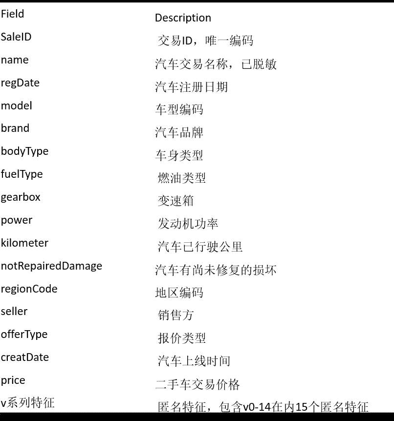

**总览数据**

**简略观察数据head()+shape**

```
Train_data.head().append(Train_data.tail())
Test_data.head().append(Test_data.tail())
Train_data.shape
Test_data.shape 
```

**describe()熟悉相关统计量**

describe()中包含每列的统计量，个数(count)、平均值(mean)、方差(std)、最小值(min)、中位数(25% 50% 75%)、最大值(max)等。通过观察以上指标，可以瞬间掌握数据的大概范围和每个值的异常值的判断 ，例如有时候会发现999 9999、 -1 等值这些其实都是nan的另外一种表达方式。

```
Train_data.describe() 
```

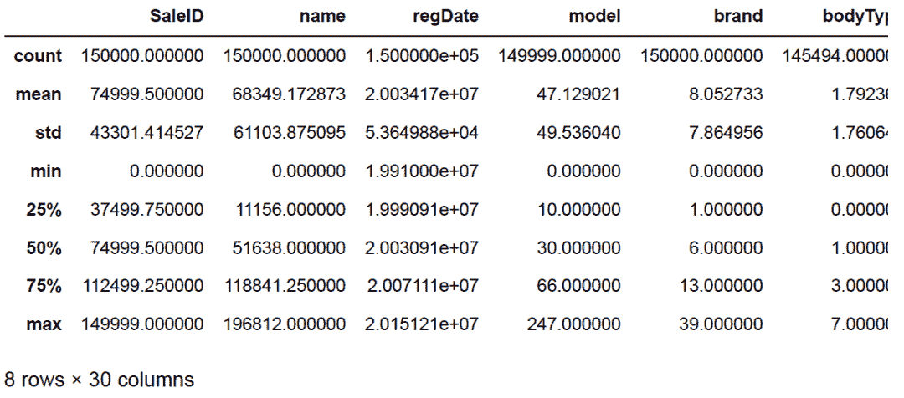

**info()熟悉数据类型**

通过info()来了解数据每列的type，有助于了解是否存在除了nan以外的特殊符号异常。

```
Train_data.info() 
```

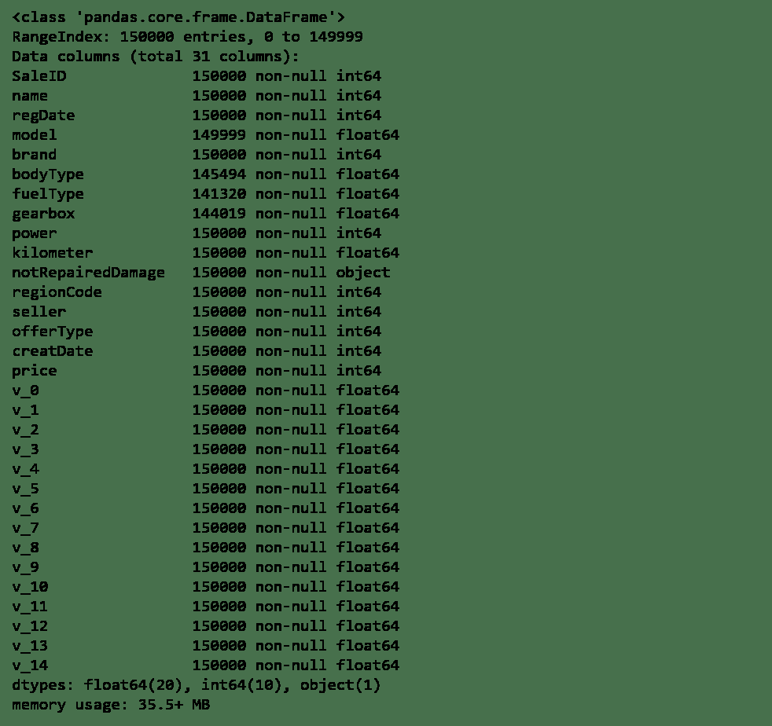

## 缺失值和异常值

**缺失值**

**查看每列的存在nan情况**

```
Train_data.isnull().sum()
Test_data.isnull().sum() 
```

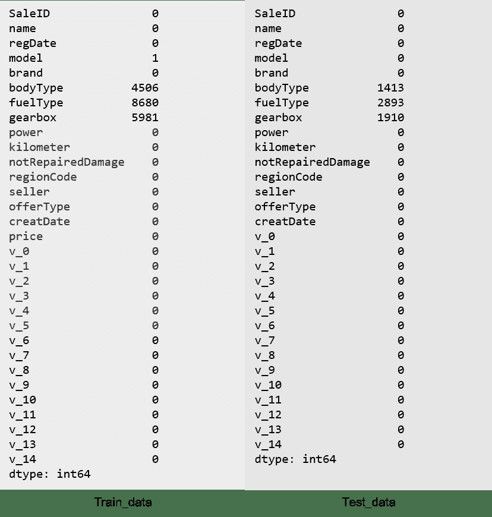

**排序函数sort_values()**

可以将数据集依照某个字段中的数据进行排序,该函数即可根据指定列数据也可根据指定行的

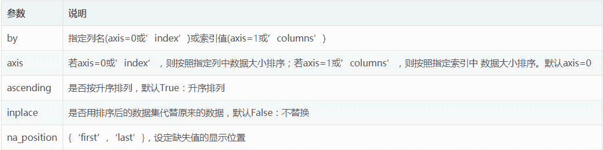

通过以下两句可以很直观的了解哪些列存在 “nan”, 并可以把nan的个数打印。主要的目的在于 nan存在的个数是否真的很大，如果很小一般选择填充，如果使用lgb等树模型可以直接空缺，让树自己去优化，但如果nan存在的过多、可以考虑删掉。

```
# nan可视化
missing = Train_data.isnull().sum()
missing = missing[missing > 0]
missing.sort_values(inplace=True)
missing.plot.bar() 
```

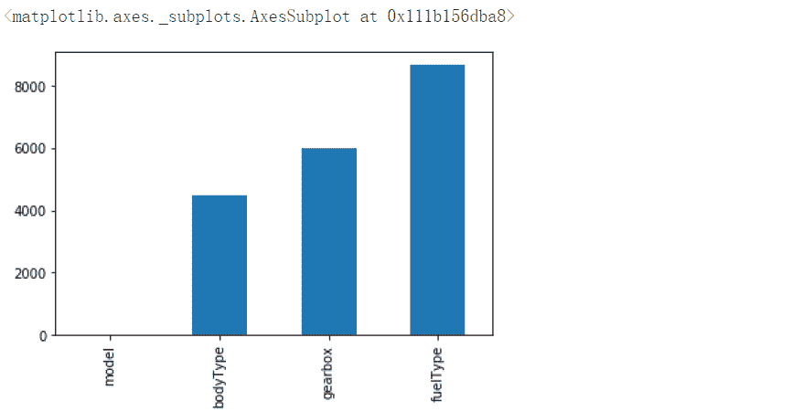

```
# 可视化缺省值
msno.matrix(Train_data.sample(250))
msno.bar(Train_data.sample(1000))
msno.matrix(Test_data.sample(250))
msno.bar(Test_data.sample(1000)) 
```

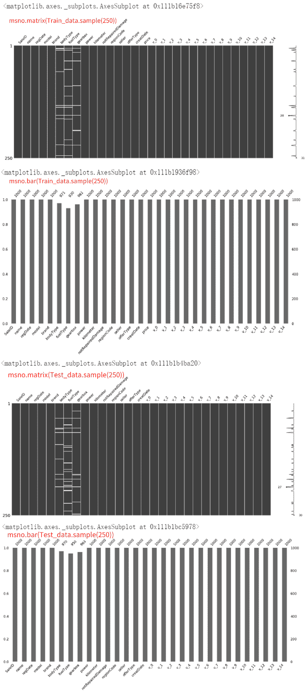

从上文Train_data.info()的统计信息可以发现，除了notRepairedDamage 为object类型其他都为数字。接下来将notRepairedDamage中几个不同的值都进行显示如下：

```
Train_data['notRepairedDamage'].value_counts() 
```


可以看出‘ - ’也为空缺值，因为很多模型对nan有直接的处理，这里我们先不做处理，先替换成nan。

```
Train_data['notRepairedDamage'].replace('-', np.nan, inplace=True)
Train_data['notRepairedDamage'].value_counts() 
```


```
Train_data.isnull().sum() 
```

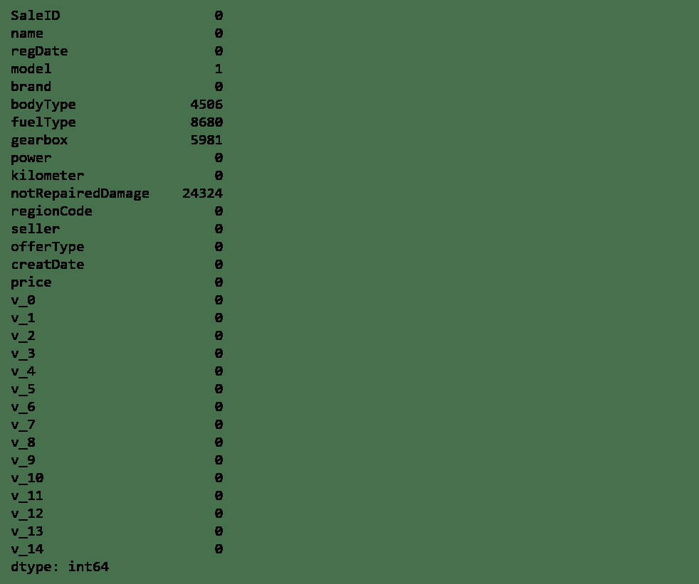

**异常值**

以下两个类别特征：seller和offerType严重倾斜，一般不会对预测有什么帮助，故这边先删掉，当然你也可以继续挖掘，但是一般意义不大

```
Train_data["seller"].value_counts()
Train_data["offerType"].value_counts() 
```

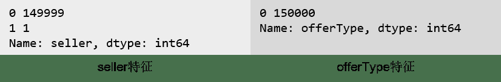

```
del Train_data["seller"]
del Train_data["offerType"]
del Test_data["seller"]
del Test_data["offerType"] 
```

## 预测值分布

**总体分布概况**

数据整体服从正态分布，样本均值和方差则相互独立，正态分布具有很多好的性质，很多模型也假设数据服从正态分布。

例如线性回归（linear regression），它假设误差服从正态分布，从而每个样本点出现的概率就可以表示为正态分布形式，将多个样本点连乘再取对数，就是所有训练集样本出现的条件概率，最大化该条件概率就是LR最终求解的问题。这个条件概率的最终表达式的形式就是我们熟悉的误差平方和。

总之， 机器学习中很多model都假设数据或参数服从正态分布。当样本不服从正态分布时，可以做如下转换：

*   线性变化z-scores

*   使用Boxcox变换

*   使用yeo-johnson变换

盲目假设变量服从正态分布可能导致不准确的结果，要结合分析。例如：不能假设股票价格服从正态分布，因为价格不能为负，故我们可以将股票价格假设为服从对数正态分布，以确保其值≥0；而股票收益可能是负数，因此收益可以假设服从正态分布。

当样本数据表明质量特征的分布为非正态时，应用基于正态分布的方法会作出不正确的判决。约翰逊分布族即为经约翰(yeo-johnson)变换后服从正态分布的随机变量的概率分布，约翰逊分布体系建立了三族分布，分别为有界**S****B**、对数正态**S****L**和无界**S****U**。

本案例的预测值为价格，显然不符合正态分布，故分别采用无界约翰逊分布Johnson SU、正态分布normal、对数正态分布lognormal，综合来看无界约翰逊分布对price的拟合效果更好。

```
y = Train_data['price']
plt.figure(1); plt.title('Johnson SU')
sns.distplot(y, kde=False, fit=st.johnsonsu)
plt.figure(2); plt.title('Normal')
sns.distplot(y, kde=False, fit=st.norm)
plt.figure(3); plt.title('Log Normal')
sns.distplot(y, kde=False, fit=st.lognorm) 
```

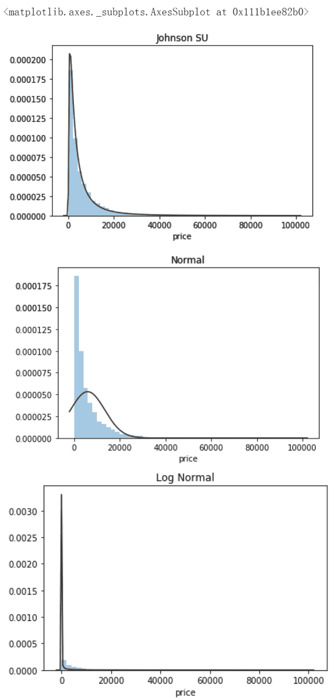

**偏度和峰度**

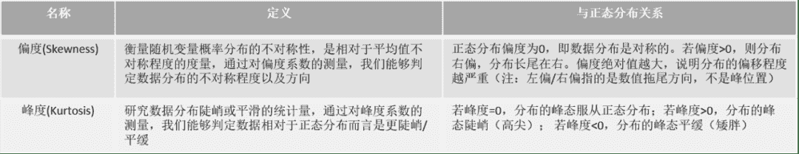

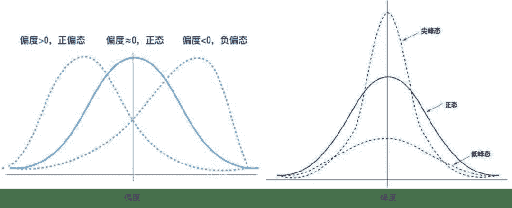

```
sns.distplot(Train_data['price']);
print("Skewness: %f" % Train_data['price'].skew())
print("Kurtosis: %f" % Train_data['price'].kurt())
sns.distplot(Train_data.skew(),color='blue',axlabel ='Skewness')
sns.distplot(Train_data.kurt(),color='orange',axlabel ='Kurtness')
Train_data.skew(), Train_data.kurt() 
```

## **预测值频数**

大于20000的值很少，其实该处可将其当作异常值处理填充或删除，本文中经过log变换之后，分布较均匀，可据此进行预测，这也是预测问题常用的技巧

```
plt.hist(Train_data['price'], orientation = 'vertical',histtype = 'bar', color ='red')
plt.show()
plt.hist(np.log(Train_data['price']), orientation = 'vertical',histtype = 'bar', color ='red')
plt.show() 
```

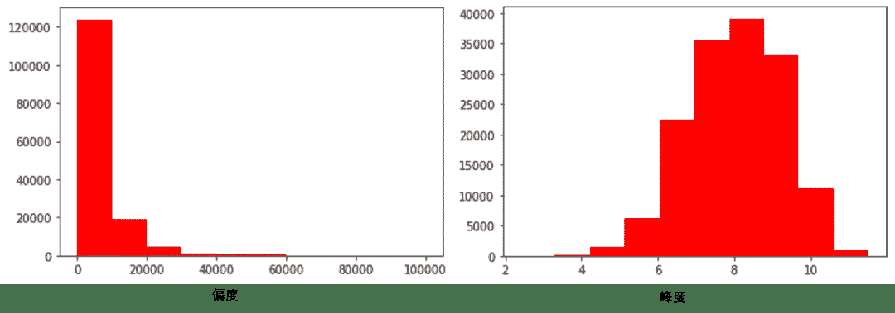

## 特征分析

**数字特征**

‘seller’和‘offerType’已被删除，其他特征均经过了label coding。若需要处理的数据未label coding，则可通过如下代码对特征进行区分：

```
# 数字特征
numeric_features = Train_data.select_dtypes(include=[np.number])
numeric_features.columns
# 类型特征
categorical_features = Train_data.select_dtypes(include=[np.object])
categorical_features.columns 
```

本文数据已经label coding，故采用人工区分方法：

```
numeric_features = ['power', 'kilometer', 'v_0', 'v_1', 'v_2', 'v_3', 'v_4', 'v_5', 'v_6', 'v_7', 'v_8', 'v_9', 'v_10', 'v_11', 'v_12', 'v_13','v_14' ]
categorical_features = ['name', 'model', 'brand', 'bodyType', 'fuelType', 'gearbox', 'notRepairedDamage', 'regionCode'] 
```

**总览**

```
numeric_features.append('price')
print(numeric_features) 
```

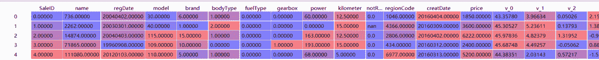

**相关性分析**

```
price_numeric = Train_data[numeric_features]
correlation = price_numeric.corr()
print(correlation['price'].sort_values(ascending=False),'\n')
f, ax = plt.subplots(figsize = (7, 7))
plt.title('Correlation of Numeric Features with Price',y=1,size=16)
sns.heatmap(correlation,square = True,  vmax=0.8)
del price_numeric['price'] 
```

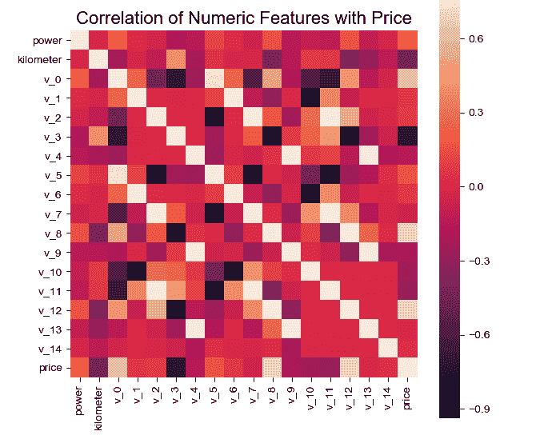

**特征偏度和峰值**

```
for col in numeric_features:
    print('{:15}'.format(col), 
          'Skewness: {:05.2f}'.format(Train_data[col].skew()) , 
          '   ' ,
          'Kurtosis: {:06.2f}'.format(Train_data[col].kurt())  
         ) 
```

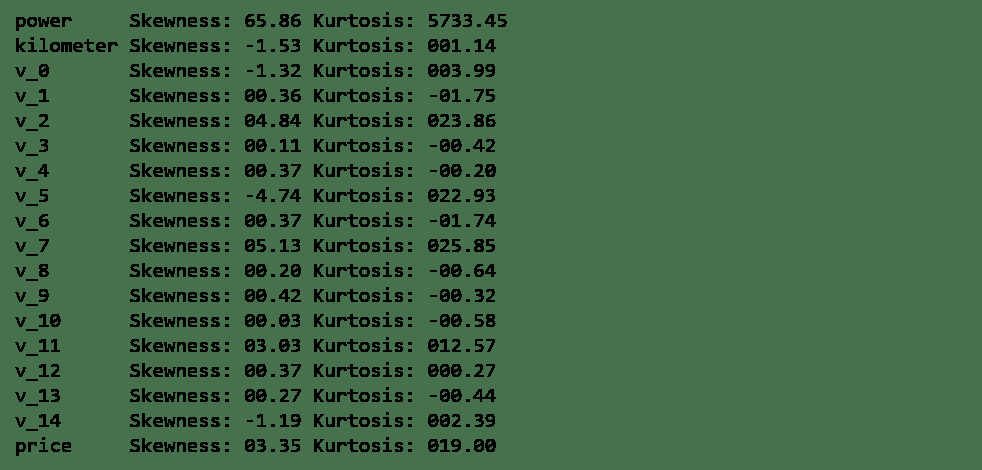

**每个数字特征的分布可视化**

pd.melt()：处理数据，透视表格，可将宽数据转化为长数据，以便于后续分析。形成的数据即为，键：各特征名称，值：特征对应的值

sns.FacetGrid() ：先sns.FacetGrid()画出轮廓,再map()填充内容

```
f = pd.melt(Train_data, value_vars=numeric_features)
g = sns.FacetGrid(f, col="variable",  col_wrap=2, sharex=False, sharey=False)
g = g.map(sns.distplot, "value") 
```

**匿名特征分布情况**

sns.pairplot()：展示变量两两之间的关系（线性或非线性，有无较为明显的相关关系）：

*   对角线：各个属性的直方图，用diag_kind属性控制图类型，可选"scatter"与"reg"

*   非对角线：两个不同属性之间的相关图，用kind属性控制图类型，可选"scatter"与"reg"

*   hue ：针对某一字段进行分类

```
sns.set()
columns = ['price', 'v_12', 'v_8' , 'v_0', 'power', 'v_5',  'v_2', 'v_6', 'v_1', 'v_14']
sns.pairplot(Train_data[columns],size = 2 ,kind ='scatter',diag_kind='kde')
plt.show() 
```

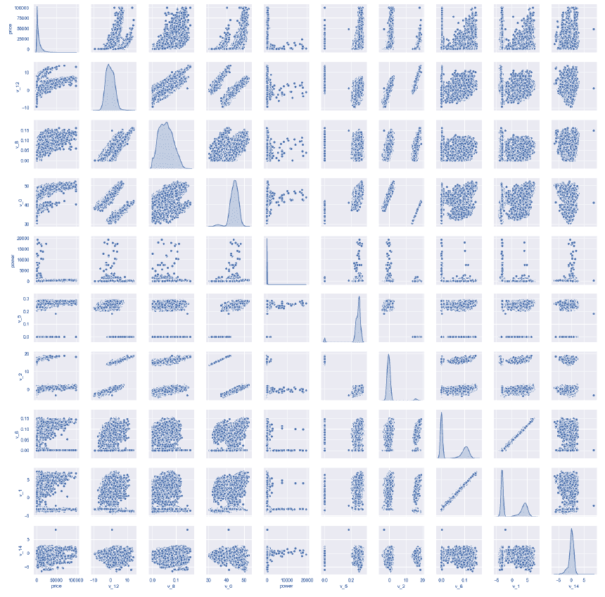

**多变量与price的回归关系**

```
fig, ((ax1, ax2), (ax3, ax4), (ax5, ax6), (ax7, ax8), (ax9, ax10)) = plt.subplots(nrows=5, ncols=2, figsize=(24, 20))
# ['v_12', 'v_8' , 'v_0', 'power', 'v_5',  'v_2', 'v_6', 'v_1', 'v_14']
v_12_scatter_plot = pd.concat([Y_train,Train_data['v_12']],axis = 1)
sns.regplot(x='v_12',y = 'price', data = v_12_scatter_plot,scatter= True, fit_reg=True, ax=ax1)

v_8_scatter_plot = pd.concat([Y_train,Train_data['v_8']],axis = 1)
sns.regplot(x='v_8',y = 'price',data = v_8_scatter_plot,scatter= True, fit_reg=True, ax=ax2)

v_0_scatter_plot = pd.concat([Y_train,Train_data['v_0']],axis = 1)
sns.regplot(x='v_0',y = 'price',data = v_0_scatter_plot,scatter= True, fit_reg=True, ax=ax3)

power_scatter_plot = pd.concat([Y_train,Train_data['power']],axis = 1)
sns.regplot(x='power',y = 'price',data = power_scatter_plot,scatter= True, fit_reg=True, ax=ax4)

v_5_scatter_plot = pd.concat([Y_train,Train_data['v_5']],axis = 1)
sns.regplot(x='v_5',y = 'price',data = v_5_scatter_plot,scatter= True, fit_reg=True, ax=ax5)

v_2_scatter_plot = pd.concat([Y_train,Train_data['v_2']],axis = 1)
sns.regplot(x='v_2',y = 'price',data = v_2_scatter_plot,scatter= True, fit_reg=True, ax=ax6)

v_6_scatter_plot = pd.concat([Y_train,Train_data['v_6']],axis = 1)
sns.regplot(x='v_6',y = 'price',data = v_6_scatter_plot,scatter= True, fit_reg=True, ax=ax7)

v_1_scatter_plot = pd.concat([Y_train,Train_data['v_1']],axis = 1)
sns.regplot(x='v_1',y = 'price',data = v_1_scatter_plot,scatter= True, fit_reg=True, ax=ax8)

v_14_scatter_plot = pd.concat([Y_train,Train_data['v_14']],axis = 1)
sns.regplot(x='v_14',y = 'price',data = v_14_scatter_plot,scatter= True, fit_reg=True, ax=ax9)

v_13_scatter_plot = pd.concat([Y_train,Train_data['v_13']],axis = 1)
sns.regplot(x='v_13',y = 'price',data = v_13_scatter_plot,scatter= True, fit_reg=True, ax=ax10) 
```

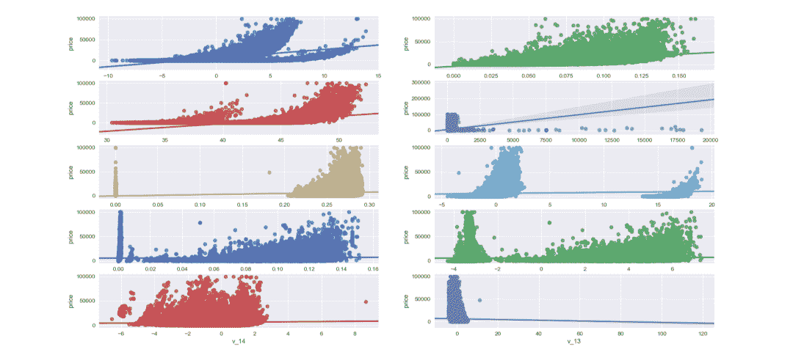

**类别特征**

**查看nunique分布**

```
for cat_fea in categorical_features:
    print(cat_fea + '特征分布如下：')
    print('{}特征有{}个不同的值'.format(cat_fea, Train_data[cat_fea].nunique()))
    print(Train_data[cat_fea].value_counts()) 
```

**查看箱型图**

*   直观识别数据中的离群点

*   直观判断数据离散分布情况，了解数据分布状态

```
categorical_features =['model','brand','bodyType','fuelType','gearbox','notRepairedDamage']
for c in categorical_features:
    Train_data[c] = Train_data[c].astype('category')
    if Train_data[c].isnull().any():
        Train_data[c] = Train_data[c].cat.add_categories(['MISSING'])
        Train_data[c] = Train_data[c].fillna('MISSING')

def boxplot(x, y, **kwargs):
    sns.boxplot(x=x, y=y)
    x=plt.xticks(rotation=90)

f = pd.melt(Train_data, id_vars=['price'], value_vars=categorical_features)
g = sns.FacetGrid(f, col="variable",  col_wrap=2, sharex=False, sharey=False, size=5)
g = g.map(boxplot, "value", "price") 
```

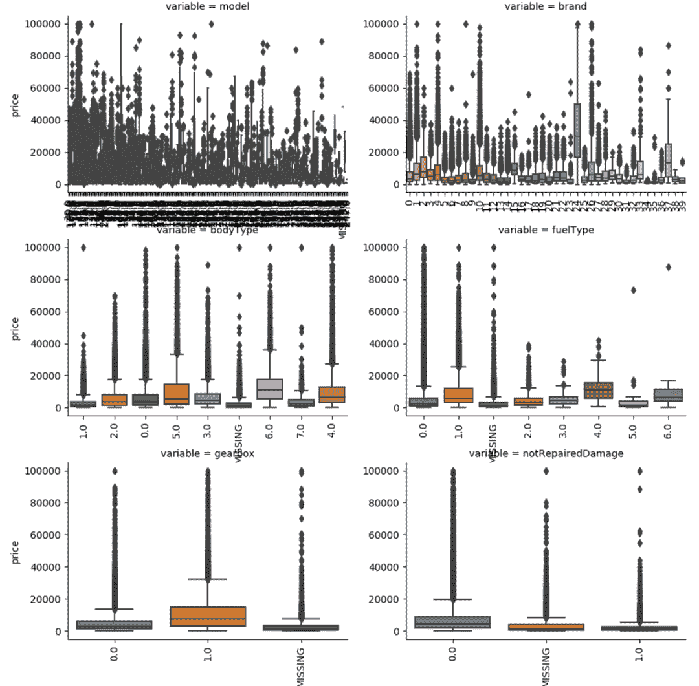

**查看小提琴图**

*   用于显示数据分布及概率密度

*   这种图表结合了箱形图和密度图的特征，主要用来显示数据的分布形状

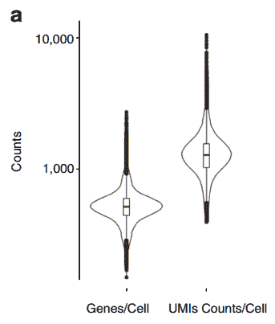

```
catg_list = categorical_features
target = 'icu_los'
for catg in catg_list :
    sns.violinplot(x=catg, y=target, data=Train_data)
    plt.show() 
```

**查看柱形图**

```
def bar_plot(x, y, **kwargs):
    sns.barplot(x=x, y=y)
    x=plt.xticks(rotation=90)

f = pd.melt(Train_data, id_vars=['price'], value_vars=categorical_features)
g = sns.FacetGrid(f, col="variable",  col_wrap=2, sharex=False, sharey=False, size=5)
g = g.map(bar_plot, "value", "price") 
```

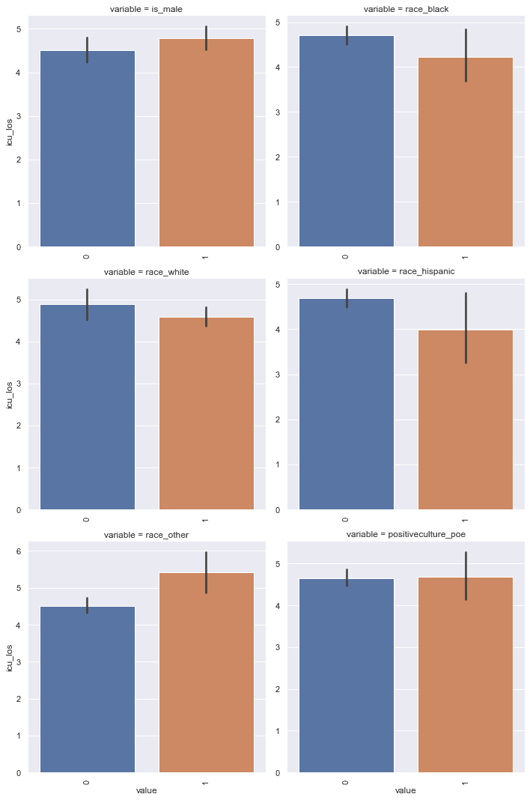

**类别频数可视化**

```
def count_plot(x,  **kwargs):
    sns.countplot(x=x)
    x=plt.xticks(rotation=90)

f = pd.melt(Train_data,  value_vars=categorical_features)
g = sns.FacetGrid(f, col="variable",  col_wrap=2, sharex=False, sharey=False, size=5)
g = g.map(count_plot, "value") 
```

# **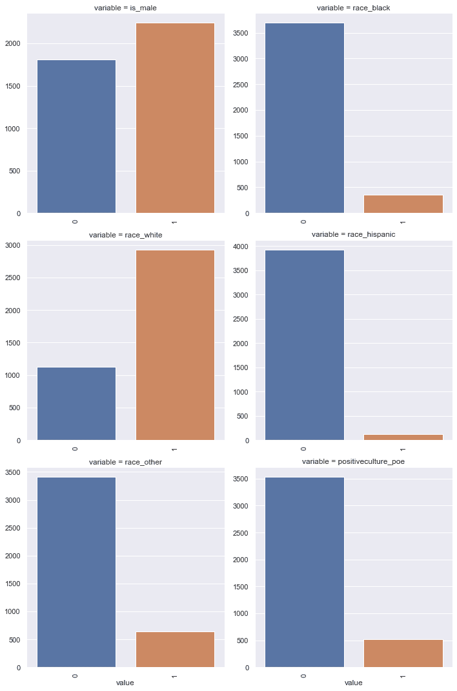**

# **生成数据报告**

用pandas_profiling生成一个较为全面的可视化和数据报告(较为简单、方便) 最终打开html文件即可

```
import pandas_profiling
pfr = pandas_profiling.ProfileReport(Train_data)
pfr.to_file("./example.html") 
```

## 参考

【1】构建模型时为什么要尽量将偏态数据转换为正态分布数据？

【2】张维铭,施雪忠,楼龙翔.非正态数据变换为正态数据的方法[J].浙江工程学院学报,2000(03):56-59.

【3】偏度与峰度的正态性分布判断

【4】数据的偏度和峰度——df.skew()、df.kurt()

【5】Melt函数处理数据，透视表格，宽数据变成长数据

【6】seaborn可视化之FacetGrid()

【7】Seaborn5分钟入门(七)——pairplot

【8】箱型图和小提琴图分析

**完整项目实践（共100多页）*后台回复 **数据挖掘电子版** 获取* 

