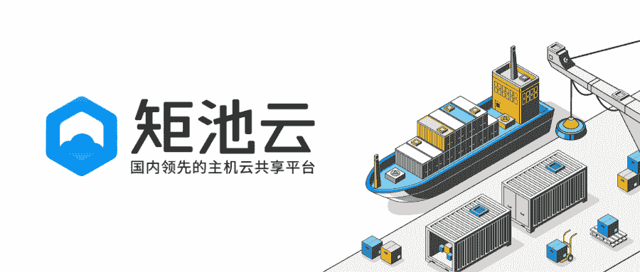
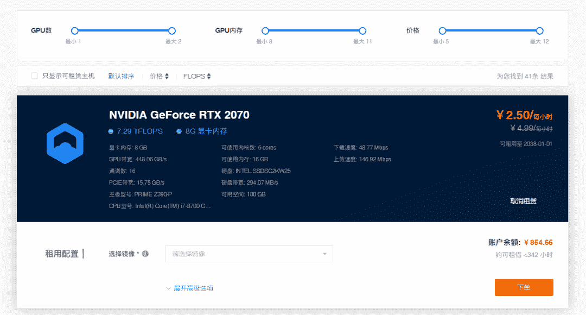
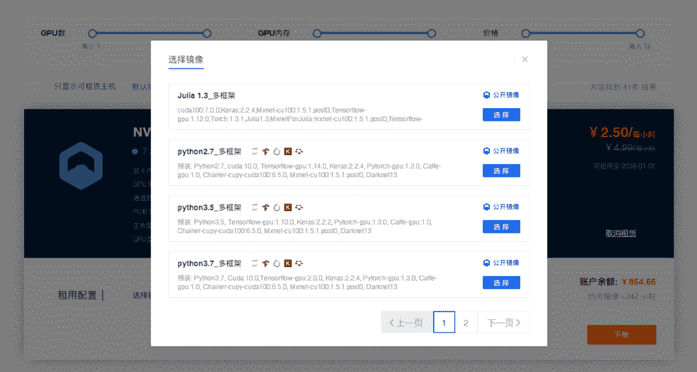
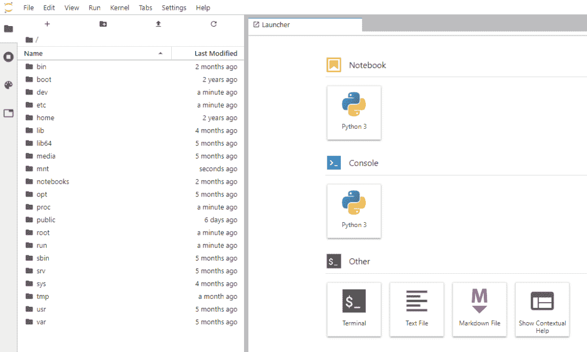
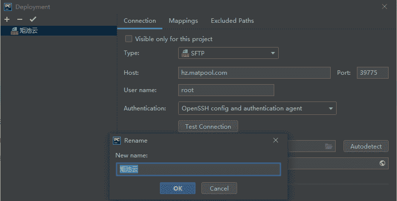
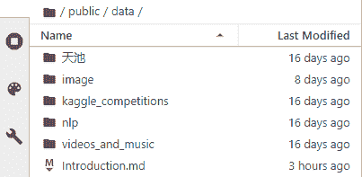
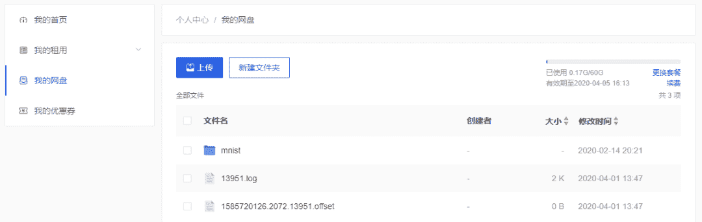
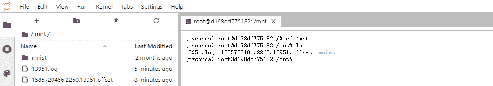

 Datawhale 

**主题：构建GPU环境**

引言：要做深度学习，必然需要 GPU，如何构建一个弹性的 GPU 环境是很多读者关心和常问的问题，今天主要分享关于云服务器的选择。

由于购买GPU价格高昂，通过购买 GPU 云算力来解放生产力成为越来越多人的首选。知名的云服务商包括亚马逊AWS，阿里云等，价格相对较贵，如果习惯应用百度深度学习框架pandlepandle，也可以在百度AI Studio 褥免费算力。除了这些，今天重点聊聊一些高性价比的算力平台，矩池云就是其中一个。

随着 Datawhale 的发展和对算力的需求，几个月前受到矩池云邀请，多个组织成员受邀体验，并给予优惠算力支持。从反馈来看，矩池云相对来说价格更亲民，简单易用，适合新手上手。除了核心GPU，额外提供了公开数据集、案例、预装环境、高速网盘等配套设施和数据，接下来会简单介绍。另外，矩池云也为Datawhale 读者提供了5元体验券和118元的邀请券「**文末领取**」，一并感谢。

## 高性价比

相较同类型产品，矩池云拥有较高的性价比。采用分钟级的实时计费模式，具体可以见下表。另有0.9 元2080Ti单卡与 3.96 元2080Ti双卡的特价机抢购机会，近期还会上线包年包月的计费模式。

矩池云产品价目表

| 产品 | 显存 | 内核 | SSD | 元/小时 |
| 单卡RTX 2070 | 8G | 6 | 100G | 2.5 |
| 双卡RTX 2070 | 16G | 12 | 100G | 5 |
| 单卡RTX 2080 Ti | 11G | 6 | 100G | 3 |
| 双卡RTX 2080 Ti | 22G | 12 | 100G | 6 |

## 一键下单

可通过筛选、排序等功能快速找到合适的主机，选择机器后一键下单。 

## 预装环境

为用户预装了常用的Python、Cuda、Tensorflow、Keras、Pytorch、Caffe、Darknet13等AI必备的开发环境。

## 快速上手

安装了JupyterLab，用户可以迅速访问使用。

## 兼容第三方工具

支持第三方工具远程使用，如PyCharm、Spyder、PuTTY、Xshell等软件。

## 公开数据集

整理了一些常见的公开数据集，供用户快速访问和使用。

*   **图像数据集**：MNIST、CIFAR10、3D_Segmentation、voc2012

*   **自然语言处理数据集**：dbpedia、imdb-sentiments、stanford-question-answering、amazonreviews、UCI-spambase、videos_and_music、youtube8m、beethoven

*   **kaggle**：msdchallenge、netflix-prize-data、transaction_prediction

*   **天池**：中文糖尿病标注数据集、Traffic_Flow_KDD_CUP_2017、User Behavior Data on Taobao App

       

## 高速网盘

提供了高速的网盘供用户管理数据，并提供了5G的免费容量。

 

网盘是永久性的存储，每次租用的时候会进行挂载，在租用主机内部进行高速读写。

## 最后

如果想了解其他GPU平台，也欢迎留言。最后，矩池云为Datawhale读者提供了两个福利：

*   邀请券 118元和免费体验券 5元。

*   扫描下方二维码，回复数字 **3** 和 **5** 领取。

