 Datawhale 

**作者：徐韬 ，Datawhale优秀学习者**

摘要：对于数据挖掘项目，本文将学习如何建模调参？从简单的模型开始，如何去建立一个模型；如何进行交叉验证；如何调节参数优化等。

**建模调参：**特征工程也好，数据清洗也罢，都是为最终的模型来服务的，模型的建立和调参决定了最终的结果。模型的选择决定结果的上限， 如何更好的去达到模型上限取决于模型的调参。

## 数据及背景

https://tianchi.aliyun.com/competition/entrance/231784/information（阿里天池-零基础入门数据挖掘）

## 理论简介

模型调参基于特征工程所构建的模型上限来优化模型。由于模型的不同和复杂度，模型的参数数量也都不一样。线性模型需要调整正则化的系数，而对于非线性模型，例如随机森林和LGB等模型，需要调节的参数增多。

模型调参的目的就是提升模型的性能度量。对于回归算法，我们要降低模型在未知的数据上的误差；对于分类算法，我们要提高模型在未知数据上的准确率。

## 知识总结

**回归分析**

回归分析是一种统计学上分析数据的方法，目的在于了解两个或多个变量间是否相关、相关方向与强度，并建立数学模型。以便通过观察特定变量（自变量），来预测研究者感兴趣的变量（因变量）

一般形式：

向量形式：

其中 向量代表一条样本 ，其中 代表样本的各个特征， 是一条向量代表了每个特征所占的权重，b是一个标量代表特征都为0时的预测值，可以视为模型的basis或者bias。

损失函数 我们希望的是能够减少在测试集上的预测值 与真实值 的差别，从而获得一个最佳的权重参数，因此这里采用最小二乘估计。

**长尾分布**

这种分布会使得采样不准，估值不准，因为尾部占了很大部分。另一方面，尾部的数据少，人们对它的了解就少，那么如果它是有害的，那么它的破坏力就非常大，因为人们对它的预防措施和经验比较少。

**欠拟合与过拟合**

**欠拟合****：**训练的模型在训练集上面的表现很差，在验证集上面的表现也很差。即训练误差和泛化误差都很大。**原****因：**

*   模型没有很好或足够数量的训练训练集

*   模型的训练特征过于简单

**过拟合****：**模型的训练误差远小于它在测试数据集上的误差。即训练误差不错，但是泛化误差比训练误差相差太多。**原因：**

*   模型没有很好或足够数量的训练训练集

*   训练数据和测试数据有偏差

*   模型的训练过度，过于复杂，没有学到主要的特征

由此引出模型复杂度概念模型中的参数，一个简单的二元线性的函数只有两个权重，而多元的复杂的函数的权重可能会什么上百上千个。

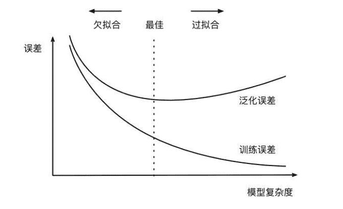

模型复杂度太低（参数过少），模型学习得太少，就难以训练出有效的模型，便会出现欠拟合。模型复杂度太高（参数很多），即模型可训练空间很大，容易学习过度，甚至于也将噪声数据学习了，便会出现过拟合。

**正则化**

损失函数后面会添加一个额外项，称作 L1正则化 和 L2正则化，或者 L1范数和 L2范数。

L1正则化和L2正则化可以看做是损失函数的惩罚项。所谓『惩罚』是指对损失函数中的某些参数做一些限制。对于线性回归模型，使用L1正则化的模型建叫做Lasso回归，使用L2正则化的模型叫做Ridge回归（岭回归）。

L1正则化模型：

L2正则化模型：

正则化说明：

*   L1正则化是指权值向量 中各个元素的绝对值之和，通常表示为

*   L2正则化是指权值向量 中各个元素的平方和然后再求平方根（可以看到Ridge回归的L2正则化项有平方符号）

正则化作用：

*   L1正则化可以产生稀疏权值矩阵，即产生一个稀疏模型，可以用于特征选择

*   L2正则化可以防止模型过拟合（overfitting）

**调参方法**

**贪心调参 （坐标下降）**

坐标下降法是一类优化算法，其最大的优势在于不用计算待优化的目标函数的梯度。最容易想到一种特别朴实的类似于坐标下降法的方法，与坐标下降法不同的是，不是循环使用各个参数进行调整，而是贪心地选取了对整体模型性能影响最大的参数。参数对整体模型性能的影响力是动态变化的，故每一轮坐标选取的过程中，这种方法在对每个坐标的下降方向进行一次直线搜索（line search）

**网格调参GridSearchCV**

作用是在指定的范围内可以自动调参，只需将参数输入即可得到最优化的结果和参数。相对于人工调参更省时省力，相对于for循环方法更简洁灵活，不易出错。

**贝叶斯调参**

贝叶斯优化通过基于目标函数的过去评估结果建立替代函数（概率模型），来找到最小化目标函数的值。贝叶斯方法与随机或网格搜索的不同之处在于，它在尝试下一组超参数时，会参考之前的评估结果，因此可以省去很多无用功。

超参数的评估代价很大，因为它要求使用待评估的超参数训练一遍模型，而许多深度学习模型动则几个小时几天才能完成训练，并评估模型，因此耗费巨大。贝叶斯调参发使用不断更新的概率模型，通过推断过去的结果来“集中”有希望的超参数。

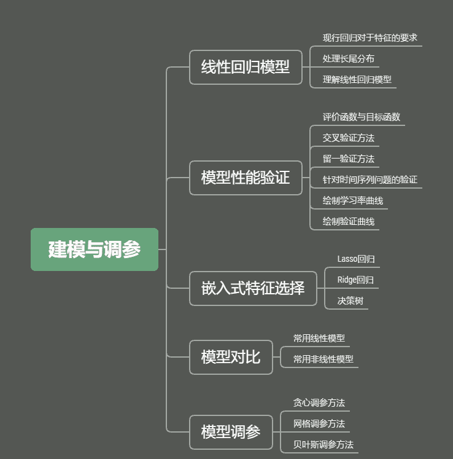

## 建模与调参

**线性回归**

**模型建立**

先使用线性回归来查看一下用线性回归模型来拟合我们的题目会有那些缺点。这里使用了 sklearn 的 LinearRegression。

```
sklearn.linear_model.LinearRegression(fit_intercept=True,normalize=False,copy_X=True,n_jobs=1 
```

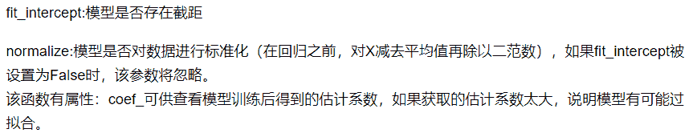

```
model = LinearRegression(normalize=True)
model.fit(data_x, data_y)

model.intercept_, model.coef_ 
```

`查看训练的线性回归模型的截距与权重`

```
'intercept:'+ str(model.intercept_)sorted(dict(zip(continuous_feature_names, model.coef_)).items(), key=lambda x:x[1], reverse=True)## output
对上下文代码涉及到的函数功能进行简单介绍： 
```

| 函数
 | 功能
 |
| zip() | 可以将两个可迭代的对象,组合返回成一个元组数据 |
| dict() | 元组数据构建字典 |
| items() | 以列表返回可遍历的(键, 值) 元组数组 |
| sort(iterable, cmp, key, reverse) | 排序函数
 |
| iterable | 指定要排序的list或者iterable |
| key | 指定取待排序元素的哪一项进行排序 - 这里x[1]表示按照列表中第二个元素排序 |
| reverse | 是一个bool变量，表示升序还是降序排列，默认为False(升序) |
| np.quantile(train_y, 0.9) | 求train_y 的90%的分位数 |

下面这个代码是把价格大于90%分位数的部分截断了,就是长尾分布截断

绘制特征v_9的值与标签的散点图，图片发现模型的预测结果（蓝色点）与真实标签（黑色点）的分布差异较大。

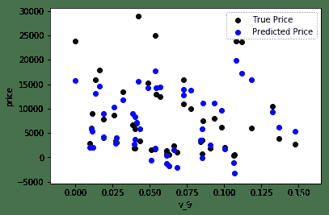

且预测值price出现负数，查看price分布 出现长尾分布 不符合正态分布。

**线性回归解决方案**

1\. 进行log变化

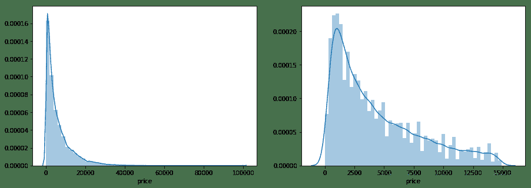

2\. 进行可视化，发现预测结果与真实值较为接近，且未出现异常状况。

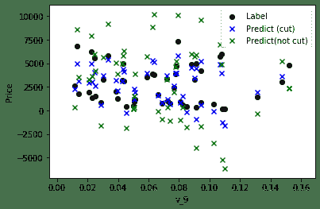

**交叉****验证**

大概说一下sklearn的交叉验证的使用方法， 下文会有很多使用：

| verbose | 日志显示 |
| verbose = 0 | 为不在标准输出流输出日志信息 |
| verbose = 1 | 为输出进度条记录 |
| verbose = 2 | 为每个epoch输出一行记录 |

K折交叉验证是将原始数据分成K组，将每个子集数据分别做一次验证集，其余的K-1组子集数据作为训练集，这样会得到K个模型，用这K个模型最终的验证集分类准确率的平均数，作为此K折交叉验证下分类器的性能指标。此处，采用五折交叉验证。

```
data_y = np.log(data_y + 1)# 交叉验证scores = cross_val_score(LinearRegression(normalize=True), X=data_x, \                        y=data_y, cv=5, scoring=make_scorer(mean_absolute_error))
np.mean(scores) 
```

但在事实上，由于我们并不具有预知未来的能力，五折交叉验证在某些与时间相关的数据集上反而反映了不真实的情况。

通过2018年的二手车价格预测2017年的二手车价格，这显然是不合理的，因此我们还可以采用时间顺序对数据集进行分隔。

在本例中，我们选用靠前时间的4/5样本当作训练集，靠后时间的1/5当作验证集，最终结果与五折交叉验证差距不大。

```
import datetimesample_feature = sample_feature.reset_index(drop=True)split_point = len(sample_feature) // 5 * 4train = sample_feature.loc[:split_point].dropna()val = sample_feature.loc[split_point:].dropna()
train_X = train[continuous_feature_names]train_y_ln = np.log(train['price'] + 1)val_X = val[continuous_feature_names]val_y_ln = np.log(val['price'] + 1)
model = model.fit(train_X, train_y_ln) 
```

*   `fill_between()`

*   `train_sizes - 第一个参数表示覆盖的区域`

*   `train_scores_mean - train_scores_std - 第二个参数表示覆盖的下限`

*   `train_scores_mean + train_scores_std - 第三个参数表示覆盖的上限`

*   `color - 表示覆盖区域的颜色`

*   `alpha - 覆盖区域的透明度,越大越不透明 [0,1]`

预测结果查看：

```
mean_absolute_error(val_y_ln, model.predict(val_X))

0.19443858353490887 
```

**可视化处理**

绘制学习率曲线与验证曲线

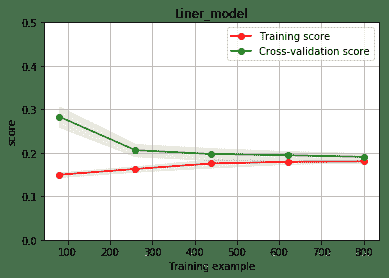

**线性模型**

先来对比一下三个lr模型的情况:

```
models = [LinearRegression(),          Ridge(),          Lasso()]result = dict()for model in models:    model_name = str(model).split('(')[0]    scores = cross_val_score(model, X=train_X, y=train_y_ln, verbose=0, cv = 5, scoring=make_scorer(mean_absolute_error))    result[model_name] = scores    print(model_name + ' is finished')
result = pd.DataFrame(result)result.index = ['cv' + str(x) for x in range(1, 6)]result
结果对比如下：

LinearRegression线性回归： 
```

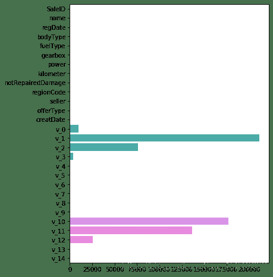

Lasso回归：L1正则化有助于生成一个稀疏权值矩阵，进而可以用于特征选择。由此发现power与userd_time特征非常重要。

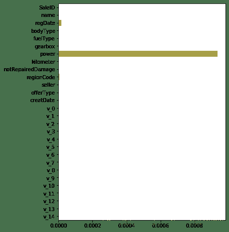

Ridge回归：

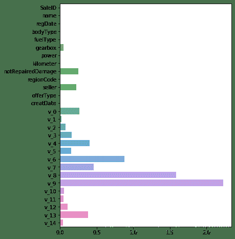

L2正则化在拟合过程中通常都倾向于让权值尽可能小，最后构造一个所有参数都比较小的模型，因为一般认为参数值小的模型比较简单，能适应不同的数据集，也在一定程度上避免了过拟合现象。

**非线****性模型**

```
SVM
通过寻求结构化风险最小来提高学习机泛化能力,基本模型定义为特征空间上的间隔最大的线性分类器支持向量机的学习策略便是间隔最大化。SVR：用于标签连续值的回归问题
SVC：用于分类标签的分类问题

Boosting
一堆弱分类器的组合就可以成为一个强分类器；不断地在错误中学习，迭代来降低犯错概率通过一系列的迭代来优化分类结果，每迭代一次引入一个弱分类器，来克服现在已经存在的弱分类器组合的短板。
Adaboost
整个训练集上维护一个分布权值向量W，用赋予权重的训练集通过弱分类算法产生分类假设（基学习器）y(x)， 然后计算错误率,用得到的错误率去更新分布权值向量w，对错误分类的样本分配更大的权值,正确分类的样本赋予更小的权值，每次更新后用相同的弱分类算法产生新的分类假设,这些分类假设的序列构成多分类器，对这些多分类器用加权的方法进行联合,最后得到决策结果
Gradient Boosting
迭代的时候选择梯度下降的方向来保证最后的结果最好。损失函数用来描述模型的'靠谱'程度,假设模型没有过拟合,损失函数越大,模型的错误率越高。如果我们的模型能够让损失函数持续的下降,最好的方式就是让损失函数在其梯度方向下降。

GradientBoostingRegressor()
```

*   `loss - 选择损失函数，默认值为ls(least squres),即最小二乘法,对函数拟合`

*   `learning_rate - 学习率`

*   `n_estimators - 弱学习器的数目,默认值100`

*   `max_depth - 每一个学习器的最大深度,限制回归树的节点数目,默认为3`

*   `min_samples_split - 可以划分为内部节点的最小样本数,默认为2`

*   `min_samples_leaf - 叶节点所需的最小样本数,默认为1`

 `**MLPRegressor()**
参数详解` 

*   `hidden_layer_sizes - hidden_layer_sizes=(50, 50),表示有两层隐藏层，第一层隐藏层有50个神经元,第二层也有50个神经元`

*   `activation - 激活函数 {‘identity’, ‘logistic’, ‘tanh’, ‘relu’},默认relu` 

*   `identity - f(x) = x` 

*   `logistic - 其实就是sigmod函数,f(x) = 1 / (1 + exp(-x))` 

*   `tanh - f(x) = tanh(x)` 

*   `relu - f(x) = max(0, x)` 

*   `solver - 用来优化权重 {‘lbfgs’, ‘sgd’, ‘adam’},默认adam,` 

*   `lbfgs - quasi-Newton方法的优化器:对小数据集来说,lbfgs收敛更快效果也``更好` 

*   `sgd - 随机梯度下降` 

*   `adam - 机遇随机梯度的优化器` 

*   `alpha - 正则化项参数,可选的，默认0.0001` 

*   `learning_rate - 学习率,用于权重更新,只有当solver为’sgd’时使用` 

*   `max_iter - 最大迭代次数,默认200` 

*   `shuffle - 判断是否在每次迭代时对样本进行清洗,默认True,只有当solver=’sgd’或者‘adam’时使用` 

`**XGBRegressor**``梯度提升回归树,也叫梯度提升机`

*   `采用连续的方式构造树,每棵树都试图纠正前一棵树的错误`

*   `与随机森林不同,梯度提升回归树没有使用随机化,而是用到了强预剪枝`

*   `从而使得梯度提升树往往深度很小,这样模型占用的内存少,预测的速度也快`

```
from sklearn.linear_model import LinearRegression
from sklearn.svm import SVC
from sklearn.tree import DecisionTreeRegressor
from sklearn.ensemble import RandomForestRegressor
from sklearn.ensemble import GradientBoostingRegressor
from sklearn.neural_network import MLPRegressor
from xgboost.sklearn import XGBRegressor
from lightgbm.sklearn import LGBMRegressor

models = [LinearRegression(),
          DecisionTreeRegressor(),
          RandomForestRegressor(),
          GradientBoostingRegressor(),
          MLPRegressor(solver='lbfgs', max_iter=100),
          XGBRegressor(n_estimators = 100, objective='reg:squarederror'),
          LGBMRegressor(n_estimators = 100)]

result = dict()
for model in models:
    model_name = str(model).split('(')[0]
    scores = cross_val_score(model, X=train_X, y=train_y_ln, verbose=0, cv = 5, scoring=make_scorer(mean_absolute_error))
    result[model_name] = scores
    print(model_name + ' is finished')

result = pd.DataFrame(result)
result.index = ['cv' + str(x) for x in range(1, 6)]
result 
```

各模型结果：

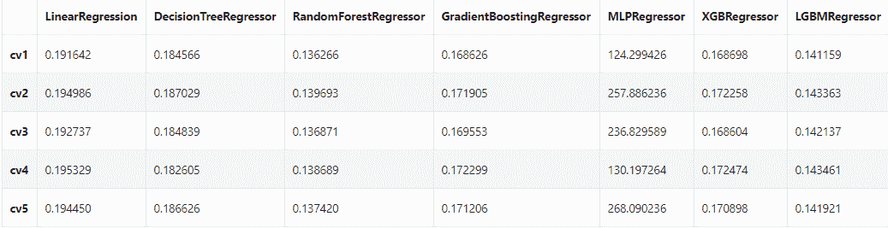

`虽然随机森林模型在此时取得较好的效果，但LGB的效果与其相差不大。对LGB进行调参后结果会得到提高，下面对LGB进行简介。`

`**LightGBM**``使用的是histogram算法，占用的内存更低，数据分隔的复杂度更低。思想是将连续的浮点特征离散成k个离散值，并构造宽度为k的Histogram。然后遍历训练数据，统计每个离散值在直方图中的累计统计量。在进行特征选择时，只需要根据直方图的离散值，遍历寻找最优的分割点。``LightGBM采用leaf-wise生长策略：每次从当前所有叶子中找到分裂增益最大（一般也是数据量最大）的一个叶子，然后分裂，如此循环。因此同Level-wise相比，在分裂次数相同的情况下，Leaf-wise可以降低更多的误差，得到更好的精度。`

`Leaf-wise的缺点是可能会长出比较深的决策树，产生过拟合因此LightGBM在Leaf-wise之上增加了一个最大深度的限制，在保证高效率的同时防止过拟合。`

```
参数: 
```

*   `num_leaves - 控制了叶节点的数目，它是控制树模型复杂度的主要参数,取值应 <= 2 ^（max_depth）` 

*   `bagging_fraction - 每次迭代时用的数据比例,用于加快训练速度和减小过拟合` 

*   `feature_fraction - 每次迭代时用的特征比例,例如为0.8时，意味着在每次迭代中随机选择80％的参数来建树，boosting为random forest时用` 

*   `min_data_in_leaf - 每个叶节点的最少样本数量。它是处理leaf-wise树的过拟合的重要参数。将它设为较大的值，可以避免生成一个过深的树。但是也可能导致欠拟合` 

*   `max_depth - 控制了树的最大深度,该参数可以显式的限制树的深度` 

*   `n_estimators - 分多少颗决策树(总共迭代的次数)` 

*   `objective - 问题类型` 

*   *   `regression - 回归任务,使用L2损失函数` 

    *   `regression_l1 - 回归任务,使用L1损失函数` 

    *   `huber - 回归任务,使用huber损失函数`

    *   `fair - 回归任务,使用fair损失函数` 

    *   `mape (mean_absolute_precentage_error) - 回归任务,使用MAPE损失函数`

**模型调参**

```
常用的三种调参方法：
```

*   `贪心调参`

*   `GridSearchCV调参`

*   `贝叶斯调参`

这里给出一个模型可调参数及范围选取的参考：

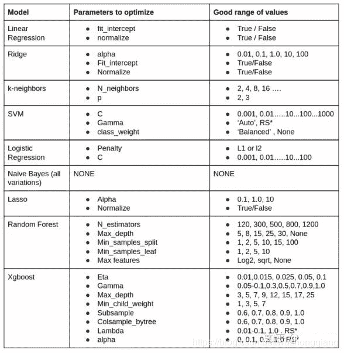

**贪心****调参**

拿当前对模型影响最大的参数调优，直到最优化；再拿下一个影响最大的参数调优，如此下去，直到所有的参数调整完毕。这个方法的缺点就是可能会调到局部最优而不是全局最优，但是省时间省力，巨大的优势面前，可以一试。

```
objectives = ["rank:map", "reg:gamma", "count:poisson", "reg:tweedie", "reg:squaredlogerror"]max_depths = [1, 3, 5, 10, 15]lambdas = [.1, 1, 2, 3, 4]

best_obj = dict()for obj in objective:    model = LGBMRegressor(objective=obj)    score = np.mean(cross_val_score(model, X=train_X, y=train_y_ln, verbose=0, cv = 5, scoring=make_scorer(mean_absolute_error)))    best_obj[obj] = score    best_leaves = dict()for leaves in num_leaves:    model = LGBMRegressor(objective=min(best_obj.items(), key=lambda x:x[1])[0], num_leaves=leaves)    score = np.mean(cross_val_score(model, X=train_X, y=train_y_ln, verbose=0, cv = 5, scoring=make_scorer(mean_absolute_error)))    best_leaves[leaves] = score    best_depth = dict()for depth in max_depth:    model = LGBMRegressor(objective=min(best_obj.items(), key=lambda x:x[1])[0],                          num_leaves=min(best_leaves.items(), key=lambda x:x[1])[0],                          max_depth=depth)    score = np.mean(cross_val_score(model, X=train_X, y=train_y_ln, verbose=0, cv = 5, scoring=make_scorer(mean_absolute_error)))    best_depth[depth] = score 
```

这里 “count:poisson” 的损失最小， 所以下个参数调试时会加上这个参数

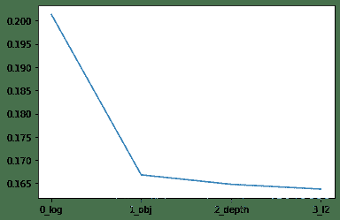

**GridSearchCV调参**

GridSearchCV，它存在的意义就是自动调参，只要把参数输进去，就能给出最优化的结果和参数。但是这个方法适合于小数据集，一旦数据的量级上去了，很难得出结果。这个在这里面优势不大， 因为数据集很大，不太能跑出结果，但是也整理一下，有时候还是很好用的。

```
parameters = {'objective': objective , 'num_leaves': num_leaves, 'max_depth': max_depth}model = LGBMRegressor()clf = GridSearchCV(model, parameters, cv=5)clf = clf.fit(train_X, train_y)
clf.best_params_
model = LGBMRegressor(objective='regression',                          num_leaves=55,                          max_depth=15)
np.mean(cross_val_score(model, X=train_X, y=train_y_ln, verbose=0, cv = 5, scoring=make_scorer(mean_absolute_error)))
0.13626164479243302 
```

**贝叶斯调参**

贝叶斯优化用于机器学习调参，主要思想是，给定优化的目标函数(广义的函数，只需指定输入和输出即可，无需知道内部结构以及数学性质)，通过不断地添加样本点来更新目标函数的后验分布(高斯过程,直到后验分布基本贴合于真实分布。简单的说，就是考虑了上一次参数的信息，从而更好的调整当前的参数。

与常规的网格搜索或者随机搜索的区别是：

*   `贝叶斯调参采用高斯过程，考虑之前的参数信息，不断地更新先验；`

*   `网格搜索未考虑之前的参数信息贝叶斯调参迭代次数少，速度快；网格搜索速度慢,参数多时易导致维度爆炸`

*   `贝叶斯调参针对非凸问题依然稳健；网格搜索针对非凸问题易得到局部最优`

使用方法：

*   `定义优化函数(rf_cv, 在里面把优化的参数传入，然后建立模型， 返回要优化的分数指标)`

*   `定义优化参数`

*   `开始优化（最大化分数还是最小化分数等）`

*   `得到优化结果`

```
from bayes_opt import BayesianOptimizationdef rf_cv(num_leaves, max_depth, subsample, min_child_samples):    val = cross_val_score(        LGBMRegressor(objective = 'regression_l1',            num_leaves=int(num_leaves),            max_depth=int(max_depth),            subsample = subsample,            min_child_samples = int(min_child_samples)        ),        X=train_X, y=train_y_ln, verbose=0, cv = 5, scoring=make_scorer(mean_absolute_error)    ).mean()    return 1 - valrf_bo = BayesianOptimization(    rf_cv,    {    'num_leaves': (2, 100),    'max_depth': (2, 100),    'subsample': (0.1, 1),    'min_child_samples' : (2, 100)    })rf_bo.maximize()

参考【1】Liner Regression-线性回归
【2】Python实现决策树
【3】机器学习大杀器——梯度提升树GBDT
【4】灵魂拷问：你看过Xgboost原文吗？
【5】无痛看懂LightGBM原文
【6】系列第一篇「数据分析」之零基础入门数据挖掘
【7】系列第二篇「特征工程」之零基础入门数据挖掘 
```

**完整项目实践（共100多页）*后台回复 **数据挖掘电子版** 获取* 


原创不易点亮 **在看**好不好