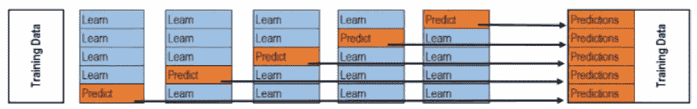

 Datawhale 

**作者：田杨军 ，Datawhale优秀学习者**

摘要：对于数据挖掘项目，本文将学习如何进行模型融合？常见的模型融合的方法有哪些？针对不同的问题类型，应该选择哪种方法呢？

**模型融合：**通过融合多个不同的模型，可能提升机器学习的性能。这一方法在各种机器学习比赛中广泛应用， 也是在比赛的攻坚时刻冲刺Top的关键。而融合模型往往又可以从模型结果，模型自身，样本集等不同的角度进行融合。

## 数据及背景

https://tianchi.aliyun.com/competition/entrance/231784/information（阿里天池-零基础入门数据挖掘）

## 模型融合

如果你打算买一辆车，你会直接走进第一家4S店，然后在店员的推销下直接把车买了吗？大概率不会，你会先去网站，看看其他人的评价或者一些专业机构在各个维度上对各种车型的对比；也许还会取咨询朋友和同事的意见。最后，做出决策。

模型融合采用的是同样的思想，即多个模型的组合可以改善整体的表现。集成模型是一种能在各种的机器学习任务上提高准确率的强有力技术。

模型融合是比赛后期一个重要的环节，大体来说有如下的类型方式：

1\. 简单加权融合：

*   回归（分类概率）：算术平均融合（Arithmetic mean），几何平均融合（Geometric mean）；

*   分类：投票（Voting）；

*   综合：排序融合(Rank averaging)，log融合。

2\. stacking/blending:

*   构建多层模型，并利用预测结果再拟合预测。

3\. boosting/bagging:

*   多树的提升方法，在xgboost，Adaboost,GBDT中已经用到。

## 平均法（Averaging）

**基本思想****：**对于回归问题，一个简单直接的思路是取平均。稍稍改进的方法是进行加权平均。权值可以用排序的方法确定，举个例子，比如A、B、C三种基本模型，模型效果进行排名，假设排名分别是1，2，3，那么给这三个模型赋予的权值分别是3/6、2/6、1/6。

平均法或加权平均法看似简单，其实后面的高级算法也可以说是基于此而产生的，Bagging或者Boosting都是一种把许多弱分类器这样融合成强分类器的思想。

**简单算术平均法：**Averaging方法就多个模型预测的结果进行平均。这种方法既可以用于回归问题，也可以用于对分类问题的概率进行平均。

**加权算术平均法：**这种方法是平均法的扩展。考虑不同模型的能力不同，对最终结果的贡献也有差异，需要用权重来表征不同模型的重要性importance。

其中， <svg xmlns="http://www.w3.org/2000/svg" viewBox="0 -1528.7 8516.7 2574.6" style="vertical-align: -2.366ex;width: 19.268ex;height: 5.825ex;"><g stroke="currentColor" fill="currentColor" stroke-width="0" transform="matrix(1 0 0 -1 0 0)"><g><g transform="translate(3121.3, 0)">且</g></g></g></svg>

## 投票法（voting）

**基本思想****：**假设对于一个二分类问题，有3个基础模型，现在我们可以在这些基学习器的基础上得到一个投票的分类器，把票数最多的类作为我们要预测的类别。

**绝对多数投票法：**最终结果必须在投票中占一半以上。

**相对多数投票法：**最终结果在投票中票数最多。

**加权投票法：**其原理为

其中， <svg xmlns="http://www.w3.org/2000/svg" viewBox="0 -1528.7 7340 2574.6" style="vertical-align: -2.366ex;width: 16.606ex;height: 5.825ex;"><g stroke="currentColor" fill="currentColor" stroke-width="0" transform="matrix(1 0 0 -1 0 0)"><g><g transform="translate(3121.3, 0)">且</g></g></g></svg>

**硬投票****：**对多个模型直接进行投票，不区分模型结果的相对重要度，最终投票数最多的类为最终被预测的类。


**软投票：**增加了设置权重的功能，可以为不同模型设置不同权重，进而区别模型不同的重要度。


```
from sklearn.tree import DecisionTreeClassifier
from sklearn.neighbors import KNeighborsClassifier
from sklearn.linear_model import LogisticRegression
from sklearn.ensemble import VotingClassifier

model1 = LogisticRegression(random_state=2020)
model2 = DecisionTreeClassifier(random_state=2020)
model = VotingClassifier(estimators=[('lr', model1), ('dt', model2)], voting='hard')
model.fit(x_train, y_train)
model.score(x_test, y_test) 
```

## 堆叠法（Stacking）

**基本思想**

stacking 就是当用初始训练数据学习出若干个基学习器后，将这几个学习器的预测结果作为新的训练集，来学习一个新的学习器。对不同模型预测的结果再进行建模。


将个体学习器结合在一起的时候使用的方法叫做结合策略。对于分类问题，我们可以使用投票法来选择输出最多的类。对于回归问题，我们可以将分类器输出的结果求平均值。

上面说的投票法和平均法都是很有效的结合策略，还有一种结合策略是使用另外一个机器学习算法来将个体机器学习器的结果结合在一起，这个方法就是Stacking。

在stacking方法中，我们把个体学习器叫做初级学习器，用于结合的学习器叫做次级学习器或元学习器（metalearner），次级学习器用于训练的数据叫做次级训练集。次级训练集是在训练集上用初级学习器得到的。

**如何进行Stacking**

Stacking算法：


*   过程1-3 是训练出来个体学习器，也就是初级学习器。

*   过程5-9是 使用训练出来的个体学习器来得预测的结果，这个预测的结果当做次级学习器的训练集。

*   过程11 是用初级学习器预测的结果训练出次级学习器，得到我们最后训练的模型。

**Stacking方法详解**

Stacking模型本质上是一种分层的结构，这里简单起见，只分析二级Stacking.假设我们有2个基模型 Model1_1、Model1_2 和 一个次级模型Model2。

**Step 1**. 基模型 Model1_1，对训练集train训练，然后用于预测 train 和 test 的标签列，分别是P1，T1，Model1_1 模型训练:


训练后的模型 Model1_1 分别在 train 和 test 上预测，得到预测标签分别是P1，T1


**Step 2\.** 基模型 Model1_2 ，对训练集train训练，然后用于预测train和test的标签列，分别是P2，T2，model1_2 模型训练:


训练后的模型 Model1_2 分别在 train 和 test 上预测，得到预测标签分别是P2，T2


**Step 3.** 分别把P1,P2以及T1,T2合并，得到一个新的训练集和测试集train2,test2。


再用次级模型 Model2 以真实训练集标签为标签训练,以train2为特征进行训练，预测test2,得到最终的测试集预测的标签列 。


这就是我们两层堆叠的一种基本的原始思路想法。在不同模型预测的结果基础上再加一层模型，进行再训练，从而得到模型最终的预测。

Stacking本质上就是这么直接的思路，但是直接这样有时对于如果训练集和测试集分布不那么一致的情况下是有一点问题的，其问题在于用初始模型训练的标签再利用真实标签进行再训练，毫无疑问会导致一定的模型过拟合训练集，这样或许模型在测试集上的泛化能力或者说效果会有一定的下降，因此现在的问题变成了如何降低再训练的过拟合性，这里我们一般有两种方法：

1.  次级模型尽量选择简单的线性模型

2.  利用K折交叉验证

*   训练：



*   预测：


```
#这里只实现了针对一个基模型做K折交叉验证，因为P1和T1都是多行一列的结构，这里是先存储为一行多列，最后进行转置。
def get_oof(clf, x_train, y_train, x_test):
 oof_train = np.zeros((ntrain,))  
 oof_test = np.zeros((ntest,))
 oof_test_skf = np.empty((NFOLDS, ntest))  #NFOLDS行，ntest列的二维array
 for i, (train_index, test_index) in enumerate(kf): #循环NFOLDS次
     x_tr = x_train[train_index]
     y_tr = y_train[train_index]
     x_te = x_train[test_index]
     clf.fit(x_tr, y_tr)
     oof_train[test_index] = clf.predict(x_te)
     oof_test_skf[i, :] = clf.predict(x_test)  #固定行填充，循环一次，填充一行
 oof_test[:] = oof_test_skf.mean(axis=0)  #axis=0,按列求平均，最后保留一行
 return oof_train.reshape(-1, 1), oof_test.reshape(-1, 1)  #转置，从一行变为一列 
```

## 混合法（Blending）

**基本思想：**Blending采用了和stacking同样的方法，不过只从训练集中选择一个fold的结果，再和原始特征进行concat作为元学习器meta learner的特征，测试集上进行同样的操作。

把原始的训练集先分成两部分，比如70%的数据作为新的训练集，剩下30%的数据作为测试集。

*   第一层，我们在这70%的数据上训练多个模型，然后去预测那30%数据的label，同时也预测test集的label。

*   在第二层，我们就直接用这30%数据在第一层预测的结果做为新特征继续训练，然后用test集第一层预测的label做特征，用第二层训练的模型做进一步预测。

**Blending训练过程：**

1.  整个训练集划分成训练集training sets和验证集validation sets两个部分；

2.  在training sets上训练模型；

3.  在validation sets和test sets上得到预测结果；

4.  将validation sets的原始特征和不同基模型base model预测得到的结果作为新的元学习器meta learner的输入，进行训练 ；

5.  使用训练好的模型meta learner在test sets以及在base model上的预测结果上进行预测，得到最终结果。

**Stacking与Blending的对比：**

优点在于：

*   blending比stacking简单，因为不用进行k次的交叉验证来获得stacker feature

*   blending避开了一个信息泄露问题：generlizers和stacker使用了不一样的数据集

缺点在于：

*   blending使用了很少的数据（第二阶段的blender只使用training set10%的量）

*   blender可能会过拟合

*   stacking使用多次的交叉验证会比较稳健

## Bagging

**基本思想：**Bagging基于bootstrap（自采样），也就是有放回的采样。训练子集的大小和原始数据集的大小相同。Bagging的技术使用子集来了解整个样本集的分布，通过bagging采样的子集的大小要小于原始集合。

*   采用bootstrap的方法基于原始数据集产生大量的子集

*   基于这些子集训练弱模型base model

*   模型是并行训练并且相互独立的

*   最终的预测结果取决于多个模型的预测结果

Bagging是一种并行式的集成学习方法，即基学习器的训练之间没有前后顺序可以同时进行，Bagging使用“有放回”采样的方式选取训练集，对于包含m个样本的训练集，进行m次有放回的随机采样操作，从而得到m个样本的采样集，这样训练集中有接近36.8%的样本没有被采到。按照相同的方式重复进行，我们就可以采集到T个包含m个样本的数据集，从而训练出T个基学习器，最终对这T个基学习器的输出进行结合。

**算法流程：**


## Boosting

**基础思想：**Boosting是一种串行的工作机制，即个体学习器的训练存在依赖关系，必须一步一步序列化进行。Boosting是一个序列化的过程，后续模型会矫正之前模型的预测结果。也就是说，之后的模型依赖于之前的模型。

其基本思想是：增加前一个基学习器在训练训练过程中预测错误样本的权重，使得后续基学习器更加关注这些打标错误的训练样本，尽可能纠正这些错误，一直向下串行直至产生需要的T个基学习器，Boosting最终对这T个学习器进行加权结合，产生学习器委员会。

下面给出加州大学欧文分校Alex Ihler教授的两页PPT：


**Boosting训练过程：**

*   基于原始数据集构造子集

*   初始的时候，所有的数据点都给相同的权重

*   基于这个子集创建一个基模型

*   使用这个模型在整个数据集上进行预测

*   基于真实值和预测值计算误差

*   被预测错的观测值会赋予更大的权重

*   再构造一个模型基于之前预测的误差进行预测，这个模型会尝试矫正之前的模型

*   类似地，构造多个模型，每一个都会矫正之前的误差

*   最终的模型（strong learner）是所有弱学习器的加权融合

## 参考

```
【1】《机器学习》（西瓜书）
【2】《数据挖掘导论》
【3】《统计学习方法》
【4】集成学习-Voting
【5】模型融合方法概述
【6】系列第一篇「数据分析」之零基础入门数据挖掘
【7】系列第二篇「特征工程」之零基础入门数据挖掘
【8】系列第三篇「建模调参」之零基础入门数据挖掘 
```

**完整项目实践（共100多页）*后台回复 **数据挖掘电子版*** 


“嗯，这篇正**在看**↓