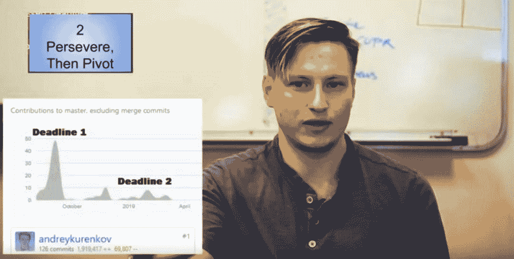
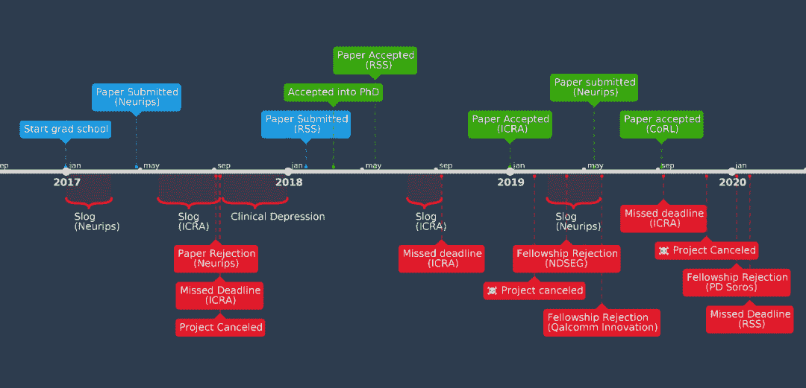
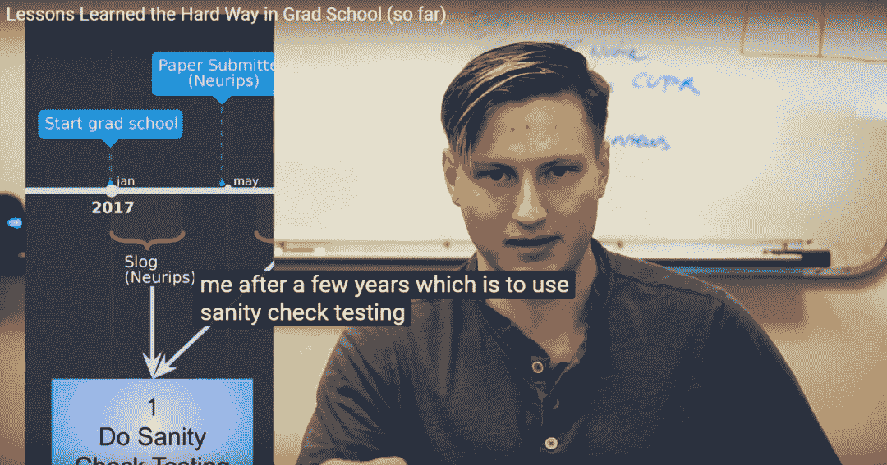
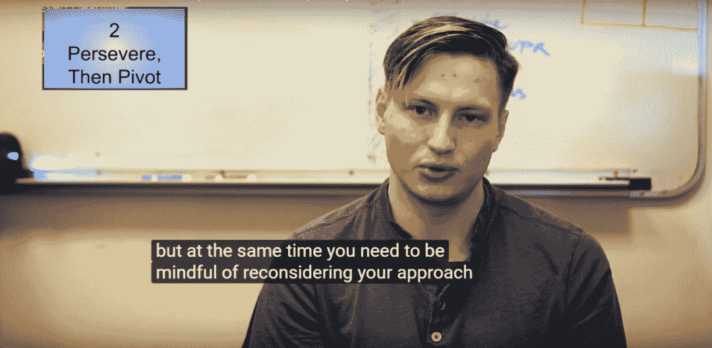
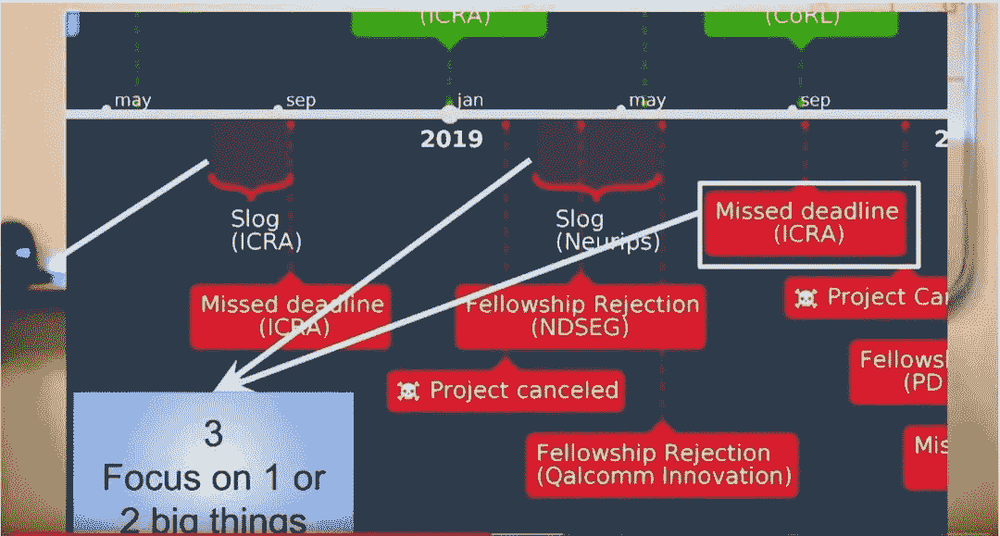
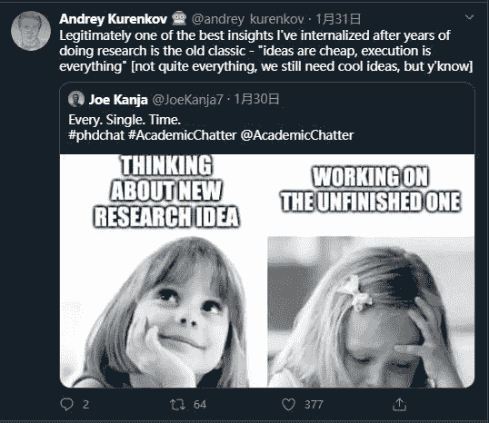
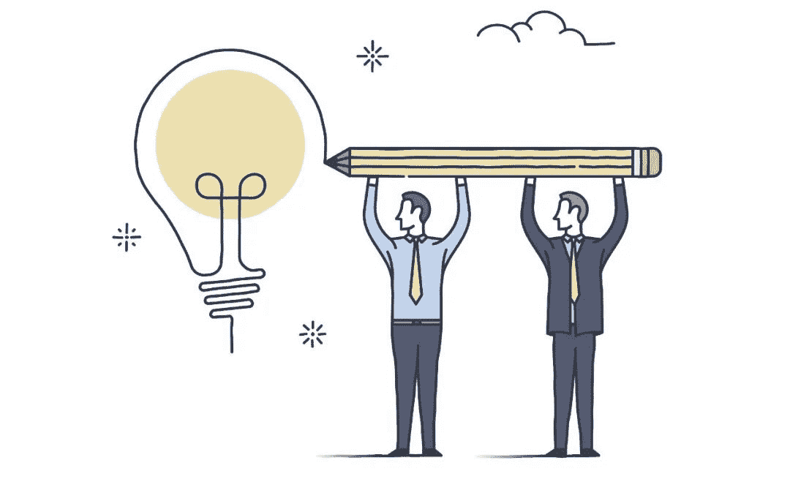
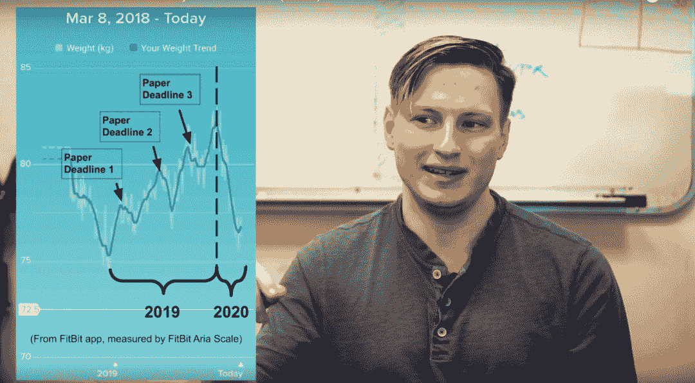

机器之心报道

**机器之心编辑部**

> 论文被拒，项目被砍，甚至连好多 deadline 都没有赶上……我的博士生涯哪有这么悲惨？

这些「失败」，全都是来自斯坦福大学视觉与学习实验室的在读博士 Andrey Kurenkov 亲身经历过的事。最近，这位来自顶级学府，人工智能著名学者李飞飞领导实验室门下的博士生推出了一系列视频，希望向人们讲述读博会遇到的种种挫折。

当然，还有如何才能避开这些坑。

挣扎、失败，有时甚至感到前路没有尽头——这些都是博士生涯的固有部分。这还伴随着冒充者综合征（觉得自己逊色于他人，不配位列其中）。Andrey Kurenkov 发现以到目前为止的经验来看，冒充者综合征的发生是普遍的，但仅仅是知道它的存在还远不足以克服。同样的，直面失败是能够成功的必要因素。

因此，在博士研究生几年来经历了无数失败后，Andrey Kurenkov 决定把自己的经验记录下来帮助他人避免一些坑。但为了避免让人有高不可攀的感觉，这些视频只记录了 Andrey 失败的所有案例：

在下文中，Andrey Kurenkov 详述了在博士生涯中会遇到的非常重要，但很可能难以发现的教训：

**尽可能快速、简单地测试你的 idea**

研究工作通常是一个 debug 的过程，有些时候会卡住，然后需要找到卡住的原因，是代码有缺陷？还是 idea 本身存在问题？在获得一个非常好的 idea 之后，却经常在实现过程中遗憾地发现，这一 idea 始终无法运行，也就不得不作废了。

如何避免出现这一窘境？或许可以构建一个可以令你的想法实现的虚拟场景，这样确保代码不会出现问题。换句话说，你需要对自己的研究展开系统性的检查（sanity check testing）。举例而言，如果你正在进行目标识别研究，则首先需要创建一个合成数据集，其中数据集中的简单几何图形必须确保正常运行。

我的首个失败项目就充分说明了对自身 idea 展开系统性测试的重要性，希望大家吸取我的这一教训。

**坚持一段时间之后还是无法取得进展，那就重新开始吧**

坚持不懈在研究中是一种很好的品质，但如果手头工作始终无法取得进展，则不得不重新思考所采用的方法。这就引出一个重要问题，当想法无法实现的时候，我们应该如何选择呢，坚持还是重新开始？我的观点是，坚持一段时间，彻底弄清楚为什么无法取得进展以及是否能够实现。如果不能，那就重新开始吧！

这是我从第二个废弃项目中得到的教训，在这个项目中，我以团队成员参与了一项研究工作，也付出了很大的努力，但最终还是失败了。回溯失败原因，我认为是自己太执拗于一种方法，而没有及时变通。但要记住，重新开始并不意味着你之前的努力完全白费了。你有理由相信自己的想法是正确的，但需要重新寻找一个有可能取得进展的研究方法。

所以，要从失败中吸取教训，重新把握之后的研究方向。

**只专注于一两件真正重要的「大事」上**

之前作为一名研究生的时候，我便倾向于同时进行多个任务，或者是承担多个项目。当然，多一些探索类辅助类的项目并不是什么坏事，而且从事人工智能方向的研究员就应该多一些科学层面的沟通交流。

但是，这很容易就做过头了，特别是现在处于 PHD 初期阶段时会发现，有非常多很有趣很诱人的想法在分散注意力，导致我无法专注于一两个真正重要的项目上。同时，在不停地沟通新想法时，导致只是处于沟通层面而非真正执行。

如上图，一个相关的概念便是「创意非常便宜，而执行才是一切」。换句话说，这些奇思妙想没有经过执行的磨练以及实现，那便没什么价值。当然，这不代表拒绝创新的想法，所以最正确的做法是，如果你有个不错的想法，但当下并没有足够时间去实现，那么尽可能将它保留，等你有足够的「精力」去执行的时候再转移注意力。

我也建议，如果你本身就属于多任务并行的人，那明智的决定是拥有耐心，让这些不错的想法一直围绕着你，同时再找个机会一一去实现它们。

**找到一个好的团队，并成为一名合格的团队成员**

虽然我没怎么提研究生阶段的成就，但其实我也还算有一点成果。这些成果应该归功于我有一位好导师以及共事的博士生们。成功不是我一个人的，而是属于团队的。

但一个团队的动力并非自然而然就能产生的。科研有时候是一项孤独的工作，你会希望得到更多的积极反馈。尤其是对于人工智能这种需要大量实现工作的应用型学科而言，我真的不认为这种「孤独」的工作方式是好的。

很多人会依靠直觉，自己埋头科研，以至于忘记周围的人。你可以主动尝试去寻找一些可以共事的伙伴，个人而言，如果和一个博士后或者一两个研究生同学一起工作，至少你能多个能够指点迷津的人或是队友。

但即使你有了共事的人，也并不意味着科研工作就会变得更容易。如何呈现一种高效的团队合作模式仍然是个难题，我在之前的博客里也写过一些团队合作方面的经验（http://www.andreykurenkov.com/writing/project/effective-teamwork/）。

而且你也得多多注意团队动向，比如我曾经有一些投入了大量精力的项目，最后都被取消了。分析其中原因，可能是因为我光顾着自己的投入，却忽略了与团队成员在方向上达成共识。有时候，通过和别人聊天，你还能获得更前沿、更新颖的 idea。

所以，总结一句话，别做孤独的前行者，要做高效的沟通者。

**注意身体健康，同时保持个人爱好**

别管你多么有耐力和决心，科研都不是容易的事。在读书时，让自己放弃工作和生活的平衡，在研究的路上一条道走到黑也许会出不错的成果，但也应注意自己在体力和情绪上能否支撑得住。

我生成过一张体重与论文 deadline 之间关系的趋势图，每当接近截止日期时，我的体重就会急速上升，达到一个顶峰，而后我通过运动和调节饮食的方式使体重恢复正常水平，但当下一个 deadline 来临时，这个现象又会重演。

当然，目前还没有出现什么严重的问题，但我意识到自己从体重和体脂率上来看都不算健康。经历了去年的这一波压力后，今年我准备将运动作为重中之重。

除了身体因素，我还想补充说一下心理健康。很多时候，研究期间的倦怠、焦虑和沮丧会是主要面对的问题。所以，学会放松是一种必备的能力。这种能力常常被人忽视，但其实它一定程度上能决定一个人的命运。

就我自己而言，当我患上抑郁症时，我靠着自己的爱好来拯救情绪，比如看动漫、跆拳道、做菜、打游戏（文明 5 真的很不错）。近些日子来，我迷上了冥想打坐，也是一种很好的放松方式。

最后，希望正在科研之路上砥砺前行的你，能够看到这些真诚的建议。有三句话也想送给大家：

> 成功就是从失败走向失败，却永不丧失热情。——温斯顿·丘吉尔
> 
> 失败只是一个重新开始的机会，但这次你会更加明智。——亨利·福特
> 
> 如果我们知道自己在做什么，这就不能称为科学研究了，不是吗？——阿尔伯特·爱因斯坦

*关于数据人才成长 后台回复* ***数据科学白皮书*** *获取*

