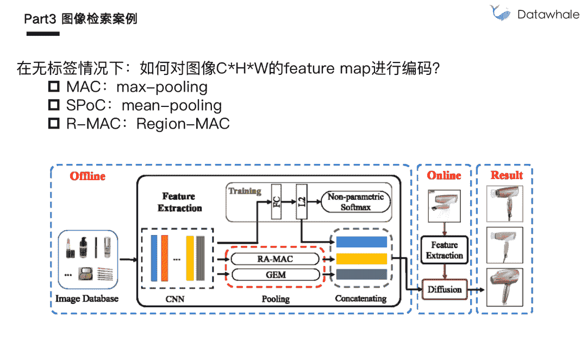

Datawhale分享

**作者：阿水，Datawhale成员**

简介：阿水，Datawhale成员，北京航空航天大学硕士，多次获得国内外数据竞赛TOP名次

图像检索是计算机视觉中基础的应用，可分为文字搜图和以图搜图。借助于卷积神经网络CNN强大的建模能力，图像检索的精度越发提高。

本次分享，将会从基础分享图像检索的原理和流程，并具体讲解图像局部特征和全局特征的差异性，最后以图像检索比赛为案例，进行独家的分享。

***注：*****今晚7点**在阿里天池直播分享，录播上传后原链接可回看

https://tianchi.aliyun.com/course/live?spm=5176.12282027.0.0.8bc1379cPYBoA6&liveId=41152

如需直播PPT，后台回复关键词 **阿水** 获取

## 主题大纲

1\. 图像检索入门

*   介绍图像检索的定义、图像检索的典型应用和流程

2\. 图像检索特征

*   介绍图像全局特征和图像局部特征，进而图像检索过程

3\. 图像检索案例

*   以图像检索的应用和竞赛为案例，讲解解决方案

## 图像检索入门

*   文字检索与内容检索

*   CBIR 应用场景

*   成熟的图像检索应用涉及到相关算法，也是一个工程问题

*   图像检索的本质是特征提取和相似度计算的过程

## 图像检索特征

*   即使相差万里的图像也有可能是相似的

*   如果图像相似，则图像特征也相似

*   局部特征与全局特征

*   简易代码示例

*   相似度计算

*   词袋模型

## 图像检索案例

## 总结

***视频链接（或**阅读原文**）***

https://tianchi.aliyun.com/course/live?spm=5176.12282027.0.0.8bc1379cPYBoA6&liveId=41152

*本文图像检索直播PPT 后台回复 **阿水** 获取*

