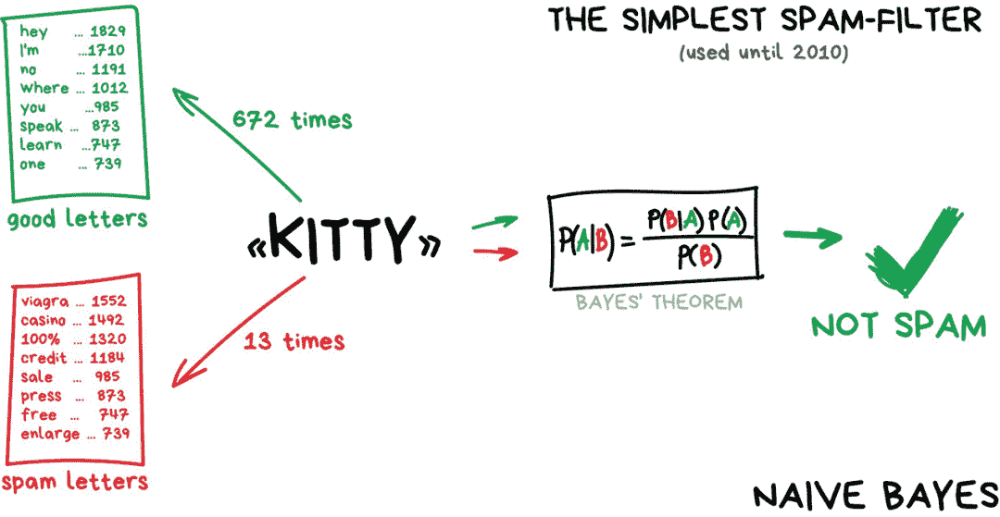

机器之心报道

**机器之心编辑部**

> 算法公式挺费神，机器学习太伤人。任何一个刚入门机器学习的人都会被复杂的公式和晦涩难懂的术语吓到。但其实，如果有通俗易懂的图解，理解机器学习的原理就会非常容易。本文整理了一篇博客文章的内容，读者可根据这些图理解看似高深的机器学习算法。

机器学习这个主题已经很普遍了，每个人都在谈论它，但很少有人能够透彻地了解它。当前网络上的一些机器学习文章晦涩难懂，理论性太强，或者通篇云里雾里地介绍人工智能、数据科学的魔力以及未来的工作等。

所以呢，本文作者 vas3k 通过简洁的语言和清晰明了的图示内容，使得读者能够更容易地理解机器学习。抛却了晦涩难懂的理论介绍，文中侧重于机器学习中的实际问题、行之有效的解决方案和通俗易懂的理论。无论你是程序员还是管理者，本文都适合你。

**AI 的范畴**

AI 到底它包含了哪些领域，它与各种技术名词之间的关系又是什么样的？其实我们会有多种判断方式，AI 范畴的划分也不会是唯一的，例如最「常见」的认识可能如下图所示。

你可能会认为：

*   人工智能是个完整的知识领域，类似于生物学或者是化学；

*   机器学习是人工智能中非常重要的一部分，但并不是唯一一个部分；

*   神经网络是机器学习的一种，现在非常受欢迎，但依然有其他优秀的算法；

但是，难道深度学习都是神经网络吗？明显并不一定是，例如周志华老师的深度森林，它就是第一个基于不可微构件的深度学习模型。因此，更科学的划分可能是下图花书中的这种：

机器学习下面应该是表示学习，即概括了所有使用机器学习挖掘表示本身的方法。相比传统 ML 需要手动设计数据特征，这类方法能自己学习好用的数据特征。整个深度学习也是一种表示学习，通过一层层模型从简单表示构建复杂表示。

**机器学习路线图**

如果你比较懒，那这有一张完整的技术路线图供你参考。

按照现阶段主流分类来看，机器学习主要分为四类：

*   经典机器学习；

*   强化学习；

*   神经网络和深度学习；

*   集成方法；

**经典机器学习**

经典机器学习经常被划分为两类：监督型学习和非监督型学习。

**监督学习**

在分类中，模型总是需要一个导师，即对应特征的标注，这样的话机器就可以基于这些标注学习进行进一步分类。万事皆可分类，基于兴趣去分类用户、基于语言和主题分类文章、基于类型而分类音乐以及基于关键词分类电子邮件。

而在垃圾邮件过滤中，朴素贝叶斯算法得到了极其广泛的应用。事实上，朴素贝叶斯曾被认为是最优雅、最实用的算法。

支持向量机 (SVM) 是最流行的经典分类方法。也是被用来对现有的一切事物进行分类: 照片中的植物外观，文件等等等。支持向量机背后的思路也很简单，以下图为例，它试图在数据点之间画出两条边距最大的线。

**监督学习——回归**

回归基本上是分类，但预测的标的是一个数字而不是类别。例如按里程计算的汽车价格，按时间计算的交通量，按公司增长计算出市场需求量等。当所预测的事物是依赖于时间时，回归是非常合适的选择。

**无监督学习**

无监督学习是 90 年代才被发明出来的，可以这么去描述它「根据未知特征对目标进行分割，而由机器去选择最佳方式。」

**无监督学习——聚类**

聚类是一种没有预先定义类的分类。比如当你不记得你所有的颜色时，把袜子按颜色分类一样。聚类算法试图通过某些特征从而找到相似的对象并将它们合并到一个聚类中。

**无监督学习——降维**

> 「将特定的特征组合成更高级的特性」

人们在使用抽象的东西总是比使用零碎的特征更具有方便性。举个例子，将所有长着三角形的耳朵、长鼻子和大尾巴的狗合并成一个很好的抽象概念——「牧羊犬」。

再比如有关科技的文章中拥有更多科技术语，而政治新闻里最多的是政客的名字。假如我们要将这些具有特性的单词以及文章组成一个新的特征，以保持其潜在关联度，SVD 便是个不错的选择。

**无监督学习——关联规则学习**

> 「在订单流中分析出特征模式」

包括分析购物车，自动化营销策略等。举个例子，顾客拿着六瓶啤酒走向收银台，在其路上是否该放些花生？如果放了，这些顾客多久会来买一次？如果啤酒花生是绝配，那还有其他什么事物也可进行这样的搭配呢？

现实生活中，每个大型零售商都有它们自己的专用解决方案，而当中技术水平最高的要数那些「推荐系统」。

**集成方法**

「团结就是力量」，这句老话很好地表达了机器学习领域中「集成方法」的基本思想。在集成方法中，我们通常会训练多个「弱模型」，以期待能组合成为一个强大的方法。像各种经典 ML 竞赛中，差不多效果最好的那一拨，如梯度提升树、随机森林等都属于集成方法。

一般而言集成方法的「组合方式」主要可以分为三种：Stacking、Bagging、Boosting。

如下图所示，Stacking 通常考虑的是异质弱学习器，弱学习器可以先并行地训练，而后通过一个「元模型」将它们组合起来，根据不同弱模型的预测结果输出一个最终的预测结果。

Bagging 方法通常考虑的是同质弱学习器，相互独立地并行学习这些弱学习器，并按照某种确定性的平均过程将它们组合起来。假设所有弱学习器都是决策树模型，那么这样做出来的 Bagging 就是随机森林。

Boosting 方法通常考虑的也是同质弱学习器，只不过它的思想是「分而治之」。它以一种高度自适应的方法顺序地学习这些弱学习器，且后续弱模型重点学习上一个弱模型误分类的数据。

这就相当于不同的弱分类器，专注于部分数据，达到「分而治之」的效果。如下所示，Boosting 就是以串行组合不同模型的范式。大名鼎鼎的 XGBoost、LightGBM 这些库或算法，都采用的 Boosting 方法。

现在，从朴素贝叶斯到 Boosting 方法，经典机器学习的主要分支已经具备了。如果读者希望有一个更系统与详细地了解，李航老师的《统计学习方法》与周志华老师的《机器学习》是最好的两本中文教程。

当然，在这篇博客中，作者还介绍了强化学习与深度学习等等，内容非常适合对人工智能感兴趣且非相关专业的读者，加上形象的配图，算得上是篇非常不错的科普文。如果你对这种简单易懂的叙述方式感兴趣的话，可以去博客上详细阅读。

*参考链接：https://vas3k.com/blog/machine_learning/*

*关于数据人才成长 后台回复* ***数据科学白皮书*** *获取*

觉得好看，请点这里↓↓↓