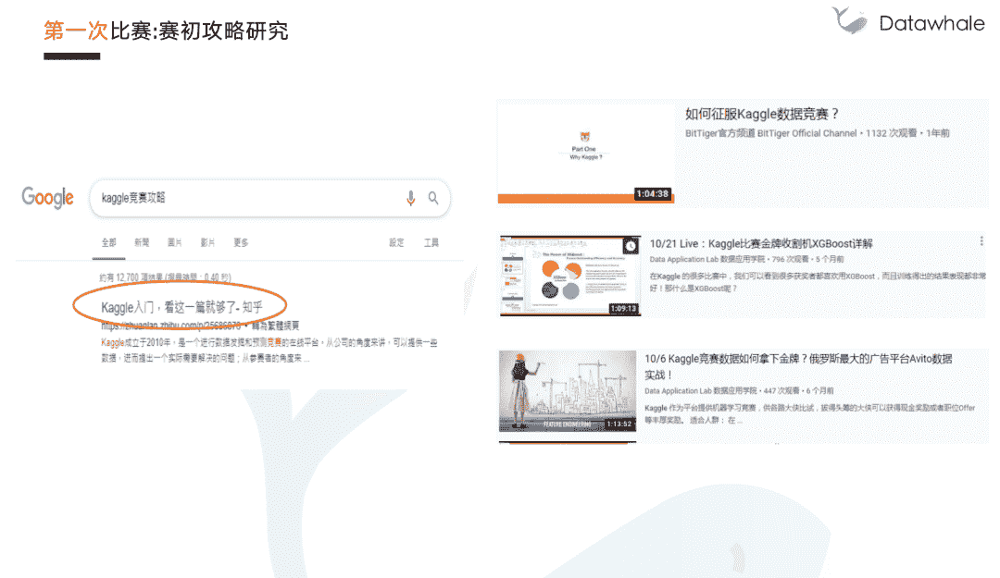
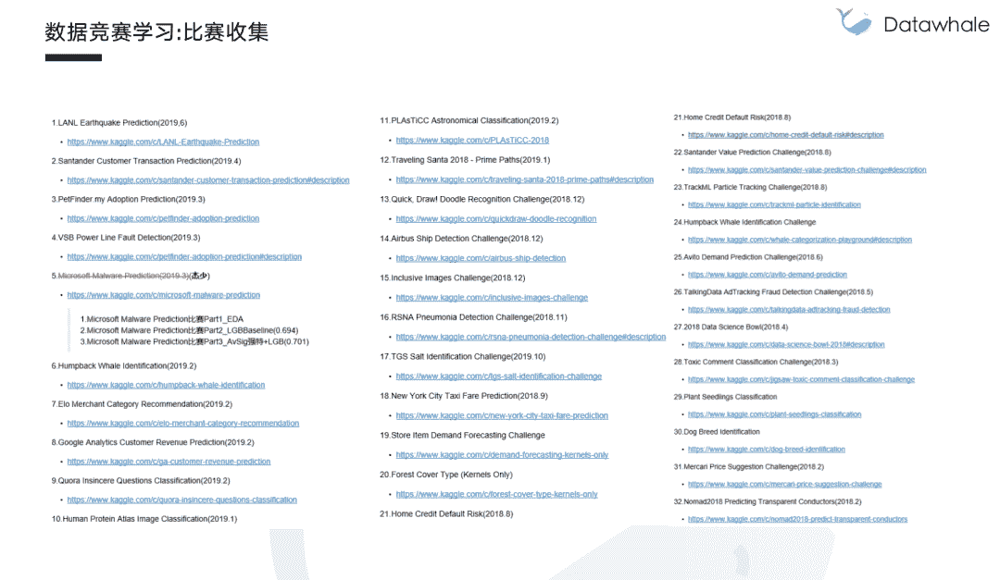

 Datawhale 

**作者：杰少，南京大学硕士**

简介：杰少，南京大学硕士，天池数据科学家，就职于阿里。KDD19, NIPS18, JDD19第二名，天池竞赛5次Top3，其他数据竞赛平台奖项20余项。

数据竞赛近几年在国内发展迅速，参加数据竞赛对于参赛者来说可以锻炼数据分析，算法建模的能力，运气好的话还可以获得不菲的奖金；对于公司来说，也可以从众多优秀的方案中选取有价值的部分用于自己的生产，是一件互利共赢的事情。

但数据竞赛领域是一个相对较新的领域，没有太多系统的学习资料，很多刚接触的朋友都会感到迷茫无从下手。本次分享，将会回顾我近三年的参赛经验，从第一次接触比赛到第一次参加比赛，再到后面如何进行比赛的学习，希望给更多新参加比赛的朋友带来一些参考。

**注*****：*****本文详细视频**已上传至阿里天池社区：

https://tianchi.aliyun.com/course/video?spm=5176.12282027.0.0.6590379cOEZzr8&liveId=41154

## 主题大纲

1.  第一次碰到比赛

2.  第一次参赛

3.  数据竞赛学习

4.  一些建议

## 第一次碰到比赛

*   课后作业：用所学做一个比赛

## 第一次参赛

*   茫然无措

*   攻略研究

*   EDA + 特征工程 + XGBoost + 集成

*   编程学习

## 数据竞赛学习

*   EDA + 特征工程 + 模型 + 集

*   比赛收集

## 一些建议

***视频链接（或**阅读原文**）***

https://tianchi.aliyun.com/course/video?spm=5176.12282027.0.0.6590379cOEZzr8&liveId=41154

