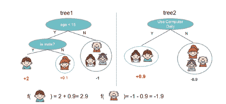
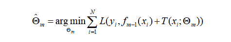
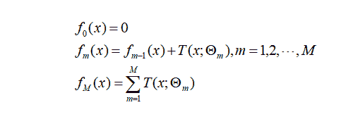
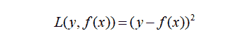
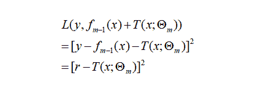
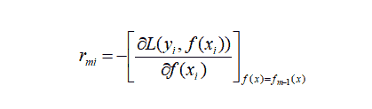
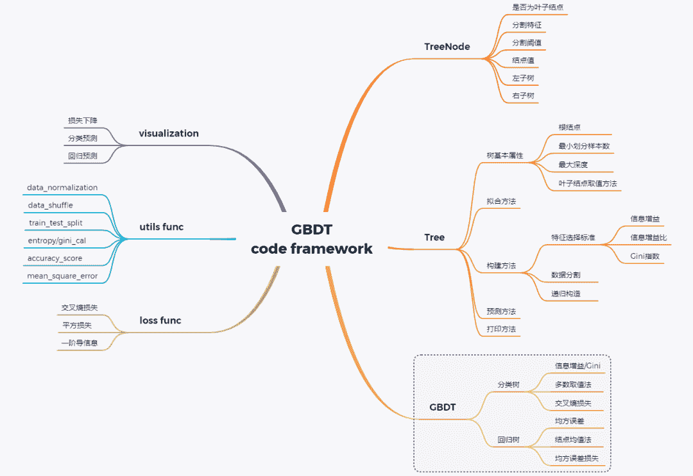
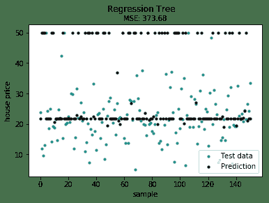

Datawhale推荐

**作者：louwill，Machine Learning Lab**

时隔大半年，机器学习算法推导系列终于有时间继续更新了。在之前的14讲中，笔者将监督模型中主要的单模型算法基本都过了一遍。预计在接下来的10讲中，笔者将努力更新完以GBDT代表的集成学习模型，以EM算法、CRF和隐马为代表的概率图模型以及以聚类降维为代表的无监督学习算法。

在系列第4和第5讲，笔者集中对ID3和CART决策树算法进行了阐述，并给出二者算法的一些初步实现。本节我们来看集成学习的核心模型GBDT(Gradient Boosting Decision Tree)，即梯度提升决策树，这也是一种决策树模型算法。GBDT近年来在一些数据竞赛上大杀四方，并不断衍生出像XGBoost和LightGBM等更强大的版本。从名字上看，GBDT是由决策树、提升模型和梯度下降一起构成的。所以，要搞清楚GBDT的基本原理，就必须对这三者及其相互作用有一个深入的理解。



**GBDT基本原理**

决策树的基本原理我们已经很清楚了，就是依据信息增益等原则不断选择特征构建树模型的过程，具体可参考[数学推导+纯Python实现机器学习算法5：决策树之CART算法](http://mp.weixin.qq.com/s?__biz=MzI4ODY2NjYzMQ%3D%3D&chksm=ec3ba39cdb4c2a8a09d3ccd7a50c48766405746acf420c870711e252458889e4fcaa126c3f69&idx=1&mid=2247485172&scene=21&sn=bbef18c5c34012d64caeb4de3e5a843d#wechat_redirect)。Boosting则是一种集成学习模式，通过将多个单个决策树(弱学习器)进行线性组合构成一个强学习器的过程，Boosting以一个单模型作为作为弱分类器，GBDT中使用CART作为这种弱学习器(基模型)。而融入了梯度下降对Boosting树模型进行优化之后就有了梯度提升树模型。

我们先来用一个通俗的说法来理解GBDT。假设某位同学月薪10k，笔者先用一个树模型拟合了6k，发现有4k的损失，然后再用一棵树模型拟合了2k，这样持续拟合下去，拟合值和目标值之间的残差会越来越小，而我们将每一轮迭代，也就是每一棵树的预测值加起来就是模型最终的预测结果。不停的使用单棵决策树组合就是Boosting的过程，使用梯度下降对Boosting树模型进行优化的过程就是Gradient Boosting。

下面我们用数学语言来描述GBDT。

一个提升树模型可以描述为：


在给定初始模型的情况下，第m步的模型可以表示为：


然后我们通过如下目标函数来优化下一棵树的参数：



以回归问题的提升树为例展开，一棵回归树可表示为：


第0步、第m步和最终模型可表示为：



给定第m-1步的模型下，求解：


当损失函数为平方损失时：



相应的损失可推导为：



则有：


说明提升树模型每一次迭代是在拟合一个残差函数。

但实际工作中并不是每一个损失函数都如平方损失那样容易优化，所以有学者就提出近似梯度下降的方法来使用损失函数的负梯度在当前模型的值作为回归提升树中残差的近似值，即：



所以，综合提升树和梯度提升，GBDT模型算法的一般流程可归纳为：

(1) 初始化弱学习器:

(2) 对有：

*   对每个样本，计算负梯度，即残差


*   将上步得到的残差作为样本新的真实值，并将数据作为下棵树的训练数据，得到一颗新的回归树其对应的叶子节点区域为。其中为回归树t的叶子节点的个数。

*   对叶子区域计算最佳拟合值


*   更新强学习器


(3) 得到最终学习器


**GBDT代码框架**

手动从头开始写一个GBDT模型并非易事，需要我们对GBDT模型算法细节都有足够深入的理解。在动手写代码之前，我们需要梳理清楚代码框架，一个完整的GBDT系统应包括如下几个方面，如图所示。



GBDT的基模型为CART，所以定义决策树结点和构建CART树至关重要，CART算法笔者系列第5讲已经进行了初步实现。当基模型构建好后，即可根据GBDT算法流程搭建GBDT和GBRT。除此之外，一些辅助函数的定义(最大熵/Gini指数计算)，损失函数定义和模型可视化方法等辅助功能也应该一应俱全。

因树结点和CART树模型第5讲已讲过，具体实现方法这里不再重写。

结点定义代码框架：

```
class TreeNode():
    def __init__(self, feature_i=None, threshold=None,
                 value=None, true_branch=None, false_branch=None):
         pass 
```

树定义代码框架，主要包括树的基本属性和方法。基本属性包括根结点、最小划分样本数、最大深度和是否为叶子结点等等。基本方法包括决策树构建、决策树拟合、决策树预测和打印等方法。

```
class Tree(object):
    def __init__(self, min_samples_split=2, min_impurity=1e-7,
                 max_depth=float("inf"), loss=None):
        self.root = None  # Root node in dec. tree
        # Minimum n of samples to justify split
        self.min_samples_split = min_samples_split
        # The minimum impurity to justify split
        self.min_impurity = min_impurity
        # The maximum depth to grow the tree to
        self.max_depth = max_depth
        # Function to calculate impurity (classif.=>info gain, regr=>variance reduct.)
        # 切割树的方法，gini，方差等
        self._impurity_calculation = None
        # Function to determine prediction of y at leaf
        # 树节点取值的方法，分类树：选取出现最多次数的值，回归树：取所有值的平均值
        self._leaf_value_calculation = None
        # If y is one-hot encoded (multi-dim) or not (one-dim)
        self.one_dim = None
        # If Gradient Boost
        self.loss = loss

    def fit(self, X, y, loss=None):
        """ Build decision tree """
        pass

    def _build_tree(self, X, y, current_depth=0):
        """ Recursive method which builds out the decision tree and splits X and respective y
        pass

    def predict_value(self, x, tree=None):
        """ Do a recursive search down the tree and make a prediction of the data sample by the
            value of the leaf that we end up at """
        pass

    def predict(self, X):
        """ Classify samples one by one and return the set of labels """
        pass

    def print_tree(self, tree=None, indent=" "):
        pass 
```

以回归树为例，基于以上树模型，可定义回归树模型如下：

```
class RegressionTree(Tree):
    # 使用方差法进行树分割
    def _calculate_variance_reduction(self, y, y1, y2):
        var_tot = calculate_variance(y)
        var_1 = calculate_variance(y1)
        var_2 = calculate_variance(y2)
        frac_1 = len(y1) / len(y)
        frac_2 = len(y2) / len(y)
        # Calculate the variance reduction
        variance_reduction = var_tot - (frac_1 * var_1 + frac_2 * var_2)
        return sum(variance_reduction)

    # 使用均值法取叶子结点值
    def _mean_of_y(self, y):
        value = np.mean(y, axis=0)
        return value if len(value) > 1 else value[0]

    # 回归树拟合
    def fit(self, X, y):
        self._impurity_calculation = self._calculate_variance_reduction
        self._leaf_value_calculation = self._mean_of_y
        super(RegressionTree, self).fit(X, y) 
```

在定义GBRT之前，先定义损失均方误差损失函数：

```
class Loss(object):
    def loss(self, y_true, y_pred):
        return NotImplementedError()
    def gradient(self, y, y_pred):
        raise NotImplementedError()
    def acc(self, y, y_pred):
        return 0

class SquareLoss(Loss):
    def __init__(self): pass
    def loss(self, y, y_pred):
        return 0.5 * np.power((y - y_pred), 2)
    def gradient(self, y, y_pred):
        return -(y - y_pred) 
```

然后定义初始版本的GBDT模型：

```
class GBDT(object):
    def __init__(self, n_estimators, learning_rate, min_samples_split,
                 min_impurity, max_depth, regression):
        # 基本参数
        self.n_estimators = n_estimators
        self.learning_rate = learning_rate
        self.min_samples_split = min_samples_split
        self.min_impurity = min_impurity
        self.max_depth = max_depth
        self.regression = regression
        self.loss = SquareLoss()
        if not self.regression:
            self.loss = SotfMaxLoss()
        # 分类问题也可以使用回归树，利用残差去学习概率
        self.estimators = []
        for i in range(self.n_estimators):
            self.estimators.append(RegressionTree(min_samples_split=self.min_samples_split,
                                             min_impurity=self.min_impurity,
                                             max_depth=self.max_depth))
    # 拟合方法
    def fit(self, X, y):
        # 让第一棵树去拟合模型
        self.estimators[0].fit(X, y)
        y_pred = self.estimators[0].predict(X)
        for i in range(1, self.n_estimators):
            gradient = self.loss.gradient(y, y_pred)
            self.estimators[i].fit(X, gradient)
            y_pred -= np.multiply(self.learning_rate, self.estimators[i].predict(X))
    # 预测方法
    def predict(self, X):
        y_pred = self.estimators[0].predict(X)
        for i in range(1, self.n_estimators):
            y_pred -= np.multiply(self.learning_rate, self.estimators[i].predict(X))
        if not self.regression:
            # Turn into probability distribution
            y_pred = np.exp(y_pred) / np.expand_dims(np.sum(np.exp(y_pred), axis=1), axis=1)
            # Set label to the value that maximizes probability
            y_pred = np.argmax(y_pred, axis=1)
        return y_pred 
```

然后可分别定义GBDT和GBRT：

```
# regression tree
class GBDTRegressor(GBDT):
      def __init__(self, n_estimators=200, learning_rate=0.5, min_samples_split=2,
                 min_var_red=1e-7, max_depth=4, debug=False):
        super(GBDTRegressor, self).__init__(n_estimators=n_estimators,
                                            learning_rate=learning_rate,
                                            min_samples_split=min_samples_split,
                                            min_impurity=min_var_red,
                                            max_depth=max_depth,
                                            regression=True)
# classification tree
class GBDTClassifier(GBDT):
      def __init__(self, n_estimators=200, learning_rate=.5, min_samples_split=2,
                 min_info_gain=1e-7, max_depth=2, debug=False):
         super(GBDTClassifier, self).__init__(n_estimators=n_estimators,
                                             learning_rate=learning_rate,
                                             min_samples_split=min_samples_split,
                                             min_impurity=min_info_gain,
                                             max_depth=max_depth,
                                             regression=False)
      def fit(self, X, y):
        y = to_categorical(y)
        super(GBDTClassifier, self).fit(X, y) 
```

最后基于boston房价数据集给出一个计算例子：

```
from sklearn import datasets
boston = datasets.load_boston()
X, y = shuffle_data(boston.data, boston.target, seed=13)
X = X.astype(np.float32)
offset = int(X.shape[0] * 0.9)

X_train, X_test, y_train, y_test = train_test_split(X, y, test_size=0.3)
print(X_train.shape, y_train.shape, X_test.shape, y_test.shape)

model = GBDTRegressor()
model.fit(X_train, y_train)
y_pred = model.predict(X_test)
# Color map
cmap = plt.get_cmap('viridis')
mse = mean_squared_error(y_test, y_pred)
print ("Mean Squared Error:", mse)

# Plot the results
m1 = plt.scatter(range(X_test.shape[0]), y_test, color=cmap(0.5), s=10)
m2 = plt.scatter(range(X_test.shape[0]), y_pred, color='black', s=10)
plt.suptitle("Regression Tree")
plt.title("MSE: %.2f" % mse, fontsize=10)
plt.xlabel('sample')
plt.ylabel('house price')
plt.legend((m1, m2), ("Test data", "Prediction"), loc='lower right')
plt.show(); 
```



slearn中为我们提供了GBDT算法完整的API可供调用，实际工程中更不可能自己手写这么复杂的算法系统。但作为学习，手写算法不失为一种深入理解算法细节和锻炼代码能力的好方法。

完整代码可参考：

https://github.com/RRdmlearning/Machine-Learning-From-Scratch/blob/master/gradient_boosting_decision_tree

**参考资料：**

*https://github.com/RRdmlearning/Machine-Learning-From-**Scratch/blob/master/gradient_boosting_decision_tree*

*李航 统计学习方法*


这次一定点亮**在看 **好不好