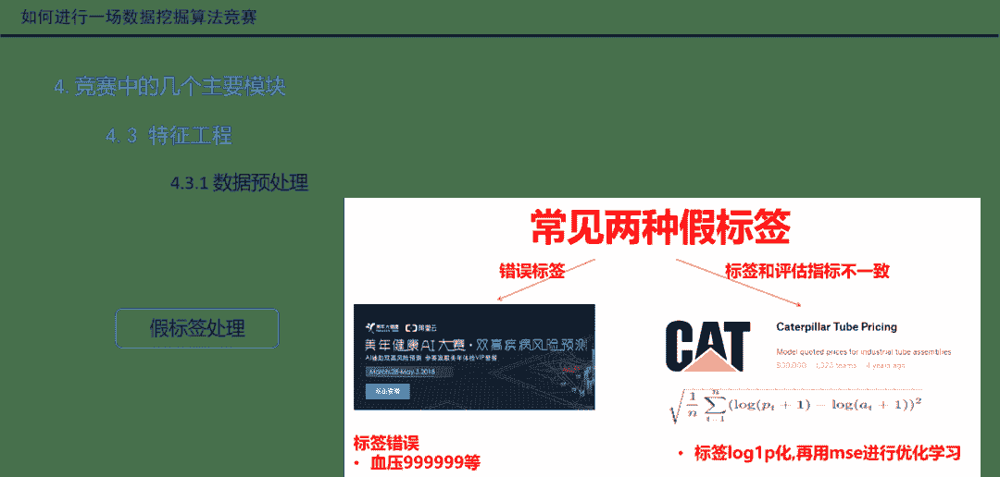
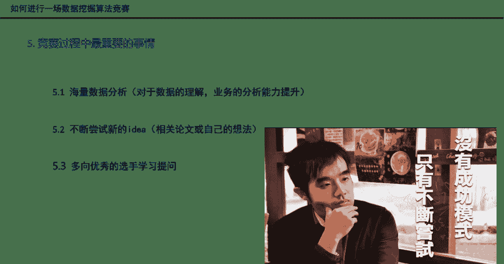

 Datawhale 

**作者：鱼佬，Datawhale成员**

简介：鱼遇雨欲语与余，Datawhale成员，武汉大学硕士，天池数据科学家。2019腾讯广告算法大赛冠军，数据竞赛爱好者。

当我们掌握了一定的机器学习和数据挖掘基础理论后，参加一场数据算法竞赛可以接触真实的业务和数据，将理论知识过渡到工程应用，同时可以在竞赛过程中进行反复地思考，强化对理论知识的理解。

本次分享，我将以个人竞赛经历和圈内整体情况为背景和大家聊聊如何进行一场数据挖掘算法竞赛，以及赛前、赛中和赛后需要做哪些事情。最后还将进行一个案例分享，来看看我是如何进行一场比赛的。

**注：**本文详细视频**** 晚7点在阿里天池分享，链接可回看

https://tianchi.aliyun.com/course/live?liveId=41153

## 主题大纲

1.  为什么要参加数据挖掘竞赛？能带来什么？

2.  参加竞赛需要哪些基础知识和技能？

3.  如何选择适合自己的竞赛？

4.  竞赛中的几个主要模块议

5.  竞赛过程中最重要的事情

6.  好的竞赛总结比竞赛过程更重要

7.  案例分享（ 天池“全国城市计算AI挑战赛”）

## 为什么要参加数据挖掘竞赛？

*   从理论知识到从理论知识到工程应用；真实数据，增加项目经验

*   求职加分，企业看重；企业办赛，人才选拔

*   奖金的激励（丰厚）

*   交友，学习，PK高手

## 参加竞赛需要的基础知识和技能？

*   理论知识掌握：评价指标、数据分析、特征工程、常用模型

*   工具的掌握    

*   *   语言的选择：Python

    *   可视化工具：Matplotlib、Seaborn

    *   数据处理工具：Pandas、NumPy

    *   机器学习库：Sklearn、XGBoost、LightGBM、TensorFlow

## 如何选择适合自己的竞赛？

*   了解常见竞赛平台。其中包括：kaggle、天池、DataFountain、Kesci、DC竞赛

*   了解竞赛分类。明白从领域归属、任务目标等方向划分分别有哪些类型

*   硬件性能：自己机器的内存、显卡等性能，或者借助云服务器。根据比赛类型，比赛数据大小来确定。

*   结合自己的研究方向

## 竞赛中的几个主要模块

竞赛中主要包含：赛题理解、问题建模、数据分析、数据清洗、特征工程、模型训练、模型验证、模型预测、模型融合等几个模块。

**Step 1**：问题建模

*   赛题理解，关注业务场景理解、赛题数据与评价指标

*   线下验证，其中包括：时序验证和K折交叉验证

**Step 2**：数据探索性分析

*   why EDA？因为需要参赛者深入了解数据、为接下来建模做准备

*   what must see? 需要重点观察数据集大小、缺失值异常值等众多信息

**Step 3**：特征工程

*   数据预处理，对离群点数据、缺失值、错误值、假标签进行处理

*   特征提取，包括类别特征、数值特征、时间特征等

*   特征选择，掌握过滤法、封装法、嵌入法三种特征选择方法

**Step 4**：必备模型，对XGBoost、LightGBM模型有深入的了解

**Step 5**：模型融合

## 竞赛过程中最重要的事情

在比赛过程中，需要进行海量数据分析、不断尝试新的idea，并且多向优秀的选手学习

好的竞赛总结比竞赛过程更重要

赛后及时作总结并学习优秀方案，是帮助提升竞赛能力的最佳方式

案例分享

以天池竞赛社区-全球城市计算AI挑战赛为例，分析如何走完一个数据挖掘竞赛的流程

***视频链接（或**阅读原文**）***

https://tianchi.aliyun.com/course/live?liveId=41153

“在看，给鱼佬**点赞**↓