断断续续写了一个多星期，期间找了很多同学讨论学习，感谢指导过点拨过我的同学们，为了精益求精本着不糊弄别人也不糊弄自己的原则在本文中探讨了很多细节。

当然，还有很多细节没提到，包括总变差（Total Variation）、空域和频域视角下的图信号等，有兴趣的同学可以深入了解下图信号处理，本人才疏学浅还希望抛砖引玉引出更多的 GCN 的文章。

非常感谢知乎 @superbrother 同学和蘑菇先生的精彩笔记才使得我能够入门 GCN，当然我也将公开我的笔记希望能帮助更多的同学。

# 1\. Convolutional Neural Network

CNN 在图像识别等任务中具有重要作用，主要是因为 CNN 利用了图片在其域中的平移不变性。由于图结构不存在平移不变性，所以 CNN 无法直接在图上进行卷积。

## 1.1 Translational Invariance

刚刚提到 CNN 之所以可以应用到图像而无法应用到图网络中主要是因为图像具有**「平移不变形（translational invariance）」**，而图网络不具备这一属性。那么问题来了，什么是平移不变形呢？

我们知道对于 CNN 来说，其核心在于使用了基于卷积核的卷积操作来提取图像的特征，这里的卷积操作类似于对**「计算区域内的中心节点和相邻节点进行加权求和」**：

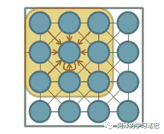

CNN 之所以能成为图像领域的明珠却很少应用于其他领域原因是：**「图片是一个规整的二维矩阵」**，无论卷积核平移到图片中的哪个位置都可以保证其运算结果的一致性，这就是我们所说的**「平移不变性」**。CNN 的卷积本质就是利用这种平移不变性来对扫描的区域进行卷积操作，从而实现了图像特征的提取。

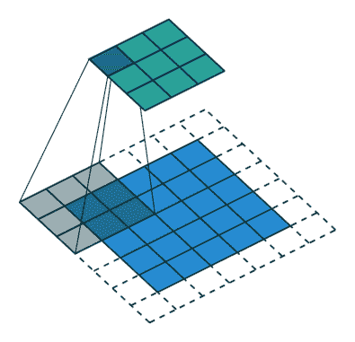

而网络是不规整的关系型数据，所以其不存在平移不变形（每个节点的周围邻居数不固定），这就使得传统的 CNN 方法无法直接应用于网络中。

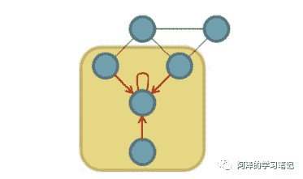

## 1.2 Convolution Kernels

既然是因为卷积核的原因，那么可不可以不使用卷积核？

答案肯定是不可以，因为卷积神经网络的一大核心就是利用卷积核实现**「参数共享（Parameter Sharing）」**。下图为有卷积核的卷积操作：

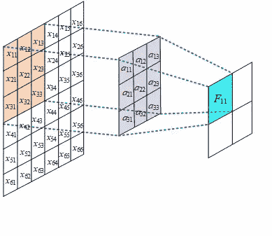

此时的参数大小只与卷积核大小有关，而如果不进行参数共享的话，参数的大小则与图像的像素矩阵保持一致：

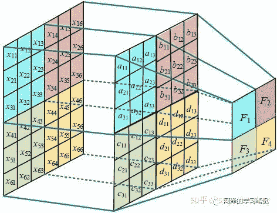

除此之外，卷积神经网络还有另一大核心：**「局部连接性（Locally Connection）」**。局部连接是指卷积计算每次只在与卷积核大小对应的区域进行，也就是说输入和输出是局部连接的。如果不进行局部连接的话，相当于将图片的矩阵展开成向量进行输入，类似于全连接神经网络，此时的参数量会变得非常巨大：

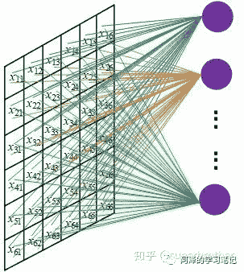

也就是说，通过参数共享和局部连接性我们可以将参数从 降低到 。其中，W H 和 K 分别为图像的宽、高和通道，N 为隐藏层节点个数，m 为卷积核宽，k 为卷积核个数。

PS：CNN 有三大特点，除了上面说的局部连接和参数共享之外，还有**「层次化表达（Hierarchical Expression）」**。CNN 的层次化表达可以通过卷积层叠加得到，每一个卷积层都是在前一层的基础上进行的，这样的意义在于，网络越往后，其提取到的特征越高级。比如说：第一层可能是一些线条，第二层可能会是一些纹理，第三层可能是一些抽象图案：

可能会有同学问：那我们还有其他办法在图上进行卷积吗？答案是一定有的 = =。

目前的一大思路就是借助谱图理论（Spectral Graph Theory）来实现在拓扑图上的卷积操作，大致步骤为将空域中的拓扑图结构通过傅立叶变换映射到频域中并进行卷积，然后利用逆变换返回空域，从而完成了图卷积操作。

看到这里，估计大家会有一堆疑问，包括：什么是谱图理论？什么是傅立叶变换？什么是频域空域？逆变换是什么？

想要清楚的回答这个问题，要从图信号处理说起。

# 2\. Graph Signal Processing

图信号处理（Graph Signal Processing，以下简称 GSP）用来处理那些定义在图上的非规则域的信号，这句话有点拗口，拆开说就是处理图上定义的信号，但信号所在域是规则的。

## 2.1 Simple Example

这里我们举一个图信号处理的简单例子：

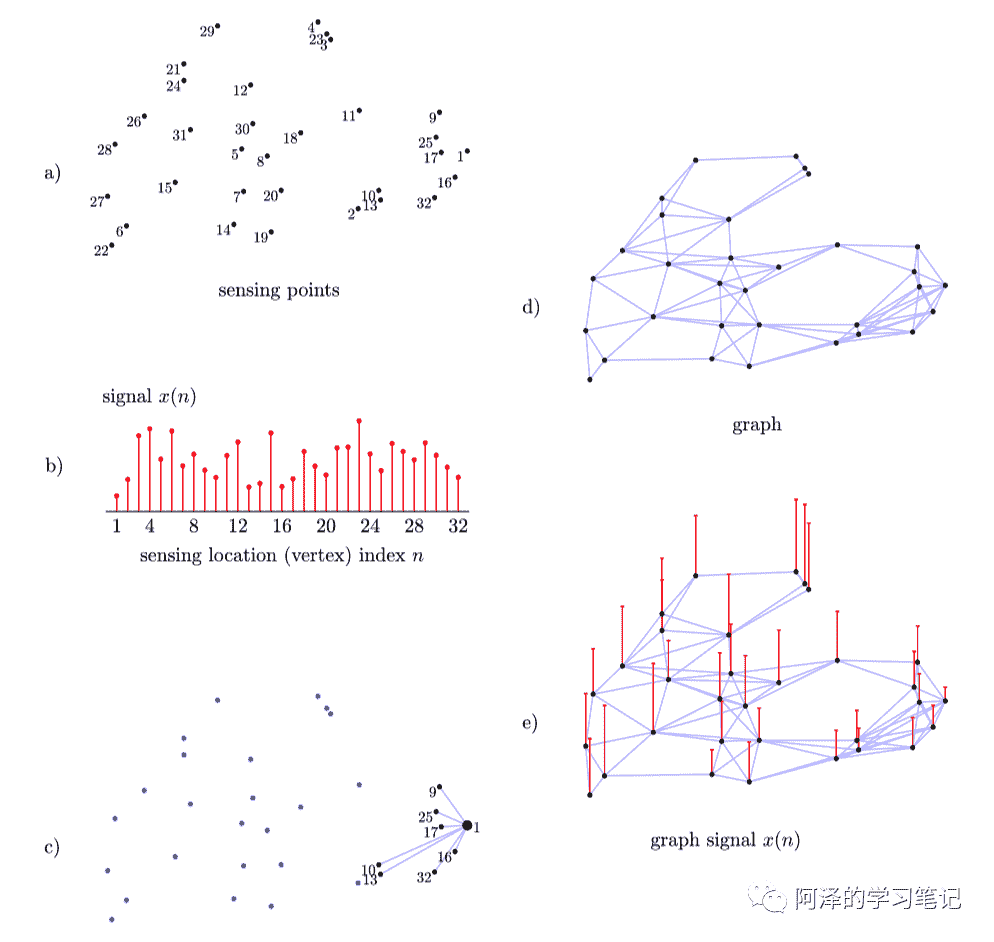

假设我们在一个地方测量温度，并根据人口密度安排了温度感应点（如上图 a 所示），地区 n 的测量温度可以表示为 （如上图 b 所示），并且 ， 为真实温度， 为随机噪声带来的误差。

现在我们想通过对测量地及周围的温度求平均来减少这些随机噪声，当然为了防止失去局部温度（这个也叫 Over Smooth），我们会对每个点取其周围区域进行平均：

上图 c 展示了 y(1) 的计算方式。我们也可以用矩阵来表示：

其中，矩阵 A 为邻接矩阵（测量点的连接情况如上图 d 所示），测量位置及每个位置的测量温度如上图 e 所示。

我们还可以对其进行优化，根据距离来为不同测量点添加不同的权重：

当然，我们也需要对权重进行归一化，以便产生无偏估计：

其中，对角矩阵 D 用于归一化，其值为 ，这个矩阵还有另外一个名字，叫**「度矩阵（Degree Matrix）」**。

以上便是一个简单的是图信号处理过程，其框架大致为：

1.  测量点构成节点（图 a），节点间的连通性和相关性构成边；

2.  节点和边构成图（图 b），该图是信号域，表示测量信号的点以及它们之间的关系，并使用该图进行分析和处理；

3.  测量温度是图的信号（图 e），这里的信号由真实温度和测量噪声所组成；

4.  考虑测量位置，我们提出了局部平均和加权平均，这是最简单的图信号处理方式（Linear fist-order）。

同样的，我们也可以将其应用在多个领域，如民意调查、政治分析等。

## 2.2 Fourier Transformer

我相信如果我一上来就扔出傅立叶变换，很多人都会崩溃不想看，不信我们试试：

如果没有崩溃的话就直接看下一节吧；如果崩溃了就接着看，但是笔掉了千万别捡，否则可能就看不懂了。

### 2.2.1 Transformer

为了让大家无痛入门，我们先从最简单变换的说起。

我们知道笛卡尔坐标系中，每个点都会有一个坐标，如下图所示 A(-3,1) B(2,3)：

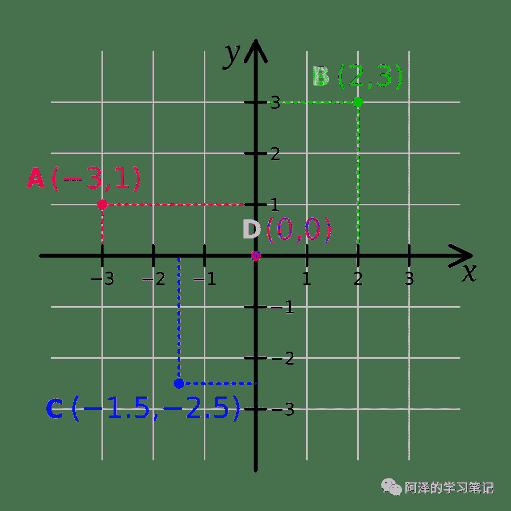

那么为什么可以这么表示呢？为什么 A 的坐标为 (-3,1) 而 B 的坐标为 (2,3) ？

这是因为在笛卡尔坐标系中，我们定义了一组标准正交基 ，基是向量有方向有大小。（正交是指不同基之间的内积为 0，即两个基线性无关，而标准基是指基的模为 1）

A 的坐标其实就表示在 x 轴坐标上有 3 个 的长度且方向与 相反，在 y 轴坐标上有 1 个 的长度，且方向相同。

这样做的好处是什么呢？主要是为了方便计算和表示，试想下，如果只给你一点点而没有坐标系，你怎么表示两个点之间的距离呢？而放在坐标系中，这些问题就迎刃而解。

有同学可能疑问，不是说变换吗？怎么扯到笛卡尔坐标系了？其实我们刚刚说的就是一种变换：**「将图上的节点变换到坐标系中」**。

### 2.2.2 Fourier Series

傅立叶变换分为傅立叶级数和连续傅立叶变换，我们先说傅立叶级数。

傅立叶级数适用于周期性函数，它能够将任何周期性函数分解成简单震荡函数的集合（正弦函数和余弦函数），举个例子，比如说下图：

左边是一个周期函数，右边是将周期函数分解成多个简单震荡函数，所以这个周期函数用数学公式可以表达为：

我们看到上图中的信号是随着时间变换的，所以我称之为**「时域（Time domain）」**。

我们观察到，不同的振荡函数具有不同的振幅和频率，以上图为例 的振幅为 1/3 而频率为 ，考虑以频率为横坐标，振幅为纵坐标，我们有：

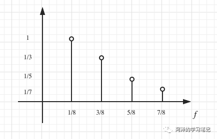

这个就是我们所说的频域（Frequency Domain），其和时域是等价的，不过是从另外一个角度去描述信号。我们把它放在一起看一下：

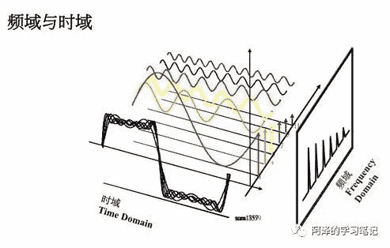

我们可以放一张动图感受一下：

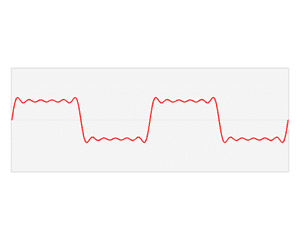

给出傅立叶级数的公式：

还可以将其稍作变换：

这样我们便能看出来，此时的标准正交基为 <embed style="width: 36.229ex" src="https://mmbiz.qlogo.cn/mmbiz_svg/YCOL3hU8ffVqYUPpT3TphiaXHqqNkmlEMdBG4FVKRAVlylvQ4KHE7bkv38WVfVILr8Syhju7nUXJxVI8QVjsF6yjv8cXbkaJQ/0?wx_fmt=svg">，而对应的系数  其实就是傅立叶级数在这组标准正交基下的向量。这便是傅立叶变换，将信号从时域变换到频域中。

这里介绍下傅立叶变换后的基为正交基，因为有个知识点后面还会用到。

我们知道判断两个向量是否正交可以用向量点乘求和等于 0 来判断，这种方法我们称为点积（内积）：

与向量点积不同的是，函数是连续的，假设现在有两个函数 f 和 g，f 的周期为 2n，我们也想用上述连续累加的方式来使得函数内积和向量内积的概念一致，而积分正是函数累加的概念，所以我们有：

对于上面我们说的傅立叶变换后的正交基，我们容易得到：

容易证明上述标准基为正交基。

在数学里，希尔伯特空间（Hilbert Space）是有限维欧几里得空间的一个推广，是一个完备的内积空间，其定义了一个带有内积的完备向量空间。在希尔伯空间中，一个抽象元素通常被称为向量，它可以是一个复数或者函数。傅立叶分析的一个重要目的是将一个给定的函数表示成一族给定的基底函数的和，而希尔伯特空间为傅立叶分析提供了一种有效的表述方式。

可能大家看到这里要爆炸了，不过不用担心，我们只需要记住上面**「两个函数的内积形式」**即可。

### 2.2.3 Fourier Transformer

我们刚刚说的都是周期性函数，但现实中大部分函数都是非周期的，那如果涉及到非周期性函数该怎么办呢？

在介绍非周期性函数之前，我们先简单介绍下欧拉公式。

考虑横轴为 1，纵轴为虚单位 i 的坐标系，图上任意一点都可以表示为 。

根据欧拉公式，我们可以写成：

其中，e 为自然对数的底数。

所以坐标轴上的点现在有了两种表示方式：

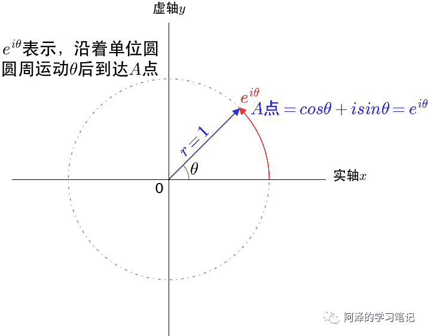

考虑 ， 会随着 t 的增大而逆时针旋转。所以 可以表示为坐标点 A 随着时间 t 逆时针旋转。我们以时间 t 为横坐标，则可以记录到坐标点 A 映射在虚轴的运动轨迹：

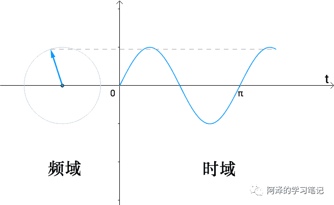

左边图是我们看到的旋转频率，称为频域，而右边图看到是时间流逝，称为时域，是不是和我们刚刚介绍的（从时域变换到频域）正好相反？也就是说，时域和频域其实是可以相互转换的。

回到正题，考虑非周期函数的傅立叶变换。

事实上，我们可以将非周期函数考虑为周期无穷大的函数，考虑频域中的横坐标： ，当周期 T 无穷大大时，频域图就从离散点变为连续的曲线，如下图：

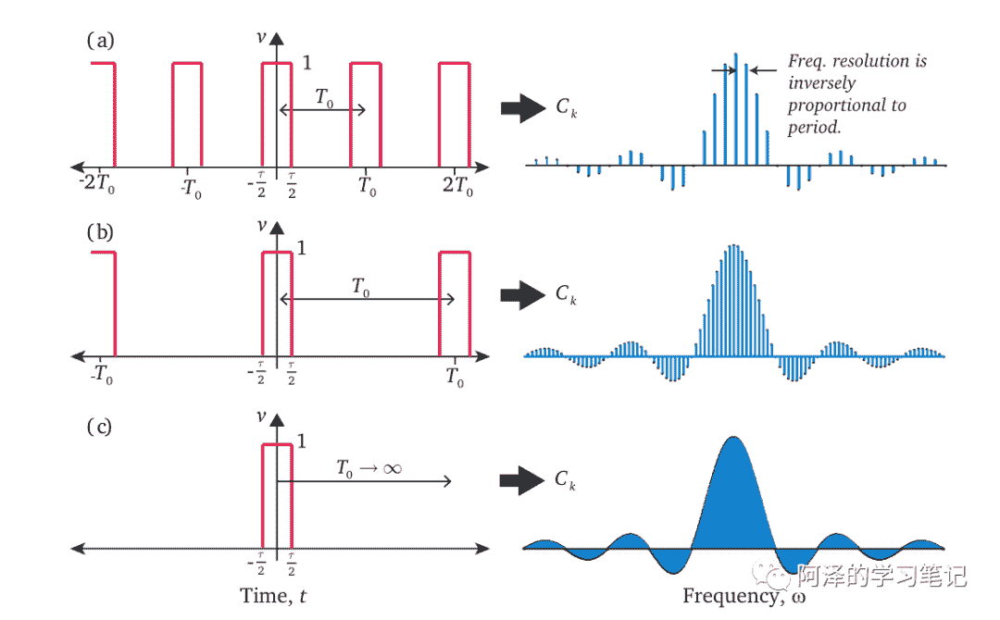

那么，我们该如何从这个非周期函数中分解出各种信号呢？答案就是利用正交！比如说，假设这函数中有一个 的信号，那么我们用 就可以把它乘出来，而其他分量如 <embed style="width: 45.751ex" src="https://mmbiz.qlogo.cn/mmbiz_svg/YCOL3hU8ffVqYUPpT3TphiaXHqqNkmlEM0J4hjme6icgKEsgwKzbuDsgoKwsbHiaUqvvujqicefGlhxCHZY3ib1Z0TR7jHgBuGkibt/0?wx_fmt=svg"> 都会因为正交而消失。所以我们需要对函数做一个内积：

其中， 刚刚介绍过，就是一组正交基的组合。我们用正交基去与函数求内积，如果原函数中包含频率为 的三角函数，则 便为 0，反之为 0，这样自然分离能分离出相应的信号，其图示如上图 c 中右部分所示。

细心的同学可能还会注意到上式的计算的结果中还有复数 i。其实是样子的：**「实数部分表示振幅」**，**「虚数部分表示相位」**。相关资料同学们可以自己查阅，不再进行过多介绍。

以上就是我们所说的傅立叶变换（Fourier Transform，FT）。同样的我们也存在逆变换：

于是，我们便实现了将信号拆成多个正弦信号，再把正弦信号逆变换为原来信号的过程。

简单介绍下傅立叶变换的应用吧， 省得看了那么多不知道他能干什么。

一个很经典的例子就是：分离、降噪。如果男生和女生一起说话，该如何分离出两者的声音呢？答案就是对这一段声音（时域）做傅立叶变换转换到频率，而男女生的声音频率不同，在频域中，低频为男生，中频为女生，高频可能为噪音，我们可以根据需要去除中频和高频的信号，并将其进行逆变换，这样便分离出了男生的声音。

PS：这里再说一个好玩的，频域中是不是不存在时间的概念？不存在时间却可以表示时间，这有没有一点像我们的人生，看似无规律，但是从上帝视角来看，一切皆命中注定。

## 2.3 Graph Laplacian

图拉普拉斯矩阵可以定义为：

其中，D 为度矩阵，W 为考虑权值的邻接矩阵。

考虑归一化后的拉普拉斯矩阵：

以上为常规操作，不过介绍到这里不知道大家会不会有一点疑问。

至少我是有疑问的：图拉普拉斯矩阵为什么要这样定义的？

要想回答这个问题，首先我们得了解什么是拉普拉斯算子。

### 2.3.1 Laplacian

在数学中，拉普拉斯算子（Laplacian）是由欧几里得空间中的一个函数的梯度的散度给出的微分算子，通常有以下几种写法： 。所以对于任意函数 来说，其拉普拉斯算子的定义为：

这里引入了一个新的概念——散度，这里简单介绍下：

散度（Divergence）是向量分析的一个向量算子，将向量空间上的向量场（矢量场）对应到一个标量场。散度描述的是向量场里一个点是汇聚点还是发源点。值为正时表示该点为发源点，值为负时表示该点为汇聚点，值为零时表示该点无源。散度在物理上的含义可以理解为磁场、热源等。

回到正文，我们看下拉普拉斯算子在 n 维空间中的笛卡尔坐标系的数学定义：

数学表示为各个维度的二阶偏导数之和。

以一维空间为例：

也就是说二阶导数近似于其二阶差分，可以理解为当前点对其在所有自由度上微扰之后获得的增益。这里自由度为 2，分别是 +1 和 -1 方向。

再以二维空间为例子：

看到上面可能大家会很可能很陌生，但是这个就是图像中的拉普拉斯卷积核：

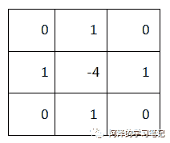

此时共有 4 个自由度 (1,0),(-1,0),(0,1),(0,-1)，当然如果对角线后其自由度可以为 8。

对此我们可以进行归纳：**「拉普拉斯算子是所有自由度上进行微小变化后所获得的增益」**。

我们将其推广到网络图中，考虑有 N 个节点的网络图，其自由度最大为 N，那么函数 可以是 N 维的向量，即：

其中， 表示函数 在网络图中节点 i 处的函数值，类比 为函数 在 (x,y) 的函数值。

在网络图中，两个节点的之间的增益为 ，考虑加权图则有 ，那么对于节点 i 来说，总增益即为拉普拉斯算子在节点 i 的值：

其中， 为节点 i 的度；上式第二行去掉了 是因为 可以控制节点 i 的邻接矩阵。

对于任意 都成立，所以我们有：

自此，我们便给出了图拉普拉斯矩阵的推导过程，这个公式的全称为：图拉普拉斯算子作用在由图节点信息构成的向量 上得到的结果等于图拉普拉斯矩阵和向量 的点积。拉普拉斯矩阵反映了当前节点对周围节点产生扰动时所产生的累积增益，直观上也可以理解为某一节点的权值变为其相邻节点权值的期望影响，形象一点就是拉普拉斯矩阵可以刻画局部的平滑度。

### 2.3.2 Laplace Spectral decomposition

拉普拉斯矩阵的谱分解就是矩阵的特征分解：

对于无向图来说，拉普拉斯矩阵是实对称矩阵，而实对称矩阵一定可以用正交矩阵进行正交相似对角化：

其中， 为特征值构成**「对角矩阵」**， 为特征向量构成的**「正交矩阵」**。

又因为正交矩阵的逆等于正交矩阵的转置： ，所以我们有：

因为 L 是半正定矩阵，我们还可以有：

其中， 为节点 i 的信号。我们称 为图信号的总变差（Total Variation），可以刻画图信号整体的平滑度。

拉普拉斯的谱分解具有以下几点性质：

*   由于拉普拉斯矩阵以每行（列）元素之和为零，因此拉普拉斯矩阵的至少有一个特征值为 0，对应的特征向量 <svg xmlns="http://www.w3.org/2000/svg" viewBox="0 -969 13396.6 1219" style="vertical-align: -0.566ex;width: 30.309ex;height: 2.758ex;"><g stroke="currentColor" fill="currentColor" stroke-width="0" transform="matrix(1 0 0 -1 0 0)"><g><g transform="translate(3364.9, 0)">，</g> <g transform="translate(5275.7, 0)">，，。。。</g></g></g></svg> ，且满足： 。

*   拉普拉斯矩阵的特征值都大于零，归一化的拉普拉斯矩阵的特征值区间为 [0, 2]；

*   如果有 n 个特征值为 0，则表示图有 n 个子图相互无连接；

*   特征值的总和为矩阵的迹，对于归一化的拉普拉斯矩阵，如果没有孤立节点或子图，其特征值为 N。

## 2.4 Graph Fourier Transformer

有同学看到这可能会感到疑问了：**「我们刚介绍傅立叶变换，现在又介绍拉普拉斯谱分解的，到底想干嘛」**。

这是因为：**「傅立叶分析是拉普拉斯谱分析的一个特例」**！想不到吧，是不是很震惊？

我们来证明下，首先考虑亥姆霍兹方程（Helmholtz Equation）：

其中， 为拉普拉斯算子， 为特征函数， 为特征值。

看不懂不要紧，把它当成广义特征方程就行： ，狭隘的特征方程只能用于处理向量和矩阵，而这个可以用于处理函数，最经典的应用是处理波动方程和扩散方程，所以我们可以用它处理信号。

回顾一下傅立叶变换：

其实就是信号函数 与基函数 的内积（刚刚介绍过函数内积）。

对于基函数 ，我们让其与拉普拉斯算子求内积：

以上便证明 是**「拉普拉斯算子的特征函数」**，同时也证明了**「离散傅立叶变换是拉普拉斯谱分析的一个特例」**。

写到这我们有以下线索：首先拉普拉斯矩阵（离散拉普拉斯算子）可以应用在图像上，理论上也可以应用到网络上，而傅立叶变换是拉普拉斯的一个小弟，所以小弟也可以应用到图上。

回顾下拉普拉斯谱分析：

我们类比一下：

| 信号中的傅立叶变换 | 网络图中的傅立叶变换 |
| --- | --- |
| 频率 | 特征值 |
| 正交基中某个向量 | 正交矩阵中的某个向量 |

是不是长得非常像，所以我们也有了网络图上的傅立叶变换：

其中， 为网络图上的 n 维向量， 表示网络中的节点 i 的第 k 个分量， 表示特征向量 k 的第 i 个分量。做个类比解释：特征值（频率） 下， 的图傅立叶变换（振幅）等于 与 对应的特征向量 的内积。

考虑矩阵乘法：

所以我们得到了**「图傅立叶变换的矩阵形式」**，这里的 为拉普拉斯谱分解的正交矩阵。

我们也可以得到傅立叶逆变换：

# 3\. Graph Convolutional Network

前面的铺垫很多，终于要迎来 GCN 了。

## 3.1 Convolution

我们先来看一下卷积的定义，卷积是指通过两个函数   和   生成第三个函数的一种数学算子，表征函数  与经过翻转和平移的   的乘积函数所围成的曲边梯形的面积：

对于离散卷积来说，我们可以定义为：

计算卷积有很多种方法，除了直接计算外，我们还可以考虑**「卷积定理」**：在适当条件下，两个信号的卷积的傅立叶变换是他们的傅立叶变换的点积。换句话说，一个域（如时域）的卷积等于另一个域（如频域）的点乘：

其中   表示   的傅立叶变换。

借助傅立叶逆变换   可以写成：

这样做有什么好处呢？或者说，我们为什么要变换一个域后再去做卷积操作？

因为利用卷积定理可以简化卷积的运算量。对于一个长度为 n 的序列，按照卷积的定义来计算则需要做 2n-1 组对位乘法，即时间复杂度为   ；而利用傅立叶变换后，只需要计算一组对位乘法，而且离散傅立叶变换有快速的算法（快速傅立叶变换），所以总的计算复杂度为   。

## 3.2 Graph Convolution

现在有了图傅立叶变换，又有了离散卷积操作，那么我们想：既然无法直接在空域进行卷积，可否将图信号映射到频域后再做卷积操作。

所以我们有：

其中，向量   与向量   的元素点积，等价于将   组织成对角矩阵的形式进行矩阵乘法，所以我们有：

最后我们再左乘   进行逆变换：

这里，我们不写成   的主要原因在于，我们可以将其与深度学习相结合，在 GCN 中我们的卷积核是可训练并且参数共享的，所以在此我们可以直接将   写成  ，这个便是深度学习中的可学习参数。

## 3.3 GCN-1

第一代的卷积神经网络也就是刚刚我们给出的公式：

这和论文中给出的公式是一样的：

这边补充一点，在这篇论文中，作者还给出了一个基于空域的**「深度局部连接网络」**（Deep Locally Connected Networks），我们可以简单看一下：

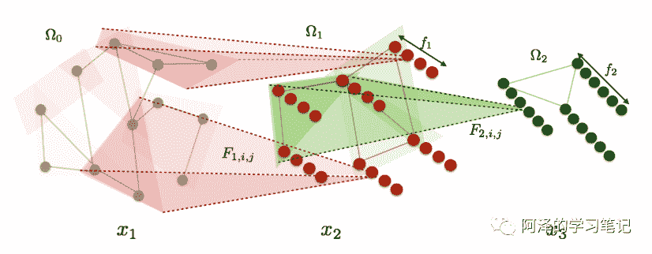

每一层变换定义为：

其中，  表示第 k 第 i 个节点；  表示第 k 层节点 i 和节点 j 的权值，考虑局部邻居；  表示卷积运算；  表示第 k 层的池化操作。也就是说每个节点都是由其邻居和自身卷积池化得到。

虽然看起来很简单，但是优点在于它不需要很强的前提假设，其只需要网络具有局部邻域结构，甚至不需要很好的 Embedding 向量。

但这种结构下有一个很大的缺点：**「没有办法实现共享参数」**。

作者针对这种问题提出了我们所看到第一代图卷积神经网络。

## 3.4 GCN-2

第一代的图卷积神经网络很巧妙的利用图谱理论来实现拓扑图的卷积操作，但其有很多缺点，比如说：计算复杂度太高，我们需要对拉普拉斯矩阵进行谱分解得到特征向量矩阵  ，时间复杂度为   ；

针对这个问题，学者提出了第二代 GCN。

首先我们回顾下图傅立叶变换：

可以看到这是一个和特征值密切相关的函数，我们不妨将   写成拉普拉斯矩阵 L 的特征值函数  ：

然后这个卷积核有两个局限性：

1.  不具备局部连接性；

2.  时间复杂度为  。

为了克服这个缺点，我们引入 K 阶多项式：

其中，参数   是多项式系数，这样滤波器就具有了 K 阶局部性了，复杂度也降低到  。

我们将这个公式带入卷积运算中：

此时，我们计算图卷积运算就不需要再乘上特征向量矩阵  ，而是直接使用拉普拉斯矩阵 L 的 k 次方，这样就避免了进行特征分解。而我们可以事先计算好   ，这样就只需要计算矩阵相乘。同时由于 L 为稀疏矩阵，所以时间复杂度为  ，  为节点边数。

此外，作者还引入了切比雪夫展开式来近似  。

设   为切比雪夫多项式的第 k 阶式子，切比雪夫多项式的递归式为：<embed style="width: 50.569ex" src="https://mmbiz.qlogo.cn/mmbiz_svg/YCOL3hU8ffVqYUPpT3TphiaXHqqNkmlEM8weS5iagVhwAuq1FMC3EsKg5cjbFibJejxs21nyEUwLAMjYib67ktY3hmISA27Z0Ifb/0?wx_fmt=svg">。所以我们有：

其中，  ；  是指拉普拉斯矩阵 L 的最大值。

> ❝
> 
> 这是因为切比雪夫多项式的输入要在   之间，由于拉普拉斯矩阵的半正定性，所以所有的特征值都是大于等于 0 的，将其除以最大特征值可以将特征压缩到   区间内，现在需要将其压缩到  ，所以我们有：
> 
> ❞

我们将切比雪夫多项式引入到我们的卷积变换中：

其中，  。这个表达式为拉普拉斯多项式中的一个 k 阶近似函数，依赖于节点的 **「k 阶邻域」**（走 k 步能到的邻居），时间复杂度与边呈线形相关。

## 3.5 GCN-3

第二代 GCN 解决了图卷机要求特征分解的问题，但是在计算图卷积操作时，依然每次都要进行矩阵乘法，时间复杂度为   ，于是学者继续优化。

我们把上式拿下来：

GCN 通过上式的多层卷积层进行叠加，而每层都会逐点进行非线性叠加，考虑到时间复杂度问题，学者直接取 K=2，也就是说得到了一个拉普拉斯算子的二阶近似函数。这样我们既可以对网络进行卷积操作，又不会引入太多的切比雪夫系数。而且这样的线形运算允许我们构建更深的网路，提高模型的建模能力。

我们知道归一化的拉普拉斯矩阵的特征值区间为 [0, 2]，进一步近似  ，所以我们有新的表达式：

其中， <svg xmlns="http://www.w3.org/2000/svg" viewBox="0 -750 3263.7 950" style="vertical-align: -0.452ex;width: 7.384ex;height: 2.149ex;"><g stroke="currentColor" fill="currentColor" stroke-width="0" transform="matrix(1 0 0 -1 0 0)"><g><g transform="translate(1150.3, 0)">，</g></g></g></svg>  为切比雪夫系数的向量，是仅有的两个参数。

在实际训练过程中，我们需要规范化参数来避免过拟合，所以我们令  ，从而有：

需要注意的是，  的特征值范围在 [0, 2] 之间，所以如果在很深的网络中会引起梯度爆炸的问题，所以我们需要再次对他进行一次归一化（原文也称 **「renormalization trick」**）：

我们把这个公式从标量推广到矩阵，对于输入节点的向量   ，其中 N 为节点数，C 为节点的特征向量维度，我们有：

其中，  是滤波器的参数矩阵，  是卷积后的信号矩阵，时间复杂度为   。节点的向量可以通过卷积操作从 C 维度 转变为 F 维度。

依据上面的单层运算，我们给出了多层图卷积网络的传播规则：

其中，  ，A 为邻接矩阵，  为单位矩阵，所以   为添加自连接的邻接矩阵；  ，  可以理解为对角线为节点 i 的度数矩阵；  为神经网络第   层的权重矩阵；  是激活函数；  是第   层的激活矩阵，并且   ，  是由节点   的特征向量组成矩阵。

到此，便完成了 GCN 卷积操作的公式推导。

## 3.6 Model

再来关注一下模型。

图卷积神经网络是指在图结构中做卷积操作的神经网络，所以其输入输出的都是图结构，区别于传统的神经网络结构，其隐藏层是直接在图结构中进行激活：

为了方便理解，我们举个分类任务例子，以包含一个隐藏层的 GCN 为例：

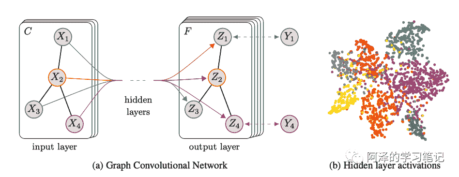

由于知道了 GCN 的传播规则，所以我们有最终的结果：

其中，  是输入层到隐藏层的权重，  是隐藏层到输出层的权重；用 Softmax 是因为这是一个节点分类任务，需要预测标签。

然后，我们用交叉熵作为代价函数：

其中，  为有标签的节点集合。

有了代价函数后，我们可以通过梯度下降来更新网络的参数。

## 3.7 Experiment

简单看下第三代 GCN 的试验。

由于 GCN 比较复杂，所以这里我将给出两种实验，一种是 GCN 的效果实验，另一种是模拟 GCN 运行的实验。

### 3.7.1 Effect

我们来看一下实验部分，GCN 与其他模型的对比：

可以看到 GCN 的结果在不同数据集上都取得了非常好的效果，远超其他模型。

我们再看一下，对于 GCN 而言不同程度的近似会有什么样的效果：

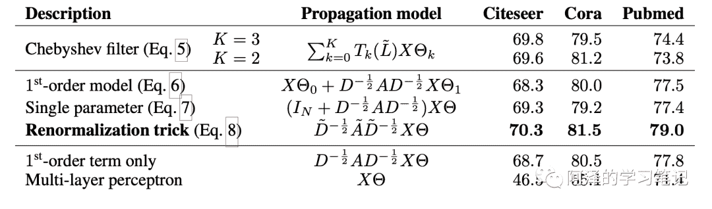

可以看到并不是模型越复杂效果越好。

GCN 还有除了训练后模型精度高外，还有两个非常硬核的地方，即使不训练，直接随机参数也可以获得不错的效果，下图展示了在某一数据集下随机赋权值的结果：

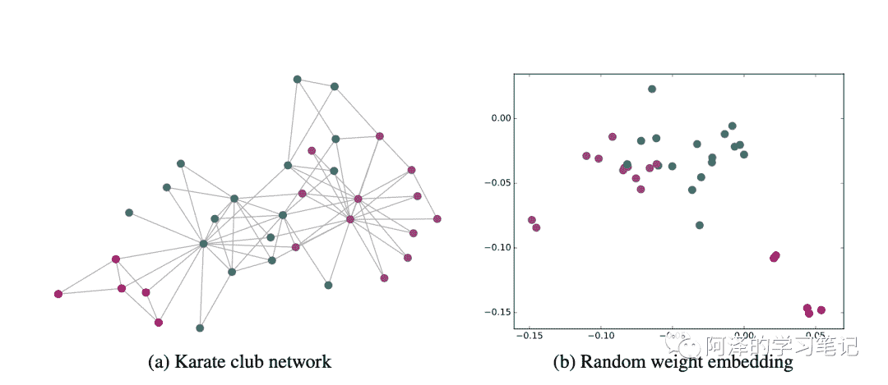

另外，作为半监督学习，GCN 可以在只标注少量样本的情况下学得出色的效果，下图为每个类别只标注一个样本的分类结果：

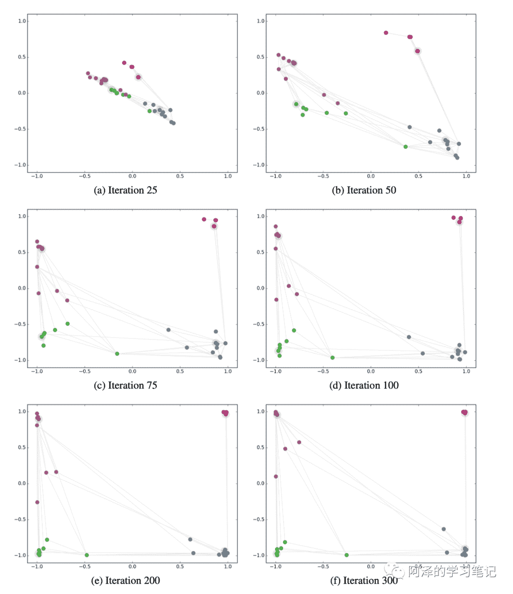

### 3.7.2 Simulation

为了更加形象的理解 GCN，我们来对 GCN 进行模拟。

首先，以一个简单有向图模型为例：

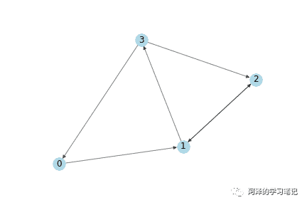

邻接矩阵 A 和 节点的特征向量 X 为：

我们有一个简单的传播规则（不考虑参数矩阵和激活函数）：

**「可以看到节点的特征变成了其邻居的特征之和！」**

但这边也就一些小问题：

1.  这种传播过程没有考虑节点自身的特征；

2.  度的大节点特征值会越来越大，度小的节点特征值会越来越小，传播过程对特征的尺度敏感。

为了解决这个问题，我们需要：

1.  加一个单位矩阵，考虑自环路；

2.  将邻接矩阵 A 与度矩阵 D 的逆相乘对特征进行归一化。

我们先看下加上单位矩阵的效果：

可以看到，加上单位矩阵的计算考虑了节点的特征。

再看下邻接矩阵归一化的效果：

邻接矩阵被归一化到 0 到 1 之间。

我们将两个放在一起，并考虑参数矩阵 W：

所以我们有：

以上便完成了 GCN 的简单仿真。

我们回过头来再来看一下网络的传播规则：

现在是不是更能明白为什么这么传播了？

这里解释一下归一化为什么是两边乘上矩阵的 -1/2 次方。

这是因为对称归一化的拉普拉斯矩阵其元素定义为：

我们仿真模拟的是用加权求和取平均的方式来聚合，而作者采用的是拉普拉斯变换。我这边做一个化简大家可能个就会明白了：

区别于加权求和取平均的方式，拉普拉斯变换不但考虑当前节点的 i 的度，还考虑其他节点 j 的度。

# 4\. Conclusion

GCN 的入门文章就介绍完了，大致思路为：CNN 中的卷积无法直接应用于网络图中，所以引出了图信号处理（Graph Signal Processing）中的 Graph Fourier Transformation，进而定义 Graph Convolution，最后结合深度学习发展出来 GCN。

# 5\. Reference

1.  《Graph Convolutional Networks in 3 Minutes》

2.  《如何理解卷积神经网络中的权值共享？》

3.  《HIERARCHICAL DEEP LEARNING ARCHITECTURE FOR 10K OBJECTS CLASSIFICATION》

4.  《Introduction to Graph Signal Processing》

5.  《Fourier series》

6.  《Fourier Series Graph Interactive》

7.  《Hilbert space》

8.  《Laplace operator》

9.  《如何理解 GCN？- Johnny Richards的回答》

10.  《图拉普拉斯算子为何定义为D-W》

11.  《图卷积神经网络理论基础》

12.  《如何理解 GCN？- superbrother的回答》

13.  《Fourier transform》

14.  《Convolution》

15.  《Convolution theorem》

16.  《Spectral Networks and Deep Locally Connected Networks on Graphs》

17.  《Convolutional Neural Networks on Graphs with Fast Localized Spectral Filtering》

18.  《Semi-supervised Classification with Graph Convolutional Networks》

19.  《How to do Deep Learning on Graphs with Graph Convolutional Networks》

“在看，给作者阿泽**点赞**↓