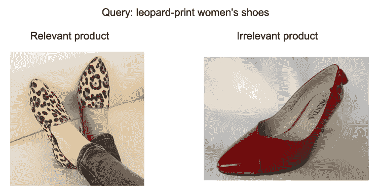

近期对图像检索颇为感兴趣，正巧看到今年KDD Cup赛题中有两道都是它相关的，借着这次机会学习学习。本文将对其中的一道，KDD Cup 2020 Challenges Modern E-Commerce Platform: Multimodalities Recall数据进行了初探与可视化处理，便于各位更为直观理解赛题数据与建模目标，同时还会给出基本的解题思路。

**文章末尾还会给出比赛交流群。**

01 **赛题介绍**

**1.1 赛题背景**

在电商领域图像数据的本身可以帮助商品快速检索，也可以进一步促进销售额。本赛题使用淘宝APP的真实场景多模态数据，数据集由淘宝搜索查询和产品图像特征组成，组织成基于查询的多模态检索任务。

**赛题任务：**给定一个自然语言形式的搜索语句，参与的团队需要实现一个模型，根据它们的图像特征对候选产品集合进行排序。查询语句一般为购物相关的商品名词，用于搜索具有特定特征的产品，候选产品的图片由展示产品的卖家提供。与查询最相关的候选产品被视为查询的ground truth，参与模型期望查询的ground truth排在最前面。我们演示一个示例查询如下:



需要注意本次赛题不是文本匹配任务，而关注跨模态的检索过程，因此不会给出商品的原始文字描述。

**1.2 赛题数据**

**训练集**包括约300万对查询语句和真实的产品图片特征，这些样本对可以作为训练您的检索模型的积极示例。对于训练集中的每个产品图像，具体包括物体检测物体的CNN特征、位置和分类标签。（为避免版权问题，赛题仅在验证集中发布大约9000张原始产品图片）

这些训练集tsv文件中的每一行代表一个样本对。

这些表有9列，各标签之间是制表符：

1.  product_id：产品的索引

2.  image_h：产品图片的高度

3.  image_w：产品图片的宽度

4.  num_boxes：检测到图像的对象边界框的数量

5.  boxes：一个[num_boxes，4]形的二维数组，指定图像中每个对象边界框的位置。

6.  features：一个[num_boxes，2048]形状的2-D数组，指定由图像中每个对象边界框的检测器计算出的2048维特征；

7.  class_labels：一个[num_boxes]形的一维数组，指定每个对象的类别ID。此数据集中有33个对象分类类别；

8.  query：与相应产品匹配的自然语言查询

9.  query_id：查询的索引

**需要注意，完整的训练集tsv文件需要120G存储空间。**

验证集包含大约500个查询，**而测试集A和B都包含大约1k个查询。对于这些集合中的每个查询，我们准备一个约30个候选产品，**每个候选产品图像的处理方式与训练集相同。

我们为中的有效集合的每个评估查询提供了真实的产品`valid_answer.json`。每个评估查询的真实产品未按顺序排序。此json文件的格式如下：

```
{
  "query-id":
  [
   "ground-truth product-id 1",
   "ground-truth product-id 2",
   ...,
   "ground-truth product-id n"
  ]
} 
```

为每个参与模型在测试数据集上计算nDCG @ 5，以评估检索到的产品与基本事实之间的对应关系。每个参赛团队的最终排名将由测试集B上的nDCG @ 5确定。

**02 数据分析**

**2.1 数据读取** 

```
import numpy as np
import pandas as pd
import glob, base64

train_df = pd.read_csv('../input/train.sample.tsv', sep='\t', nrows=None)

def decode_rows(row):
    row['boxes'] = np.frombuffer(base64.b64decode(row['boxes']), dtype=np.float32).reshape(row['num_boxes'], 4)
    row['features'] = np.frombuffer(base64.b64decode(row['features']), dtype=np.float32).reshape(row['num_boxes'], 2048)
    row['class_labels'] = np.frombuffer(base64.b64decode(row['class_labels']), dtype=np.int64).reshape(row['num_boxes'])
    return row

train_df = train_df.iloc[:].apply(lambda x: decode_rows(x), axis=1) 
```

读取之后，训练集可以用表格形式呈现：


**2.2 数据分析**

(1) 图像尺寸：图像尺寸大部分位于800像素，且长短比为1:1，应该是淘宝商品的主体。


(2) 图像物体：图像包含的物体主要1-2个居多；


(3) 商品类别


```
0  top clothes (coat, jacket, shirt, etc.)
1  skirt & dress
2  bottom clothes (trousers, pants, etc.)
3  luggage, leather goods
4  shoes
5  accessories (jewelry, clothing accessories, belts, hats, scarves, etc.)
6  snacks, nuts, liquor and tea
7  makeup, perfume, beauty tools and essential oils
8  bottle drink
9  furniture
10  stationery
11  household electrical appliances
12  home decoration
13  household fabric
14  kitchenware
15  home / personal cleaning tools
16  storage supplies
17  motorcycle, motorcycle accessories, vehicles, bicycle and riding equipment
18  outdoor product
19  lighting
20  toys
21  underwear
22  digital supplies
23  bed linens
24  baby products
25  personal care
26  sporting goods
27  clothes (accessories, baby clothing, etc.)
28  others
29  human face
30  arm
31  hair
32  hand 
```

**03 解题思路**


本赛题主要考察跨模态的检索检索任务，而且数据量非常大，需要选手通过query文本检索到商品，具体使用检索指标进行量化：

(1) 这一题典型的跨模态检索任务，由于测试集中每个query会给出可能的30个商品，因此也可以使用多模态匹配的方法。

https://zhuanlan.zhihu.com/p/33627162

(2) 充分使用query文本信息，根据文本进行分类，进一步再进行检索；

(3) 如何将120G的数据进行充分训练；

**04 比赛交流群**

正在我寻找本次比赛交流群的时候，得知官方不会创建赛题交流群，那像我这样的推荐小白该向谁请教呢。故创建了本次比赛的交流群，供大家学习交流，答疑解惑。

昨天已经加群的小伙伴请不要重复加群！


如果群二维码已满，请添加最下面的微信

回复【KDD】


让我知道你在看

