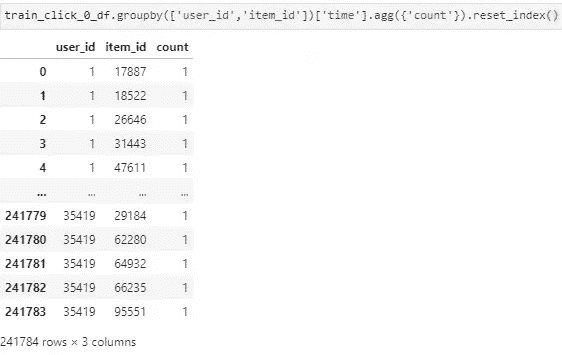

**写在前面**

      近期对推荐系统颇为感兴趣，正巧看到今年KDD Cup赛题中有两道都是推荐相关的，借着这次机会学习学习。本文将对其中的一道，KDD Cup 2020 Challenges for Modern E-Commerce Platform: Debiasing 数据进行了初探与可视化处理，便于各位更为直观理解赛题数据与建模目标，同时还会给出基本的解题思路。

**文末给出 KDD Cup 2020 赛题交流群**

**一、基本介绍**

**1.1 赛题背景**

      如何推荐过去很少曝光的物品，以对抗推荐系统中经常遇到的马修效应。尤其是，在对点击数据进行训练时，减少偏差对于该任务的成功至关重要。就像现代推荐系统中记录的点击数据和实际在线环境之间存在差距一样，培训数据和测试数据之间也会存在差距，主要是关于趋势和项目的受欢迎程度。

*   获奖的解决方案需要在历史上很少接触的产品上表现良好。

*   培训数据和测试数据是在多个时期内收集的，甚至包括大规模的销售活动。由于趋势的变化，对于可靠的预测不可避免地要执行偏差减小。

*   我们提供了商品的多模式功能以及一些（匿名的）关键用户功能，以帮助参与者探索能够抵抗数据偏差并能够很好地处理未开发商品的解决方案。

**1.2 数据集**

训练数据：underexpose_train.zip

测试数据：underexpose_test.zip

具体字段如下：

*   item_id：商品的唯一标识符

*   txt_vec：项目的文本特征，它是由预先训练的模型生成的128维实值向量

*   img_vec：项目的图像特征，它是由预先训练的模型生成的128维实值向量

*   user_id：用户的唯一标识符

*   时间：点击事件发生的时间戳，即（unix_timestamp-random_number_1）/ random_number_2

*   user_age_level：用户所属的年龄段

*   user_gender：用户的性别，可以为空

*   user_city_level：用户所在城市的等级

**1.3 评估指标**

      对于本次比赛，我们使用NDCG @ 50来衡量推荐列表的质量。

（1）我们将计算两个指标：NDCG @ 50满和NDCG @ 50稀有。

*   NDCG @ 50-full是对整个测试集（即，underexpose_test_qtime-T.csv中的所有测试用例）进行计算的。

*   在underexpose_test_qtime-T.csv中的一半测试用例上计算NDCG @ 50稀有度。所选的一半包括其下一个要预测的项目比过去训练集中的另一半更少探索的案例，即underexpose_train_click-0.zip，underexpose_train_click-1.zip，…，underexpose_train_click-T.zip。

（2）T = 0,1,2，…，6期正在开发中。参与者的最终排名将基于T = 7,8,9进行计算。完整的NDCG @ 50获胜团队需要跻身前10％，同时要在合格团队中获得最佳NDCG @ 50稀有度。

```
def getDCG(scores):
    return np.sum(
        np.divide(np.power(2, scores) - 1, np.log(np.arange(scores.shape[0], dtype=np.float32) + 2)),
        dtype=np.float32)

def getNDCG(rank_list, pos_items):
    relevance = np.ones_like(pos_items)
    it2rel = {it: r for it, r in zip(pos_items, relevance)}
    rank_scores = np.asarray([it2rel.get(it, 0.0) for it in rank_list], dtype=np.float32)

    idcg = getDCG(np.sort(relevance)[::-1])

    dcg = getDCG(rank_scores)

    if dcg == 0.0:
        return 0.0

    ndcg = dcg / idcg
    return ndcg

def recall_N(y_true, y_pred, N=50):
    return len(set(y_pred[:N]) & set(y_true)) * 1.0 / len(y_true) 
```

**二、数据分析**

**2.1 数据加载**

```
%matplotlib inline
import pandas as pd
import numpy as np

import matplotlib.pyplot as plt
import seaborn as sns
plt.rc('font', family='SimHei', size=13)

import os,gc,re,warnings,sys
warnings.filterwarnings("ignore")

path = './data/'

##### train
train_user_df = pd.read_csv(path+'underexpose_train/underexpose_user_feat.csv', names=['user_id','user_age_level','user_gender','user_city_level'])
train_item_df = pd.read_csv(path+'underexpose_train/underexpose_item_feat.csv')
train_click_0_df = pd.read_csv(path+'underexpose_train/underexpose_train_click-0.csv',names=['user_id','item_id','time'])

##### test
test_qtime_0_df = pd.read_csv(path+'underexpose_test/underexpose_test_click-0/underexpose_test_qtime-0.csv', names=['user_id','query_time'])
test_click_0_df = pd.read_csv(path+'underexpose_test/underexpose_test_click-0/underexpose_test_click-0.csv', names=['user_id','item_id','time']) 
```

**2.2 预处理**

这里对train_item_df的列名称进行了简单处理，并计算了用户点击rank和点击次数统计，方面后面数据探查。

```
train_item_df.columns = ['item_id'] + ['txt_vec'+str(i) for i in range(128)] + ['img_vec'+str(i) for i in range(128)]
train_item_df['txt_vec0'] = train_item_df['txt_vec0'].apply(lambda x:float(x[1:]))
train_item_df['txt_vec127'] = train_item_df['txt_vec127'].apply(lambda x:float(x[:-1]))
train_item_df['img_vec0'] = train_item_df['img_vec0'].apply(lambda x:float(x[1:]))
train_item_df['img_vec127'] = train_item_df['img_vec127'].apply(lambda x:float(x[:-1]))

# rank
train_click_0_df['rank'] = train_click_0_df.groupby(['user_id'])['time'].rank(ascending=False).astype(int)
test_click_0_df['rank'] = test_click_0_df.groupby(['user_id'])['time'].rank(ascending=False).astype(int)

# click cnts
train_click_0_df['click_cnts'] = train_click_0_df.groupby(['user_id'])['time'].transform('count')
test_click_0_df['click_cnts'] = test_click_0_df.groupby(['user_id'])['time'].transform('count') 
```

**2.3 基本探查**

（1）train_user_df 用户属性数据


```
plt.figure()
plt.figure(figsize=(16, 10))
i = 1
for col in ['user_id', 'user_age_level', 'user_gender', 'user_city_level']:
    plt.subplot(2, 2, i)
    i += 1
    v = train_user_df[col].value_counts().reset_index()[:10]
    fig = sns.barplot(x=v['index'], y=v[col])
    for item in fig.get_xticklabels():
        item.set_rotation(90)
    plt.title(col)
plt.tight_layout()
plt.show() 
```


       用户数据中给了user_age_level、user_gender、user_city_level，可以大体看出基本的属性分布，同时，有3个用户出现了两次，简单的剔除即刻。用户年龄、性别和城市等级都很符合我们的主观认识。

（2）train_item_df 商品数据，给出了商品文本表示向量和图片表示向量


这里目前没有过多的分析，后面会结合用户行为进行分析。

（3）train_click_0_df 用户点击行为数据


下面给出user_id和item_id的分布可视化展示


**2.3 深入分析**

（1）用户重复点击



很有意思不存在用户多次点击同一个商品，这与去年的CIKM和安泰杯有很大的差异。

（2）商品共现频次

```
tmp = train_click_0_df.sort_values('time')
tmp['next_item'] = tmp.groupby(['user_id'])['item_id'].transform(lambda x:x.shift(-1))
union_item = tmp.groupby(['item_id','next_item'])['time'].agg({'count'}).reset_index().sort_values('count', ascending=False)
union_item[['count']].describe() 
```


       商品共现是只两个商品连续出现，可以看出平均共现次数1.03，最高的也才24。


（3）向量表示分析


       只是仅对其中一个用户进行向量分析，发现很多商品没有对应的文本向量和图片向量。接下来分析分析用户的点击序列中，前后商品的关系，即相似性分析。

```
nonull_tmp = tmp[~tmp['txt_vec0'].isnull()]

sim_list = []
for i in range(0, nonull_tmp.shape[0]-1):
    emb1 = nonull_tmp.values[i][-128-128:-128]
    emb2 = nonull_tmp.values[i+1][-128-128:-128]
    sim_list.append(np.dot(emb1,emb2)/(np.linalg.norm(emb1)*(np.linalg.norm(emb2))))
sim_list.append(0)

plt.figure()
plt.figure(figsize=(10, 6))
fig = sns.lineplot(x=[i for i in range(len(sim_list))], y=sim_list)
for item in fig.get_xticklabels():
    item.set_rotation(90)
plt.tight_layout()
plt.title('用户点击序列前后txt相似性')
plt.show() 
```


       发现前后商品的相似性很多集中在0-0.5之间，相似性在0.8以试的非常少。接下来看看图像向量的相似性。


貌似前后商品的图片向量相似性更低。

（4）根据用户点击序列提取商品嵌入表示

       接下来看看商品嵌入表示，是不是如同txt和img向量一样。这里使用word2vec进行构造，当然还可以尝试图嵌入等方式来提取嵌入表示。

```
tmp = train_click_0_df.sort_values('time')

# 提取用户点击序列，并构成文本
doc = tmp.groupby(['user_id'])['item_id'].agg({list}).reset_index()['list'].values.tolist()

# 导入 Word2Vec
from gensim.models import Word2Vec

# 转为字符串型才能进行训练
for i in range(len(doc)):
    doc[i] = [str(x) for x in doc[i]]

model = Word2Vec(doc, size=128, window=5, min_count=3, sg=0, hs=1, seed=2020)

# 训练结果提取
values = set(tmp['item_id'].values)
w2v=[]

for v in values:
    try:
        a = [int(v)]
        a.extend(model[str(v)])
        w2v.append(a)
    except:
        pass

out_df = pd.DataFrame(w2v)
out_df.columns = ['item_id'] + ['item_vec'+str(i) for i in range(128)]

# 用户合并item id向量
tmp = train_click_0_df[train_click_0_df['user_id']==5701]
tmp = tmp.merge(out_df, on='item_id', how='left')
nonull_tmp = tmp[~tmp['item_vec0'].isnull()]

# 可视化展示前后商品向量相似性
sim_list = []
for i in range(0, nonull_tmp.shape[0]-1):
    emb1 = nonull_tmp.values[i][-128:]
    emb2 = nonull_tmp.values[i+1][-128:]
    sim_list.append(np.dot(emb1,emb2)/(np.linalg.norm(emb1)*(np.linalg.norm(emb2))))
sim_list.append(0)

plt.figure()
plt.figure(figsize=(10, 6))
fig = sns.lineplot(x=[i for i in range(len(sim_list))], y=sim_list)
for item in fig.get_xticklabels():
    item.set_rotation(90)
plt.tight_layout()
plt.show() 
```


**三、解题思路**

       赛题主要考查如何消除人工智能偏见的问题，推荐历史点击次数少的商品。传统的召回方式，如协同过滤 item CF 和 user CF，user CF更加倾向于推荐热门商品，item CF推荐有很好的新颖性，很擅长推荐长尾里的物品，或许可以尝试一下。

       根据向量相似性进行推荐，也是一个尝试的方向，不过看到用户前后点击的商品相似性并不高，让我有些迟疑。或许还需要更多的分析，如结合时间之类的属性。还有就是前后关系只能描述当前兴趣，可以尝试提取长期兴趣进行推荐。

       还有就是深度学习模型进行召回，如YouTube的推荐系统算法，DSSM双塔模型等都是不错的方式。

       对应排序阶段而言，一般都会上模型，需要考虑的就是特征，如何去区分热门商品，提高历史出现频次少的商品成为关键。要做到既能推荐对，又能推荐的够新颖。

**赛题交流群**

       正在我寻找本次比赛交流群的时候，得知官方不会创建赛题交流群，那像我这样的推荐小白该向谁请教呢。故创建了本次比赛的交流群，如果群满，添加Finlay-LYZ拉群。


让我知道你在看

