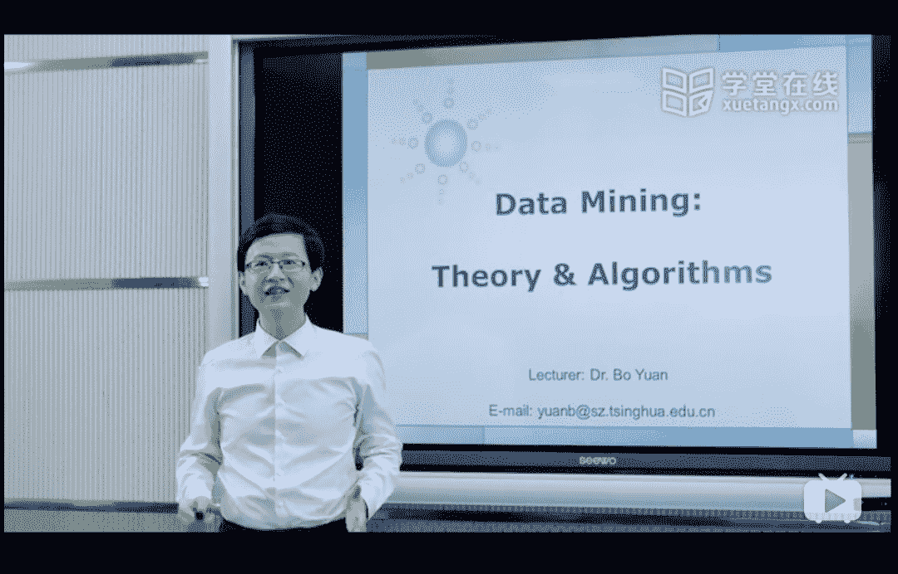
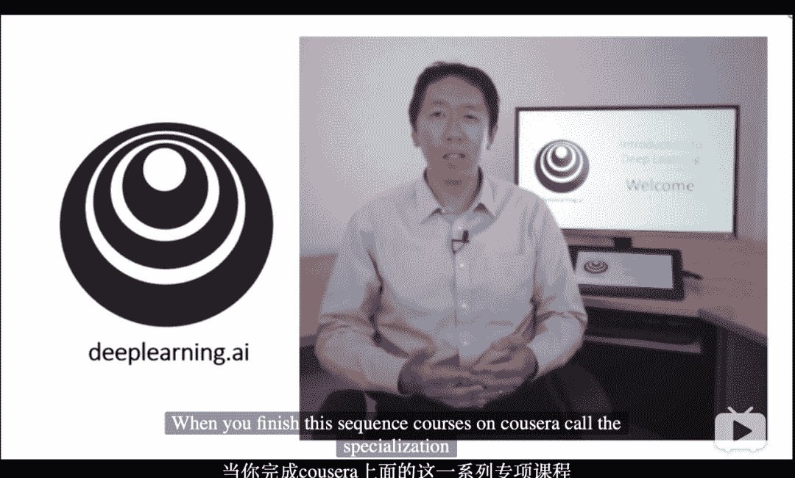
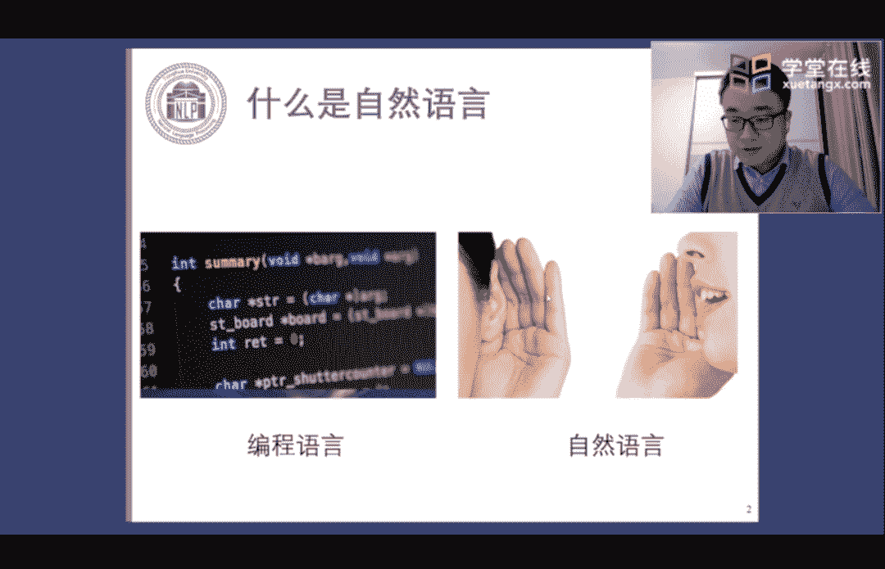
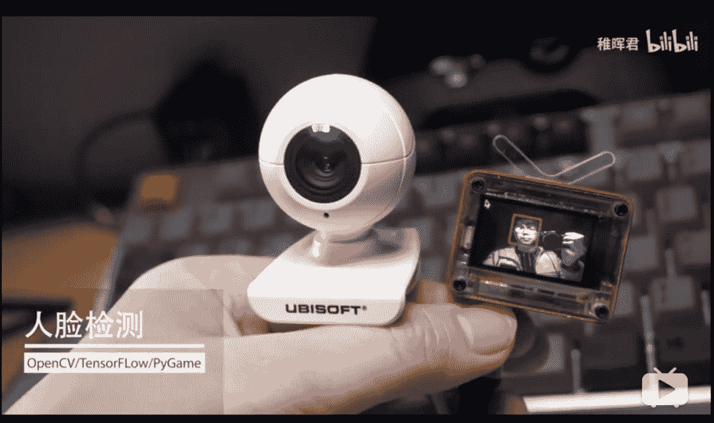

经过这几个月的居家隔离，想必大多数同学都开始习惯通过线上的方式开展学习了，在线教育领域也因此迎来了一波爆发，竞争异常激烈，既有知名平台如MOOC、学堂在线、网易云课堂等，也有不少初创新星。但要说最受年轻人欢迎的学习资源网站，应该非B站莫属。该平台资源之丰富不用多说，并且全程无广告，很多网友都表示自己通过B站学会了很多技能，比如Python、数据库、Photoshop、英语考级、日语考级等。总之，一个B站就足够解决绝大多数问题。下面，我们整理一波B站上关于数据科学、人工智能领域的学习资料和值得关注的up主，欢迎大家收藏转发哦～

**AI入门了解**

**1、Crash Course AI**

https://space.bilibili.com/276373762/channel/detail?cid=101907

课程介绍：该课程出自Crash Course，首发YouTube，单个视频时长均在10分钟左右。视频节奏非常好，语速偏快，适合下饭时间入门了解。主讲很擅长深入浅出的讲清复杂的概念，一集信息量很大甚至评论区还会有课代表帮你总结才能稍稍消化。

**数学基础**

**1、Up主：3Blue1Brown的数学基础**

https://space.bilibili.com/88461692

课程介绍：用动画讲述数学专业知识，其视频涵盖了线性代数、微积分、拓扑学等领域，每门课都配有直观生动的动画演示，帮助观众加深对数学概念定理的理解。

**2、数学分析**

https://www.bilibili.com/video/av8042121

课程介绍：复旦陈纪修老师的数学分析视频课程，共214讲。陈纪修老师主持编写了21世纪课程教材——《数学分析》。

**3、数学建模**

www.bilibili.com/video/av8824879

课程介绍：清华大学数学建模公开课，共84讲。教材用的是《数学模型》姜启源 。

**4、统计学**

https://www.bilibili.com/video/av7199273

课程介绍：可汗学院公开课，将统计学所有内容都涵盖了。共85讲。

**可视化**

**1、Python数据可视化分析**

https://www.bilibili.com/video/av6989413

课程介绍：麦子学院的公开课，共31讲。

**2、Matplotlib Python 画图教程**

https://www.bilibili.com/video/av16378354

课程介绍：莫烦Python的课程内容，共19讲。

**数据分析**

**1、Python 数据分析与展示(北京理工大学 )**

https://www.bilibili.com/video/av10101509

课程介绍：北京理工大学MOOC课程，共65讲。

**2、Numpy & Pandas**

https://www.bilibili.com/video/av16378934 

课程介绍：莫烦 Python 数据处理教程，主要讲解Numpy、Pandas两个包的使用。共18讲。

**3、【数据分析】SQL数据库入门到精通，最干净易懂的小白必备教程10小时完整版**

https://www.bilibili.com/video/av77541375

课程介绍：英文课程，中文字幕，很多同学表示这是看过最好的课程，通俗易懂。

**数据挖掘**

**1、清华大学-数据挖掘：理论与算法** 

https://www.bilibili.com/video/BV154411Q7mGfrom=search&seid=4187357852637700624

课程介绍：本课程完整覆盖数据挖掘领域的各项核心技术，包括数据预处理、分类、聚类、回归、关联、推荐、集成学习、进化计算等。强调在知识的广度、深度和趣味性之间寻找最佳平衡点，在生动幽默中讲述数据挖掘的核心思想、关键技术以及一些在其它相关课程和教科书中少有涉及的重要知识点，适合对大数据和数据科学感兴趣的各专业学生以及工程技术人员学习。

**机器学习**

**1、[中英字幕]吴恩达机器学习系列课程**

https://www.bilibili.com/video/BV164411b7dxfrom=search&seid=13732295711057612613

课程介绍：这是个视频是转自吴恩达老师在Coursera上的公开课视频，内容偏向理论而并非实战，适合初学机器学习、深度学习的同学。需要视频配套资料的可以看看这里https://zhuanlan.zhihu.com/p/84214338这是国内黄博士为吴老师课程配的全套资料，包括视频字幕，对应python代码，原版PPT，中文版笔记等等

**2、林轩田机器学习基石(国语)**

https://www.bilibili.com/video/av12463015/

课程介绍：台湾大学林轩田老师的《机器学习基石》课程由浅入深、内容全面，基本涵盖了机器学习领域的很多方面。其作为机器学习的入门和进阶资料非常适合。而且林老师的教学风格也很幽默风趣，总让读者在轻松愉快的氛围中掌握知识。

**3、机器学习技法（林轩田）**

https://www.bilibili.com/video/av85508326?p=1

课程介绍：同样是台大林轩田老师课程，通常学完基石的同学会继续学习这一门课程。

**4、李宏毅机器学习(2017)**

https://www.bilibili.com/video/av10590361

课程介绍：台大教授李宏毅制作的，经常被认为机器学习中文课程的首选，而且课程风格诙谐幽默，这就让枯燥的课程变的有趣许多。而且最重要的是，课程中布置了很多作业，而万能的网友更是找出了作业答案，并将其公布在了留言区，可以说太良心了，简直是没钱报班学习者的福音。

**5、up主：shuhuai008 【机器学习】【白板推导系列】**

https://www.bilibili.com/video/av70839977

课程介绍：这个up主来自清华，他做的这一套机器学习白板推导的视频讲解系列目前出到第33集流模型。这个视频系列最大的特点是给出了整体的框架，再用单章去分解里面的重点，力求做到简洁易懂，很有中国特色。对比国外普遍一个视频2小时的课程，更适合国人。

**6、机器学习教程【强烈推荐】**

https://www.bilibili.com/video/av46180067/

课程介绍：这门课程来自邹博老师的《机器学习与数学分析》，风格同样是深入浅出、通俗易懂，对于有基础和没基础的同学，都能让你轻易入门。

**7、机器学习算法-2017邹博最新（Python版）**

https://www.bilibili.com/video/av23585080

课程介绍：这门课程同样来自邹博老师，适合配合上一部一起观看。

**8、(上海交通大学张志华)机器学习导论**

https://www.bilibili.com/video/av76230791/

课程介绍：张志华老师的这门课讲的很深入，适合学习机器学习和深度学习的研究者深入学习，内容比较偏向理论，需要一定的数学基础。

**9、Scikit-learn (sklearn) 优雅地学会机器学习 (莫烦 Python 教程)**

https://www.bilibili.com/video/av17003173

课程介绍：莫烦的机器学习教程汇集了很多近些年来比较流行的 python 模块教程。课程内容有趣，没有机器学习背景的朋友们也能产生兴趣，对机器学习的每种方法都能迅速理解。另外，对于已经入门了的同学们, 这门课程也是一个提升自己应用机器学习的好地方, 因为里面同时也介绍了很多种机器学习的技巧方法, 能大大帮助提升学习效果。

**10、Stanford : Statistical Learning 斯坦福大学：统计学习**

https://www.bilibili.com/video/av19775701

课程介绍：这门课程来自统计学两位超级大佬，全英文字幕，是公认的统计学系入门课程，使用的教材是Introduction to statistical learning，极力避免深奥的公式推导和复杂的概念，对于数学基础不好的人非常友好。

**深度学习**

**1、【中英字幕】吴恩达深度学习课程**

第一课 — 神经网络与深度学习

https://www.bilibili.com/video/av66314465

课程介绍：这门课程的目标是为同学们介绍深度学习的基础知识。学完这门课，你将能够：理解驱动深度学习的主要技术趋势；能够搭建、训练并且运用全连接的深层神经网络；了解如何实现高效的（向量化）的神经网络；理解神经网络架构中的关键参数。

第二课 — 改善深层神经网络：超参数调试、正则化以及优化

https://www.bilibili.com/video/av66524657/

课程介绍：这门课程将学会理解业界构建深度神经网络应用最有效的做法；能够高效地使用神经网络通用的技巧，包括初始化、L2和dropout正则化、Batch归一化、梯度检验；能够实现并应用各种优化算法，例如mini-batch、Momentum、RMSprop和Adam，并检查它们的收敛程度；理解深度学习时代关于如何构建训练/开发/测试集以及偏差/方差分析最新最有效的方法；能够用TensorFlow实现一个神经网络。

第三课 — 结构化机器学习项目

https://www.bilibili.com/video/av87949453?p=24

课程介绍：这门课程将学会理解如何诊断机器学习系统中的错误；能够优先减小误差最有效的方向；理解复杂ML设定，例如训练/测试集不匹配，比较并/或超过人的表现；知道如何应用端到端学习、迁移学习以及多任务学习。

第四课 — 卷积神经网络

https://www.bilibili.com/video/av66646276

课程介绍：这门课程将学会理解如何搭建一个神经网络，包括最新的变体，例如残余网络；知道如何将卷积网络应用到视觉检测和识别任务；知道如何使用神经风格迁移生成艺术；能够在图像、视频以及其他2D或3D数据上应用这些算法。

第五课 — 序列模型

https://www.bilibili.com/video/av66647398/

课程介绍：这门课程将学会理解如何构建并训练循环神经网络（RNN），以及一些广泛应用的变体，例如GRU和LSTM；能够将序列模型应用到自然语言问题中，包括文字合成；能够将序列模型应用到音频应用，包括语音识别和音乐合成。

**2、up主：周博磊 强化学习纲要**

https://space.bilibili.com/511221970

课程介绍：最近，香港中文大学信息工程系助理教授周博磊也开始当up主，上传自己的《强化学习》课程。整个课程共分为基础课程和高阶课程两大部分，主要面向大三、大四或研一的学生，参加课程的学生需要具备相关背景知识，包括线性代数、概率论、机器学习（数据挖掘、模式识别、深度学习）等。此外，由于该课程有不少实践内容，所以参加课程的同学最好有一些编程经验，会用 Python、PyTorch。除了直播和课程视频之外，周博磊还会同步更新课程的代码，使用的编程语言为 Python，深度学习框架则是 TensorFlow 和 PyTorch 皆可（PyTorch 为主）。和常规的课程一样，《强化学习纲要》也会在每节课后留下一些作业。

**3、深度学习框架Tensorflow学习与应用**

https://www.bilibili.com/video/av20542427

课程介绍：这门课程来自炼数成金。课程内容基本上是以代码编程为主，也会有少量的深度学习理论内容。课程会从Tensorflow最基础的图(graphs),会话(session),张量(tensor),变量(Variable)等一些最基础的知识开始讲起，逐步讲到Tensorflow的基础使用，以及在Tensorflow中CNN和LSTM的使用。在课程的后面会带着大家做几个实际的项目，比如训练自己的模型去进行图像识别，使用Tensorflow进行验证码的识别，以及Tensorflow在NLP中的使用。

**4、PyTorch 动态神经网络 (莫烦 Python 教学)**

https://www.bilibili.com/video/av15997678

课程介绍：这套视频比较适合有一些机器学习课程基础的同学。

**5、Numpy & Pandas (莫烦 Python 数据处理教程)**

https://www.bilibili.com/video/av16378934

课程介绍：这门课程汇集了在 Python 中最重要的数据处理，科学计算模块: Numpy 和 Pandas。

**6、Matplotlib Python 画图教程 (莫烦Python)**

https://www.bilibili.com/video/av16378354/

课程介绍：Matplotlib 是一个非常强大的 Python 画图工具;这门课程可以对比莫烦numpy & pandas & matplotlib同时来学。

**7、tensorflow2.0入门与实战 2019年最通俗易懂的课程**

https://www.bilibili.com/video/av62215565?p=17

课程介绍：本课程是关于Tensorflow与深度学习实战的一门课程。该课用通俗易懂的实例，系统讲解了Tensorflow2.0的使用，可以说是目前最新最系统的 Tensorflow 2.0 教程。其中讲解了Tensorflow中各种概念、操作和使用方法，针对Tensorflow的基础知识，在传统数据分析中应用进行详细讲解，并且给出了丰富的深度学习模型实战。

**8、斯坦福2017季CS231n深度视觉识别课程视频**

https://www.bilibili.com/video/av13260183/?p=1

课程介绍：本课程是斯坦福大学关于计算机视觉的课程，全英文字幕，老师是Fei-Fei Li, Justin Johnson, Serena Yeung。

**9、【北京大学】人工智能实践：Tensorflow笔记**

https://www.bilibili.com/video/av22530538

课程介绍：这是人工智能入门课，将用八次课帮你梳理人工智能概念、机器学习方法、深度学习框架。

**10、Keras 快速搭建神经网络 (莫烦 Python 教程)**

https://www.bilibili.com/video/av16910214

课程介绍：这门课程包括对Keras的介绍以及如何搭建各种神经网络。

**11、李宏毅对抗生成网络(GAN)国语教程(2018)**

https://www.bilibili.com/video/av24011528

课程介绍：这门课程内容详略得当，不想推公式的同学可以跳过推导，并不影响后续课程。

课程的项目和论文都很新，同时也很生动，可以迅速的接触一些最新的东西。另外，为了讲清楚一个概念或技术，PPT的可视化做的非常用心，简洁易懂。

**12、李宏毅深度强化学习(国语)课程(2018)**

https://www.bilibili.com/video/av24724071/

课程介绍：这门课程每个视频大约40分钟左右，PPT内容为英文，讲授语言为中文。课程内容主打强化学习，涉及理论和论文解读，需要同学们具备一定的强化学习基础。

**13、David Silver 强化学习课程高清版**

https://www.bilibili.com/video/av35209257/

课程介绍：这是David Silver在 UCL 讲授的强化学习入门课程。Silver就是那位来自 DeepMind，在 Nature 上发表了 DQN 论文，紧接着提出 AlphaGo 和 AlphaGo Zero，从此掀起深度强化学习研究浪潮的大神。他的课程深入浅出，在介绍强化学习概念的过程中穿插了很多例子，对初学者非常友好，建议作为第一个观看的入门视频课程。

**14、【中英文字幕】OpenAI - Spinning Up in Deep RL Workshop （Deep Reinforcement Learning）**

https://www.bilibili.com/video/av45364513/

课程介绍：对于想上手实践深度强化学习的同学们，这门课程是不错的资源，从 VPG(Vanilla Policy Gradient) 到 TRPO(Trust Region Policy Optimization)、SAC(Soft Actor-Critic) 均有实现，关键是 OpenAI 出品，代码质量高。

**15、斯坦福CS224n深度学习自然语言处理课程 by Chris Manning**

https://www.bilibili.com/video/av46216519/

课程介绍：这门自然语言处理课程是值得每个NLPer学习的NLP课程，由 Christopher Manning大神坐镇主讲，在斯坦福大学已经讲授很多年。此次2019年新课，有很多更新，除了增加一些新内容外，最大的一点大概是代码由Tensorflow迁移到PyTorch。这门课程的主要目标是希望学生能学到现代深度学习相关知识，特别是和NLP相关的一些知识点；能从宏观上了解人类语言以及理解和产生人类语言的难度；能理解和用代码（PyTorch)实习NLP中的一些主要问题和人物，例如词义理解、依存句法分析、机器翻译、问答系统等。

**自然语言处理**

**1、清华「云上学堂」:刘知远老师闲话AI——自然语言理解难在哪儿** 

https://www.bilibili.com/video/av90563504

课程介绍：这门课程来自清华大学计算机系刘知远老师。该课程不涉及任何算法及公式，主要是对为什么开展自然语言理解的研究进行介绍，对于想要入门相关领域同学不妨一看。

**Python**

**1、[小甲鱼]零基础入门学Python**

https://www.bilibili.com/video/av4050443

课程介绍：小甲鱼教学视频全套共96套，课程生动有趣幽默，强烈推荐给零基础学习python的同学，一步一步深入熟知Python。

**2、Python编程 从入门到实践**

https://www.bilibili.com/video/av35698354

课程介绍：这门课程还有配套纸质书籍，非常适合初学者入门的python神书，文笔精炼，内容浅显易懂，还有源代码可做练习题。 

**3、麻省理工公开课（计算机科学导论及Python编程）**

https://www.bilibili.com/video/av10497433

课程介绍：这门课是为零基础或编程经验较少的学生设计。适合新手学习编程，掌握基础计算机科学理论知识。

**4、【Python】这可能是你见过的最简洁最没有废话的Python教程**

https://www.bilibili.com/video/av5236569

课程介绍：老师雨敲窗表示，由于自己在python的学习道路上摸索了一些方法，也知道小白入门的痛点在哪里，所以这有可能是大家见到的最简洁的python入门教程，每节课视频长度5到10分钟，再花个一两个小时敲一敲代码就足够了。

**5、python全栈开发（入门到放弃）**

https://www.bilibili.com/video/av13690129

课程介绍：这门课程共616讲，内容非常系统翔实，包含Python 领域方方面面，对基础的讲解非常透彻。

**6、python数据结构与算法系列课程**

https://www.bilibili.com/video/av21540971

课程介绍：课程一共44讲，知识点清晰，适合刚入门学习不久的学生，视频中所讲的算法较好理解，没学过python的也能看得懂，里面用得较多的是 if、while循环，涉及python其它的语法的少。另外，该视频还有配套书籍，名称是 《数据结构与算法 Python语言描述 裘宗燕著》。

**7、Python教程_600集Python从入门到精通教程（懂中文就能学会）**

https://www.bilibili.com/video/BV1ex411x7Em?p=1

课程介绍：这套教程共分为三部分：Linux基础命令；Python基础教程；飞机大战项目演练。从Linux开始讲起是为了照顾真正零基础的同学。

**8、2019 Python教程400集 不定时更新！**

https://www.bilibili.com/video/av50240377/

课程介绍：这套Python课程400集，从零基础开始，全面讲解Python基础，直达可以手写神经网络的境界。

**9、Python 基础教程 (莫烦 Python 教程)**

https://www.bilibili.com/video/av16926522

课程介绍：Python基础非常适合刚入门, 或者是以前使用过其语言的同学, 每一段视频都不会很长, 节节相连, 对于迅速掌握基础的使用方法很有帮助。

**10、【千锋教育】Python 900集（学完可就业/2019版）**

https://www.bilibili.com/video/av69060979

课程介绍：这门课程非常全面，很适合自学人群的查漏补缺。

**其他相关领域有趣的up主**

**1、up主：python人工智能大数据**

https://space.bilibili.com/477684807?spm_id_from=333.788.b_636f6d6d656e74.4

推荐理由：这名up主来自清华大学，除了会搬运一些经典AI课程，还会有一些戳中同学痛点的视频，比如AI研究生不知道如何写论文？？清华大学计算机教授为你指点迷津！！！

https://www.bilibili.com/video/BV1j7411R76Dfrom=search&seid=5878899074941305529 

这门课程内容为清华大学计算机系刘洋老师的《浅谈研究生学位论文选题方法》，主要对即将入学或已经在读的研究生的论文选题作出指导，解决同学们在选题时遇到的常见问题。

**2、up主：稚晖君** 

https://space.bilibili.com/20259914

推荐理由：这名up主超级硬核，作为一个AI开发者，凭借一个硬核纯手工作品——“套娃”小电视登上B站首页，播放量达263.7万。这是一台从零开始制造的AI助手“贾维斯”，不仅能当语音助手，还能处理实时图像，甚至能当web服务器。整个小电视除了芯片外，从手工画pcb、手工焊接，到写c++代码，几乎全是up主自己手工完成。根据一个技术大佬统计所需要用到的知识有：电子基础，电子元器件选型，电路原理图设计，高速电路PCB设计，电子元器件焊接技术，电路板调试，启动程序UBOOT裁剪移植，linux内核裁剪移植，文件系统，低层驱动程序(C语言,ARM架构汇编，linux内核架构)，上层应用程序(C++、Qt、JAVA、Python等，深度学习，机器学习，OpenCV，神经网络，自然语言处理)，静态博客服务器搭建，高等数学，线性代数，概率论，离散数学，3D建模，3D打印，雕刻机，视频拍摄后期制作，防脱发技术。

**3、up主：泡泡机器人**

https://space.bilibili.com/38737757/

推荐理由：机器人要实现智能化，同步定位与地图建构（SLAM或Simultaneous localization and mapping）技术必不可少。尤其这两年无人机、无人车、VR/AR的发展，让SLAM日益火热和重要。在SLAM理论中，第一个问题称为定位 (Localization)，第二个称为建图 (Mapping)，第三个则是随后的路径规划。就跟一个人来到新环境一样，需要知道自己身处位置，接下来往哪里走。SLAM的作用便是如此，能够精准地建立时间和空间的对应关系。

但非常可惜的是，国内关于SLAM的学习资料还非常少。B站上有热心的阿婆主上传了一系列SLAM课程。UP主“泡泡机器人”是中国SLAM研究爱好者自发组成的团体，在自愿条件下分享SLAM相关知识，旨为推动国内SLAM研究做出一点小小的贡献。

**4、老师好我叫何同学**

https://space.bilibili.com/163637592?from=search&seid=9630507640569471349

这是一位比较年轻的UP主，目前还在上大学，发布的主要是数码电子产品相关的视频，如三星的折叠屏手机、iPad、HomePod和Apple Watch等，视频中多处精心设计的动画和仔细斟酌的脚本，都是非常吸引人的亮点。何同学去年发布的视频《有多快？5G在日常使用中的真实体验》，让他彻底出圈了，全网上千万的视频曝光量，给他带来了百万粉丝。

**5、up主:CodeSheep**

https://space.bilibili.com/384068749?from=search&seid=9290310507418460283

推荐理由：这是一位程序员出身的UP主，日常分享内容主要有：自学书籍推荐、程序员面试经验分享、职场危机、读研心路历程等。他认为程序员群体太需要一个能为自己发声的平台，一方面程序员天天和代码打交道，自己其实都快变成一个哑巴了，失去了基本的社交能力，另一方面，程序员其实算是弱势群体，在职场上如果遇到了不公平的待遇，需要有平台去表达自己的心声。总之，如果你也是一名技术人，或者有志进入 IT 行业，不妨看看这位程序员UP主的视频，不管是吐槽还是分享感悟，你能够找到共鸣。

以上是本期资源汇总，喜欢的话就收藏起来哦～你还关注数据科学领域的哪些学习资源呢？欢迎下方留言。

“在看，给分享**点赞**↓