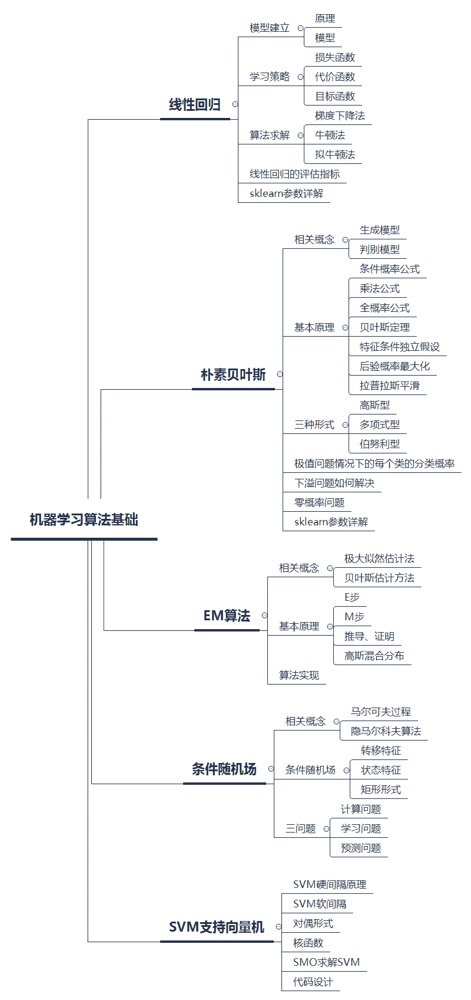
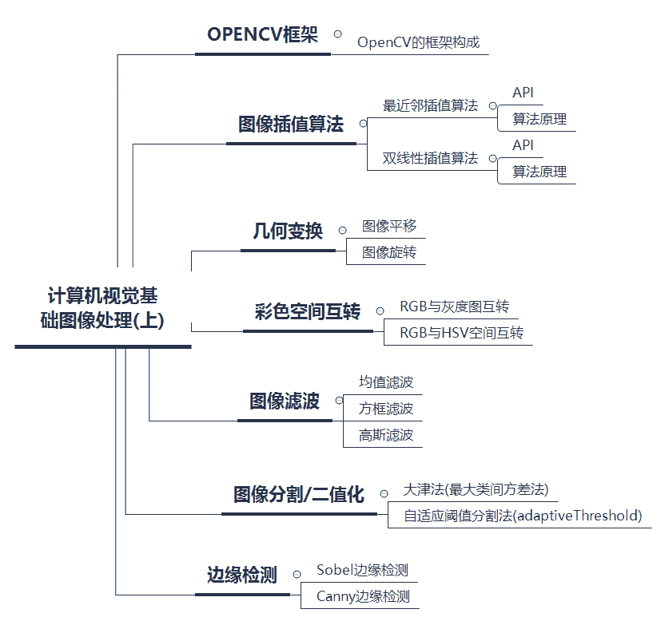
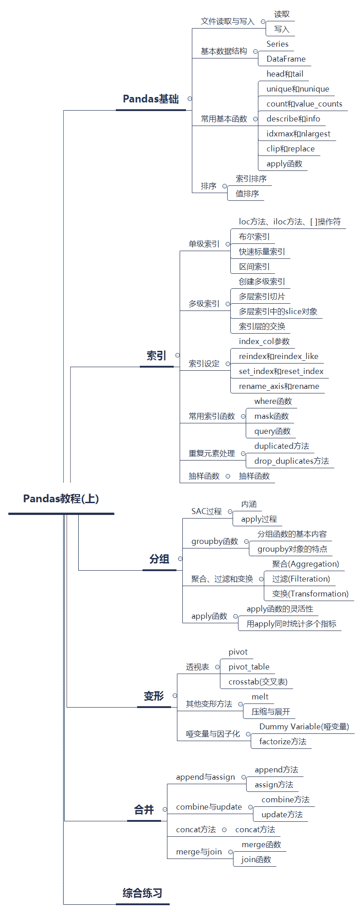
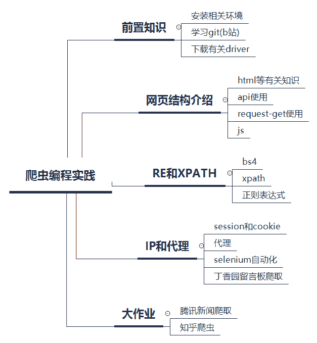

 Datawhale学习 

**主办：****Datawhale，人民邮电出版社异步社区**

寄语：本次组队学习涵盖了机器学习算法、计算机视觉、Pandas、爬虫编程实践四个模块的内容。

第十期：Datawhale联合伯禹教育、和鲸科技发起「深度学习」公益学习；第十一期：Datawhale联合阿里天池，组织了「数据挖掘」入门学习，同时发起数据挖掘入门赛事；本期组队学习，Datawhale将联合异步社区，共同发起机器学习算法、计算机视觉、Pandas及爬虫编程实践的组队学习。

## 关于开源

**开源目的**：Datawhale作为开源组织，更多是希望营造互促的学习氛围和纯粹的学习环境，所有学习内容和学习规划都将开源在Datawhale Github上，方便大家有监督和无监督学习，从而帮助到更多学习者成长。同时也希望成长后的学习者参与到开源贡献，进行迭代完善，形成良性循环。

**开源地址：**

https://github.com/datawhalechina/team-learning

**组队学习**：关于组队学习，顾名思义，就是一群志同道合的小伙伴聚集一起，一起学习，一起讨论，一起组队打boss，一起克服拖延症。其实没有老师，没有教学，有的是一群热爱学习和渴望改变的小伙伴，交流学习，互促共进。

事不宜迟，来看看这次有哪些学习内容吧。

## 机器学习算法

**开源贡献**：赵楠、杨开漠、谢文昕、张雨

*   赵楠

*   技术和算法工作者

    知乎：https://zhuanlan.zhihu.com/mrhomer

*   杨开漠

    五邑大学计算机硕士

    Github：https://github.com/km1994

*   谢文昕

    上海交通大学博士

*   张雨

    复旦大学在读博士

    Github：https://github.com/Drizzle-Zhang

**开源路线**：机器学习算法基础学习路径



**定位人群**：有概率论、矩阵运算、微积分、最优化理论等基础数学知识。

**开****源地址**：

*   https://github.com/datawhalechina/team-learning/blob/master/机器学习算法基础

**延伸阅读**：

*   《机器学习精讲》

*   https://www.epubit.com/bookDetails?id=UB6ca56d535c5c5

## 计算机视觉基础：图像处理(上)

**开源贡献**：王程伟、任乔牧、张强、李芝翔

*   王程伟

    南昌航空大学硕士

    博客：https://blog.csdn.net/weixin_40647819

*   任乔牧

    东南大学硕士

    知乎：http://www.zhihu.com/people/AlbertRen

*   张强

    宁波大学计算机硕士

    Github：https://github.com/QiangZiBr

*   李芝翔

    华北电力大学硕士，主要方向计算机视觉

    GitHub：https://sandy1230.github.io/

**开源路线**：计算机视觉基础图像处理(上)学习路径



**定位人群**：有C++编程基础，对学习计算机视觉有需求的学员。

**开源地址**：

https://github.com/datawhalechina/team-learning/tree/master/计算机视觉基础：图像处理（上）

**延伸阅读**：

*   《计算机视觉度量深入解析》

*   https://www.epubit.com/bookDetails?id=N23670

## Pandas教程(上)

**开源贡献**：耿远昊、谢文睿

*   耿远昊

*   华东师范大学在读

    Github：https://github.com/GYHHAHA

*   谢文睿

    北京工业大学硕士，南瓜书项目发起人

    GitHub：https://github.com/Sm1les

**开源路线**：Pandas学习路径



**定位人群**：有python语言编程基础，对学习数据分析有需求的学员。

**开源地址**：

https://github.com/datawhalechina/team-learning/blob/master/Pandas教程（上）

**延伸阅读**：

*   《“笨办法”学Python 3》

*   https://www.epubit.com/bookDetails?id=N92

## Python爬虫编程实践

**开源贡献**：艾春辉、陈信达、叶梁、杨石雄

*   艾春辉

    华北电力大学信息与计算科学专业在读

    Github：https://github.com/shiyanlou-015555

*   陈信达

    华北电力大学

    博客：www.chenxindaaa.com

*   叶梁

    上海立信会计金融学院，南瓜书项目参与人

*   杨石雄

    电子科技大学硕士 

    博客：https://blog.csdn.net/Eric___Young

**开源路线**：爬虫编程实践路径



**定位人群**：有python语言编程基础，对学习爬虫技术有需求的学员。

**开源地址**：

https://github.com/datawhalechina/team-learning/tree/master/Python爬虫编程实践

**延伸阅读**：

*   《用Python写网络爬虫（第2版）》

*   https://www.epubit.com/bookDetails?id=N33225

## 参与学习

**学习规则**

1\. 组织学习本身非盈利目的，避免非学习占用名额，需交9.9元督促金，完成所有学习后返还；

2\. 需要有一个CSDN或Github等记录学习的帐号；

3\. 按照任务安排进行学习，完成后写学习笔记blog；

4\. 每次任务截止之前在群内填写问卷打卡(发blog链接)，遇到问题可在群内讨论；

5\. 未按时打卡的同学视为自动放弃，流出学习群。

**报名方式**

**4月18日15:00**在Datawhale社群（高校群和在职群）分享本次组队学习入群二维码。未在社群的小伙伴，可在公众号后台回复关键词“**在校**”或“**在职**”进Datawhale社群（已在社群的小伙伴请勿重复加入！）

## 最后

组队学习只是提供了好的学习环境，学习内容及资料都已开源在Datawhale Github上，未能参加也可以根据开源路线自行学习。组织不易，欢迎点亮在看，留言自己的学习期望和对学习活动的建议，我们将邀请5位走心评论，直接给予名额。

*开源学习路线：https://github.com/datawhalechina/team-learning*

```
 “在看，给开源贡献者点赞↓ 
```