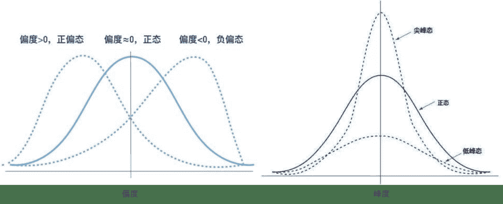
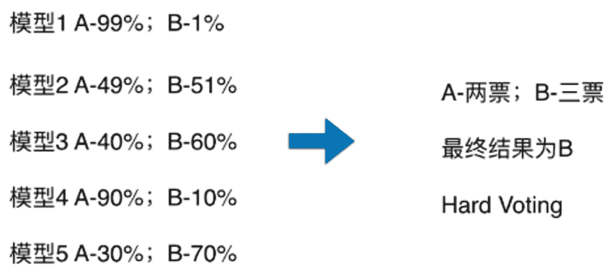
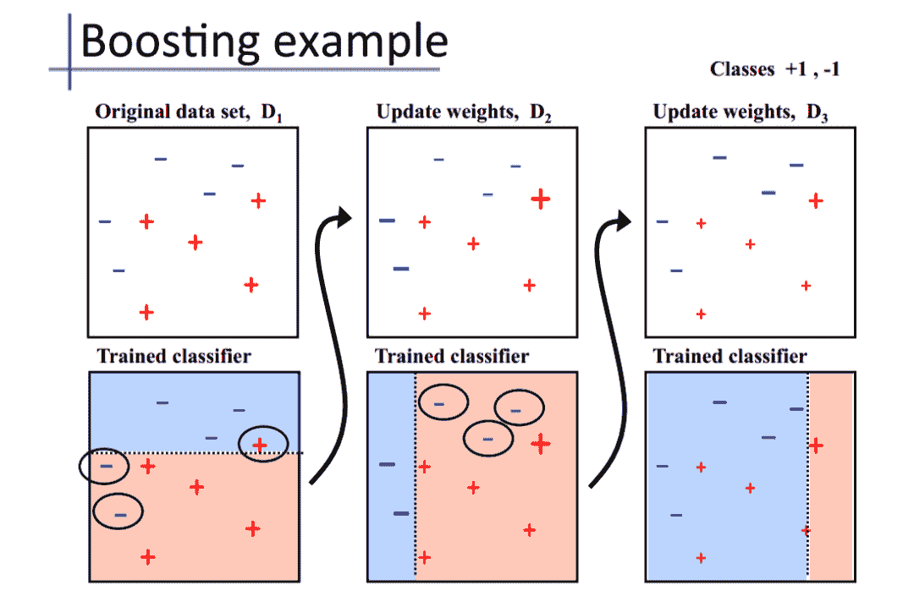
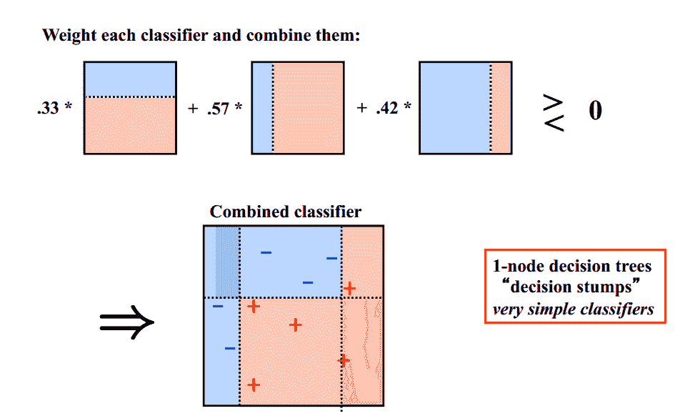

 Datawhale 

**作者：王瑞楠、吴忠强、徐韬、田杨军**

摘要：入门数据挖掘，必须理论结合实践。本文梳理了数据挖掘知识体系，帮助大家了解和提升在实际场景中的数据分析、特征工程、建模调参和模型融合等技能。

## 数据分析

探索性数据分析（Exploratory Data Analysis，EDA）是指对已有数据在尽量少的先验假设下通过作图、制表、方程拟合、计算特征量等手段探索数据的结构和规律的一种数据分析方法。


**常用的第三方库**

**数据科学库**

*   pandas：用于分组、过滤和组合数据，还提供了时间序列功能。

*   numpy：处理大型的多维数组和矩阵

*   scipy：用于解决线性代数、概率论、积分计算等任务

**数据可视化库**

*   matplotlib：构建各种图表，从直方图和散点图到非笛卡尔坐标图等

*   seaborn：提供了丰富的可视化图库，包括时间序列、联合图和小提琴图等复杂的类型。

**常用函数**

**数据简略观测**

*   head()：观察数据读取是否准确，常读取前5行数据。

*   shape：读取数据集的维度。

**数据总览**

*   describe()：包含每列的统计量，个数、平均值、方差、最小值、中位数、最大值等。

*   数据类型info()：了解数据每列的type，了解是否存在除了nan以外的特殊符号异常。

**数据检测**

**缺失值检测**

*   查看每列的存在nan情况

*   排序函数sort_values()：将数据集依照某个字段中的数据进行排序,该函数即可根据指定列数据也可根据指定行的

*   可视化nan值与缺失值

**异常值检测**

*   3σ原则：拉依达准则，该准则具体来说，就是先假设一组检测数据只含有随机误差，对原始数据进行计算处理得到标准差，然后按一定的概率确定一个区间，认为误差超过这个区间的就属于异常值。

*   箱线图：依据实际数据绘制，真实、直观地表现出了数据分布的本来面貌，且没有对数据作任何限制性要求（3σ原则要求数据服从正态分布或近似服从正态分布），其判断异常值的标准以四分位数和四分位距为基础。

**预测分布**

**总体分布概况：**

*   无接触约翰逊分布：

*   正态分布


很多模型假设数据服从正态分布，数据整体服从正态分布，样本均值和方差则相互独立。当样本不服从正态分布时，可以做如下转换：

*   线性变化z-scores：基于原始数据的均值（mean）和标准差（standard deviation）进行数据的标准化。将A的原始值x使用z-score标准化到x’

*   Boxcox变换：一种广义幂变换方法，是统计建模中常用的一种数据变换，用于连续的响应变量不满足正态分布的情况。

*   yeo-johnson变换：是幂变换（power transformation）的方法之一，通过构建一组单调函数对随机变量进行数据变换。

**查看skeness 和kurtosis**

*   skeness：衡量随机变量概率分布的不对称性，是相对于平均值不对称程度的度量，通过对偏度系数的测量，我们能够判定数据分布的不对称程度以及方向。

*   kurtosis：研究数据分布陡峭或平滑的统计量，通过对峰度系数的测量，我们能够判定数据相对于正态分布而言是更陡峭/平缓。



**预测值的具体频数**

当某范围预测值很少时，可将其当作异常值处理填充或删除。若频数很失常，需对数据进行处理，例如进行log变换，使数据分布较均匀，可据处理后的数据进行预测，这也是预测问题常用的技巧。

**特征分析**

**数字特征**

*   相关性分析：对两个或多个具备相关性的变量元素进行分析，从而衡量两个变量因素之间的相关密切程度。

*   特征的偏度和峰度

*   数字特征分布可视化

*   *   pd.melt()：处理数据，透视表格，可将宽数据转化为长数据，以便于后续分析。形成的数据即为，键：各特征名称，值：特征对应的值

    *   sns.FacetGrid() ：先sns.FacetGrid()画出轮廓,再map()填充内容

    *   sns.pairplot()：展示变量两两之间的关系（线性或非线性，有无较为明显的相关关系）。

**类别特征**

*   unique分布：对于一维数组或者列表，unique函数去除其中重复的元素，并按元素由大到小返回一个新的无元素重复的元组或者列表。

*   可视化：

*   *   箱型图可视化：直观识别数据中的离群点，判断数据离散分布情况，了解数据分布状态。

    *   小提琴图可视化：用于显示数据分布及概率密度，这种图表结合了箱形图和密度图的特征，主要用来显示数据的分布形状

    *   柱形图可视化类别

    *   每个类别频数可视化

## 数据清洗

数据和特征决定了机器学习的上限，而模型和算法只是逼近这个上限而已。俗话说：garbage in, garbage out。分析完数据后，特征工程前，必不可少的步骤是对数据进行清洗。

数据清洗作用是利用有关技术如数理统计、数据挖掘或预定义的清理规则将脏数据转化为满足数据质量要求的数据。主要包括缺失值处理、异常值处理、数据分桶、特征归一化/标准化等流程。


**缺失值处理**

关于缺失值处理的方式， 有几种情况：

*   不处理：针对xgboost等树模型，有些模型有处理缺失的机制，所以可以不处理；

*   如果缺失的太多，可以考虑删除该列；

*   插值补全（均值，中位数，众数，建模预测，多重插补等）；

*   分箱处理，缺失值一个箱。

**异常值处理**

常用的异常值处理操作包括BOX-COX转换（处理有偏分布），箱线图分析删除异常值， 长尾截断等方式， 当然这些操作一般都是处理数值型的数据。

*   BOX-COX转换：用于连续的变量不满足正态的时候，在做线性回归的过程中，一般需要做线性模型假定。

*   箱线图分析：依据实际数据绘制，真实、直观地表现出了数据分布的本来面貌，其判断异常值的标准以四分位数和四分位距为基础。

**数据分桶**

连续值经常离散化或者分离成“箱子”进行分析, 为什么要做数据分桶呢？

*   离散后稀疏向量内积乘法运算速度更快，计算结果也方便存储，容易扩展；

*   离散后的特征对异常值更具鲁棒性，如 age>30 为 1 否则为 0，对于年龄为 200 的也不会对模型造成很大的干扰；

*   LR 属于广义线性模型，表达能力有限，经过离散化后，每个变量有单独的权重，这相当于引入了非线性，能够提升模型的表达能力，加大拟合；

*   离散后特征可以进行特征交叉，提升表达能力，由 M+N 个变量编程 M*N 个变量，进一步引入非线形，提升了表达能力；

*   特征离散后模型更稳定，如用户年龄区间，不会因为用户年龄长了一岁就变化

当然还有很多原因，LightGBM 在改进 XGBoost 时就增加了数据分桶，增强了模型的泛化性。现在介绍数据分桶的方式有：

*   等频分桶：区间的边界值要经过选择,使得每个区间包含大致相等的实例数量。比如说 N=10 ,每个区间应该包含大约10%的实例。

*   等距分桶：从最小值到最大值之间,均分为 N 等份；

*   Best-KS分桶：类似利用基尼指数进行二分类；

*   卡方分桶：自底向上的(即基于合并的)数据离散化方法。它依赖于卡方检验：具有最小卡方值的相邻区间合并在一起,直到满足确定的停止准则。

**数据转换**

数据转换的方式有：

*   数据归一化(MinMaxScaler)；

*   标准化(StandardScaler)；

*   对数变换(log1p)；

*   转换数据类型(astype)；

*   独热编码(OneHotEncoder)；

*   标签编码(LabelEncoder)；

*   修复偏斜特征(boxcox1p)等。

## 特征工程

特征工程指的是把原始数据转变为模型训练数据的过程，目的是获取更好的训练数据特征。特征工程能使得模型的性能得到提升，有时甚至在简单的模型上也能取得不错的效果。


**特征构造**

特征构造的时候需要考虑数值特征，类别特征，时间特征。

*   数值特征，一般会尝试一些它们之间的加减组合（当然不要乱来，根据特征表达的含义）或者提取一些统计特征

*   类别特征，我们一般会尝试之间的交叉组合，embedding也是一种思路

*   时间特征，这一块又可以作为一个大专题来学习，在时间序列的预测中这一块非常重要，也会非常复杂，需要就尽可能多的挖掘时间信息，会有不同的方式技巧。

**特征选择**

特征选择主要有两个功能：

*   减少特征数量、降维，使模型泛化能力更强，减少过拟合

*   增强对特征和特征值之间的理解

通常来说，从两个方面考虑来选择特征：

*   特征是否发散：如果一个特征不发散，例如方差接近于0，也就是说样本在这个特征上基本上没有差异，这个特征对于样本的区分并没有什么用。

*   特征与目标的相关性：这点比较显见，与目标相关性高的特征，应当优选选择。

根据特征选择的形式又可以将特征选择方法分为3种：

*   过滤法(Filter)：按照发散性或者相关性对各个特征进行评分，设定阈值或者待选择阈值的个数，选择特征。

*   包装法(Wrapper)：根据目标函数（通常是预测效果评分），每次选择若干特征，或者排除若干特征。

*   嵌入法(Embedded)：先使用某些机器学习的算法和模型进行训练，得到各个特征的权值系数，根据系数从大到小选择特征。

**降维**

数据特征维度太高，首先会导致计算很麻烦，其次增加了问题的复杂程度，分析起来也不方便。但盲目减少数据的特征会损失掉数据包含的关键信息，容易产生错误的结论，对分析不利。

PCA降维方法，既可以减少需要分析的指标，而且尽可能多的保持了原来数据的信息。

但要注意一点， 特征选择是从已存在的特征中选取携带信息最多的，选完之后的特征依然具有可解释性，而PCA，将已存在的特征压缩，降维完毕后不是原来特征的任何一个，也就是PCA降维之后的特征我们根本不知道什么含义了。

## 建模调参

特征工程也好，数据清洗也罢，都是为最终的模型来服务的，模型的建立和调参决定了最终的结果。模型的选择决定结果的上限， 如何更好的去达到模型上限取决于模型的调参。

建模的过程需要我们对常见的线性模型、非线性模型有基础的了解。模型构建完成后，需要掌握一定的模型性能验证的方法和技巧。同时，还需要掌握贪心调参、网格调参、贝叶斯调参等调参方法。


**回归分析**

回归分析是一种统计学上分析数据的方法，目的在于了解两个或多个变量间是否相关、相关方向与强度，并建立数学模型。以便通过观察特定变量（自变量），来预测研究者感兴趣的变量（因变量）

**长尾分布**

这种分布会使得采样不准，估值不准，因为尾部占了很大部分。另一方面，尾部的数据少，人们对它的了解就少，那么如果它是有害的，那么它的破坏力就非常大，因为人们对它的预防措施和经验比较少。

**欠拟合与过拟合**

**欠拟合**：训练的模型在训练集上面的表现很差，在验证集上面的表现也很差。即训练误差和泛化误差都很大。**原因**：

*   模型没有很好或足够数量的训练训练集

*   模型的训练特征过于简单

**过拟合**：模型的训练误差远小于它在测试数据集上的误差。即训练误差不错，但是泛化误差比训练误差相差太多。**原因**：

*   模型没有很好或足够数量的训练训练集

*   训练数据和测试数据有偏差

*   模型的训练过度，过于复杂，没有学到主要的特征

由此引出模型复杂度概念模型中的参数，一个简单的二元线性的函数只有两个权重，而多元的复杂的函数的权重可能会什么上百上千个。


模型复杂度太低（参数过少），模型学习得太少，就难以训练出有效的模型，便会出现欠拟合。模型复杂度太高（参数很多），即模型可训练空间很大，容易学习过度，甚至于也将噪声数据学习了，便会出现过拟合。

**正则化**

损失函数后面会添加一个额外项，称作 L1正则化 和 L2正则化，或者 L1范数和 L2范数。

L1正则化和L2正则化可以看做是损失函数的惩罚项。所谓『惩罚』是指对损失函数中的某些参数做一些限制。对于线性回归模型，使用L1正则化的模型建叫做Lasso回归，使用L2正则化的模型叫做Ridge回归（岭回归）。

**正则化说明**：

*   L1正则化是指权值向量 中各个元素的绝对值之和，通常表示为

*   L2正则化是指权值向量 中各个元素的平方和然后再求平方根（可以看到Ridge回归的L2正则化项有平方符号）

**正则化作用**：

*   L1正则化可以产生稀疏权值矩阵，即产生一个稀疏模型，可以用于特征选择

*   L2正则化可以防止模型过拟合（overfitting）

**调参方法**

**贪心调参 （坐标下降）**

坐标下降法是一类优化算法，其最大的优势在于不用计算待优化的目标函数的梯度。与坐标下降法不同的是，不循环使用各个参数进行调整，而是贪心地选取了对整体模型性能影响最大的参数。参数对整体模型性能的影响力是动态变化的，故每一轮坐标选取的过程中，这种方法在对每个坐标的下降方向进行一次直线搜索（line search）

**网格调参GridSearchCV**

作用是在指定的范围内可以自动调参，只需将参数输入即可得到最优化的结果和参数。相对于人工调参更省时省力，相对于for循环方法更简洁灵活，不易出错。

**贝叶斯调参**

贝叶斯优化通过基于目标函数的过去评估结果建立替代函数（概率模型），来找到最小化目标函数的值。贝叶斯方法与随机或网格搜索的不同之处在于，它在尝试下一组超参数时，会参考之前的评估结果，因此可以省去很多无用功。

超参数的评估代价很大，因为它要求使用待评估的超参数训练一遍模型，而许多深度学习模型动则几个小时几天才能完成训练，并评估模型，因此耗费巨大。贝叶斯调参发使用不断更新的概率模型，通过推断过去的结果来“集中”有希望的超参数。

这里给出一个模型可调参数及范围选取的参考：


## 模型融合

通过融合多个不同的模型，可能提升机器学习的性能。这一方法在各种机器学习比赛中广泛应用， 也是在比赛的攻坚时刻冲刺Top的关键。而融合模型往往又可以从模型结果，模型自身，样本集等不同的角度进行融合。


模型融合是比赛后期一个重要的环节，大体来说有如下的类型方式

1\. 简单加权融合：

*   回归（分类概率）：算术平均融合（Arithmetic mean），几何平均融合（Geometric mean）；

*   分类：投票（Voting）；

*   综合：排序融合(Rank averaging)，log融合。

2\. stacking/blending:

*   构建多层模型，并利用预测结果再拟合预测。

3\. boosting/bagging:

*   多树的提升方法，在xgboost，Adaboost,GBDT中已经用到。

**简单算术平均法**

Averaging方法就多个模型预测的结果进行平均。这种方法既可以用于回归问题，也可以用于对分类问题的概率进行平均。

**加权算术平均法**

这种方法是平均法的扩展。考虑不同模型的能力不同，对最终结果的贡献也有差异，需要用权重来表征不同模型的重要性importance。

**投票法**

假设对于一个二分类问题，有3个基础模型，现在我们可以在这些基学习器的基础上得到一个投票的分类器，把票数最多的类作为我们要预测的类别。

*   硬投票：对多个模型直接进行投票，不区分模型结果的相对重要度，最终投票数最多的类为最终被预测的类。

*   *   绝对多数投票法：最终结果必须在投票中占一半以上。

    *   相对多数投票法：最终结果在投票中票数最多。



*   软投票：增加了设置权重的功能，可以为不同模型设置不同权重，进而区别模型不同的重要度。


**堆叠法（Stacking）**

stacking 就是当用初始训练数据学习出若干个基学习器后，将这几个学习器的预测结果作为新的训练集，来学习一个新的学习器。对不同模型预测的结果再进行建模。


## **混合法（Blending）**

## Blending采用了和stacking同样的方法，不过只从训练集中选择一个fold的结果，再和原始特征进行concat作为元学习器meta learner的特征，测试集上进行同样的操作。

把原始的训练集先分成两部分，比如70%的数据作为新的训练集，剩下30%的数据作为测试集。

*   第一层，我们在这70%的数据上训练多个模型，然后去预测那30%数据的label，同时也预测test集的label。

*   在第二层，我们就直接用这30%数据在第一层预测的结果做为新特征继续训练，然后用test集第一层预测的label做特征，用第二层训练的模型做进一步预测。

## **Bagging**

## Bagging基于bootstrap（自采样），也就是有放回的采样。训练子集的大小和原始数据集的大小相同。Bagging的技术使用子集来了解整个样本集的分布，通过bagging采样的子集的大小要小于原始集合。

*   采用bootstrap的方法基于原始数据集产生大量的子集

*   基于这些子集训练弱模型base model

*   模型是并行训练并且相互独立的

*   最终的预测结果取决于多个模型的预测结果

## **Boosting**

## Boosting是一种串行的工作机制，即个体学习器的训练存在依赖关系，必须一步一步序列化进行。Boosting是一个序列化的过程，后续模型会矫正之前模型的预测结果。也就是说，之后的模型依赖于之前的模型。

其基本思想是：增加前一个基学习器在训练训练过程中预测错误样本的权重，使得后续基学习器更加关注这些打标错误的训练样本，尽可能纠正这些错误，一直向下串行直至产生需要的T个基学习器，Boosting最终对这T个学习器进行加权结合，产生学习器委员会。

下面给出加州大学欧文分校Alex Ihler教授的两页PPT：





## 延伸阅读

```
【1】数据分析：
https://mp.weixin.qq.com/s/IOlHIEIQhuIaubTeP4o39w
【2】特征工程：
https://mp.weixin.qq.com/s/A2vChdNXRqlddyIY0iJ3zQ
【3】建模调参：
https://mp.weixin.qq.com/s/cXSRcMk_0t8RxSaKb0sHww
【4】模型融合：
https://mp.weixin.qq.com/s/fsT6rzpL5cuzh2usNjzzbA
【5】完整视频：
https://www.bilibili.com/video/BV1ye411x7oU
【6】理论实践：
https://tianchi.aliyun.com/competition/entrance/231784/information（阿里天池-零基础入门数据挖掘） 
```

**完整项目实践（共100多页）*后台回复 **数据挖掘电子版** 获取* 


“在看，为沉迷学习**点赞**↓