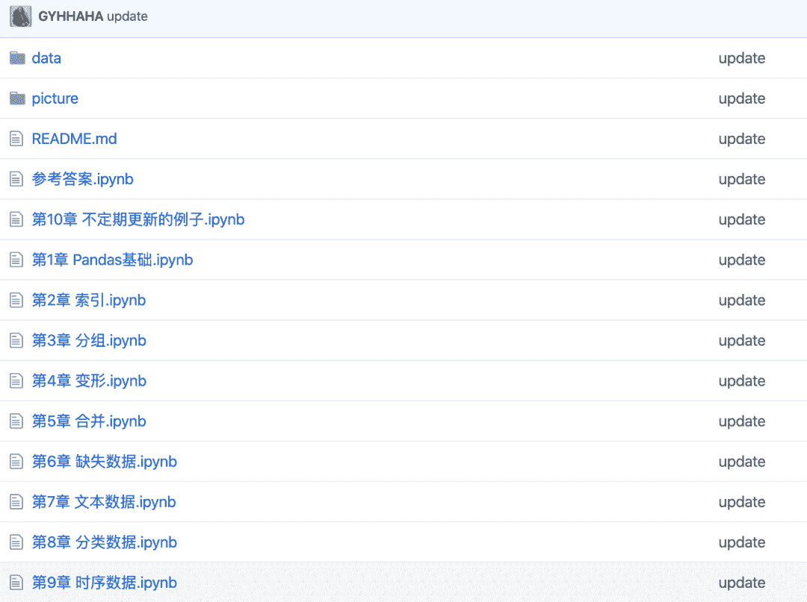
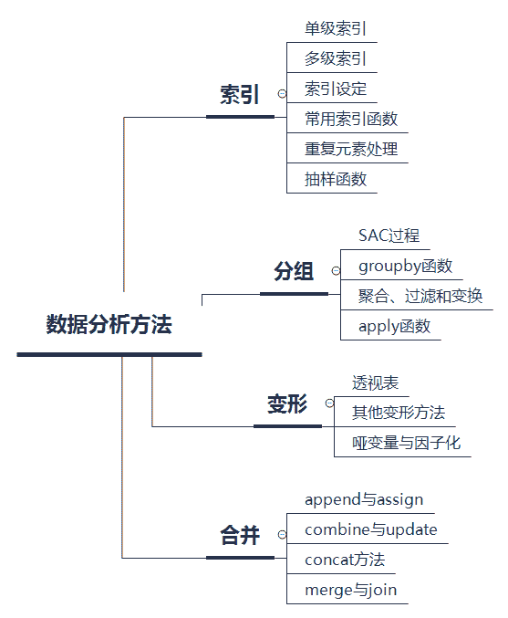
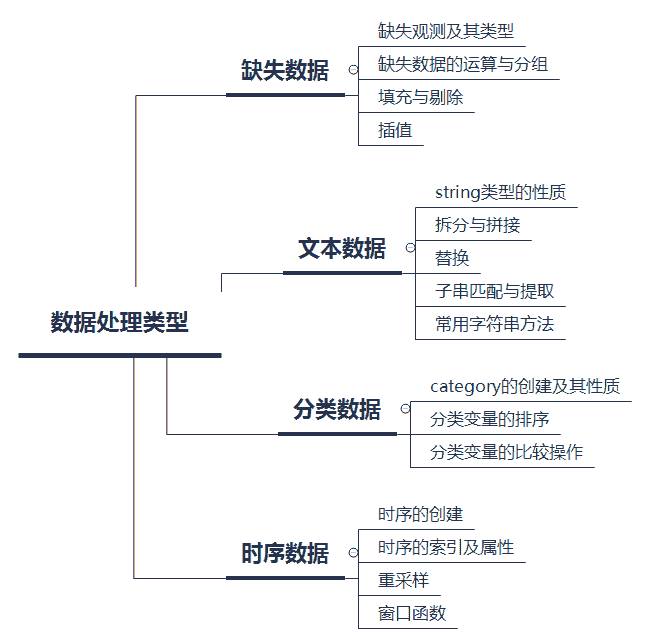
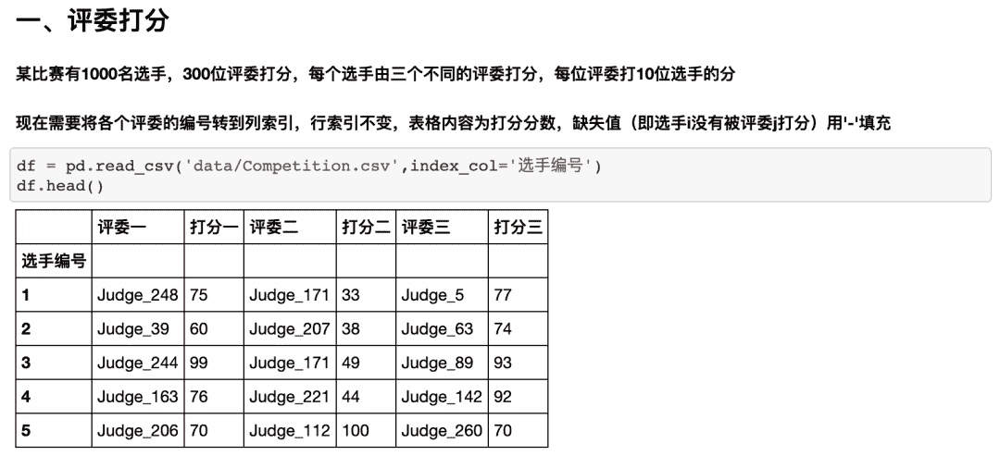
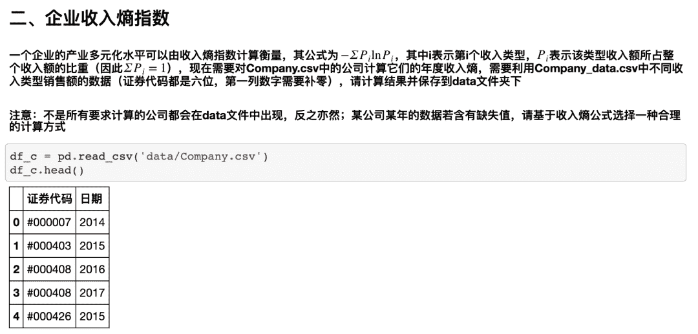

 Datawhale 

**作者：耿远昊、Datawhale团队**

寄语：Pandas 是基于Numpy的一种工具，是为了解决数据分析任务而创建的，其纳入了大量库和一些标准的数据模型，提供了大量能使我们快速便捷地处理数据的函数和方法。

Datawhale又一开源项目来了！Joyful-Pandas（顾名思义：快乐学习Pandas）由Datawhale成员耿远昊发起，作者结合了三份经典教材的学习经验，历时2个多月时间，结合最新的Pandas版本，编写了这套关于Pandas的开源教程，梳理了Pandas的主线内容。

本项目从Pandas基础、数据分析方法、数据处理类型及动手实践四个模块，对Pandas进行系统性学习。同时，针对内容设计了大量的练习及案例，理论结合实践，巩固数据处理分析能力。

## 开源初衷

在使用Pandas之前，几乎所有的大型表格处理问题都是用xlrd/xlwt和python循环实现，虽然这已经几乎能完成一切的需求，但其缺点也显而易见，其一就是速度问题，其二就是代码的复用性几乎为0。

曾经也尝试过去零星地学Pandas，但不得不说这个包实在太过庞大，每次使用总觉得盲人摸象，每个函数的参数也很多，学习的路线并不是十分平缓。如果你刚刚手上使用Pandas，那么在碎片的学习过程中，报错是常常发生的事，并且很难修（因为不理解内部的操作），即使修好了下次又不会，令人有些沮丧。

2019年秋季，笔者偶然接触到了Theodore Petrou所著的《Pandas Cookbook》。快速地学习了一遍后，发现之前很多搞不清的概念得到了较好的解答。

之后，笔者又逐步地对着官方的User Guide一字一句查看，通读后建立了大的一些宏观概念。这是一个非常重要的台阶，官方的教程总是会告诉你重点在哪里。

经过了一段时间的思考，结合《Python for Data Analysis》(作者：Pandas之父)、《Pandas Cookbook》和官方的User Guide，按照自己的思路编写了一套关于Pandas的教程，完整梳理Pandas的主线内容。

本着杜绝浅尝辄止的理念，本教程涉及了每个部分的核心概念和函数。最后，希望达到“所写所得即所想”的境界，这大概需要更多的实践，也是笔者努力实现的目标方向。

关于项目的名字，笔者在原先使用Pandas时非常的痛苦（Painful），那现在是时候转变为“Joyful-Pandas”了！

## 开源内容

Joyful-Pandas共有11个章节，分成了4个模块，涵盖了Pandas基础内容，数据处理过程中常用的数据类型，及在处理过程中涉及到的操作。具体目录详情如下：

**模块1 Pandas基础（第1章）**

拿到数据后必然先要读取，分析完了数据必然是要保存；读取数据之后，我们面对了怎样的对象（Series? or Dataframe?）是第一重要的课题，因此了解序列和数据框的常规操作及其组件（component）便是必须涉及的内容。

****模块2 数据分析方法（第2-5章）****

对于一个Series或DataFrame而言，Pandas存在以下四种操作：

*   索引：如果一个操作使得它的元素信息减少了，那就对应了索引；

*   分组：数据被分组，从组内提取了关键的信息，使得数据信息被充分地使用；

*   变形：数据呈现结构或形态上的变化，使得我们更容易地能够地进一步处理数据；

*   合并：如果一个操作使得原本不属于这个数据框的信息被加入了进来，那往往是涉及到了合并操作。

笔者从数据信息增减的角度出发，将四类操作拆解成了3个板块，分别对应了本项目第2-5章的内容，串联了官方文档关于数据框操作的全部内容，帮助学习者系统梳理。

******模块3 数据处理类型（第6-9章）******

对序列和数据框这两种容器，Pandas基础对其的结构有了初步理解，而四种操作熟悉了所有相关操作，那么下面就要关心其中的数据类型。

其中涉及来四类特殊的数据类型：

*   缺失型数据

*   文本型数据

*   分类型数据

*   时间序列型数据

四种数据类型，分别对应了6-9章的内容。同时，在缺失型数据和文本型数据中，详细涉及Pandas1.0版本新的Nullable和string数据类型，这也是从Pandas 0.x升级后具有最大改动的方面。

********模块4 动手实践（第10章）********

最终，教程1-9章的最后都会加入两个练习题帮助读者巩固本章所学，每一道题都有多个小问，难度逐个上升，与知识点紧密结合。同时在第10章中会添加若干难度不一的综合问题，目前已添加两个经典案例，供大家学习实践。

最后，所有的练习都提供了**参考答案**，保证了完备性。

## 写到最后

除了教程主体和练习内容，每一章还加入了问题部分。每个章节设置3-8个问题，问题的内容包含了对知识点的细化认识、对复杂知识点的梳理、对某个函数或Pandas对象设计的思考等，如果在完成练习的基础上认真思考了这些问题，那么相信你对Pandas的掌握程度一定会再上一层楼，最后衷心的希望你能快乐的学习Pandas，体验用Pandas进行数据处理和分析的乐趣。

## 开源地址

https://github.com/datawhalechina/joyful-pandas（或阅读原文）

“为开源贡献者**点赞**↓“