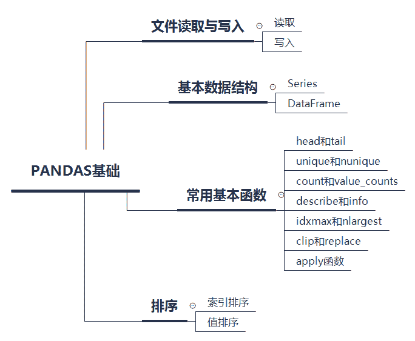
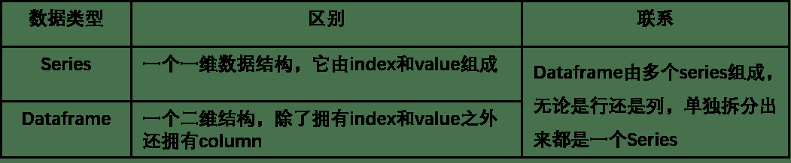
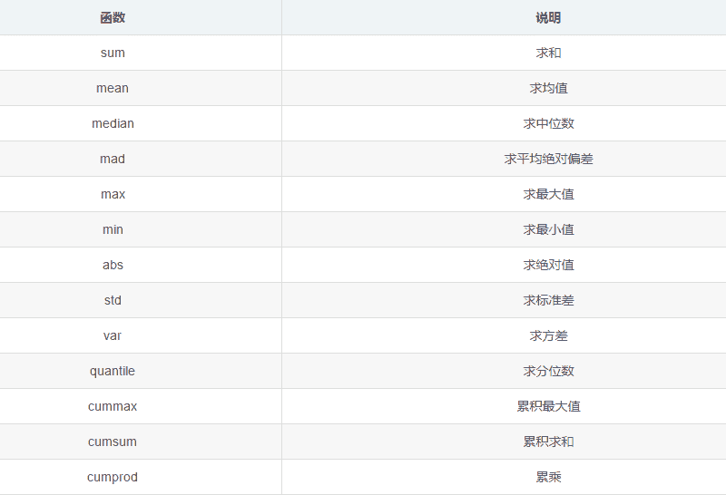

 Datawhale学习 

**作者：杨煜，Datawhale成员**

寄语：本文对Pandas基础内容进行了梳理，从文件读取与写入、Series及DataFrame基本数据结构、常用基本函数及排序四个模块快速入门。同时，文末给出了问题及练习，以便更好地实践。

## 知识体系框架



完整学习教程已开源，开源链接：

https://github.com/datawhalechina/joyful-pandas

## 文件的读取和写入

```
import pandas as pd
import numpy as np
# 加上这两行可以一次性输出多个变量而不用print
from IPython.core.interactiveshell import InteractiveShell
InteractiveShell.ast_node_interactivity = "all"
# 查看版本
pd.__version__
pd.set_option('display.max_columns', None) 
```

### 读取

Pandas常用的有以下三种文件：

*   csv文件

*   txt文件

*   xls/xlsx文件

读取文件时的注意事项：

*   文件路径是否正确，相对路径 ./data

*   编码方式 分隔符

*   列名

```
#读取csv文件
df = pd.read_csv('./data./table.csv')
df.head()
#读取txt文件，直接读取可能会出现数据都挤在一列上
df_txt = pd.read_table('./data./table.txt')
#df_txt = pd.read_table('./data./table.csv', sep=",")
df_txt.head()
#读取xls/xlsx文件
df_excel = pd.read_excel('./data./table.xlsx')
df_excel.head() 
```

写入

将结果输出到csx、txt、xls、xlsx文件中

```
df.to_csv('./new table.csv')
df.to_excel('./new table.xlsx') 
```

## 基本数据结构

## Pandas处理的基本数据结构有 Series 和 DataFrame。两者的区别和联系见下表：



### Series

**1\. 创建**

```
Series常见属性有 values， index， name， dtype 
```

```
s = pd.Series(np.random.randn(5), index=['a','b','c','d','e'], 
              name='this is a series', dtype='float64') 
```

**2\. 访问Series属性**

```
s.values, s.index, s.name, s.dtype 
```

**3. 取出某元素**

通过索引取数或通过位置取数

```
s['a'], s[2:], s[1] 
```

**4. 调用方法**

```
s.mean(), s.sum(), s.hist() 
```

### DataFrame

### **1\. 创建**

```
DataFrame基本属性有 values、columns、index
```

```
df = pd.DataFrame({'col1':list('abcde'), 'col2':range(5,10),
     'col3':[1.3,2.5,3.6,4.6,5.8]}, index=list('一二三四五')) 
```

**2\. 取一列/取一行**

```
df['col1'], df[:1]
type(df), type(df['col1']), type(df[:1] 
```

**3\. 修改行或列名**

```
df.rename(index={'一':'one'}, columns={'col1':'new_col1'}) 
```

**4\. 调用属性和方法**

```
df.index, df.columns, df.values, df.shape, df.mean() 
```

**5\. 索引对齐特性**

```
这是Pandas中非常强大的特性，在对多个DataFrame 进行合并或者加减乘除操作时，行和列的索引都重叠的时候才能进行相应操作，否则会使用NA值进行填充。 
```

```
df1 = pd.DataFrame({'A':[1,2,3]},index=[1,2,3])
df2 = pd.DataFrame({'A':[1,2,3]},index=[3,1,2])
df1-df2 #由于索引对齐，因此结果不是0 
```

**6\. 列的删除**

对于删除而言，可以使用drop函数或del或pop。

方法1：直接drop不会影响原DataFrame，设置inplace=True后会直接在原DataFrame中改动；

```
df.drop(index='五', columns='col1') 
```

方法2：del会直接改变原Dataframe；

```
df['col1']=[1,2,3,4,5]
del df['col1'] 
```

```
方法3：pop方法直接在原来的DataFrame上操作，且返回被删除的列，与python中的pop函数类。 
```

```
df['col1']=[1,2,3,4,5]
df.pop('col1') 
```

**7\. 列的添加**

方法1：直接新增；

```
df1['B'] = list('abc') 
```

```
方法2：用assign方法，不会改变原DataFrame； 
```

```
df1.assign(C=pd.Series(list('def'))) 
```

```
方法3：df.assign 效果其实是左连接，之所以会出现NaN的情况，是因为C和df的索引不一致导致。打印一下可以看到，df的索引是1-3，而C默认的是0-4。 
```

```
C=pd.Series(list('def')) 
```

**8\. 根据类型选择列**

```
df.select_dtypes(include=['number'])
df.select_dtypes(include=['float']) 
```

### Series和DataFrame相互转换

**1\. DataFrame转换为Series**

就是取某一列的操作

```
s = df.mean()
s.name = 'to_DataFrame' 
```

**2\. Series转换为DataFrame**

使用to_frame() 方法

```
s.to_frame()
# T符号可以进行转置操作
s.to_frame().T 
```

### 常用基本函数

首先，读取数据

```
df = pd.read_csv('./data/table.csv') 
```

**1. head & tail**

用来显示数据头部或者尾部的几行数据，默认是5行。可以指定n参数显示多少行

```
df.head()
df.tail()
df.head(6) 
```

#### **2\. unique & nunique**

unique显示所有的唯一值是什么；nunique显示有多少个唯一值。需要注意的是：需要在具体列上操作，本身DataFrame并没有这两个方法

```
df['Physics'].unique()
df['Physics'].nunique() 
```

#### **3\. count & value_counts**

count返回非缺失值元素个数；value_counts返回每个元素有多少个值，也是作用在具体某列上

```
df['Physics'].count()
df['Physics'].value_counts() 
```

#### **4\. describe & info**

info() 函数返回有哪些列、有多少非缺失值、每列的类型；describe() 默认统计数值型数据的各个统计量，可以自行选择分位数位置。非数值型特征需要单独调用describe方法。

```
df.info()
df.describe()
# describe()可以自行选择分位数位置
df.describe(percentiles=[.05, .25, .75, .95])
# 非数值型特征需要单独调用describe方法
df['Physics'].describe() 
```

#### **5\. idxmax & nlargest**

idxmax函数返回最大值对应的索引，在某些情况下特别适用，idxmin功能类似；nlargest函数返回前几个大的元素值，nsmallest功能类似，需要指定具体列

```
df['Math'].idxmax()
df['Math'].max()
df['Math'].nlargest(2) 
```

#### **6\. clip & replace**

clip和replace是两类替换函数：

*   clip是对超过或者低于某些值的数进行截断，numpy.clip(a, a_min, a_max, out=None)

*   replace是对某些值进行替换

```
df['Math'].head()
# 低于33的全都显示为33， 高于80的全都显示为80
df['Math'].clip(33,80).head() 
df['Math'].mad()

df['Address'].head()
df['Address'].replace(['street_1','street_2'],['one','two']).head()

# 还可以通过字典方式修改
df.replace({'Address':{'street_1':'one','street_2':'two'}}).head( 
```

#### **7\. apply**

apply和匿名函数 lambda结合使用，可以很方便的进行一些数据处理。对于Series，它可以迭代每一列的值(行)操作；对于DataFrame，它可以迭代每一个列操作。

```
# 遍历Math列中的所有值，添加！
df['Math'].apply(lambda x:str(x)+'!').head() 
 # 先是遍历所有列，然后遍历每列的所有的值，添加！
df.apply(lambda x:x.apply(lambda x:str(x)+'!')).head() 
```

### 排序

**1\. 索引排序**

```
 #set_index函数可以设置索引，将在下一章详细介绍
df.set_index('Math').head()
 #可以设置ascending参数，默认为升序，True
df.set_index('Math').sort_index().head() 
```

**2\. 值排序**

```
df.sort_values(by='Class').head()
df.sort_values(by=['Address','Height']).head() 
```

### 问题及练习

问题

1\. Series和DataFrame有哪些常见属性和方法？

*   Series

| 属性方法 | 说明 |
| s.values | 访问s的内容 |
| s.index | 获取s的索引 |
| s.iteritems() | 获取索引和值对 |
| s.dtype | 获取s的数据类型 |
| s[‘a’] | 根据索引访问元素 |

*   DataFrame

| 属性方法 | 说明 |
| df.index | 访问行索引 |
| df.columns | 访问列索引 |
| df.values | 访问数据 |
| df.shape | 获取df的数据形状 |

2\. value_counts会统计缺失值吗？

    答：value_counts不会统计缺失值。

3. 与idxmax和nlargest功能相反的是哪两组函数？

    答：idxmin和nsmallest。

4\. 在常用函数一节中，由于一些函数的功能比较简单，因此没有列入，现在将它们列在下面，请分别说明它们的用途并尝试使用。



5\. df.mean(axis=1)是什么意思？它与df.mean()的结果一样吗？第一问提到的函数也有axis参数吗？怎么使用？

 答：df.mean(axis=1)意思是对df按列求均值；axis = 0表示保持列标签不变，对行进行操作；axis = 1表示保持行标签不变，对列进行操作。

练习

**练习1：**

现有一份关于美剧《权力的游戏》剧本的数据集，请解决以下问题：
（a）在所有的数据中，一共出现了多少人物？
（b）以单元格计数（即简单把一个单元格视作一句），谁说了最多的话？
（c）以单词计数，谁说了最多的单词？

```
import pandas as pd
df = pd.read_csv('data/Game_of_Thrones_Script.csv')
df.head()
df['Name'].nunique()
df['Name'].value_counts() 
```

**练习2：**

现有一份关于科比的投篮数据集，请解决如下问题：
（a）哪种action_type和combined_shot_type的组合是最多的？
（b）在所有被记录的game_id中，遭遇到最多的opponent是一个支？

```
import pandas as pd
df = pd.read_csv('data/Kobe_data.csv',index_col='shot_id')
df.head()
pd.Series(list(zip(df['action_type'],df['combined_shot_type']))).value_counts()
df.groupby('game_id')['opponent'].unique().astype('str').value_counts() 
```

**文中相关数据集*后台回复 **Pandas** 获取*


“为沉迷学习**点赞**↓“