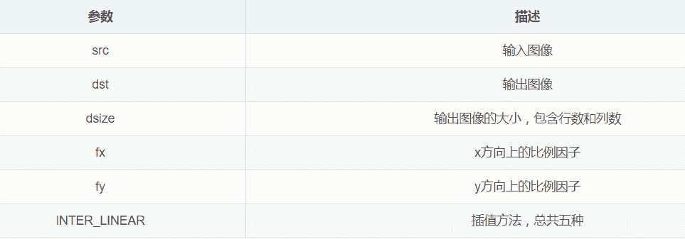

 Datawhale学习 

**作者：姚童，Datawhale优秀学习者**

寄语：本文梳理了最近邻插值法、双线性插值法和三次样条插值法的原理，并以图像缩放为例，对原理进行了C++及Python实现。

# 在图像处理中，几何变换是将一幅图像映射到另外一幅图像内的操作，可以大概分为放缩、翻转、仿射(平移、旋转)、透视、重映射几部分。

# 在几何变换时，无法给有些像素点直接赋值，例如，将图像放大两倍，必然会多出一些无法被直接映射的像素点，对于这些像素点，通过插值决定它们的值。且不同插值方式的结果不同。

# 在一幅输入图像[u，v]中，灰度值仅在整数位置上有定义。然而，输出图像的坐标映射回原图像后，一般为非整数的坐标。所以输出图像[x，y]的灰度值，一般由非整数坐标来决定，非整数坐标的像素值，就需要插值算法来进行处理。常见的插值算法有最近邻插值、双线性插值和三次样条插值。

## 本文目标

*   了解插值算法与常见几何变换之间的关系

*   理解插值算法的原理

*   掌握OpenCV框架下插值算法API的使用

## 插值算法原理介绍

近邻插值算法

1\. 原理简介

将目标图像中的点，对应到原图像中后，找到最相邻的整数坐标点的像素值，作为该点的像素值输出。


如上图所示，目标图像中的某点投影到原图像中的位置为点P，与P距离最近的点为Q11，此时易知，f(P)=f(Q11)。

2. 例子说明

如图所示：


将一幅3*3图像放大到4*4，用f(x , y)表示原图像，h(x ,y)表示目标图像，我们有如下公式：


3. 缺点

由最邻近插值法，放大后的图像有很严重的马赛克，会出现明显的块状效应；缩小后的图像有很严重的失真。

这是一种最基本、最简单的图像缩放方式。变换后的每个像素点的像素值，只由原图像中的一个像素点确定。例如上面，点(0,0.75)的像素只由(0,1)确定，这样的效果显然不好。点(0,0.75)的像素不止和(0,1)有关，和(0,0)也有关，只是(0,1)的影响更大。如果可以用附近的几个像素点按权重分配，共同确定目标图像某点的像素，效果会更好。下面的双线性插值就解决了这个问题。

双线性插值算法

1\. 线性插值

在讲双线性插值之前先了解一下线性插值。线性插值：使用连接两个已知量的直线来确定在这两个已知量之间的一个未知量的值。线性插值形式：


如下图所示：


线性插值多项式：


其实，即使x不在x0到x1之间，这个公式也是成立的。在这种情况下，这种方法叫作线性外插。

线性插值的误差：线性插值其实就是拉格朗日插值有2个结点时的情况。插值余项为：


从插值余项可以看出，随着二阶导数的增大，线性插值的误差增大。即函数的曲率越大，线性插值近似的误差也越大。

举个例子。下图中，左边为原图像，拉伸后，理想的输出图像的像素分布应该为绿色箭头指向的，但是按照线性插值，会得到红色箭头指向的结果。


2\. 双线性插值

双线性插值形式：


双线性插值是线性插值在二维时的推广,在两个方向上共做了三次线性插值。定义了一个双曲抛物面与四个已知点拟合。

具体操作为在X方向上进行两次线性插值计算，然后在Y方向上进行一次插值计算。如下图所示：


首先，f(x,y)为二元函数，假设我们知道f(x0,y0),f(x1,y1),f(x0,y1),f(x1,y0)四个点的值。这四个点确定一个矩形，我们希望通过插值得到矩形内任意点的函数值。

先在x方向上进行两次线性插值，得到：


再在y方向上进行一次线性插值，得到：


综合起来，就是双线性插值的结果：


如果选择一个坐标系统，使f(x)已知的四个点的坐标分别为(0,0),(0,1),(1,0),(1,1)，那么确定一个单位正方形，四个点分别为正方形的四个顶点：

*   首先对上端的两个顶点进行线性插值得：


*   再对底端的两个顶点进行线性插值得：


*   最后，做垂直方向的线性插值，以确定：


*   整理得插值公式的化简形式：


3\. 原图像和目标图像的几何中心对齐

在计算目标图像中，对应原图像的虚拟坐标点时，一般的变换是：


这种变换下，原图像的有些点没有参与计算。举个例子，把9∗9的原图像缩小成3∗3，原图像的原点(0,0)和目标图像的原点(0,0)都为左上角，目标图像右上角的坐标为(0,2)，对应原图像的坐标为(0∗(9/3),2∗(9/3))=(0,6)。目标图像右边已经没有点了，(0,6)右边的像素点也就用不到了。

原图像和目标图像的像素之间的对应关系如下：


从图片可以看出，只有圈出来的红色部分参与运算了。目标图像的每个像素点的灰度值相对于原图像偏左上方，右下角的元素实际上没有参与运算。

为了让原图像和目标图像的中心对齐，我们规定另外一种变换方式：


就是在原来的变换后面加了调节因子：

0.5(src_width/dst_width−1)


这种变换下，目标图像的中心点(1,1)，对应了原图像的中心点(4,4)，两个图像的几何中心重合，能充分利用原图像的点，并且目标图像的每个像素点之间都是等间隔的，也都和两边有一定的边距。实际上，在openCv中也是这种变换方式。


4\. cv.resize()的计算过程

对于缩小图像，目标图像中每个点都能找到原图像中包围它的四个临近点，每个点都进行双线性插值即可。

对于放大图像，边界附近的点经过坐标变换可能超出了原图像的范围。举个例子，把3∗3的原图像放大成4∗4。

*   中间的点：双线性插值

中间的点都能在原图像中找到包围它的四个临近点，做双线性插值即可。

*   边界上的点（除了顶点）：线性插值

例如，目标图像中的点(1,3)，对应原图像的点为(0.625,2.125)，原图像的纵坐标最大为2，找不到包围(0.625,2.125)四个点，所以用它最邻近的两个点(0,2)和(1,2)做线性插值（外插），得到目标图像中(1,3)的像素值。

*   四个顶点：最邻近插值

例如，目标图像右上角的顶点(0,3)，对于原图像的点为(0,2.125)，直接用原图像右上角的顶点(0,2)作为它的值即可。

**计算过程：**

用h(x,y)表示目标图像，f(x,y)表示原图像

*   中间的点：双线性插值


*   边界上的点（除了顶点）：线性插值


*   四个顶点：最邻近插值


可以用代码举例子测试：

```
import cv2
import numpy as np
src = np.array([[56,23,15],[65,32,78],[12,45,62]],dtype=np.uint8)
print(src)
dst = cv2.resize(src,dsize=(4,4),interpolation=cv2.INTER_LINEAR)
print(dst) 
```

三次样条插值算法

给定n+1个点，a=x_0<x_1<...<x_n=b，以及他们的函数值f(x_i)，i=0,1,2,...n上，确定一个三次多项式：


每个三次多项式中有四个未知参数，有n个区间，n个多项式，共4n个未知参数。我们知道“n个未知数需要n个已知条件确定唯一解”，所以要确定这4n个未知参数，共需要4n个已知条件。

每个三次多项式满足如下条件：


以上共4n−2个条件，还差2个条件，由如下三种边界条件确定：


4n个条件有了，就可以确定每个区间上的三次多项式。

对于每个区间内的点，就可以用Si(x)得到插值结果。三次样条插值具有良好的收敛性，稳定性和光滑性，优点明显，是非常重要的插值工具。

这里主要了解三次样条插值的作用，具体的推导过程比较繁琐，想了解的可以查阅资料。

## 两种映射方法

向前映射和向后映射都是将一个图像经过几何变换得到另一个图像的过程，它们的目的都是得到目标图像的像素，只是方式不同。

向前映射

图像变换的本质是将像素点的坐标通过某一种函数关系，映射到另外的位置。

向前映射的过程可以分解为两步：**坐标变换+分配像素值**

向前映射的坐标变换：由原图像坐标推算该像素在目标图像的位置。

例如，我们知道原图像的某个像素点的坐标(x,y)，变换后在新图像的坐标为(x′,y′)，变换后的坐标一般为非整数的，而非整数的坐标是没意义的，所以将这个点的像素按权重分配给周围四个像素点。对于变换后坐标仍为整数的点，直接把其像素值分配给目标图像中对应的点即可。将原图像的所有像素点都进行这种坐标变换和分配像素值，就得到了新图像。

所以，新图像的每个像素点的像素值，都是由它周围的非整数坐标的点的像素分配给它并叠加得到的（或者直接等于某个整数坐标点的像素值）。由于这个分配、叠加的特性，向前映射法有时也叫像素移交映射。

对于向前映射，虽然原图像中的每个点分配系数之和为1。但目标图像上每个点的像素值是多个分配值叠加而成的，所以不能保证所有分配到其上的权重之和为1。因此必须记录下所有分配到其上的权重并累加起来，最后利用累加权重进行归一化，才能得到正确的插值结果。所以，确定目标图像某一点的像素值，需要遍历原图像的所有像素值，进行坐标变换和分配像素值。这是向前映射法的缺点。

向后映射

向后映射的过程可以分解为两步：坐标变换+插值。

向后映射的坐标变换：由输出图像坐标反过来推算该像素在原图像的位置

前面说的几种插值方式，就是向后映射的例子。是由目标图像的坐标算出在原图像的坐标，再确定它的像素值由原图像的哪几个点按权重分配得到。然后进行插值操作，得到该点的像素值。某一点的像素值进行一次操作就可以得到，不需要遍历全部像素点。向后映射法也叫像素填充算法。向后映射法解决了漏点的问题，出现了马赛克。

## 动手实现

c++实现

**1\. 函数原型**

```
void cv::resize(InputArray src, OutputArray dst, Size dsize, double fx=0, double fy=0, int interpolation=INTER_LINEAR ) 
```



**2\. 插值方式**


注：目标图像大小可以通过“参数dsize”和“参数fx和fy”两种方式确定。两种参数不能同时为0。

*   通过参数dsize确定

dsize的第一个参数为列数，第二个参数为行数，都为整数。若指定了dsize的值，无论是否指定了fx和fy的值，都由参数dsize来决定目标图像的大小。

*   通过参数fx和fy确定

如果dsize的值None，目标图像的大小通过fx和fy确定。fx为列数缩放的倍数，fy为行数缩放的倍数。

**3.代码实现**

```
#include <opencv2/opencv.hpp>
#include <iostream>

using namespace cv;
using namespace std;

int main(int argc, char* argv[])
{
  Mat img = imread(""C:/Users/94890/Desktop/picture/luelue.jpg"");
  if (img.empty())
  {
    cout << "无法读取图像" << endl;
    return 0;
  }

   int height = img.rows;//原图像行数
   int width = img.cols;//原图像列数
   // 缩小图像，比例为(0.2, 0.2)，行列数必须为整数
  Size dsize = Size(round(0.2 * width), round(0.2 * height));
  Mat shrink;
      //使用双线性插值
  resize(img, shrink, dsize, 0, 0, INTER_LINEAR);

  // 在缩小图像的基础上，放大图像，比例为(1.5, 1.5)
  float fx = 1.5;
  float fy = 1.5;
  Mat enlarge1, enlarge2;
  resize(shrink, enlarge1, Size(), fx, fy, INTER_NEAREST);
  resize(shrink, enlarge2, Size(), fx, fy, INTER_LINEAR);

  // 显示
  imshow("src", img);
  imshow("shrink", shrink);
  imshow("INTER_NEAREST", enlarge1);
  imshow("INTER_LINEAR", enlarge2);

   //保存图像
   imwrite("C:/Users/94890/Desktop/picture/shrink2.jpg",shrink);
   imwrite("C:/Users/94890/Desktop/picture/INTER_NEAREST2.jpg", enlarge1);
   imwrite("C:/Users/94890/Desktop/picture/INTER_LINEAR2.jpg", enlarge2);
  waitKey(0);
      return 0;
} 
```

原图像


0.2倍缩小，双线性插值


缩小后的图像1.5倍放大，最近邻插值


缩小后的图像1.5倍放大，双线性插值


**python实现**

**1. 函数原型**

```
#dst为输出图像，类型与原图像相同
dst = cv2.resize(src, dsize[, dst[, fx[, fy[, interpolation]]]]) 
```


**2. 插值方式**

通常，缩小图像使用区域插值（cv.INTER_AREA），放大图像使用三次样条插值（cv.INTER_CUBIC）和双线性插值（cv.INTER_LINEAR）。三次样条插值方式速度较慢，双线性插值方式较快且效果也不错。


**3\. 代码实现**

```
import cv2

if __name__ == "__main__":
    img = cv2.imread('C:/Users/94890/Desktop/smile.jpg', cv2.IMREAD_UNCHANGED)
    print('Original shape : ', img.shape)#img.shape属性种第一个值对应行数，第二个值对应列数
    width = int(img.shape[1] * 0.3)#列数必须是整数
    height = int(img.shape[0] * 0.3)#行数必须是整数
    dsize = (width, height)#dsize属性值第一个数对应列数，第二个数对应行数
    # resize image
    resized = cv2.resize(img, dsize, interpolation=cv2.INTER_LINEAR)#双线性插值方式
    print('Resized shape : ', resized.shape)

    fx = 1.5#列数变为原来的1.5倍
    fy = 1.5#行数变为原来的1.5倍
    resized1 = cv2.resize(resized, dsize=None, fx=fx, fy=fy, interpolation=cv2.INTER_NEAREST)#最邻近插值
    resized2 = cv2.resize(resized, dsize=None, fx=fx, fy=fy, interpolation=cv2.INTER_LINEAR)#双线性插值
    print('Resized1 shape : ', resized1.shape)

    #显示图像
    cv2.imshow("Resized image", resized)
    cv2.imshow("INTER_NEAREST image", resized1)
    cv2.imshow("INTER_LINEAR image", resized2)
    #保存图像
    cv2.imwrite("C:/Users/94890/Desktop/Resized_image.jpg", resized)
    cv2.imwrite("C:/Users/94890/Desktop/INTER_NEAREST_image.jpg", resized1)
    cv2.imwrite("C:/Users/94890/Desktop/INTER_LINEAR_image.jpg", resized2)
    cv2.waitKey(0)
    cv2.destroyAllWindows() 
```

原图像


0.3倍缩小，双线性插值


缩小后的图像1.5倍放大，最近邻插值


缩小后的图像1.5倍放大，双线性插值


“为沉迷学习**点赞**↓