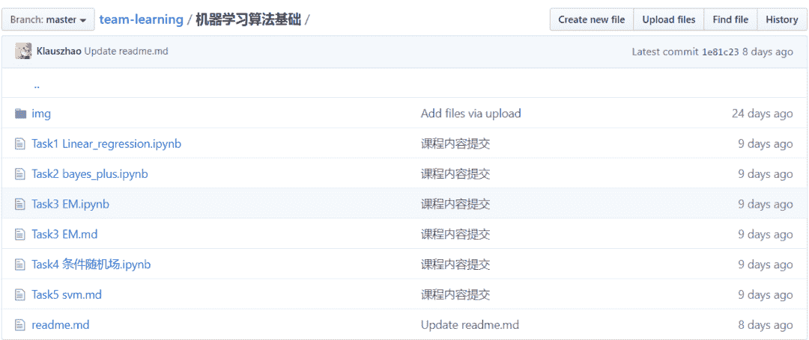
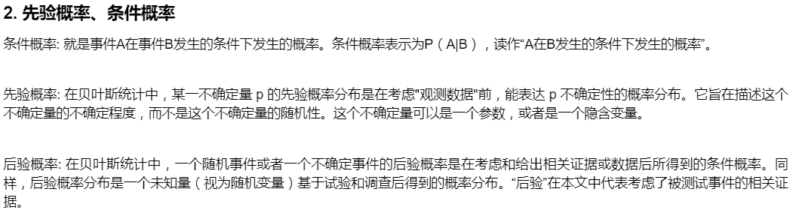
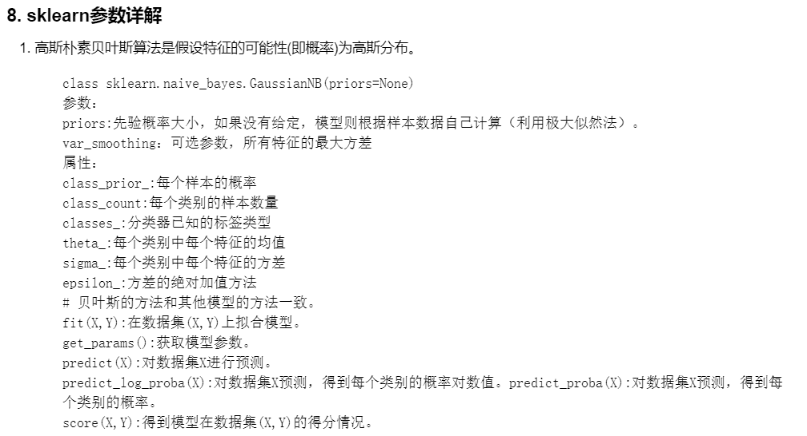

 Datawhale 

**作者：****赵楠、杨开漠、谢文昕、张雨**

寄语：本文针对5大机器学习经典算法，梳理了其模型、策略和求解等方面的内容，同时给出了其对应sklearn的参数详解和代码实现，帮助学习者入门和巩固机器学习理论知识。

作为Datawhale机器学习开源教程，主要对经典算法：线性回归、朴素贝叶斯、EM算法、条件随机场和支持向量机，给出了完整的学习路径，同时对学习内容进行梳理，并给出了Python代码实现，避免成为调包侠，做到知其然知其所以然。

## 开源贡献

**开源贡献**：赵楠、杨开漠、谢文昕、张雨

*   赵楠

*   技术和算法工作者

    知乎：https://zhuanlan.zhihu.com/mrhomer

*   杨开漠

    五邑大学计算机硕士

    Github：https://github.com/km1994

*   谢文昕

    上海交通大学博士

*   张雨

    复旦大学在读博士

    Github：https://github.com/Drizzle-Zhang

## 开源内容

机器学习初级算法共涉及五部分内容：线性回归算法、朴素贝叶斯、EM算法、条件随机场和支持向量机。

项目链接：https://github.com/datawhalechina/team-learning/blob/master/机器学习算法基础

首先，每个算法开始模块会给出本章的学习知识点梳理，帮助学习者对所学算法有一个整体宏观的认知。

然后，针对每个知识点要进行详细的讲解，帮助学习者深入学习每个知识点。

最后，将算法的sklearn参数进行了详细的介绍，并给出了Python代码实现，帮助学习者完整动手实践。

## 学习路径

下图为机器学习经典算法的完整学习路径

## 开源地址

https://github.com/datawhalechina/team-learning/blob/master/机器学习算法基础

（或阅读原文）

“为开源贡献者**点赞**↓