 Datawhale 

**作者：****瞿晓阳，AutoML书籍作者**

寄语：让计算机自己去学习和训练规则，是否能达到更好的效果呢？自动机器学习就是答案，也就是所谓“AI的AI”，让AI去学习AI。

随着深度神经网络的不断发展，各种模型和新颖模块的不断发明利用，人们逐渐意识到开发一种新的神经网络结构越来越费时费力，为什么不让机器自己在不断的学习过程中创造出新的神经网络呢？

正是出于这个构思，2017年Google推出了AutoML，一个能自主设计深度神经网络的AI网络。

自此，人工智能又有了更进一步的发展，人们开始探索如何利用已有的机器学习知识和神经网络框架来让人工智能自主搭建适合业务场景的网络，人工智能的另一扇大门被打开。

## 深度学习vs自动化深度学习

随着深度神经网络的广泛应用和不断发展，越来越强大的网络模型被构建，从AlexNet，到VGGNet，GoogleNet以及ResNet。

虽然这些模型足够灵活，但人工神经网络结构仍然需要大量的专业知识并且需要充足的时间，而且调参对于深度模型来说也是一项非常痛苦的事情，众多的超参数和网络结构参数会产生爆炸性的组合。

是否有可能使这一过程自动化，让每一个人，甚至是不了解机器学习的人可以轻松地将机器学习应用于所面临的问题，自动化深度学习（AutoDL）就是答案。

如图1所示，是现在的深度学习方法与自动化深度学习的对比图，自动化深度学习的目标是通过超参数优化的方法让机器学会自动设计网络及调参优化。

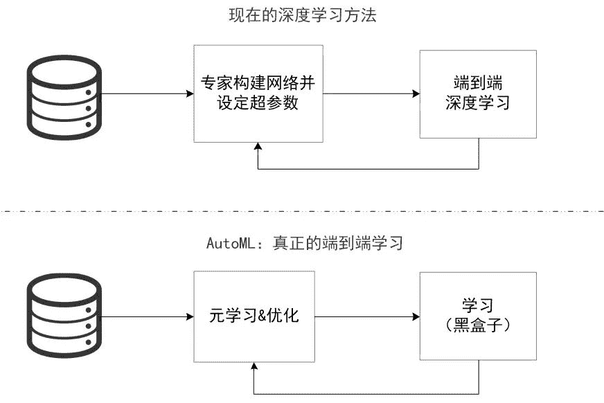图1：传统深度学习与AutoDL比较

## 什么是神经架构搜索（NAS）

神经架构搜索（NAS）是一种针对特定数据集从头开始自动设计性能良好的模型的技术，NAS技术与超参数优化所解决的问题相同：在搜索空间中找到对目标任务表现良好的网络结构。

NAS主要由三个基本问题组成，分别是搜索空间、优化方法、以及评估方法。

*   搜索空间针对目标任务定义了一组可能的神经网络结构。

*   优化方法确定如何探索搜索空间以找到好的架构。

*   评估方法评估通过优化方法考虑的每种网络结构的性能。

由于神经网络的结构和连接通常可以由可变长度的字符串指定，在实际问题中，根据特定数据集生成指定的“子网络”，通过训练得到验证集的准确性。

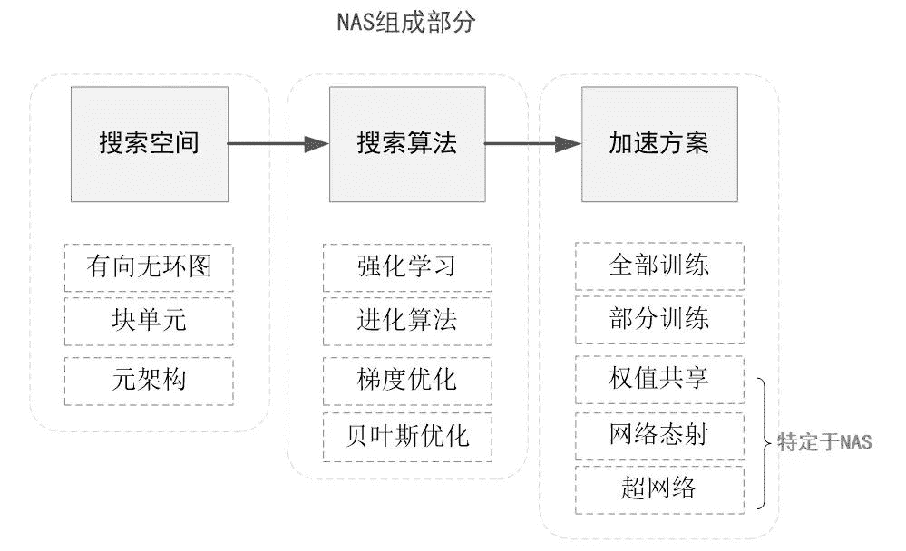

图2：NAS组件

## **搜索空间**

## 如其名，就是可供搜索的一个网络结构集合，它的数字表示为：

*   网络的结构（如：神经网络的深度，即隐藏层个数，和特定的隐藏层宽度）

*   配置（如：操作/网络间的链接类型，核的大小，过滤器的数量）

因此，给定搜索空间，可以将其中的神经网络结构编码成该空间下的表示。这种搜索空间被称为marco（宏）搜索空间。

好的搜索空间为好的搜索结果提供可能性，搜索空间的设计不断发展，除了传统的链式结构外，“多分支”结构也开始起着越来越重要的作用，启发于ResNet和DenseNet提出的跳跃连接和密集连接，这些跳跃连接也已经被加入到搜索空间的定义中。

另一个趋势是设计一个只包含一个基本单元（cell）搜索空间，被用作整个网络中的block（如卷积块）的构建。这类搜索空间被称为micro（微）搜索空间，其中搜索成本和复杂性可以被显著的降低。

除了减小搜索复杂度外，仅仅通过改变单元（cell）堆叠的数量，可以很容易地把找到的最好的block的设计推广到其他任务。

## 搜索算法

搜索算法是一个迭代过程，用于确定以何种规则来探索搜索空间。

在搜索过程的每个步骤或迭代中，一个来自于搜索空间的样本会被生成，即子网络（child network）。所有的子网络在训练集上被训练，在验证集上的准确率作为目标被优化（或者是强化学习中的奖励）。

搜索算法的目的是找到最佳子网络，例如最小化验证集损失或最大化奖励。主流的NAS搜索策略大致可以分为强化学习、进化算法和可微分的梯度下降算法。

**1\. 基于强化学习的方法**

强化学习有三个基本要素：智能体（Agent）、环境（Environment）和奖励（Reward），智能体以 “试错”的方式进行学习，通过与环境交互获得奖励来指导行为。智能体和环境之间的交互可以被视为顺序决策过程：在每个时间t，Agent在动作集合中选择动作与环境交互并接收奖励。

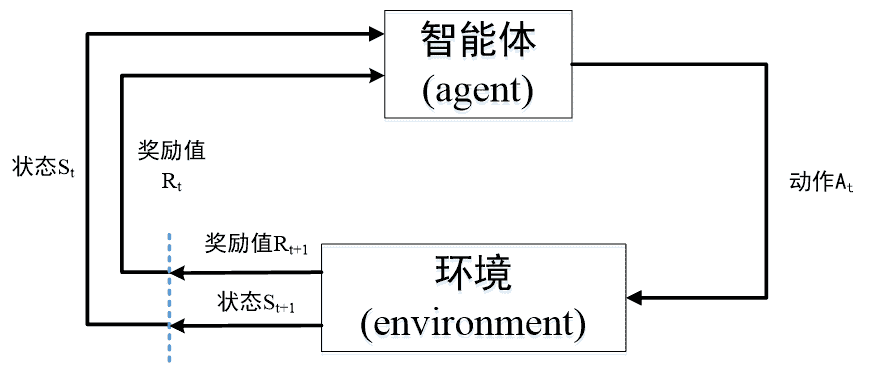

图3： 强化学习中智能体与环境的交互过程

神经架构自动搜索中，强化学习把架构的生成看成一个智能体（agent）在选择动作（action）的过程，通过在测试集上测试网络性能来获取奖励值（reward），从而指导架构的生成。

与传统的强化学习问题略有不同的是构建了一个RNN控制器，通过迭代的方式来更新控制器从而生成合适的架构。

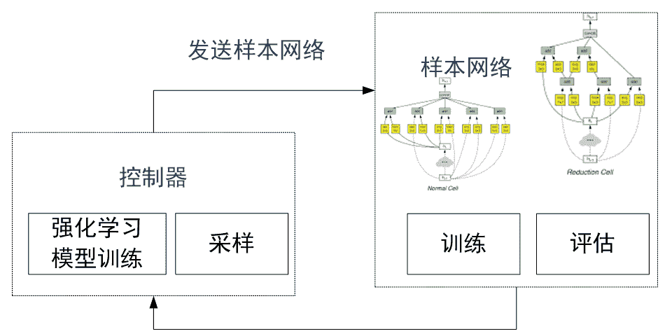

图4：基于强化学习的网络架构搜索示意图

**2\. 基于进化算法的方法**

基于进化算法的神经网络结构搜索，在演化步骤中，把子模型作为种群来进化。群体中的每个模型都是训练过的网络，并被视为个体，模型在验证集上的表现（例如，准确度）作为每个个体的质量好坏。基于进化算法神经架构搜索的通用流程如下：

*   初始化操作，对现有的各个个体进行编码，把这些个体编码成种群。

*   选择操作，从种群中根据适应度挑选出优秀的个体。

*   繁殖操作，分为两种：有性繁殖操作和无性繁殖操作，无性繁殖的操作包括变异操作，有性繁殖包括交叉操作或者组合操作。

*   网络训练操作，对上一步繁殖操作得到的所有个体神经网络进行训练，训练到收敛为止。

*   适应度计算操作，使用指定的验证集对每个已训练的网络计算验证准确率，把验证准确率作为适应度。

具体流程如下图所示：

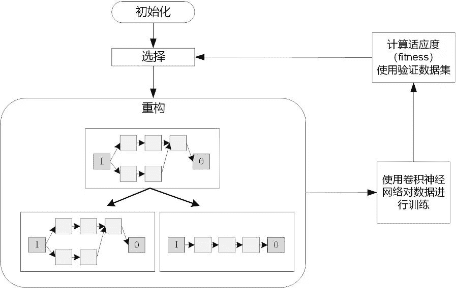

图5：  基于进化算法的神经架构搜索通用流程

**3\. 基于可微分架构搜索的方法**

可微分架构搜索方法很多种，其中比较出名的是卡内基梅隆大学提出的

DARTS（DifferentiableArchitecture Search）。

与传统的在离散的和不可微的搜索空间尚采用进化或强化学习搜索结构的方法不同，该方法是基于将结构表示的松弛化（relaxation），允许使用梯度下降来解决架构搜索的问题，所以效率可以比之前不可微的方法快几个数量级。

简单来说就是给操作（operations）的每个连接都赋一个权值alpha，优化的目的是为了通过梯度下降优化alpha矩阵，根据alpha的大小来确定连接方式。

神经网络原有的权重称为矩阵，在训练集上固定alpha矩阵的值，然后梯度下降矩阵的值，再验证集上固定矩阵的值，然后梯度下降alpha的值，循环往复直到这两个值都比较理想。

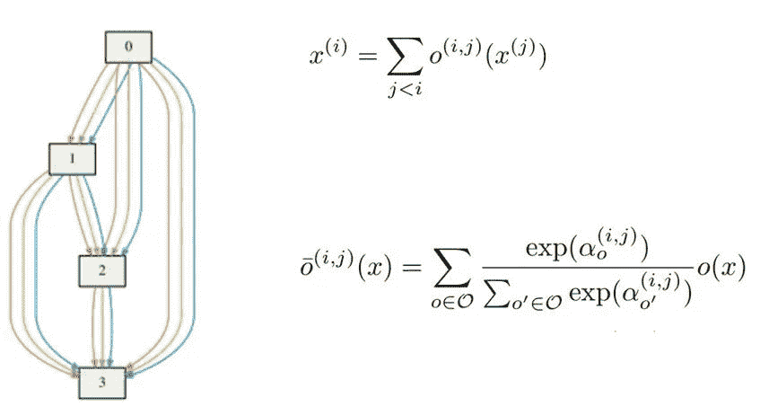

图6：DARTS搜索空间

## 加速方案

无论是基于强化学习还是进化算法的搜索，子网络都要被训练和评估，以指导搜索过程。但是从头开始训练每个自网络需要超大的资源和时间。所以NAS的加速方案被提出，主要代表方案是改进代理模型和权值共享。

**1. 改****进代理（Improve proxy）**

很明显代理模型的引入会带有误差，研究证明子网络的FLOPs（每秒计算的浮点数）和模型大小与最终准确度呈负相关，因此引入了一种应用于奖励计算的校正函数，通过早期停止获得子网络的精度，弥合代理与真实准确性之间的差距。

根据这一想法，研究者们提出了几种通过“预测”神经架构的精度来改进代理度量的方法，预计精确度较差的子网络将被暂停训练或直接放弃。以下是三种预测神经架构搜索的方法：

*   根据子网络的学习曲线预测神经架构的精度。

*   回归模型。使用基于网络设置和验证曲线的特征来预测部分训练模型的最终性能。

*   训练代理模型，基于progressively architectural properties预测子网络的准确性。

**2\. 权值共享（Weight sharing）**

在神经网络的搜索和训练过程中，涉及到很多权值和超参数，权值共享可以实现加速，在这里列举几个权值共享的经典方法：

*   在进化过程中，允许子网络继承父本的权重，而不是从头训练每个子模型。使用One shot 模型实现共享。

*   设计带有辅助超网络的“主”模型，以生成以模型架构为条件的主模型的权重。从超网络代表的分布中采样的权重。

*   使用one-shot模型，主要有两种方法：

*   *   第一种是训练表示各种候选结构的one-shot模型，然后使用预训练的one-shot模型权重在验证集上随机评估这些候选结构。

    *   另一种是使用包含整个搜索空间的one-shot模型训练所有权重，同时，使用梯度下降来优化候选结构的分布。

*   通过网络转换/态射来探索搜索空间，它使用诸如插入层或添加跳过连接之类的操作将训练好的神经网络修改为新的结构。由于网络转换/态射从现有的训练网络开始，因此重用权重并且仅需为数不多的训练迭代来完成新的结构的训练。

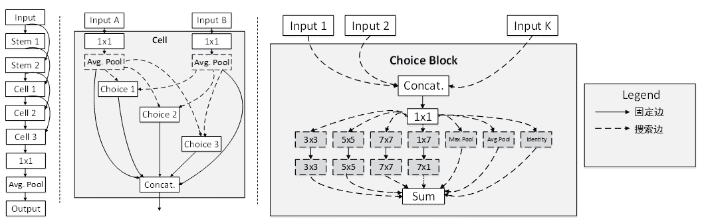

图7：one-shot结构图，实现连接无法删除而虚线连接可以删除

## 神经网络架构搜索的快速实现

使用开源的开源自动机器学习项目例如微软的NNI和亚马逊的AutoGluon可以快速实现常用NAS算法。下面简单介绍使用AutoGluon在10分钟内快速实现ENAS的过程：

**1\. 定义基础Block结构**

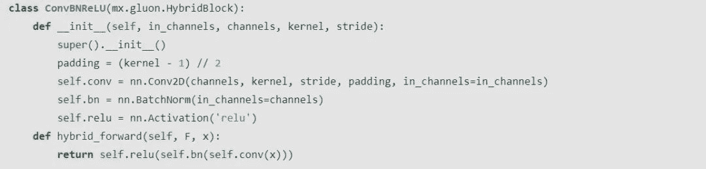

**2\. 定义ENAS单元结构**

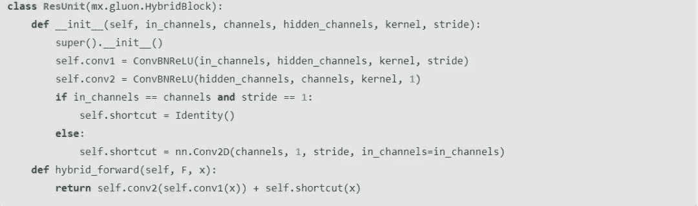

**3\. 定义超网络**

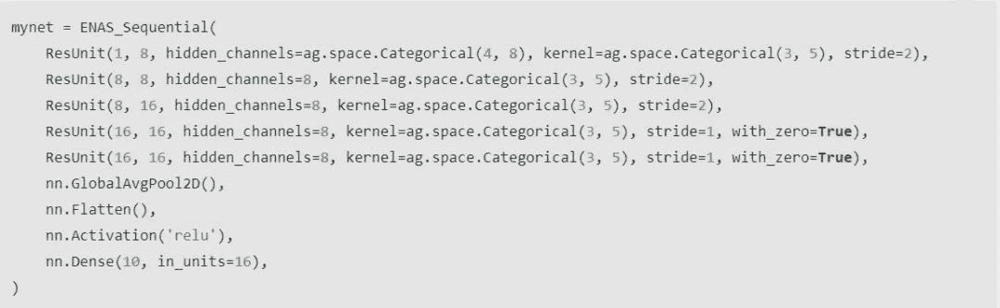

**4\. 构造ENAS_Scheduler开始训练**

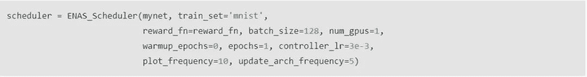

**5\. 训练结束可以查看搜索到的最佳结构**

## 总结

传统的人工智能旨在使用机器帮助人类完成特定的任务，随着人工智能的发展，在计算机领域衍生出了机器学习，机器学习旨在通过计算机程序完成对数据的分析，从而得到对世界上某件事情的预测并做出决定。当机器学习不断发展，其复杂程度也不断增加，完全依靠人为对计算机进行规定，使其按照人为设定的规则运行时，耗费了大量的人力资源。

如果让计算机自己去学习和训练规则，是否能达到更好的效果呢？自动机器学习就是答案，也就是所谓“AI的AI”，让AI去学习AI，从而减少人工的参与，让机器完成更复杂的工作，掀起下一代人工智能的浪潮。

本文摘编自《深入理解AutoML和AutoDL》，经出版方授权发布。作为国内首本系统介绍AutoML的中文书籍，该书提供了大量AutoML和AutoDL的启发性思路和理解角度，确实是一本AutoML入门的好书。

“为沉迷学习**点赞**↓