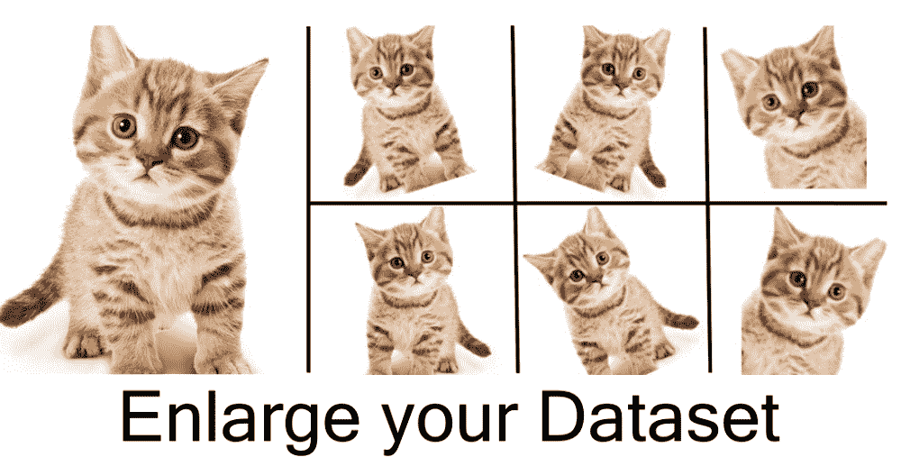
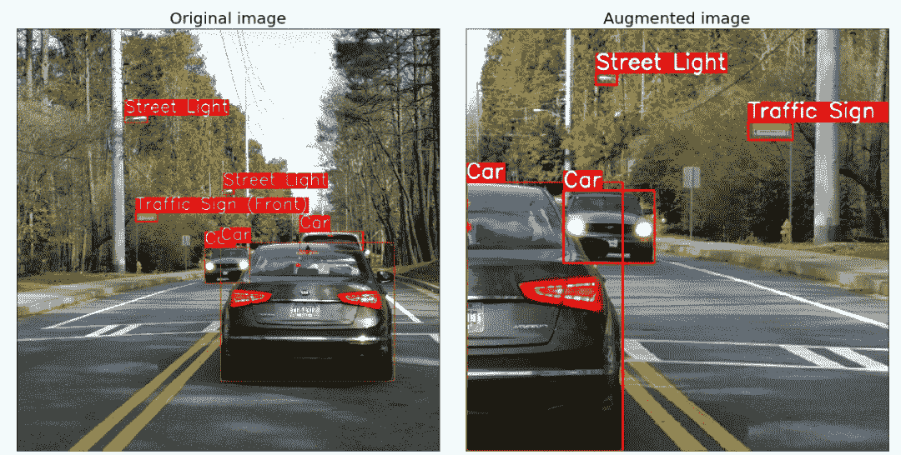
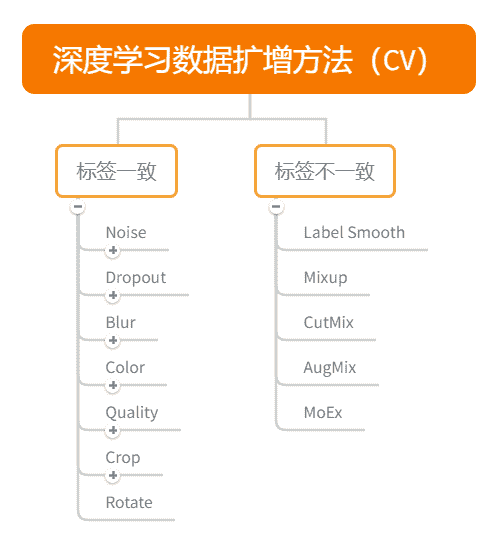
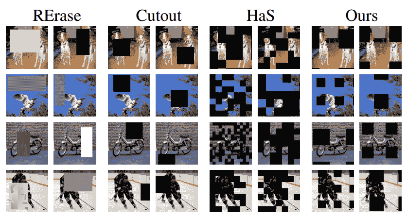
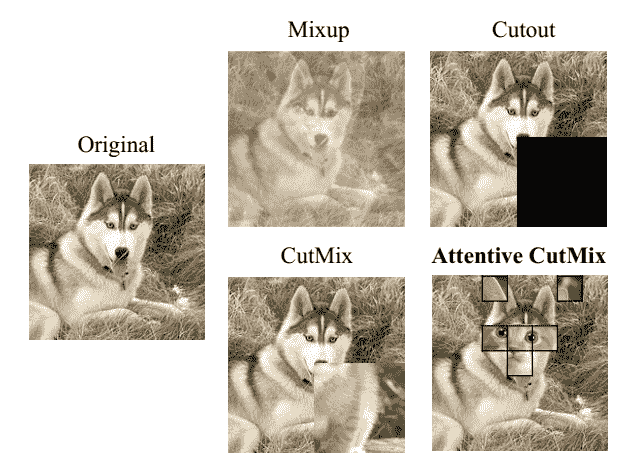
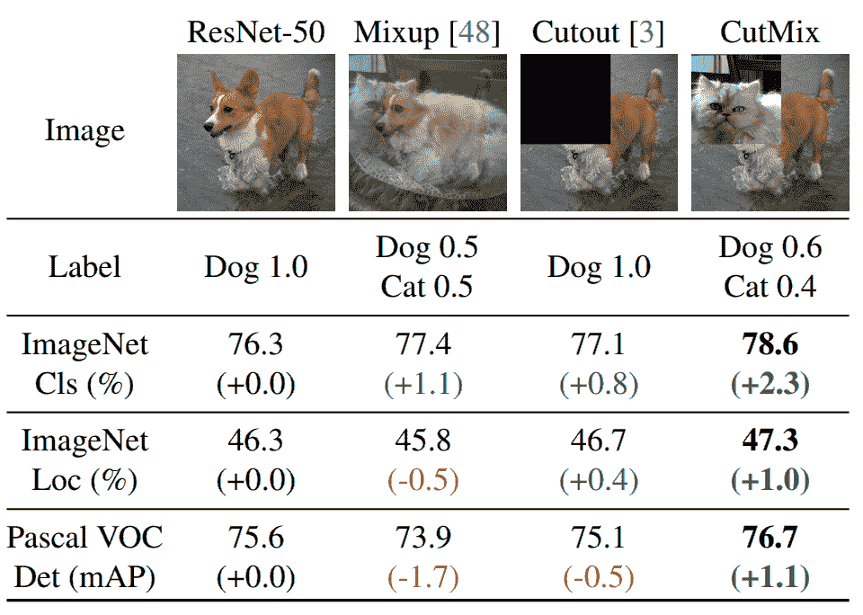

在Kaggle视觉竞赛中，数据扩增（Data Augmentation）是不可少的环节。数据扩增可以增加训练集的样本，同时也可以有效环节模型过拟合的情况，也可以给模型带来的更强的泛化能力。本文将全面介绍Kaggle视频竞赛中各类数据扩增方法。



**数据扩增方法**

*   **数据扩增为什么有用？**

在深度学习模型的训练过程中，数据扩增是必不可少的环节。现有深度学习的参数非常多，CNN模型可训练的参数量基本上都是万到百万级别，而训练集样本的数量很难有这么多。

其次数据扩增可以扩展样本空间，假设现在的分类模型需要对汽车进行分类，左边的是汽车A，右边为汽车B。如果不适用任何数据扩增方法，CNN模型会从汽车车头的角度来进行判别，而不是汽车具体的区别。


*   **数据扩增怎么做？**

数据扩增是对读取进行数据增强的操作，所以需要在数据读取的时候完成。

此外由于数据扩增有一定的随机性，相同的图片经过数据扩增可能得到不同的图片。下面是Pytoch进行读取和数据扩增的方法：

```
class QRDataset(Dataset):
    def __init__(self, img_path, img_label, transform=None):
        self.img_path = img_path
        self.img_label = img_label 
        if transform is not None:
            self.transform = transform
        else:
            self.transform = None

    def __getitem__(self, index):
        start_time = time.time()
        img = Image.open(self.img_path[index]).convert('RGB')

        if self.transform is not None:
            img = self.transform(img)
        return img,torch.from_numpy(np.array(self.img_label[index]))

    def __len__(self):
        return len(self.img_path) 
```

*   **有哪些数据扩增方法？**

数据扩增方法有很多：从颜色空间、尺度空间到样本空间，同时根据不同任务数据扩增都有相应的区别。

对于图像分类，数据扩增一般不会改变标签；对于物体检测，数据扩增会改变物体坐标位置；对于图像分割，数据扩增会像素标签；



同时为了深入浅出的讲解数据扩增方法，本文选择以图像分类为例，列举各种数据扩增方法。其他视觉任务可以以此类推，举一反三。



**01 数据扩增库**

*   **torchvision**

https://github.com/pytorch/vision

pytorch官方提供的数据扩增库，提供了基本的数据数据扩增方法，可以无缝与torch进行集成；但数据扩增方法种类较少，且速度中等；

*   imgaug

https://github.com/aleju/imgaug

imgaug是常用的第三方数据扩增库，提供了多样的数据扩增方法，且组合起来非常方便，速度较快；

*   albumentations

https://albumentations.readthedocs.io

是常用的第三方数据扩增库，提供了多样的数据扩增方法，对图像分类、语义分割、物体检测和关键点检测都支持，速度较快。albumentations是我个人比较喜欢的，也是用的次数最多的。

下文我将现有的数据扩增方法分成两种：基础数据扩增方法和进阶数据扩增方法。

02 **基本****数据扩增方法**

基础数据扩增方法指常见的数据扩增方法，且都是标签一致的数据扩增方法，大都出现在torchvision中：

*   transforms.CenterCrop

    对图片中心进行裁剪；

*   transforms.ColorJitter

    对图像颜色的对比度、饱和度和零度进行变换；

*   transforms.FiveCrop

    对图像四个角和中心进行裁剪得到五分图像；

*   transforms.Grayscale

    对图像进行灰度变换；

*   transforms.Pad

    使用固定值进行像素填充；

*   transforms.RandomAffine

    随机仿射变换；

*   transforms.RandomCrop

    随机区域裁剪；

*   transforms.RandomHorizontalFlip

    随机水平翻转；

*   transforms.RandomRotation

    随机旋转；

*   transforms.RandomVerticalFlip

*   随机垂直翻转；

03 **进阶数据扩增方法**

进阶数据扩增方法包括标签不一致的数据扩增方法（需要手动实现）和一些像素cutout的方法（在albumentations库可以找到）。

像素cutout方法



像素擦除的方法主要是随机擦除像素的区域，以此增强模型的判别能力，此类方法论文有Erase、Cutout、Has和GridMask。

其中Cutout是比较很常见的，在albumentations中有狠多实现：

*   transforms.GridDropout

*   transforms.Cutout

*   transforms.CoarseDropout

*   transforms.MaskDropout

*   transforms.GridMask

标签不一致方法

标签不一致的方法需要对两张图进行像素差值或者区域差值，其中最为典型的是Mixup、CutMix和Attentive CutMix。



Mixup是直接进行两张图像素的差值，标签也进行差值；CutMix是使用Cutout的区域进行像素填充；Attentive CutMix使用模型预测的激活区域进行像素填充。Attentive CutMix是20年比较新的论文，只在CIFAR数据集上进行了验证，时间复杂度较高。



进阶的数据扩增方法会提高模型的精度，但有两个缺点：（1）如果使用mix和cutout等标签不一致的方法，会改变数据集标签的分布；（2）进阶的数据扩增方法需要更长的训练周期。

04 **参考文献**

*   CutMix: Regularization Strategy to Train Strong Classifiers with Localizable Features

*   GridMask Data Augmentation

*   Attentive CutMix: An Enhanced Data Augmentation Approach for Deep Learning Based Image Classification


“在看，为沉迷学习**点赞**↓