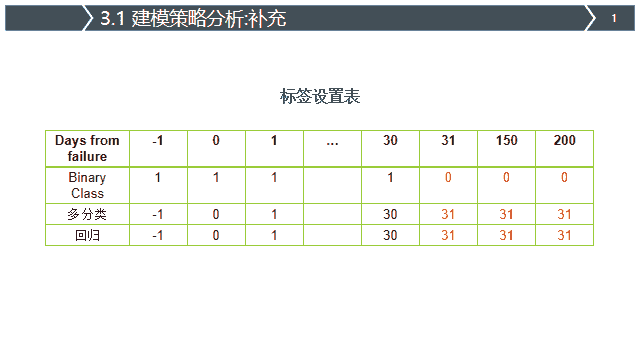

PAKDD2020 阿里巴巴智能运维算法大赛

**第一名思路**

本篇文章我们介绍刚刚结束的PAKDD2020阿里巴巴智能运维算法大赛的思路以及一些核心内容（以PPT的形式展示了），有兴趣的朋友可以去天池上阅读原题目，再回来看ppt思考。个人认为该比赛的难点主要有如下四点：

1.  原始数据相对较大，如果把原始数据全部载入到内存的话会占用100G+ 的内存，这对于很多朋友来说基本是没法忍受的，如果再继续做特征的话没有500G内存的服务器是跑不动的；

2.  建模的方式，这一个赛题建模的方式可以带来的提升还是很明显的，如何建模才能更加充分的使用数据也是一大难点；

3.  如何降低数据的噪音，这里我们采用了和时间序列建模类似的策略，滚动标签建模降低噪音影响；

4.  如何进行后处理提交，因为该题目的评分策略的关系,后处理的方式影响也较大, 此处我们依据训练集的分布设计了贪心的策略；

*   *   **评分指标细节**: 预测为正常盘的结果无需写到上传文件中。单块盘可能存在多个预测结果，但在评估过程中只考虑每块盘的最早一次预测为故障的日期。

    *   例如, 硬盘disk_1分别在2018-08-15和2018-08-19两次被预测出未来30天内可能会发生故障，但在模型评估时只会选用2018-08-15那天的预测结果。

“在看，为沉迷学习**点赞**↓