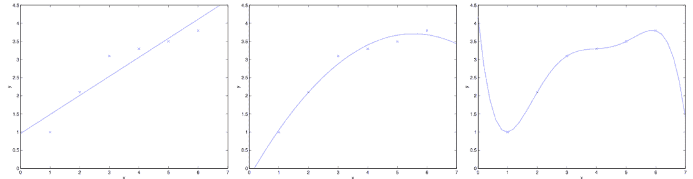

 Datawhale 

**作者：尹晓丹****，Datawhale优秀学习者**

寄语：本文对线性回归算法的原理及模型，学习策略、算法求解和sklearn参数做了详细的讲解。同时，用例子进行Python代码实践。

线性回归是利用数理统计中的回归分析，来确定两种或两种以上变量间相互依赖的定量关系的一种统计分析方法，是机器学习最基础的算法之一。

## 学习框架


## 模型建立

## **线性回归原理**

进入一家房产网，可以看到房价、面积、厅室呈现以下数据：


将价格和面积、厅室数量的关系习得为：

使得 , 这就是一个直观的线性回归的样式。

## **线性回归模型**

**1\. 线性回归的一般形式**

有数据集<embed style="width: 29.237ex" src="https://mmbiz.qlogo.cn/mmbiz_svg/3a3QxMHZ8YwnLDxI5vXUicdvoriblHER22XA5FicTFJLFcZZKUN0HTIJjZ8CYKx3QfCp25sRe62xn2GTKibPHDYdhSKGYBqhbVL8/0?wx_fmt=svg">,其中,<embed style="width: 34.372ex" src="https://mmbiz.qlogo.cn/mmbiz_svg/3a3QxMHZ8YwnLDxI5vXUicdvoriblHER22GVgTbiapqFMy1JElOeOHMlEsic5PP1A8CxxX6L1L6IlFaZPGE1rQT1BG7icB6fhZFqZ/0?wx_fmt=svg">其中 表示变量的数量， 表示每个变量的维度。

可以用以下函数来描述y和x之间的关系：

如何来确定 的值，使得 尽可能接近 的值呢？均方误差是回归中常用的性能度量，即：

我们可以选择 ，试图让均方误差最小化。

**2. 极大似然估计（概率角度阐释）**

下面我们用极大似然估计，来解释为什么要用均方误差作为性能度量。可以把目标值和变量写成如下等式：

表示我们未观测到的变量的印象，即随机噪音。我们假定 是独立同分布，服从高斯分布。（根据中心极限定理）

因此，

我们建立极大似然函数，即描述数据遵从当前样本分布的概率分布函数。由于样本的数据集独立同分布，因此可以写成:

选择 ???? ，使得似然函数最大化，这就是极大似然估计的思想。为了方便计算，我们计算时通常对对数似然函数求最大值：

显然，最大化 即最小化:

这一结果即均方误差，因此用这个值作为代价函数来优化模型在统计学的角度是合理的。

## 学习策略

**1\. 损失函数**(Loss Function)

度量单样本预测的错误程度，损失函数值越小，模型就越好。常用的损失函数包括：0-1损失函数、平方损失函数、绝对损失函数、对数损失函数等。

**2\. 代价函数**(Cost Function)

度量全部样本集的平均误差。常用的代价函数包括均方误差、均方根误差、平均绝对误差等。

**3\. 目标函数**(Object Function)

代价函数和正则化函数，最终要优化的函数。

**4\. 思考题**

既然代价函数已经可以度量样本集的平均误差，为什么还要设定目标函数？

答：当模型复杂度增加时，有可能对训练集可以模拟的很好，但是预测测试集的效果不好，出现过拟合现象，这就出现了所谓的“结构化风险”。结构风险最小化即为了防止过拟合而提出来的策略，定义模型复杂度为 ????(????) ，目标函数可表示为：



例如有以下6个房价和面积关系的数据点，可以看到，当设定：

时，可以完美拟合训练集数据，但是，真实情况下房价和面积不可能是这样的关系，出现了过拟合现象。当训练集本身存在噪声时，拟合曲线对未知影响因素的拟合往往不是最好的。

通常，随着模型复杂度的增加，训练误差会减少；但测试误差会先增加后减小。我们的最终目的时试测试误差达到最小，这就是我们为什么需要选取适合的目标函数的原因。

## 算法求解

## **梯度下降法**

设定初始参数 ,不断迭代，使得 最小化：

对其求导为：

即：

将所有的参数以向量形式表示，可得：

由于这个方法中，参数在每一个数据点上同时进行了移动，因此称为批梯度下降法，对应的，我们可以每一次让参数只针对一个数据点进行移动，即：

这个算法称为随机梯度下降法，随机梯度下降法的好处是，当数据点很多时，运行效率更高；

其缺点是，因为每次只针对一个样本更新参数，未必找到最快路径达到最优值，甚至有时候会出现参数在最小值附近徘徊而不是立即收敛。**但当数据量很大的时候，随机梯度下降法经常优于批梯度下降法。**

****

当 为凸函数时，梯度下降法相当于让参数 不断向 的最小值位置移动。

梯度下降法的缺陷：如果函数为非凸函数，有可能找到的并非全局最优值，而是局部最优值。

## **最小二乘法矩阵求解**

令：

其中，

由于

且

对于向量来说，有

因此可以把损失函数写作

为最小化 ,对 求导可得：

中间两项互为转置，由于求得的值是个标量，矩阵与转置相同，因此可以写成

令偏导数等于零，由于最后一项和 ???? 无关，偏导数为0。因此，

利用矩阵求导性质，

和

令导数等于零，

**牛顿法**


可求得：

重复迭代，可以让逼近取到 的最小值。当我们对损失函数 进行优化的时候，实际上是想要取到 的最小值，因此迭代公式为：

当 是向量值的时候，

的偏导数， 是 的海森矩阵，

**问题**：请用泰勒展开法推导牛顿法公式。

答：将泰勒公式展开到二阶：

对上式求导，并令导数等于0，求得 值

可以求得，

牛顿法的收敛速度非常快，但海森矩阵的计算较为复杂，尤其当参数的维度很多时，会耗费大量计算成本。我们可以用其他矩阵替代海森矩阵，用拟牛顿法进行估计。


牛顿法比梯度下降法收敛速度更快，红色的牛顿法的迭代路径，绿色的是梯度下降法的迭代路径。

**拟牛顿法**

常用的拟牛顿法算法包括DFP，BFGS等。拟牛顿法的思路是用一个矩阵替代计算复杂的海森矩阵 ，因此要找到符合H性质的矩阵。

要求得海森矩阵符合的条件，同样对泰勒公式求导

即迭代后的值，代入可得：

更一般的，

为第k个迭代值。即找到矩阵 ，使得它符合上式。

## 线性回归的评估指标

均方误差(MSE):

均方根误差(RMSE)：

平均绝对误差(MAE)：

但以上评价指标都无法消除量纲不一致而导致的误差值差别大的问题，最常用的指标是 ,可以避免量纲不一致问题。

我们可以把 理解为，回归模型可以成功解释的数据方差部分在数据固有方差中所占的比例， 越接近1，表示可解释力度越大，模型拟合的效果越好。

## sklearn参数详解

**1\. it_intercept**

默认为True,是否计算该模型的截距。如果使用中心化的数据，可以考虑设置为False,不考虑截距。一般还是要考虑截距。

**2\. normalize**

默认为false. 当fit_intercept设置为false的时候，这个参数会被自动忽略。如果为True,回归器会标准化输入参数：减去平均值，并且除以相应的二范数。当然啦，在这里还是建议将标准化的工作放在训练模型之前。通过设置sklearn.preprocessing.StandardScaler来实现，而在此处设置为false。

**3\. copy_X**

默认为True, 否则X会被改写

**4\. n_jobs**

int 默认为1\. 当-1时默认使用全部CPUs ??(这个参数有待尝试)

**5. 可用属性**

**coef_????*训练后的输入端模型系数，如果label有两个，即y值有两列。那么是一个2D的array

**6\. intercept_**: 截距

**7\. 可用的methods**

*   **fit(X,y,sample_weight=None)**:

    X: array, 稀疏矩阵 [n_samples,n_features]

    y: array [n_samples, n_targets]

    sample_weight: 权重 array [n_samples] 在版本0.17后添加了sample_weight

*   **get_params(deep=True)**：返回对regressor 的设置值

*   **predict(X)**: 预测 基于 R^2值

*   **score**：评估

**练习题**

请用以下数据（可自行生成尝试，或用其他已有数据集）

*   首先尝试调用sklearn的线性回归函数进行训练；

*   用最小二乘法的矩阵求解法训练数据；

*   用梯度下降法训练数据；

*   比较各方法得出的结果是否一致。

**1\. sklearn的线性回归**
生成数据：

```
#生成数据
import numpy as np
#生成随机数
np.random.seed(1234)
x = np.random.rand(500,3)
#构建映射关系，模拟真实的数据待预测值,映射关系为y = 4.2x1 + 5.7*x2 + 10.8*x3，可自行设置值进行尝试
y = x.dot(np.array([4.2,5.7,10.8])) 
```

```
import numpy as np
from sklearn.linear_model import LinearRegression
import matplotlib.pyplot as plt
%matplotlib inline

lr = LinearRegression(fit_intercept=True)# 默认即可
#训练model
lr.fit(x, y)
print("估计的参数值：%s"%(lr.coef_))
print("估计的截距：%s"%(lr.intercept_))
#计算R方
print('R2:',(lr.score(x,y)))
#测试
x_test = np.array([4,5,7]).reshape(1,-1)
y_hat = lr.predict(x_test)
print('真实值为：',x_test.dot(np.array([4.2,5.7,10.8])))
print('预测值为：',y_hat) 
```


**2. ****最小二乘法**

```
class LR_LS():
    def __init__(self):
        self.w = None      
    def fit(self, X, y):
        # 最小二乘法矩阵求解
        #============================= show me your code =======================
        self.w = np.linalg.inv(X.T.dot(X)).dot(X.T).dot(y)
        #============================= show me your code =======================
    def predict(self, X):
        # 用已经拟合的参数值预测新自变量
        #============================= show me your code =======================
        y_pred = X.dot(self.w)
        #============================= show me your code =======================
        return y_pred

if __name__ == "__main__":
    lr_ls = LR_LS()
    lr_ls.fit(x,y)
    print("估计的参数值：%s" %(lr_ls.w))
    x_test = np.array([4,5,7]).reshape(1,-1)
    print('真实值为：',x_test.dot(np.array([4.2,5.7,10.8])))
    print("预测值为: %s" %(lr_ls.predict(x_test))) 
```


**3. 梯度****下降法**

```
class LR_GD():
    def __init__(self):
        self.w = None     
    def fit(self,X,y,alpha=0.002,loss = 1e-10): # 设定步长为0.002,判断是否收敛的条件为1e-10
        y = y.reshape(-1,1) #重塑y值的维度以便矩阵运算
        [m,d] = np.shape(X) #自变量的维度
        self.w = np.zeros((d)) #将参数的初始值定为0
        tol = 1e5
        #============================= show me your code =======================
        while tol > loss:
            h_f = X.dot(self.w).reshape(-1,1) 
            theta = self.w + alpha*np.mean(X*(y - h_f),axis=0) #计算迭代的参数值
            tol = np.sum(np.abs(theta - self.w))
            self.w = theta
        #============================= show me your code =======================
    def predict(self, X):
        # 用已经拟合的参数值预测新自变量
        y_pred = X.dot(self.w)
        return y_pred  

if __name__ == "__main__":
    lr_gd = LR_GD()
    lr_gd.fit(x,y)
    print("估计的参数值为：%s" %(lr_gd.w))
    x_test = np.array([4,5,7]).reshape(1,-1)
    print('真实值为：',x_test.dot(np.array([4.2,5.7,10.8])))
    print("预测值为：%s" %(lr_gd.predict(x_test))) 
```


**4\. 测试**

在3维数据上测试sklearn线性回归和最小二乘法的结果相同，梯度下降法略有误差；又在100维数据上测试了一下最小二乘法的结果比sklearn线性回归的结果更好一些。


“为沉迷学习**点赞**↓