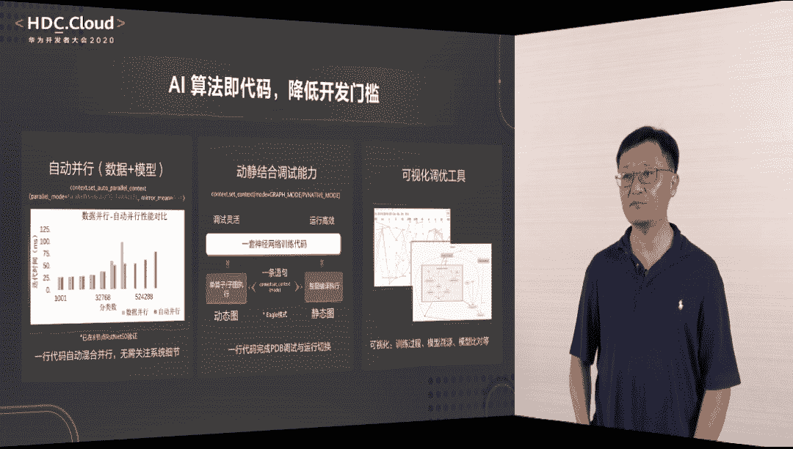
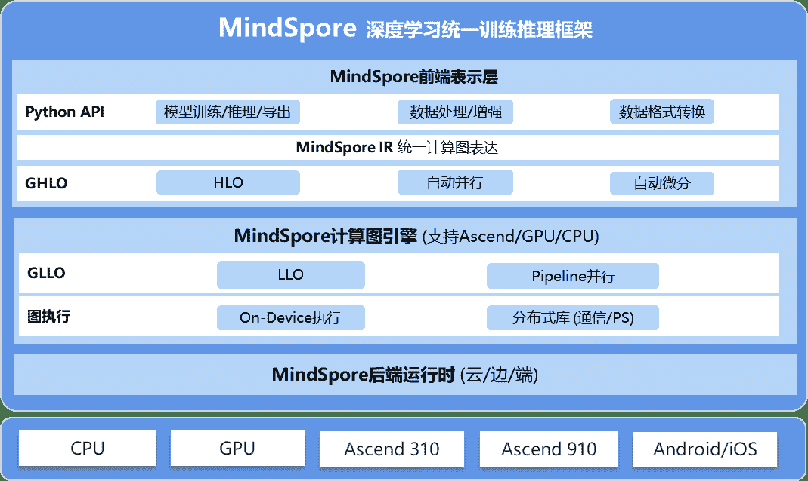

 Datawhale 

**作者：Datawhale**

摘要：随着深度学习框架等工具的全面开源，最强 AI 处理芯片昇腾的落地，华为的 AI 布局已经逐渐清晰起来，MindSpore 将为各行业带来哪些新变化，让我们拭目以待。

今年的华为开发者大会 HDC 2020 上，除了昇腾、鲲鹏等自研芯片硬件平台之外，最令人期待的就是深度学习框架 MindSpore 的开源了。在华为 MindSpore 首席科学家陈雷宣布这款产品正式开源后，我们终于可以在开放平台上一睹它的真面目。

## 降低AI应用门槛，三大创新能力

作为一款「全场景 AI 框架」，MindSpore 是华为人工智能解决方案的重要组成部分，与 TensorFlow、PyTorch、PaddlePaddle 等流行深度学习框架对标，**旨在大幅度降低 AI 应用开发门槛，让人工智能无处不在**。

MindSpore 是一款支持端、边、云独立/协同的统一训练和推理框架。华为希望通过这款完整的软件堆栈，实现一次性算子开发、一致的开发和调试体验，以此帮助开发者实现一次开发，应用在所有设备上平滑迁移的能力。

原生支持 AI 芯片，全场景一致的开发体验——除了这些我们早已知晓的强大之处外，了 MindSpore 更是具备三大创新能力：新编程范式，执行模式和协作方式。

## 开源地址

MindSpore 首个开源版本为 0.1.0-alpha 版，主要由自动微分、自动并行、数据处理等功能构成。华为表示，MindSpore 具备开发算法即代码、运行高效、部署态灵活的特点，其核心分为三层：从下往上分别是后端运行时、计算图引擎及前端表示层。

从整体上来说，MindSpore 搭建神经网络会以「单元」为中心，其中单元是张量和运算操作的集合。从输入张量开始，MindSpore 会提供各种算子以构造一个「单元」，最后模型封装这个单元就可以用来训练、推理了。

*MindSpore 的整体结构，从后端的硬件支持到前端 API，中间会涉及多种优化与特性。例如不采用计算图的自动微分、自动并行与优化计算过程等等。*

MindSpore 最大的特点在于，其采用了业界最新的 Source-to-Source 自动微分，它能利用编译器及编程语言的底层技术，进一步优化以支持更好的微分表达。

MindSpore 开源社区：https://www.mindspore.cn/

MindSpore 代码：https://gitee.com/mindspore

## 入门公开课，已更新至第三讲

为了让开发者们细致学习 MindSpore，机器之心与华为昇腾学院发布了**《轻松上手开源框架MindSpore》**线上公开课：

**理论拆解：**华为一线资深工程师将详解 MindSpore 整体架构与各模块特性，帮助初学者循序渐进掌握相关知识点。

**代码演示：**配合知识点讲解，讲师将演示代码操作，帮助开发者快速上手体验。

**课后实践：**阶段性设置课后实践作业，邀请开发者独自完成并提交结果，优秀作业将获得《深度学习与 MindSpore 实践》书籍奖励。具体作业题目、完成方式与评价标准详见后续课程预告。

**今晚，公开课第三讲**

第一课与第二课精彩回顾点击阅读原文查看。（地址：https://www.jiqizhixin.com/columns/MindSpore）

MindSpore专属技术交流群。注：若群人数达到限制，无法直接扫码加入，请识别上方海报二维码，添加机器之心助手（syncedai6），备注「开源」，将邀请进群。

“为国内开源发展**点赞**↓