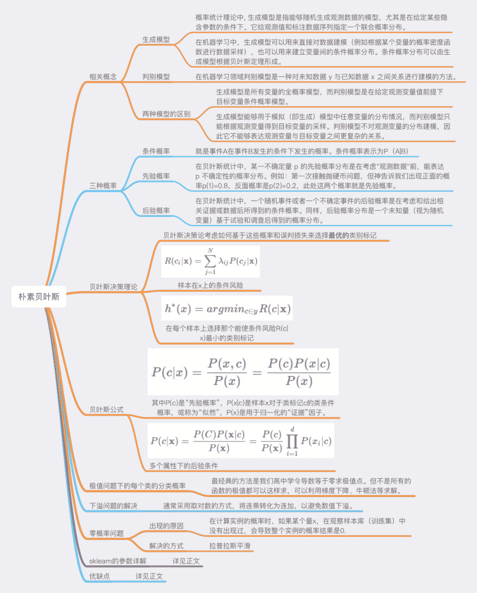

 Datawhale 

**作者：尹晓丹****，Datawhale优秀学习者**

寄语：首先，简单介绍了生成模型和判别模型，对条件概率、先验概率和后验概率进行了总结；其次，对朴素贝叶斯的原理及公式推导做了详细解读；再次，对三种可能遇到的问题进行了解析，给出了合理的解决办法；最后，对朴素贝叶斯的sklearn参数和代码进行了详解。

贝叶斯分类是一类分类算法的总称，这类算法均以贝叶斯定理为基础，故统称为贝叶斯分类。而朴素贝叶斯分类是贝叶斯分类中最简单，也是应用最为广泛的分类算法之一。朴素贝叶斯方法是在贝叶斯算法的基础上进行了相应的简化，即假定给定目标值时属性之间相互条件独立。

## 知识框架



## 相关概念

**生成模型**

概率统计理论中, 生成模型是指能够随机生成观测数据的模型，尤其是在给定某些隐含参数的条件下。它给观测值和标注数据序列指定一个联合概率分布。

在机器学习中，生成模型可以用来直接对数据建模（例如根据某个变量的概率密度函数进行数据采样），也可以用来建立变量间的条件概率分布。条件概率分布可以由生成模型根据贝叶斯定理形成。

常见的基于生成模型算法有高斯混合模型和其他混合模型、隐马尔可夫模型、随机上下文无关文法、朴素贝叶斯分类器、AODE分类器、潜在狄利克雷分配模型、受限玻尔兹曼机等。

举个栗子：要确定一个瓜是好瓜还是坏瓜，用判别模型的方法使从历史数据中学习到模型，然后通过提取这个瓜的特征来预测出这只瓜是好瓜的概率，是坏瓜的概率。

**判别模型**

在机器学习领域判别模型是一种对未知数据 y 与已知数据 x 之间关系进行建模的方法。

判别模型是一种基于概率理论的方法。已知输入变量 x ，判别模型通过构建条件概率分布 P(y|x) 预测 y 。

常见的基于判别模型算法有逻辑回归、线性回归、支持向量机、提升方法、条件随机场、人工神经网络、随机森林、感知器。

举个栗子：利用生成模型是根据好瓜的特征首先学习出一个好瓜的模型，然后根据坏瓜的特征学习得到一个坏瓜的模型，然后从需要预测的瓜中提取特征，放到生成好的好瓜的模型中看概率是多少，在放到生产的坏瓜模型中看概率是多少，哪个概率大就预测其为哪个。

**生成模型与判别模型的区别**

生成模型是所有变量的全概率模型，而判别模型是在给定观测变量值前提下目标变量条件概率模型。

因此，生成模型能够用于模拟（即生成）模型中任意变量的分布情况，而判别模型只能根据观测变量得到目标变量的采样。判别模型不对观测变量的分布建模，因此它不能够表达观测变量与目标变量之间更复杂的关系。因此，生成模型更适用于无监督的任务，如分类和聚类。

## 先验概率、条件概率

**条件概率**

就是事件A在事件B发生的条件下发生的概率。条件概率表示为P（A|B），读作“A在B发生的条件下发生的概率”。

**先验概率**

在贝叶斯统计中，某一不确定量 p 的先验概率分布是在考虑"观测数据"前，能表达 p 不确定性的概率分布。它旨在描述这个不确定量的不确定程度，而不是这个不确定量的随机性。这个不确定量可以是一个参数，或者是一个隐含变量。

**后验概率**

在贝叶斯统计中，一个随机事件或者一个不确定事件的后验概率是在考虑和给出相关证据或数据后所得到的条件概率。

同样，后验概率分布是一个未知量（视为随机变量）基于试验和调查后得到的概率分布。“后验”在本文中代表考虑了被测试事件的相关证据。

## 贝叶斯决策理论

贝叶斯决策论是概率框架下实施决策的基本方法，对分类任务来说，在所有相关概率都已知的理想情形下，贝叶斯决策论考虑如何基于这些概率和误判损失来选择最优的类别标记。

假设有N种可能标记， 是将类 误分类为 所产生的损失，基于后验概率 可以获得样本x分类为 所产生的期望损失 ，即在样本x上的条件风险：

我们的任务是寻找一个判定准则 以最小化总体风险

显然，对每个样本 ，若 能最小化条件风险 ,则总体风险 也将被最小化。这就产生了贝叶斯判定准则：最小化总体风险，只需要在每个样本上选择那个能使条件风险 最小的类别标记，即：

此时， 称作贝叶斯最优分类器，与之对应的总体风险 称为贝叶斯风险， 反映了分类器能达到的最好性能，即机器学习所产生的模型精度的上限。具体来说，若目标是最小化分类错误率（对应0/1损失），则 可以用 损失改写，得到条件风险和最小化分类错误率的最优分类器分别为：

即对每个样本x，选择能使后验概率P(c|x)最大的类别标识。

获得后验概率的两种方法：

*   判别式模型 : 给定x, 可以通过直接建模P(c|x)来预测c。

*   生成模型 : 先对联合分布p(x,c)模，然后再有此获得P(c|x)。

## 贝叶斯公式

对生成模型来说，必然考虑：

其中P(c)是“先验概率”；P(x|c)是样本x对于类标记c的类条件概率，或称为“似然”；P(x)是用于归一化的“证据”因子。上式即为贝叶斯公式，可以将其看做：

对类条件概率P(x|c)来说，直接根据样本出现的频率来估计将会遇到严重的困难，所以引入了极大似然估计。

**极大似然估计**

估计类条件概率有一种常用的策略就是先假定其具有某种确定的概率分布形式，再基于训练样本对概率分布的参数进行估计。

假设P(x|c)具有某种确定的形式并且被参数 唯一确定，则我们的任务就是利用训练结D估计参数 。为了明确期间，我们将P(x|c)记为 。

举个通俗的例子：假设一个袋子装有白球与红球，比例未知，现在抽取10次（每次抽完都放回，保证事件独立性），假设抽到了7次白球和3次红球，在此数据样本条件下，可以采用最大似然估计法求解袋子中白球的比例（最大似然估计是一种“模型已定，参数未知”的方法）。

当然，这种数据情况下很明显，白球的比例是70%，但如何通过理论的方法得到这个答案呢？一些复杂的条件下，是很难通过直观的方式获得答案的，这时候理论分析就尤为重要了，这也是学者们为何要提出最大似然估计的原因。我们可以定义从袋子中抽取白球和红球的概率如下：

x1为第一次采样，x2为第二次采样，f为模型, theta为模型参数。其中θ是未知的，因此，我们定义似然L为：

两边取ln，取ln是为了将右边的乘号变为加号，方便求导。

两边取ln的结果，左边的通常称之为对数似然。

这是平均对数似然。最大似然估计的过程，就是找一个合适的theta，使得平均对数似然的值为最大。因此，可以得到以下公式：

最大似然估计的公式。这里讨论的是2次采样的情况，

当然也可以拓展到多次采样的情况：最大似然估计的公式（n次采样）。我们定义M为模型（也就是之前公式中的f），表示抽到白球的概率为θ，而抽到红球的概率为(1-θ)，因此10次抽取抽到白球7次的概率可以表示为：

将其描述为平均似然可得：

10次抽取抽到白球7次的平均对数似然，抽球的情况比较简单，可以直接用平均似然来求解。那么最大似然就是找到一个合适的theta，获得最大的平均似然。因此我们可以对平均似然的公式对theta求导，并另导数为0。

求得，θ=0.7。求导过程 由此可得，当抽取白球的概率为0.7时，最可能产生10次抽取抽到白球7次的事件。以上就用到了最大似然估计的思想。

令Dc表示训练集D中第c类样本组成的集合，假设这些集合是独立同分布的，则对参数θc、对于数据集Dc的似然是:

对θc进行激发似然估计买就是去寻找能最大化似然函数的参数值θc直观上，极大似然估计是在试图在θc的所有可能的去职中，找到一个能使数据出现最大“可能性”的最大值上面的式子中的连乘操作容易造成下溢，通常使用对数似然：

此时，参数 的极大似然估计 为

例如，在连续属性的情形下，假设概率密度函数 ,则参数 和 。

也就是说通过极大似然发得到的额正态分布均值就是样本均值，方差就是 的均值。这显然是一个符合只觉得结果，在离散属性情形下，也可以通过类似的方法来估计类条件概率。

需要注意的是这种方法虽然能够使类条件概率估计变得简单，但是估计结果准确性严重依赖于所假设的概率分布形式是否符合潜在的真实数据分布。在显示生活中往往需要应用任务本身的经验知识，“猜测”则会导致误导性的结果。

贝叶斯分类器的训练过程就是参数估计。总结最大似然法估计参数的过程，一般分为以下四个步骤：

*   写出似然函数；

*   对似然函数取对数，并整理；

*   求导数，令偏导数为0，得到似然方程组；

*   解似然方程组，得到所有参数即为所求。

**朴素贝叶斯分类器**

基于贝叶斯公式来估计后验概率P(c|x)主要困难在于类条件概率P(x|c)是所有属性上的联合概率，难以从有限的训练样本直接估计而得。

基于有限训练样本直接计算联合概率，在计算上将会遭遇组合爆炸问题；在数据上将会遭遇样本稀疏问题；属性越多，问题越严重。

为了避开这个障碍，朴素贝叶斯分类器采用了“属性条件独立性假设”：对已知类别，假设所有属性相互独立。换言之，假设每个属性独立的对分类结果发生影响相互独立。

回答西瓜的例子就可以认为｛色泽 根蒂 敲声 纹理 脐部 触感｝这些属性对西瓜是好还是坏的结果所产生的影响相互独立。

基于条件独立性假设，对于多个属性的后验概率可以写成：

d为属性数目， 是 在第 个属性上取值。对于所有的类别来说 相同，基于极大似然的贝叶斯判定准则有朴素贝叶斯的表达式：

## 极值问题情况下每个类的分类概率

很多时候遇到求出各种目标函数（object function）的最值问题（最大值或者最小值）。关于函数最值问题，其实在高中的时候我们就已经了解不少，最经典的方法就是：直接求出极值点。

这些极值点的梯度为0。若极值点唯一，则这个点就是代入函数得出的就是最值；若极值点不唯一，那么这些点中，必定存在最小值或者最大值（去除函数的左右的最端点），所以把极值代入函数，经对比后可得到结果。

请注意：并不一定所有函数的极值都可以通过设置导数为0的方式求出。也就是说，有些问题中当我们设定导数为0时，未必能直接计算出满足导数为0的点（比如逻辑回归模型），这时候就需要利用数值计算相关的技术（最典型为梯度下降法，牛顿法……）。

## 下溢问题如何解决

数值下溢问题：是指计算机浮点数计算的结果小于可以表示的最小数，因为计算机的能力有限，当数值小于一定数时，其无法精确保存，会造成数值的精度丢失，由上述公式可以看到，求概率时多个概率值相乘，得到的结果往往非常小；因此通常采用取对数的方式，将连乘转化为连加，以避免数值下溢。

## 零概率问题如何解决？

零概率问题，就是在计算实例的概率时，如果某个量x，在观察样本库（训练集）中没有出现过，会导致整个实例的概率结果是0。

在实际的模型训练过程中，可能会出现零概率问题（因为先验概率和反条件概率是根据训练样本算的，但训练样本数量不是无限的，所以可能出现有的情况在实际中存在，但在训练样本中没有，导致为0的概率值，影响后面后验概率的计算）。

即便可以继续增加训练数据量，但对于有些问题来说，数据怎么增多也是不够的。这时我们说模型是不平滑的，我们要使之平滑，一种方法就是将训练（学习）的方法换成贝叶斯估计。

现在看一个示例，及P(敲声=清脆∣好瓜=是)=8/0=0。不论样本的其他属性如何，分类结果都会为“好瓜=否”，这样显然不太合理。

**朴素贝叶斯算法的先天缺陷**

其他属性携带的信息被训练集中某个分类下未出现的属性值“抹去”，造成预测出来的概率绝对为0。为了弥补这一缺陷，前辈们引入了拉普拉斯平滑的方法：对先验概率的分子(划分的计数)加1，分母加上类别数；对条件概率分子加1，分母加上对应特征的可能取值数量。这样在解决零概率问题的同时，也保证了概率和依然为1：

其中，N表示数据集中分类标签， 表示第 个属性的取值类别数， 样本容量， 表示类别 的记录数量， 表示类别 中第 个属性取值为 的记录数量。

将这两个式子应用到上面的计算过程中，就可以弥补朴素贝叶斯算法的这一缺陷问题。

用西瓜的数据来看，当我们计算 P(好瓜=是) 时，样本有17个，所以|D| = 17，N，好瓜标签可以分为｛是，否｝两类，所以N=2，（好瓜=是）的样本个数有8个，所以这里 。

综上，根据拉普拉斯平滑后有

P（色泽=青绿|好瓜=是）时，色泽青绿的样本有8个，所以|D_c| = 8，色泽标签可以分为｛青绿，浅白，乌黑｝三类，所以N=3，（好瓜=是）的样本个数有3个，所以这里 =3。综上，根据拉普拉斯平滑后有

同理，分析可知，之前不合理的P(敲声=清脆∣好瓜=是)=80=0P(敲声=清脆|好瓜=是)=\frac{8}{0}=0P(敲声=清脆∣好瓜=是)= 8/0 =0在进行拉普拉斯平滑后为：

显然结果不是0，使结果变得合理。

## 优缺点

**优点**

1\. 朴素贝叶斯模型有稳定的分类效率。

2\. 对小规模的数据表现很好，能处理多分类任务，适合增量式训练，尤其是数据量超出内存时，可以一批批的去增量训练。

3\. 对缺失数据不太敏感，算法也比较简单，常用于文本分类。

**缺点**

1\. 理论上，朴素贝叶斯模型与其他分类方法相比具有最小的误差率。但是实际上并非总是如此，这是因为朴素贝叶斯模型给定输出类别的情况下,假设属性之间相互独立，这个假设在实际应用中往往是不成立的，在属性个数比较多或者属性之间相关性较大时，分类效果不好。而在属性相关性较小时，朴素贝叶斯性能最为良好。对于这一点，有半朴素贝叶斯之类的算法通过考虑部分关联性适度改进。

2\. 需要知道先验概率，且先验概率很多时候取决于假设，假设的模型可以有很多种，因此在某些时候会由于假设的先验模型的原因导致预测效果不佳。

3\. 由于我们是通过先验和数据来决定后验的概率从而决定分类，所以分类决策存在一定的错误率。

4\. 对输入数据的表达形式很敏感。

## sklearn参数详解

高斯朴素贝叶斯算法是假设特征的可能性(即概率)为高斯分布。

**class sklearn.naive_bayes.GaussianNB(priors=None)**

参数：

**1\. priors** : 先验概率大小，如果没有给定，模型则根据样本数据自己计算（利用极大似然法）。

**2\. var_smoothing**：可选参数，所有特征的最大方差

属性：

**3\. class_prior_** : 每个样本的概率

**4\. class_count** : 每个类别的样本数量

**5\. classes_** : 分类器已知的标签类型

**6\. theta_** : 每个类别中每个特征的均值

**7\. sigma_** : 每个类别中每个特征的方差

**8\. epsilon_** : 方差的绝对加值方法

**贝叶斯的方法和其他模型的方法一致**

**1\. fit(X,Y)** : 在数据集(X,Y)上拟合模型。

**2\. get_params()** : 获取模型参数。

**3\. predict(X)** : 对数据集X进行预测。

**4\. predict_log_proba(X)** : 对数据集X预测，得到每个类别的概率对数值。

**5\. predict_proba(X)** : 对数据集X预测，得到每个类别的概率。

**6\. score(X,Y)** : 得到模型在数据集(X,Y)的得分情况。

**构建朴素贝叶斯模型**

这里采用GaussianNB 高斯朴素贝叶斯,概率密度函数为：

```
import numpy as np
import pandas as pd
import matplotlib.pyplot as plt
%matplotlib inline

from sklearn.datasets import load_iris
from sklearn.model_selection import train_test_split

from collections import Counter
import math
import math 
```

```
# data
def create_data():
    iris = load_iris()
    df = pd.DataFrame(iris.data, columns=iris.feature_names)
    df['label'] = iris.target
    df.columns = ['sepal length', 'sepal width', 'petal length', 'petal width', 'label']
    data = np.array(df.iloc[:100, :])
    # print(data)
    return data[:,:-1], data[:,-1] 
```

```
import math
class NaiveBayes:
    def __init__(self):
        self.model = None

    # 数学期望
    @staticmethod
    def mean(X):
        """计算均值
        Param: X : list or np.ndarray

        Return:
            avg : float

        """
        avg = 0.0
        # ========= show me your code ==================
        avg = sum(X) / float(len(X))
        # ========= show me your code ==================
        return avg

    # 标准差（方差）
    def stdev(self, X):
        """计算标准差
        Param: X : list or np.ndarray

        Return:
            res : float

        """
        res = 0.0
        # ========= show me your code ==================
        avg = self.mean(X)
        res = math.sqrt(sum([pow(x - avg, 2) for x in X]) / float(len(X)))
        # ========= show me your code ==================
        return res

    # 概率密度函数
    def gaussian_probability(self, x, mean, stdev):
        """根据均值和标注差计算x符号该高斯分布的概率
        Parameters:
        ----------
        x : 输入
        mean : 均值
        stdev : 标准差

        Return:

        res : float， x符合的概率值

        """
        res = 0.0
        # ========= show me your code ==================
        exponent = math.exp(-(math.pow(x - mean, 2) /
                              (2 * math.pow(stdev, 2))))
        res = (1 / (math.sqrt(2 * math.pi) * stdev)) * exponent
        # ========= show me your code ==================

        return res

    # 处理X_train
    def summarize(self, train_data):
        """计算每个类目下对应数据的均值和标准差
        Param: train_data : list

        Return : [mean, stdev]
        """
        summaries = [0.0, 0.0]
        # ========= show me your code ==================
        summaries = [(self.mean(i), self.stdev(i)) for i in zip(*train_data)]

        # ========= show me your code ==================
        return summaries

    # 分类别求出数学期望和标准差
    def fit(self, X, y):
        labels = list(set(y))
        data = {label: [] for label in labels}
        for f, label in zip(X, y):
            data[label].append(f)
        self.model = {
            label: self.summarize(value) for label, value in data.items()
        }
        return 'gaussianNB train done!'

    # 计算概率
    def calculate_probabilities(self, input_data):
        """计算数据在各个高斯分布下的概率
        Paramter:
        input_data : 输入数据

        Return:
        probabilities : {label : p}
        """
        # summaries:{0.0: [(5.0, 0.37),(3.42, 0.40)], 1.0: [(5.8, 0.449),(2.7, 0.27)]}
        # input_data:[1.1, 2.2]
        probabilities = {}
        # ========= show me your code ==================
        for label, value in self.model.items():
            probabilities[label] = 1
            for i in range(len(value)):
                mean, stdev = value[i]
                probabilities[label] *= self.gaussian_probability(
                    input_data[i], mean, stdev)
        # ========= show me your code ==================
        return probabilities

    # 类别
    def predict(self, X_test):
        # {0.0: 2.9680340789325763e-27, 1.0: 3.5749783019849535e-26}
        label = sorted(self.calculate_probabilities(X_test).items(), key=lambda x: x[-1])[-1][0]
        return label
    # 计算得分
    def score(self, X_test, y_test):
        right = 0
        for X, y in zip(X_test, y_test):
            label = self.predict(X)
            if label == y:
                right += 1

        return right / float(len(X_test)) 
```

```
model = NaiveBayes()
model.fit(X_train, y_train)
print(model.predict([3.4,  6.2,  2.0,  0.3]))
model.score(X_test, y_test) 
```


“为沉迷学习**点赞**↓