 Datawhale 

**作者：小一****，Datawhale优秀学习者**

寄语：首先，对聚类算法进行了介绍；然后，解释了EM算法E步、M步的原理；最后，对sklearn参数进行了详解，并对王者荣耀英雄利用EM算法聚类，助力深入理解EM算法。

EM算法(Expectation Maximization Algorithm)，译作最大期望化算法或期望最大算法。它是一种迭代算法，是常见且经典的聚类算法之一，用于含有隐变量（hidden variable）的概率参数模型的最大似然估计或极大后验概率估计。

对聚类算法、EM算法的原理及其实践进行详细的讲解之前。首先来看一张EM算法的聚类图，有个大致直观地了解。

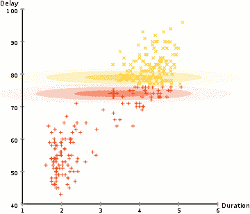

## 学习框架

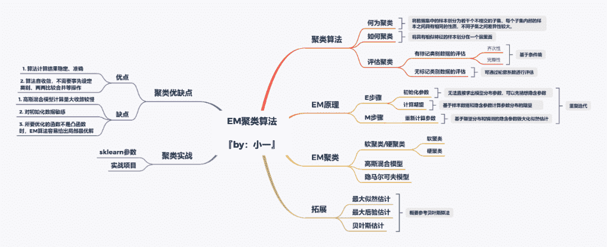

**数据集及聚类分析代码后台回复** ***王者荣耀*** *获取*

## 聚类算法

先来一段西瓜书里面的定义：在“无监督学习”中，训练样本的标记信息是未知的，目标是通过对无标记训练样本的学习来揭示数据的内在性质及规律，为进一步的数据分析提供基础，此类学习任务中研究最多、应用最广的是“聚类”（clustering）。

总结一下关键词：标记信息未知、学习、内在性质及规律、聚类。对，还有一个：无监督学习，无监督算法大多都可以用上面的关键词来描述。

以聚类算法为例，其目的是对一批未知标记的数据通过某种方式进行聚类，使其能够有效的分成若干个类别，每一个类别里面的数据特征都类似，不同类别的数据差异性较大。

举个简单的例子：在中国的乡村有这样一个现象，一个村子的姓氏大多相同，不同村子有不同的姓氏。那如果现在把王家村、李家村、赵家村的所有人都聚集在一起，前提是不知道他们是哪个村子的，如何对他们进行聚类？

*   特性①：姓名，通过姓氏进行聚类，最终聚成三类：王+李+赵+其它

*   特性②：性别，通过性别进行聚类，最终聚成两类：男+女

*   特性③：年龄，通过年龄进行聚类，最终聚成三类：儿童+青年+老年

*   特性④：价值，通过价值进行聚类，最终聚成三类：高收入+中收入+低收入

*   特性⑤：属性，通过属性进行聚类，最终聚成三类：村领导+村干部+村民

*   …

上面的姓氏、性别、年龄、价值和属性等都是村民的内在性质（人物特征），这样的内在性质有很多，也就决定了聚类的标准并不唯一。

ok，想必大家已经明白了什么是聚类，通过上面的例子我们总结一下。

**1\. 何为聚类**

聚类：将数据集中的样本划分为若干个不相交的子集，每个子集内部的样本之间具有相同的性质，不同子集之间差异性较大。通常情况下，我们会将子集称之为“簇”(cluster)

**2\. 如何聚类**

聚类的本质是将具有相似特征的样本划分在一个簇里面，根据聚类算法的不同，聚类的实现过程也不尽相同。

例如，聚类算法中k-means是基于均值的聚类，DBSCAN是基于密度的聚类，AGNES是基于层次的聚类，可以针对不同的样本集使用不同算法进行聚类。

**3\. 评估聚类**

聚类性能的评估比较麻烦，主要有两个原因：

*   样本集不存在已标记的类别数据，无法直接计算聚类算法的准确率。

*   若存在标记类别数据，无法直接通过预测前后类别之间的对应关系进行性能评估

针对上面的问题，可以大致分为两种，一种是存在已经确定的标记类别数据（类似于分类数据集），一种是完全没有标记的类别数据。

**有标记类别数据的评估：**当前的样本数据有标记类别数据C1和预测后的标记类别数据C2，但是无法直观的通过C1、C2去计算聚类错误率。

这个时候，可以通过条件熵去分析，可以认识到两个指标，分别是齐次性和完整性。通过这两个指标可以评估带有类别标记样本的聚类性能。

其中齐次性表示一个聚类元素只由一种类别的元素组成；完整性则表示给定的已标记的类别 ，全部分配到一个聚类里。

**没有标记的类别数据的评估：**大多应用于聚类算法的数据都是无标记的，因为既然数据都有标记了，直接用分类算法不香吗？

有一个指标叫做轮廓系数，它可以在不需要已标记数据集的前提下，对聚类算法的性能进行评估。

轮廓算法由以下两个指标构成：

*   a：一个样本与其所在相同聚类的平均距离

*   b：一个样本与其距离最近的下一个聚类里的点的平均距离

则针对这个样本，其轮廓系数s的值为：

针对一个数据集，其轮过系数s 为其所有样本的轮廓系数的平均值。轮廓系数的数值介于[-1,1]之间，-1表示完全错误的聚类，1表示完美的聚类，0表示聚类重叠。

EM原理

EM的英文全称是：Expectation Maximization，所以EM算法也叫最大期望算法。

学习EM之前，希望你已经理解了什么是极大似然估计，不了解的点这个：[太赞了！机器学习基础核心算法：贝叶斯分类！(附西瓜书案例及代码实现)](http://mp.weixin.qq.com/s?__biz=MzIyNjM2MzQyNg%3D%3D&chksm=e870ccc7df0745d1c8073e1b4c382cfdc54b25a5f533ce27839675a5557163d1c5039e5f9509&idx=1&mid=2247490954&scene=21&sn=683efac1be54ff781dfc521b5c8b0132#wechat_redirect)

**1\. 极大似然估计**

先说一下极大似然估计：已知某个随机样本满足某种概率分布，且某个参数能使这个样本出现的概率最大，我们把这个参数作为估计的真实值叫做最大似然估计。也就是求解出现样本结果的最佳参数θ。

所以极大似然估计需要面临的概率分布只能有一个，但是要是不止一个呢？看个例子：

假设现在有两枚硬币A和B，随机抛掷后正面朝上概率分别为P_A，P_B。为了估计这两个概率，需要每次取一枚硬币，连掷10下并记录下结果，结果如下：

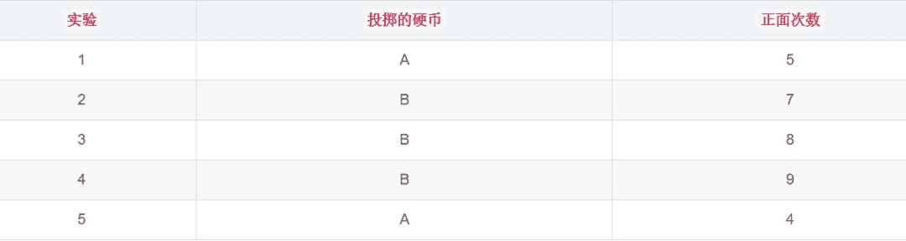

ok，根据以上分布结果，可以轻松算出：

似乎很简单，但是你要知道每次我们都知道了是抛出哪个硬币。换句话说，我们已经提前知道了每次选择硬币抛出的样本分布。如果，我们不知道呢？那会是什么样的？上面的例子变成了这种：

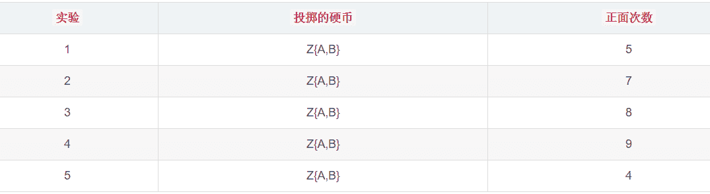

Z{A,B}表示每次选择A、B两个硬币中一个，但是我们现在已经不知道是哪一个了，目标还是估计A、B两个硬币正面朝上的概率。当我们知道每一次抛出的硬币是A还是B，才能利用最大似然估计对A、B正面朝上的概率进行估计。

当我们知道A、B正面朝上的概率，才会知道抛出的硬币最有可能是A还是B。这样来看，这个问题就有趣了，我们并不知道是鸡生蛋还是蛋生鸡，怎么判断是先有鸡还是先有蛋？考虑这个问题不妨再来看下面的例子。

##### **2\. 分菜问题**

##### 大厨炒好了一锅菜，需要把锅里的菜平均分配到两个碟子里，大厨应该怎么办呢？

如果是浸淫已久的大厨，可能随便小手一抖就平均到两个碟子里了，但是大多数都是伪大厨，手上功夫还不到位，他们应该怎么做？

伪大厨可能需要多试几次才行，比如先随便分在两个碟子里，然后把菜多碟子的菜往另一个碟子匀匀，然后再匀匀，再匀匀…一直到两个碟子中菜的量大致一样。

ok，那我们这个问题呢？要不也试试伪大厨的方法？

##### **3\. 模仿分菜**

##### 首先，我们模仿伪大厨的方法，随便设置A、B硬币正面朝上的概率P_A=0.5、P_B=0.9。如果第一枚硬币是A硬币，那么它正面朝上的概率是：

##### 如果第一枚硬币是B硬币，那么它正面朝上的概率是：

同样的计算方法，其他几枚硬币的概率分别是：

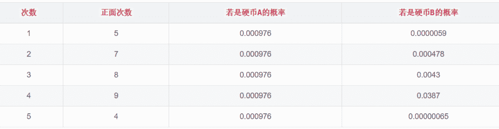

按照最大似然法则，每一次取概率最大的作为我们的结果，则硬币的顺序依次是：AABBA。这个也就是上面我们假设的Z值，那么根据这个Z值我们可以轻松的算出：

算出的P_A、P_B的值和我们假设的不一致，这时候说明伪大厨还没有把菜分均匀。看来伪大厨还需要再分一次，这个时候A、B正面朝上的值由第一次的：

##### 更新成现在的：

重复上面的步骤，最终A、B正面朝上的概率不再发生变化，且会逐渐逼近一个值，这就是EM算法的工作原理。

##### **4\. 模仿的升级**

虽然说我们一直在模仿大厨的操作，但是我们也想要超越他成为更厉害的大厨。

在上面的过程中，我们发现直接每一次选择最大概率的结果作为硬币的选择有点过于绝对，因为从计算结果来看另一枚硬币也是有概率的，只是概率偏小一点。这样的话，我们在第一轮中可以这样计算：

如果第一枚硬币是A硬币，那么它正面朝上的概率是：

同理可以求出第2轮到底5轮的概率值

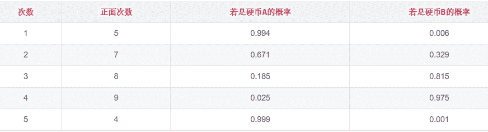

此时，我们可以根据最大似然估计求出的概率，分别算出AB正反面的期望值：

例如：第一轮中，0.994的概率为A，抛10次，正面朝上的概率为0.994*5=9.94，同理反正为0.06。同理可以求出第2轮到第5轮的期望值：

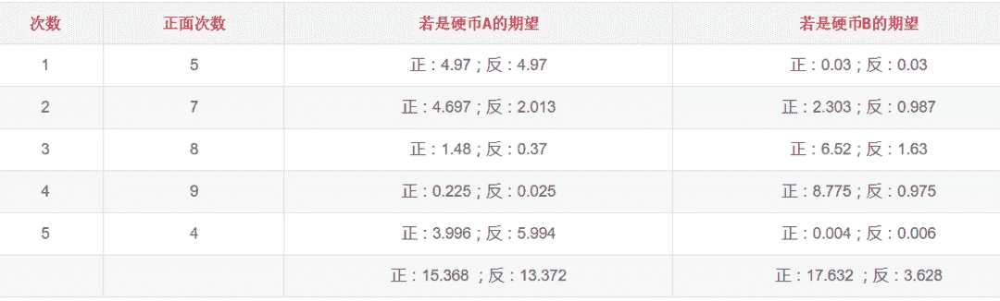

此时根据期望值我们可以轻松的算出：

可以看出，相比上一种方法，这种方法的收敛会更快些，更加逼近我们的目标值。这个过程就是EM算法的实现过程。

##### **5\. EM工作原理**

上面的投掷硬币属于A硬币还是B硬币我们称之为隐含参数，A硬币和B硬币的分布参数我们称之为模型参数。

EM 算法解决这个的思路是使用启发式的迭代方法，既然我们无法直接求出模型分布参数，那么我们可以先猜想隐含参数（EM算法的E步），接着基于观察数据和猜测的隐含参数一起来极大化似然估计，求解我们的模型参数（EM算法的M步)。

由于我们之前的隐含参数是猜测的，所以此时得到的模型参数一般还不是我们想要的结果。我们基于当前得到的模型参数，继续猜测隐含参数（EM算法的E步），然后继续极大化似然估计，求解我们的模型参数（EM算法的M步)。

以此类推，不断的迭代下去，直到模型分布参数基本无变化，算法收敛，找到合适的模型参数。

画了一个图，感受一下：

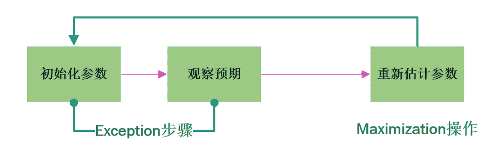

EM聚类

EM算法在聚类的时候也是要先估计一个隐状态，这个隐状态也就是我们的样本标签。

有了样本标签之后，就可以将原来的无监督学习转换为监督学习，然后通过极大似然估计法求解出模型最优参数。

需要解释一点的是，在整个过程中，隐状态的估计需要用到EM算法。

**硬聚类or软聚类**

k-means算法是通过距离来聚类的，因为距离是确定的，所以就导致每个样本只能归为一类，这叫做硬聚类。

而EM算法在聚类的过程中，每个样本都有一定的概率和每个聚类有关，这叫做软聚类。

通常，我们可以假设样本符合高斯分布，因为每个高斯分布都属于这个模型的组成部分，要分成K个簇就相当于是K个组成部分。

这样我们可以先初始化每个组成部分的高斯分布的参数，然后再来看每个样本是属于哪个组成部分。这就是E步骤；再通过得到的这些隐含变量结果，反过来求每个组成部分高斯分布的参数，即 M 步骤。

反复EM步骤，直到每个组成部分的高斯分布参数不变为止，这样也就相当于将样本按照高斯模型进行了EM聚类。

EM 算法相当于一个框架，我们可以采用不同的模型来进行聚类，比如 GMM（高斯混合模型）、 HMM（隐马尔科夫模型）来进行聚类。

GMM通过概率密度来进行聚类，聚成的类符合高斯分布（正态分布）。HMM用到了马尔可夫过程，通过状态转移矩阵来计算状态转移的概率。

项目实战

**1\. 准备工作**

如何创建高斯聚类呢，我们需要先了解一下高斯聚类的参数。在sklearn 中，高斯聚类可以这样创建：

```
# 创建高斯聚类模型
gmm = GaussianMixture(n_components=1, covariance_type='full', max_iter=100) 
```

解释一下主要的参数：

*   n_components：即高斯混合模型的个数，也就是我们要聚类的个数，默认值为 1。

*   covariance_type：代表协方差类型。一个高斯混合模型的分布是由均值向量和协方差矩阵决定的，所以协方差的类型也代表了不同的高斯混合模型的特征。

*   max_iter：代表最大迭代次数，EM 算法是由 E 步和 M 步迭代求得最终的模型参数，这里可以指定最大迭代次数，默认值为 100。

其中协方差类型covariance_type又四种取值，分别是：

*   covariance_type=full，代表完全协方差，也就是元素都不为 0；

*   covariance_type=tied，代表相同的完全协方差；

*   covariance_type=diag，代表对角协方差，也就是对角不为 0，其余为 0；

*   covariance_type=spherical，代表球面协方差，非对角为 0，对角完全相同，呈现球面的特性。

需要注意的是，聚类的个数往往是由业务决定的，比如对用户收入进行聚类，可以分为：高收入群体、中收入群体、低收入群体，根据用户价值进行聚类，可以分为：高价值用户、中价值用户、低价值用户、无价值用户等等。

当然如果你无法确定聚类的个数，可以通过设置不同的聚类个数进而选择具有最优效果的模型。

**2\. 了解数据**

本次实战我们的数据是王者荣耀的英雄属性数据，通过对69个英雄的22个属性数据，其中包括英雄的最大生命、生命成长、最大发力、最高物攻等等，通过每个英雄之间的特征，对69个英雄进行“人以群分，物以类聚”。

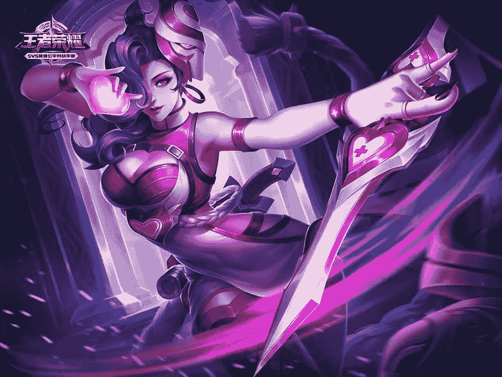

感兴趣的同学可以尝试一下最终的结果能否应用于实际游戏中。ok，先来看看我们本次数据的整体描述：

```
df_ori.head(5) 
```

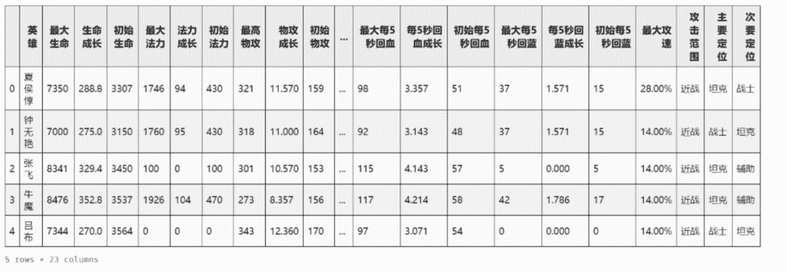

再来看看各个英雄属性的整体情况：

```
"""数据的EDA操作"""
"""
1.数据整体描述
"""
df.data=df_ori.copy()
df.data.drop('英雄'，axis=1,inplace=True)
#次要定位存在空值
df.data.info() 
```

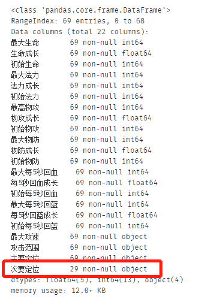

一共22个英雄属性（不包括姓名），其中次要定位存在空值，且空值较多。再来看看数值型数据的整体分布情况：

```
df_data.describe() 
```

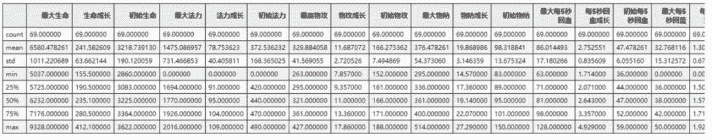

数据分布没有什么异常，但是应该需要考虑进行标准化，这个后面再说。最大攻速字段应该是数值型的，我们需要对其进行处理：

```
df_ori.head(5) 
```

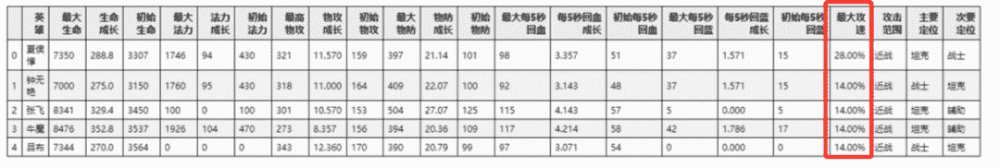

另外，次要定位属性缺失值太多，而且没有有效的填充方法，直接删掉它

```
# 最大攻速为百分比需要替换成数值
df_data['最大攻速'] = df_data['最大攻速'].apply(lambda str: str.replace('%', ''))
# 次要定位数据无法填充，且已存在主要定位，直接删除该字段
df_data.drop('次要定位', axis=1, inplace=True) 
```

##### **3\. 数据探索**

一共只有69数据，但是却有22个属性，是否存在属性重复的情况呢？我们知道在建模过程中，重复的属性对最终结果不会产生影响。所以我们可以通过关联度分析，看一下数据之间的关联度情况，这种方式在前面的实战种很多次都用到过。

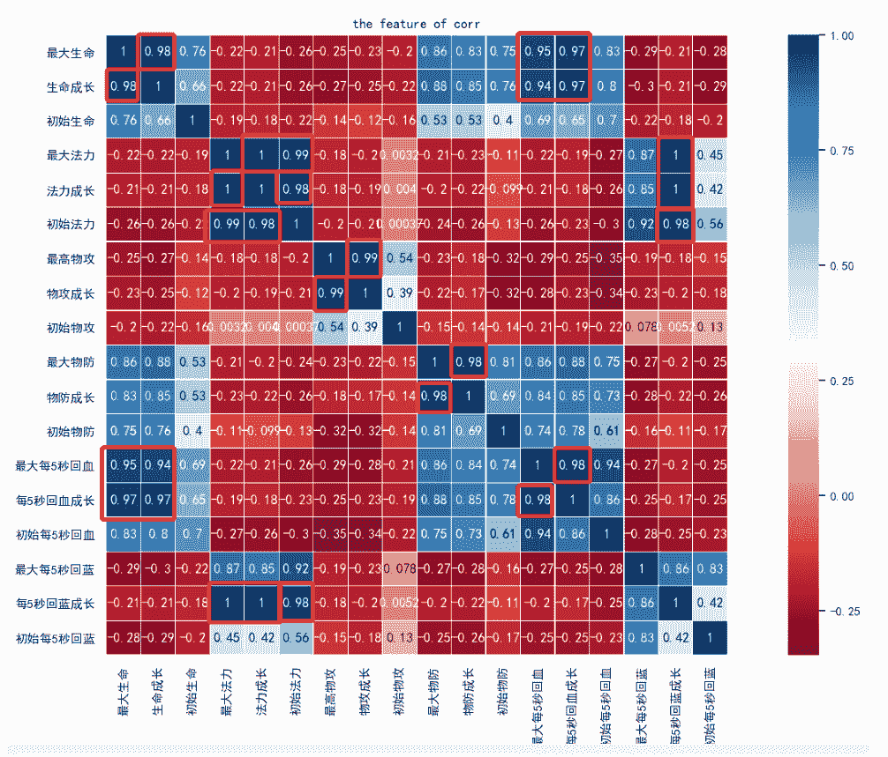

可以看到，用红框标出的，都是属性之间相互关联度特别大的，对于这些我们只需要保留其中的一种属性即可。通过筛选，我们最终确定了13个英雄属性

```
"""进行特征选择"""
features=df_data.columns.values.tolist()
duplicates_features=['生命成长','最大法力','法力成长','物攻成长','物防成长','每5秒回血成长','最大每5秒回血成长','每5秒回蓝成长']
features=features
for feature in duplicates_features:
    features.remove(feature)
df_data=df_data[features]
df_data.head() 
```

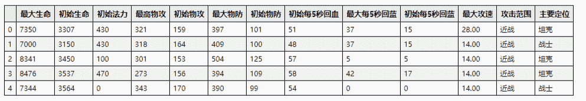

再来看英雄属性：攻击范围和主要定位，是离散型特征，直接对其进行特征量化

```
"""通过标签编码实现特征量化"""
for feature in ['攻击范围', '主要定位']:
  le = preprocessing.LabelEncoder()
  le.fit(df_data[feature])
  df_data[feature] = le.transform(df_data[feature]) 
```

最后就是数据的规范化，直接通过Z-Score进行数据规范

```
"""采用Z-Score规范化数据，保证每个特征维度的数据均值为0，方差为1"""
stas = StandardScaler()
df_data = stas.fit_transform(df_data) 
```

##### **4\. 建模**

选用我们前面提到的GMM进行建模

```
# 构造GMM聚类
gmm = GaussianMixture(n_components=30, covariance_type='full')
gmm.fit(df_data)

# 训练数据
prediction = gmm.predict(df_data) 
```

最终的模型聚类结果是这样的：

```
#将分组结果输出到CSV文件中
df_ori.insert(0,'分组',prediction)
df_ori.sort_values('分组').head(15) 
```

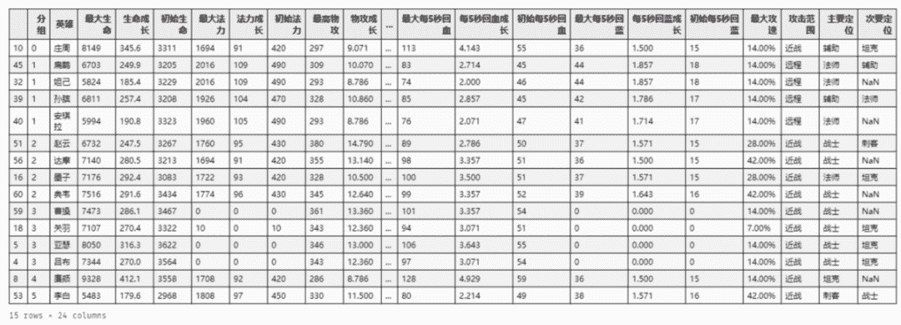

##### **5\. 总结**

上面的图中放了前20的英雄，组号相同的英雄表示属性相近，感兴趣的同学不妨在游戏中试试？

另外，聚类算法属于无监督的学习方式，我们并没有实际的结果可以进行对比来区别模型的准确率。这里我们试着用轮廓系数进行模型的评分。

```
"""根据轮廓系数计算模型得分"""
from sklearn.metrics import silhouette_score
score=silhouette_score(df_data,prediction,metric='euclidean')
score 
```

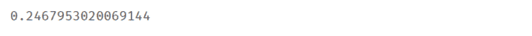

最后得分0.246，也不是很高，说明聚类的效果不是特别好，应该还是英雄属性的原因，例如，通过主要定位就可以对英雄就行聚类，或者通过攻击范围进行聚类，但是这两个属性和其他属性的结合，有时候并非是最好的，对游戏理解比较深刻的同学可以考虑一下优化方法。

**数据集及代码在后台回复** ***王者荣耀*** *获取*


“为沉迷学习**点赞**↓