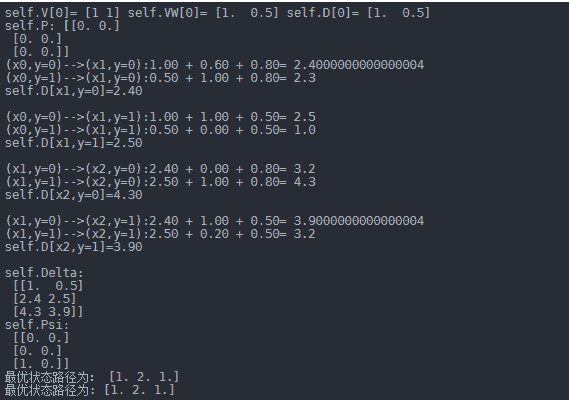

 Datawhale 

**作者：丁媛媛，****Datawhale优秀学习者**

寄语：本文先对马尔可夫过程及隐马尔可夫算法进行了简单的介绍；然后，对条件随机场的定义及其三种形式进行了详细推导；最后，介绍了条件随机场的三大问题，同时针对预测问题给出了代码实践。

条件随机场(conditional random fields，简称 CRF，或CRFs)，是一种判别式概率模型，常用于标注或分析序列资料，如自然语言文字或是生物序列。

条件随机场是条件概率分布模型P(Y|X)，表示的是给定一组输入随机变量X的条件下另一组输出随机变量Y的马尔可夫随机场，也就是说CRF的特点是假设输出随机变量构成马尔可夫随机场。

## 知识框架


## 马尔可夫过程

定义：假设一个随机过程中， 时刻的状态 的条件发布，只与其前一状态 相关，即：

则将其称为马尔可夫过程。


## 隐马尔可夫算法(HMM)

**1、定义**

隐马尔可夫算法是对含有未知参数（隐状态）的马尔可夫链进行建模的生成模型，如下图所示：


在隐马尔科夫模型中，包含隐状态和观察状态，隐状态 对于观察者而言是不可见的，而观察状态 对于观察者而言是可见的。隐状态间存在转移概率，隐状态 到对应的观察状态 间存在输出概率。

**2、假设**

假设隐状态 的状态满足马尔可夫过程， 时刻的状态 的条件分布，仅与其前一个状态 相关，即：

假设观测序列中各个状态仅取决于它所对应的隐状态，即：

**3、存在问题**

在序列标注问题中，隐状态（标注）不仅和单个观测状态相关，还和观察序列的长度、上下文等信息相关。例如词性标注问题中，一个词被标注为动词还是名词，不仅与它本身以及它前一个词的标注有关，还依赖于上下文中的其他词。

## 条件随机场

以线性链条件随机场为例

**1、定义**

给定<embed style="width: 41.686ex" src="https://mmbiz.qlogo.cn/mmbiz_svg/3a3QxMHZ8YwnLDxI5vXUicdH89tOSgFqyKvKuRJn09piarq2nHAfFt5oyqNibD1ibWMotRkQ1usR12BU3IaDcRgtr61gbJWgTtEe/0?wx_fmt=svg">均为线性链表示的随机变量序列，若在给随机变量序列X的条件下，随机变量序列Y的条件概率分布P(Y|X)构成条件随机场，即满足马尔可夫性：

则称为 为线性链条件随机场。

通过去除了隐马尔科夫算法中的观测状态相互独立假设，使算法在计算当前隐状态 时，会考虑整个观测序列，从而获得更高的表达能力，并进行全局归一化解决标注偏置问题。

**1）参数化形式**

其中： 为归一化因子，是在全局范围进行归一化，枚举了整个隐状态序列 的全部可能，从而解决了局部归一化带来的标注偏置问题。

为定义在边上的特征函数，转移特征，依赖于前一个和当前位置 为定义在节点上的特征函数，状态特征，依赖于当前位置。

**2）简化形式**

因为条件随机场中同一特征在各个位置都有定义，所以可以对同一个特征在各个位置求和，将局部特征函数转化为一个全局特征函数，这样就可以将条件随机场写成权值向量和特征向量的内积形式，即条件随机场的简化形式。

*   **step 1 **将转移特征和状态特征及其权值用统一的符号表示，设有 个转移特征， 个状态特征， ,记

*   **step 2 **对转移与状态特征在各个位置 求和，记作

*   **step 3 **将 和 用统一的权重表示，记作

*   **step 4 **转化后的条件随机场可表示为：

*   **step 5 **若 表示权重向量： 以 表示特征向量，即

     则，条件随机场写成内积形式为：

**3）矩阵形式**

**2、基本问题**

条件随机场包含概率计算问题、学习问题和预测问题三个问题。

*   概率计算问题：已知模型的所有参数，计算观测序列Y出现的概率，常用方法：前向和后向算法；

*   学习问题：已知观测序列Y,求解使得该观测序列概率最大的模型参数，包括隐状态序列、隐状态间的转移概率分布和从隐状态到观测状态的概率分布，常用方法：Baum-Wehch算法；

*   预测问题：一直模型所有参数和观测序列Y，计算最可能的隐状态序列X,常用算法：维特比算法。

**1）概率计算问题**

给定条件随机场 ，输入序列 和 输出序列 ; 计算条件概率

计算相应的数学期望问题；

**前向-后向算法**

*   **step 1** 前向计算；对观测序列x的每个位置 ，定义一个 阶矩阵（m为标记Y_i取值的个数），对每个指标 ，定义前向向量 ，则递推公式:

      其中，

<svg xmlns="http://www.w3.org/2000/svg" viewBox="0 -1449.5 11184.3 2399" style="-webkit-overflow-scrolling: touch;vertical-align: -2.148ex;width: 25.304ex;height: 5.428ex;max-width: 300% !important;"><g stroke="currentColor" fill="currentColor" stroke-width="0" transform="matrix(1 0 0 -1 0 0)"><g><g transform="translate(4495.1, 0)"><g transform="translate(750, 0)"><g transform="translate(0, -600)"><g><g transform="translate(2222.4, 0)">否则</g></g></g></g></g></g></g></svg>

*   **step 2** 后向计算；对每个指标 ，定义前向向量 ，则递推公式:

*   **step 3**

*   **step 4** 概率计算；所以，标注序列在位置 是标注 的条件概率为：

     其中，

*   **step 5** 期望值计算；通过利用前向-后向向量，计算特征函数关于联合概率分布 和 条件概率分布 的数学期望，即特征函数 关于条件概率分布 的数学期望：

       其中：

**2）学习问题**

这里主要介绍一下 BFGS 算法的思路。

**输入**：特征函数 ：经验分布 ；

**输出**：最优参数值 ，最优模型 。

1.  选定初始点 ， 取 为正定对称矩阵， ;

2.  计算 ，若 ，则停止计算，否则转 (3) ；

3.  利用 计算 ；

4.  一维搜索：求 使得

1.  设

2.  计算 , 若 ， 则停止计算；否则，利用下面公式计算 :

     令 ，转步骤（3）；

**3）预测问题**

对于预测问题，常用的方法是维特比算法，其思路如下：

**输入**：模型特征向量 和权重向量 ，输入序列（观测序列） ；

**输出**：条件概率最大的输出序列（标记序列） ，也就是最优路径；

1.  初始化

1.  递推，对

1.  终止

1.  返回路径

    求得最优路径

**案****例：利用维特比算法计算给定输入序列 对应的最优输出序列 ：**

1.  初始化

1.  递推，对

1.  终止

1.  返回路径

求得最优路径<embed style="width: 29.243ex" src="https://mmbiz.qlogo.cn/mmbiz_svg/3a3QxMHZ8YwnLDxI5vXUicdH89tOSgFqyhSoQZ4g8vrprviabOtc1Vibibo9IfrhAbm8J2lOZrzQIUpBJS79Gaf9U8tP3DlzX2Ka/0?wx_fmt=svg">

代码实现如下：

```
import numpy as np

class CRF(object):
    '''实现条件随机场预测问题的维特比算法
    '''
    def __init__(self, V, VW, E, EW):
        '''
        :param V:是定义在节点上的特征函数，称为状态特征
        :param VW:是V对应的权值
        :param E:是定义在边上的特征函数，称为转移特征
        :param EW:是E对应的权值
        '''
        self.V  = V  #点分布表
        self.VW = VW #点权值表
        self.E  = E  #边分布表
        self.EW = EW #边权值表
        self.D  = [] #Delta表，最大非规范化概率的局部状态路径概率
        self.P  = [] #Psi表，当前状态和最优前导状态的索引表s
        self.BP = [] #BestPath，最优路径
        return 

    def Viterbi(self):
        '''
        条件随机场预测问题的维特比算法，此算法一定要结合CRF参数化形式对应的状态路径图来理解，更容易理解.
        '''
        self.D = np.full(shape=(np.shape(self.V)), fill_value=.0)
        self.P = np.full(shape=(np.shape(self.V)), fill_value=.0)
        for i in range(np.shape(self.V)[0]):
            #初始化
            if 0 == i:
                self.D[i] = np.multiply(self.V[i], self.VW[i])
                self.P[i] = np.array([0, 0])
                print('self.V[%d]='%i, self.V[i], 'self.VW[%d]='%i, self.VW[i], 'self.D[%d]='%i, self.D[i])
                print('self.P:', self.P)
                pass
            #递推求解布局最优状态路径
            else:
                for y in range(np.shape(self.V)[1]): #delta[i][y=1,2...]
                    for l in range(np.shape(self.V)[1]): #V[i-1][l=1,2...]
                        delta = 0.0
                        delta += self.D[i-1, l]                      #前导状态的最优状态路径的概率
                        delta += self.E[i-1][l,y]*self.EW[i-1][l,y]  #前导状态到当前状体的转移概率
                        delta += self.V[i,y]*self.VW[i,y]            #当前状态的概率
                        print('(x%d,y=%d)-->(x%d,y=%d):%.2f + %.2f + %.2f='%(i-1, l, i, y, \
                              self.D[i-1, l], \
                              self.E[i-1][l,y]*self.EW[i-1][l,y], \
                              self.V[i,y]*self.VW[i,y]), delta)
                        if 0 == l or delta > self.D[i, y]:
                            self.D[i, y] = delta
                            self.P[i, y] = l
                    print('self.D[x%d,y=%d]=%.2f\n'%(i, y, self.D[i,y]))
        print('self.Delta:\n', self.D)
        print('self.Psi:\n', self.P)

        #返回，得到所有的最优前导状态
        N = np.shape(self.V)[0]
        self.BP = np.full(shape=(N,), fill_value=0.0)
        t_range = -1 * np.array(sorted(-1*np.arange(N)))
        for t in t_range:
            if N-1 == t:#得到最优状态
                self.BP[t] = np.argmax(self.D[-1])
            else: #得到最优前导状态
                self.BP[t] = self.P[t+1, int(self.BP[t+1])]

        #最优状态路径表现在存储的是状态的下标，我们执行存储值+1转换成示例中的状态值
        #也可以不用转换，只要你能理解，self.BP中存储的0是状态1就可以~~~~
        self.BP += 1

        print('最优状态路径为：', self.BP)
        return self.BP

def CRF_manual():   
    S = np.array([[1,1],   #X1:S(Y1=1), S(Y1=2)
                  [1,1],   #X2:S(Y2=1), S(Y2=2)
                  [1,1]])  #X3:S(Y3=1), S(Y3=1)
    SW = np.array([[1.0, 0.5], #X1:SW(Y1=1), SW(Y1=2)
                   [0.8, 0.5], #X2:SW(Y2=1), SW(Y2=2)
                   [0.8, 0.5]])#X3:SW(Y3=1), SW(Y3=1)
    E = np.array([[[1, 1],  #Edge:Y1=1--->(Y2=1, Y2=2)
                   [1, 0]], #Edge:Y1=2--->(Y2=1, Y2=2)
                  [[0, 1],  #Edge:Y2=1--->(Y3=1, Y3=2) 
                   [1, 1]]])#Edge:Y2=2--->(Y3=1, Y3=2)
    EW= np.array([[[0.6, 1],  #EdgeW:Y1=1--->(Y2=1, Y2=2)
                   [1, 0.0]], #EdgeW:Y1=2--->(Y2=1, Y2=2)
                  [[0.0, 1],  #EdgeW:Y2=1--->(Y3=1, Y3=2)
                   [1, 0.2]]])#EdgeW:Y2=2--->(Y3=1, Y3=2)

    crf = CRF(S, SW, E, EW)
    ret = crf.Viterbi()
    print('最优状态路径为:', ret)
    return

if __name__=='__main__':
    CRF_manual() 
```

输出如下图：



 **后台回复** ***社区** 和更多优秀学习者一起成长*


“为沉迷学习**点赞**↓