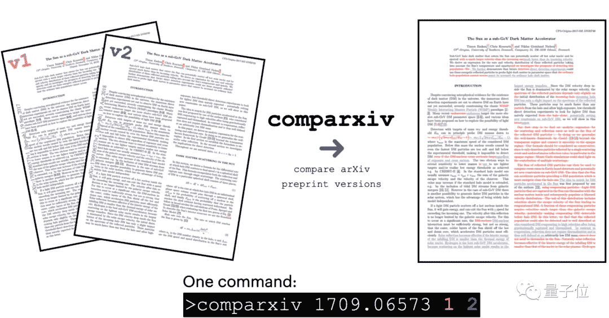
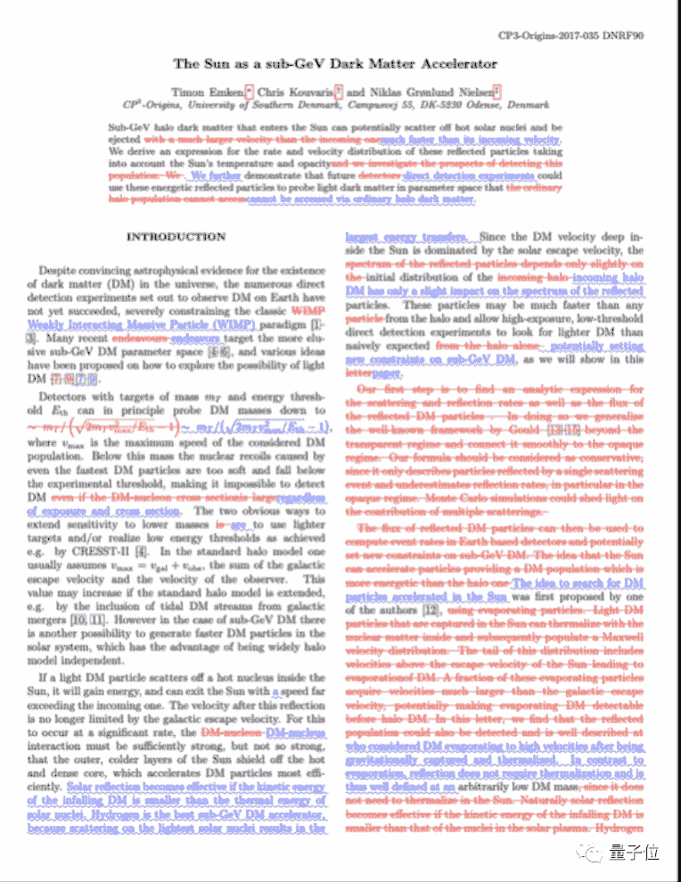
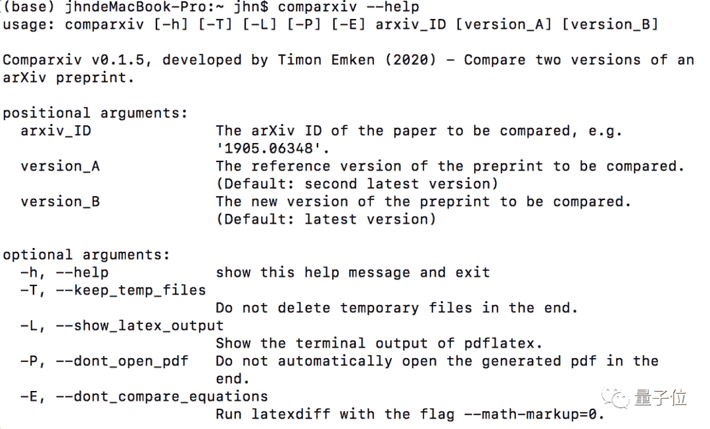

##### 贾浩楠 发自 凹非寺
量子位 报道 | 公众号 QbitAI

在arXiv上发现了一篇中意的论文，当然是下载保存慢慢研究！

然而，等你好不容易看完了文章，发现作者又上传了V2、V3，一眼望去却看不出差别，这种情况令人头疼不已，难道又要花几个晚上时间研究新版本？

Github上的一个比较预印本论文版本差别的工具也许能帮到你，而且**只需一行代码就能实现**。



## 使用教程

运行这个工具你需要安装PyPI包、以及带有pdflatex和latexdiff的文本分布工具。

对于Linux系统，可以通过运行这个指令来安装文本分布工具：

```
sudo apt-get install texlive-full 
```

MacOS系统通过这个指令安装：

```
brew cask install mactex 
```

前提是你已经安装过了Homebrew。

使用环境都配置好以后，直接使用指令安装comparxiv工具：

```
pip install comparxiv 
```

或从项目地址安装：

```
git clone https://github.com/temken/comparxiv.git
cd comparxiv
python setup.py install 
```

安装完成就可以开始使用了。

如果我们要比较某一篇论文的最近两个版本，只需要提供论文的ID：

```
comparxiv hep-ph/0612370 
```

如果要比较第N和N-1版本，运行这个指令：

```
comparxiv 1709.06573vN 
```

比较两个特定版本N、M，运行：

```
comparxiv 1905.06348 N M 
```

或者：

```
comparxiv 1905.06348vN M 
```

如果运行成功，会输出一个pdf文件并自动打开：



此外，还有一些实用指令，输入：

```
comparxiv —help 
```

可查看，包括：



## One more thing

这个项目于4月24日上传Github，作者声明现在还处在b测阶段，除了一些测试的论文实例，无法应用在所有的arXiv论文上。


但是从已有的测试结果来看，完全称得上便捷实用。

所以建议你**先马后看**，等待正式版本问世，大概率会是一个人见人爱的实用工具。

Github项目地址：
https://github.com/temken/comparxiv

 **后台回复** ***学习** 和更多优秀学习伙伴一起成长*


“为沉迷学习**点赞**↓