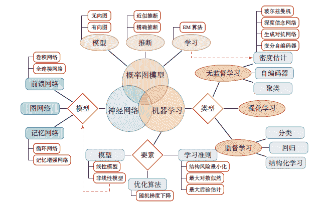
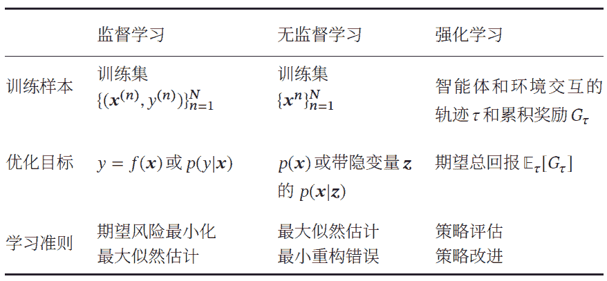
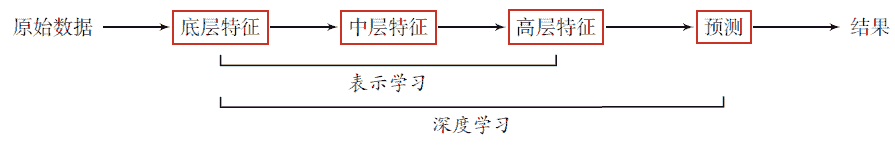
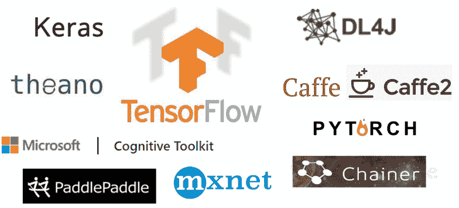

 Datawhale 

****作者：邱锡鹏，复旦大学教授****

寄语：本文梳理了深度学习知识体系，分为机器学习、神经网络和概率图模型，同时对机器学习算法类型、深度学习原理框架等进行了梳理，帮助大家更好地学习和入手深度学习。

深度学习是机器学习的分支，是一种以人工神经网络为架构，对数据进行表征学习的算法。深度学习在搜索技术，数据挖掘，机器学习，机器翻译，自然语言处理等多个领域都取得了卓越的成果，可见其重要性，本文将通过梳理知识体系脉络帮助大家深入浅出了解深度学习。

## 深度学习知识体系

下图梳理了神经网络和深度学习所涉及的知识体系。该知识体系可以分为三大块：机器学习、神经网络和概率图模型。

   

**1\. 机器学习**

机器学习可以分为监督学习、无监督学习和强化学习。机器学习的基本概念以及三要素为：模型、学习准则和优化算法。深度学习是机器学习的分支，机器学习分为监督学习、无监督学习及强化学习三个方向，具体内容在下文中会详细介绍。

**2\. 神经网络**

神经网络作为一类非线性的机器学习模型，可以更好地实现输入和输出之间的映射。关于神经网络，需要掌握其优化和正则化方向，注意力机制和外部记忆。神经网络包含三种主要的神经网络模型：

*   前馈神经网络；

*   卷积神经网络；

*   循环神经网络。目前，越来越多人也投入到图神经网络中的研究中来。

**3\. 概率图模型**

概率图模型为机器学习提供了一个更加便捷的描述框架. 其基本概念包括模型表示、学习和推断. 目前深度学习和概率图模型的融合已经十分流行. 其中，比较重要的图模型有：

*   两种概率图模型：玻尔兹曼机和深度信念网络；

*   两种概率生成模型：深度生成模型和序列生成模型。

## 机器学习算法类型

机器学习算法可以按照不同的标准来进行分类：

*   按照函数????(???? ; ????) 的不同，分为线性模型和非线性模型；

*   按照学习准则的不同，分为统计方法和非统计方法。

但一般来说，按照训练样本提供的信息以及反馈方式的不同，将机器学习算法分为以下几类：

**1\. 监督学习（Supervised Learning）**

如果机器学习的目标是通过建模样本的特征 ???? 和标签 ???? 之间的关系：???? = ????(???? ; ????) 或????(????| ???? ; ????)，并且训练集中每个样本都有标签，那么这类机器学习称为监督学习。

根据标签类型的不同，监督学习又可以分为回归问题、分类问题和结构化学习问题.

*   **回归**（Regression）问题中的标签 ???? 是连续值（实数或连续整数），????(????; ????)的输出也是连续值。

*   **分类**（Classification）问题中的标签 ???? 是离散的类别（符号）. 在分类问题中，学习到的模型也称为分类器（Classifier）. 分类问题根据其类别数量又可分为二分类（Binary Classification）和多分类（Multi-class Classification）问题。

*   **结构化学习**（Structured Learning）问题的输出 ???? 通常是结构化的对象，比如序列、树或图等. 结构化学习可以看作是一种特殊的分类问题.由于结构化学习的输出空间比较大，因此我们一般定义一个联合特征空间，将????, ???? 映射为该空间中的联合特征向量????(????, ????)，预测模型可以写为：

    

    其中Gen(????) 表示输入 ???? 的所有可能的输出目标集合。一种基于感知器的结构化学计算arg max 的过程也称为解码（Decoding）过程，一般通过动态规划的方法来计算.

**2\. 无监督学习（Unsupervised Learning，UL）**

无监督学习是指从不包含目标标签的训练样本中自动学习到一些有价值的信息。典型的无监督学习问题有聚类、密度估计、特征学习、降维等。

**3\. 强化学习（Reinforcement Learning，RL）**

强化学习是一类通过交互来学习的机器学习算法。在强化学习中，智能体根据环境的状态做出一个动作，并得到即时或延时的奖励。智能体在和环境的交互中不断学习并调整策略，以取得最大化的期望总回报。

**4\. 三种机器学习类型的比较**

监督学习需要每个样本都有标签，而无监督学习则不需要标签。一般而言，监督学习通常需要大量的有标签数据集，这些数据集一般都需要由人工进行标注，成本很高。

因此，也出现了很多弱监督学习（Weakly Supervised Learning）和半监督学习（Semi-Supervised Learning，SSL）的方法，希望从大规模的无标注数据中充分挖掘有用的信息，降低对标注样本数量的要求。

强化学习和监督学习的不同在于强化学习不需要显式地以“输入/输出对”的方式给出训练样本，是一种在线的学习机制。     

## 深度学习原理简介 

为了学习一种好的表示，需要构建具有一定“深度”的模型，并通过学习算法来让模型自动学习出好的特征表示（从底层特征，到中层特征，再到高层特征），从而最终提升预测模型的准确率。

所谓“深度”是指原始数据进行非线性特征转换的次数。如果把一个表示学习系统看作是一个有向图结构，深度也可以看作是从输入节点到输出节点所经过的最长路径的长度。

这样我们就需要一种学习方法可以从数据中学习一个“深度模型”，这就是深度学习（Deep Learning，DL）。深度学习是机器学习的一个子问题，其主要目的是从数据中自动学习到有效的特征表示。

通过多层的特征转换，把原始数据变成更高层次、更抽象的表示。这些学习到的表示可以替代人工设计的特征，从而避免“特征工程”。下图为深度学习的数据处理流程。

深度学习是将原始的数据特征通过多步的特征转换得到一种特征表示，并进一步输入到预测函数得到最终结果。

和“浅层学习”不同，深度学习需要解决的关键问题是贡献度分配问题（Credit Assignment Problem，CAP）[Minsky, 1961]，即一个系统中不同的组件(component)或其参数对最终系统输出结果的贡献或影响。

以下围棋为例，每当下完一盘棋，最后的结果要么赢要么输。我们会思考哪几步棋导致了最后的胜利，或者又是哪几步棋导致了最后的败局。如何判断每一步棋的贡献就是贡献度分配问题，这是一个非常困难的问题。

从某种意义上讲，深度学习可以看作是一种强化学习（Reinforcement Learning，RL），每个内部组件并不能直接得到监督信息，需要通过整个模型的最终监督信息（奖励）得到，并且有一定的延时性。

目前，深度学习采用的模型主要是神经网络模型，其主要原因是神经网络模型可以使用误差反向传播算法，从而可以比较好地解决贡献度分配问题。只要是超过一层的神经网络都会存在贡献度分配问题，因此超过一层的神经网络都可以看作是深度学习模型。

随着深度学习的快速发展，模型深度也从早期的5 ∼ 10 层到目前的数百层。随着模型深度的不断增加，其特征表示的能力也越来越强，从而使后续的预测更加容易。

## 常见深度学习框架

在深度学习中，一般通过误差反向传播算法来进行参数学习. 采用手工方式来计算梯度再写代码实现的方式会非常低效，并且容易出错。

此外，深度学习模型需要的计算机资源比较多，一般需要在CPU 和GPU 之间不断进行切换，开发难度也比较大。因此，一些支持自动梯度计算、无缝CPU 和GPU 切换等功能的深度学习框架就应运而生。

比较有代表性的框架包括：Caffe、TensorFlow、Pytorch、MXNet 、飞桨（PaddlePaddle）等。

**1\. Caffe**：由加州大学伯克利分校开发的针对卷积神经网络的计算框架，主要用于计算机视觉。Caffe 用C++ 和Python 实现，但可以通过配置文件来实现所要的网络结构，不需要编码。Caffe2 已经被并入PyTorch 中。

**2\. TensorFlow**：由Google 公司开发的深度学习框架，可以在任意具备CPU或者GPU 的设备上运行。其计算过程使用数据流图来表示。

TensorFlow 的名字来源于其计算过程中的操作对象为多维数组，即张量（Tensor）。TensorFlow 1.0 版本采用静态计算图，2.0 版本之后也支持动态计算图。

**3\. PyTorch**：由Facebook、NVIDIA、Twitter 等公司开发维护的深度学习框架，其前身为Lua 语言的Torch4。PyTorch 也是基于动态计算图的框架，在需要动态改变神经网络结构的任务中有着明显的优势。

**4\. 飞桨（PaddlePaddle）**：百度开发的一个高效和可扩展的深度学习框架，同时支持动态图和静态图。飞桨提供强大的深度学习并行技术，可以同时支持稠密参数和稀疏参数场景的超大规模深度学习并行训练，支持千亿规模参数和数百个节点的高效并行训练。

**5\. Chainer**：一个最早采用动态计算图的深度学习框架，其核心开发团队为来自日本的一家机器学习创业公司Preferred Networks和Tensorflow、Theano、Caffe 等框架使用的静态计算图相比，动态计算图可以在运行时动态地构建计算图，因此非常很适合进行一些复杂的决策或推理任务。

**6\. MXNet**：由亚马逊、华盛顿大学和卡内基梅隆大学等开发维护的深度学习框架。MXNet 支持混合使用符号和命令式编程来最大化效率和生产率，并可以有效地扩展到多个GPU 和多台机器。

**7\. Theano**：由蒙特利尔大学的Python 工具包， 用来高效地定义、优化和计算张量数据的数学表达式。Theano 可以透明地使用GPU 和高效的符号微分。Theano 项目目前已停止维护。

在这些基础框架之上，还有一些建立在这些框架之上的高度模块化的神经网络库，使得构建一个神经网络模型就像搭积木一样容易. 其中比较有名的模块化神经网络框架有

*   基于TensorFlow 和Theano 的Keras8；

*   基于Theano的Lasagne9。

本文摘编自复旦大学邱锡鹏教授的《神经网络与深度学习》，经出版方授权发布。

**后台回复** ***学习** 和更多优秀伙伴一起*学习*成长*

“为沉迷学习**点赞**↓