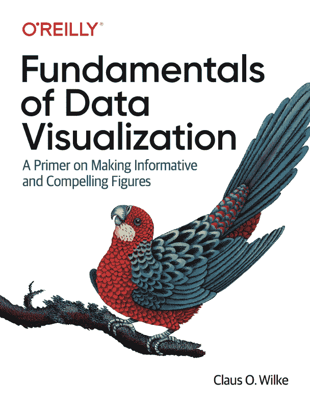

> 原文：[Fundamentals of Data Visualization](https://serialmentor.com/dataviz/)
> 
> 校验：[飞龙](https://github.com/wizardforcel)
> 
> 协议：[CC BY-NC-SA 4.0](http://creativecommons.org/licenses/by-nc-sa/4.0/)
> 
> 欢迎任何人参与和完善：一个人可以走的很快，但是一群人却可以走的更远。

*   [ApacheCN 面试求职交流群 724187166](https://jq.qq.com/?_wv=1027&k=54ujcL3)
*   [ApacheCN 学习资源](http://www.apachecn.org/)

## 目录

*   [数据可视化的基础知识](https://github.com/apachecn/fund-data-vis-zh/tree/master/README.md)
*   [欢迎](https://github.com/apachecn/fund-data-vis-zh/tree/master/docs/2.md)
*   [前言](https://github.com/apachecn/fund-data-vis-zh/tree/master/docs/4.md)
*   [1 简介](https://github.com/apachecn/fund-data-vis-zh/tree/master/docs/5.md)
*   [2 可视化数据：将数据映射到美学上](https://github.com/apachecn/fund-data-vis-zh/tree/master/docs/6.md)
*   [3 坐标系和轴](https://github.com/apachecn/fund-data-vis-zh/tree/master/docs/7.md)
*   [4 颜色刻度](https://github.com/apachecn/fund-data-vis-zh/tree/master/docs/8.md)
*   [5 可视化的目录](https://github.com/apachecn/fund-data-vis-zh/tree/master/docs/9.md)
*   [6 可视化数量](https://github.com/apachecn/fund-data-vis-zh/tree/master/docs/10.md)
*   [7 可视化分布：直方图和密度图](https://github.com/apachecn/fund-data-vis-zh/tree/master/docs/11.md)
*   [8 可视化分布：经验累积分布函数和 q-q 图](https://github.com/apachecn/fund-data-vis-zh/tree/master/docs/12.md)
*   [9 一次可视化多个分布](https://github.com/apachecn/fund-data-vis-zh/tree/master/docs/13.md)
*   [10 可视化比例](https://github.com/apachecn/fund-data-vis-zh/tree/master/docs/14.md)
*   [11 可视化嵌套比例](https://github.com/apachecn/fund-data-vis-zh/tree/master/docs/15.md)
*   [12 可视化两个或多个定量变量之间的关联](https://github.com/apachecn/fund-data-vis-zh/tree/master/docs/16.md)
*   [13 可视化自变量的时间序列和其他函数](https://github.com/apachecn/fund-data-vis-zh/tree/master/docs/17.md)
*   [14 可视化趋势](https://github.com/apachecn/fund-data-vis-zh/tree/master/docs/18.md)
*   [15 可视化地理空间数据](https://github.com/apachecn/fund-data-vis-zh/tree/master/docs/19.md)
*   [16 可视化不确定性](https://github.com/apachecn/fund-data-vis-zh/tree/master/docs/20.md)
*   [17 比例墨水原理](https://github.com/apachecn/fund-data-vis-zh/tree/master/docs/21.md)
*   [18 处理重叠点](https://github.com/apachecn/fund-data-vis-zh/tree/master/docs/22.md)
*   [19 颜色使用的常见缺陷](https://github.com/apachecn/fund-data-vis-zh/tree/master/docs/23.md)
*   [20 冗余编码](https://github.com/apachecn/fund-data-vis-zh/tree/master/docs/24.md)
*   [21 多面板图形](https://github.com/apachecn/fund-data-vis-zh/tree/master/docs/25.md)
*   [22 标题，说明和表格](https://github.com/apachecn/fund-data-vis-zh/tree/master/docs/26.md)
*   [23 平衡数据和上下文](https://github.com/apachecn/fund-data-vis-zh/tree/master/docs/27.md)
*   [24 使用较大的轴标签](https://github.com/apachecn/fund-data-vis-zh/tree/master/docs/28.md)
*   [25 避免线条图](https://github.com/apachecn/fund-data-vis-zh/tree/master/docs/29.md)
*   [26 不要走向 3D](https://github.com/apachecn/fund-data-vis-zh/tree/master/docs/30.md)
*   [27 了解最常用的图像文件格式](https://github.com/apachecn/fund-data-vis-zh/tree/master/docs/31.md)
*   [28 选择合适的可视化软件](https://github.com/apachecn/fund-data-vis-zh/tree/master/docs/32.md)
*   [29 讲述一个故事并提出一个观点](https://github.com/apachecn/fund-data-vis-zh/tree/master/docs/33.md)
*   [30 带注解的参考书目](https://github.com/apachecn/fund-data-vis-zh/tree/master/docs/34.md)
*   [技术注解](https://github.com/apachecn/fund-data-vis-zh/tree/master/docs/35.md)
*   [参考](https://github.com/apachecn/fund-data-vis-zh/tree/master/docs/36.md)

## 联系方式

*   在我们的 [apachecn/found-data-vis-zh](https://github.com/apachecn/found-data-vis-zh) github 上提 issue.
*   发邮件到 Email: `apachecn@163.com`.
*   在我们的 [组织学习交流群](http://www.apachecn.org/organization/348.html) 中联系群主/管理员即可.

## 赞助我们

