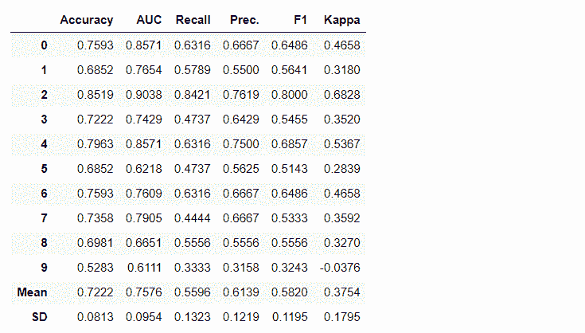

 Datawhale干货 

**编译：张峰，Datawhale成员**

寄语：PyCaret，是一款 Python中的开源低代码（low-code）机器学习库，支持在「低代码」环境中训练和部署有监督以及无监督的机器学习模型，提升机器学习实验的效率。

## 本文对PyCaret低代码库进行了简单介绍，并对其操作方法进行了详细的解读。现在，让我们一起来领略下：如何用仅仅几行代码搞定一个机器学习模型吧。

## 

## 首发 PyCaret 1.0.0

## 我们很高兴能宣布PyCaret，这是一个使用Python的开源机器学习库，用于在Windows上训练和部署有监督和无监督的机器学习模型低码环境。通过PyCaret，您可以在选择笔记本电脑环境后的几秒钟内，从准备数据到部署模型。

与其他开源机器学习库相比，PyCaret是一个备用的低代码库，可用于仅用很少的单词替换数百行代码。这使得实验快速而有效地成指数增长。PyCaret本质上是Python的包装器，它围绕着多个机器学习库和框架，例如scikit-learn，XGBoost，Microsoft LightGBM，spaCy等。

PyCaret简单易用。在PyCaret中执行的所有操作都按顺序存储在完全协调部署的管道中，无论是估算缺失值、转换分类数据、进行特征工程亦或是进行超参数调整，PyCaret都能自动执行所有操作。要了解有关PyCaret的更多信息，请观看此1分钟的视频。

## PyCaret入门

# 可以安装PyCaret的第一个稳定版本(PyCaret1.0.0)。使用命令行(command line)界面或笔记本(notebook)环境，运行下面的代码单元以安装PyCaret。

```
pip install pycaret 
```

```
如果您使用的是Azure笔记本或Google Colab，请运行以下代码单元以安装PyCaret。 
```

```
!pip install pycaret 
```

当您安装PyCaret时，将自动安装所有依赖项。完整依赖项列表参照下方链接：

https://github.com/pycaret/pycaret/blob/master/requirements.txt

# 没有比这更容易????，现在来直观感受下PyCaret的强大。


## 分步教程????

# **1\. 获取数据**

# 在本次循序渐进的教程中，我们将使用“糖尿病”数据集，目标是根据血压，胰岛素水平，年龄等多种因素来预测患者结果。直接从存储库导入数据集的最简单方法是使用pycaret.datasets模块中的get_data函数。

# *PyCaret的github仓库：https://github.com/pycaret/pycaret*

```
from pycaret.datasets import get_data
diabetes = get_data('diabetes') 
```


**????特别提****醒**： PyCaret可以直接与pandas数据框（dataframe）一起使用。

# **2\. 搭建环境**

PyCaret中任何机器学习实验的第一步都是通过导入所需的模块并初始化setup()来设置环境的。本示例中使用的模块是pycaret.classification。导入模块后，将通过定义数据框（'diabetes'）和目标变量（'Class variable'）来初始化setup()。

```
from pycaret.classification import *
exp1 = setup(diabetes, target = 'Class variable') 
```


所有预处理步骤都在setup()中应用。PyCaret拥有20多种功能，可为机器学习准备数据，它会根据setup函数中定义的参数创建转换管道（transformation pipeline）。

它会自动编排管道（pipeline）中的所有依赖项，因此您不必手动管理对测试数据集或未知的数据集进行转换的顺序执行。PyCaret的管道可以轻松地在各种环境之间转移，以实现大规模运行或轻松部署到生产环境中。以下是PyCaret首次发布时可用的预处理功能。PyCaret的预处理能力如下图：


????**特别提醒：**当setup()初始化时，将自动执行机器学习必需的数据预处理步骤，例如缺失值插补，分类变量编码，标签编码（将yes或no转换为1或0）和训练、测试集拆分（train-test-split）。

# **3.比较模型**

这是在有监督的机器学习实验（分类或回归）中建议的第一步。此功能训练模型库中的所有模型，并使用k倍交叉验证（默认10倍）比较通用评估指标。使用的评估指标是：

*   分类：Accuracy（准确度），AUC，Recall（召回率），Precision（精确度），F1，Kappa

*   回归：MAE，MSE，RMSE，R2，RMSLE，MAPE

```
compare_models() 
```


**????特别提醒：**

*   默认情况下，使用10倍交叉验证来评估指标。可以通过更改fold参数的值来更改它。

*   默认情况下，表格按“准确度”（从最高到最低）排序。可以通过更改sort参数的值来更改。

# **4.创建模型**

在PyCaret的任何模块中创建模型就像编写create_model一样简单。它仅接受一个参数，即作为字符串输入传递的模型名称。此函数返回具有k倍交叉验证分数和训练有素的模型对象的表格。

```
adaboost = create_model('ada') 
```



变量“ adaboost”存储一个由create_model函数返回的经过训练的模型对象，该对象是scikit-learn评估器。可以通过在变量后使用点（.）来访问训练对象的原始属性。请参见下面的示例。


**????特别提醒：**ret具有60多个开源即用型（ready-to-use）算法。查看PyCaret中可用的估算器/模型的完整列表：https://www.pycaret.org/create-model

# **5.调整模型**

tune_model功能用于机器学习模型的自动调整超参数。PyCaret 在预定义的搜索空间上使用随机网格搜索。此函数返回具有k倍交叉验证分数和训练有素的模型对象的表格。

```
tuned_adaboost = tune_model('ada') 
```


**????特别提醒：**tune_model位于无监督模块，如函数pycaret.nlp，pycaret.clustering和pycaret.anomal可与监督模块结合使用。例如，PyCaret的NLP模块可用于通过监督ML模型（例如“准确度”或“ R2”）评估目标/成本函数来调整主题参数（topics parameter）的数量。

# **6.集成模型**

ensemble_model功能用于ensembling训练的模型。它仅采用一个参数，即经过训练的模型对象。此函数返回具有k倍交叉验证得分和训练模型对象的表。

```
# creating a decision tree model
dt = create_model('dt')
# ensembling a trained dt model
dt_bagged = ensemble_model(dt) 
```


????**特别提醒：**

*   默认情况下，“Bagging”方法用于ensembling，可使用ensemble_model函数中的method参数将其更改为“Boosting” 。

*   PyCaret还提供blend_models和stack_models功能来集成多个训练过的模型。

# **7.显示模型**

可以使用plot_model函数对经过训练的机器学习模型进行性能评估和诊断。它使用训练有素的模型对象和作图的类型作为plot_model函数中的字符串输入。

```
# create a model
adaboost = create_model('ada')
# AUC plot
plot_model(adaboost, plot = 'auc')
# Decision Boundary
plot_model(adaboost, plot = 'boundary')
# Precision Recall Curve
plot_model(adaboost, plot = 'pr')
# Validation Curve
plot_model(adaboost, plot = 'vc') 
```


了解有关PyCaret中不同可视化的更多信息：https://www.pycaret.org/plot-model

或者，您可以使用评估模型（evaluate_model）函数通过botebook中的用户界面查看作图效果。

```
evaluate_model(adaboost) 
```


**????特别提醒：** plot_model函数pycaret.nlp模块可用于显示文本语料库和语义主题模型。

# **8.解释模型**

在现实生活中通常是这样，当数据之间的关系是非线性时，我们总是看到基于树的模型（tree-based ）比简单的高斯模型（simple gaussian models）做得更好。但是，这是以失去可解释性为代价的，因为基于树的模型没有像线性模型那样提供简单的系数。PyCaret 使用interpret_model函数实现SHAP（SHapley Additive exPlanations）。

```
# create a model
xgboost = create_model('xgboost')
# summary plot
interpret_model(xgboost)
# correlation plot
interpret_model(xgboost, plot = 'correlation') 
```


可以使用“plot = 'reason'”评估测试数据集中特定数据点（也称为原因自变量'reason argument'）的解释。在下面的示例中，我们正在检查测试数据集中的第一个实例。

```
interpret_model(xgboost, plot = 'reason', observation = 0) 
```


# **9.预测模型**

到目前为止，我们看到的结果仅基于训练数据集的k倍交叉验证（默认为70％）。为了查看模型在test / hold-out上的预测和性能，使用了predict_model函数。

```
# create a model
rf = create_model('rf')
# predict test / hold-out dataset
rf_holdout_pred = predict_model(rf) 
```


```
predict_model函数还用于预测未知的数据集。现在，我们将使用与训练时相同的数据集作为新的未知数据集的代理（proxy ）。实际上，每次使用新的未知数据集时，predict_model函数将被迭代使用。 
```

```
predictions = predict_model(rf, data = diabetes) 
```


**????特别提醒：**

*   predict_model函数还可以预测使用stack_models和create_stacknet函数创建的模型的顺序链（sequential chain）。

*   predict_model函数还可以使用deploy_model函数直接从AWS S3上托管的模型进行预测。

# **10.部署模型**

利用训练后的模型在未知数据集上生成预测的一种方法是：在训练过模型的同一notebooks / IDE中使用predict_model函数。但是，对未知数据集进行预测是一个迭代过程。根据用例，进行预测的频率可以是从实时预测到批量预测。PyCaret的deploy_model函数允许notebook环境在云端部署整个管道，包括经过训练的模型。

```
deploy_model(model = rf, model_name = 'rf_aws', platform = 'aws',authentication =  {'bucket'  : 'pycaret-test'}) 
```

# **11.保存模型/保存实验**

训练完成后，包含所有预处理转换和训练后的模型对象的整个管道都可以保存为二进制pickle文件。

```
# creating model
adaboost = create_model('ada')
# saving model
save_model(adaboost, model_name = 'ada_for_deployment') 
```


```
您还可以将包含所有中间输出的整个实验保存为一个二进制文件。 
```

```
save_experiment(experiment_name = 'my_first_experiment') 
```


**????特别提醒：**您可以使用PyCaret所有模块中可用的load_model和load_experiment函数加载保存的模型和保存的实验。

## 延伸阅读

## 【1】回归：https://pycaret.org/reg101/

## 【2】聚类：https://pycaret.org/clu101/

## 【3】异常检测：https://www.pycaret.org/anom101

## 【4】自然语言处理：https://pycaret.org/nlp101/

## 【5】关联规则挖掘：https://pycaret.org/arul101/

【6】预处理功能：https://www.pycaret.org/preprocessing

【7】模型列表：https://www.pycaret.org/create-model

【8】可视化信息：https://www.pycaret.org/plot-model


“为沉迷学习**点赞**↓