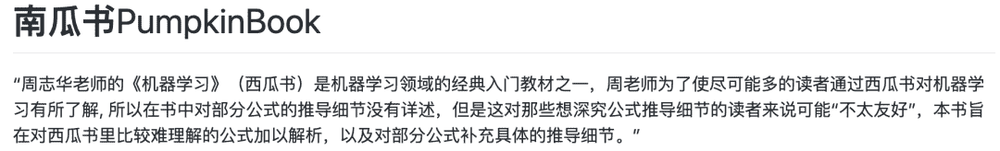
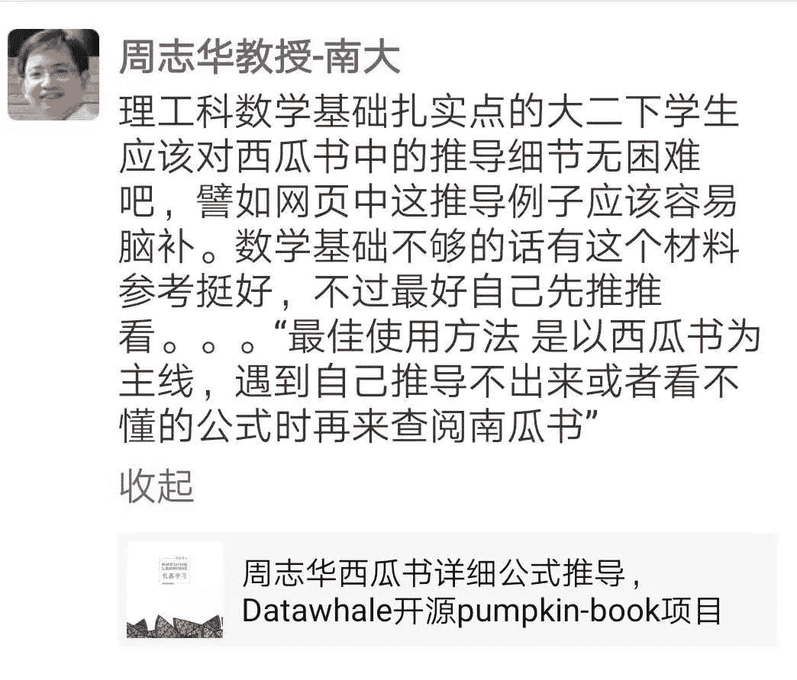
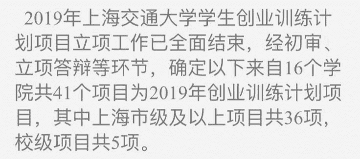
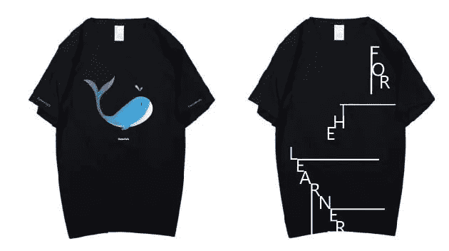
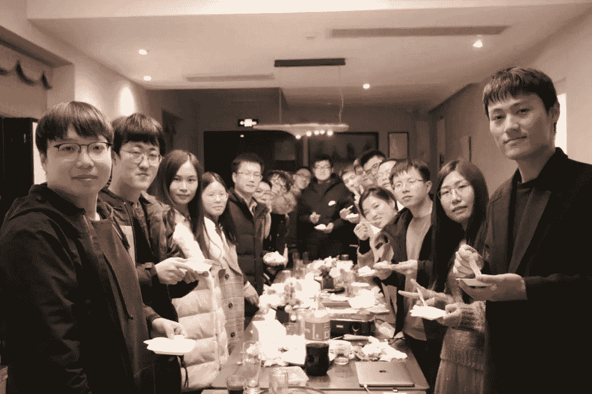

  Datawhale 

****作者：Datawhale成员****

Datawhale已经成立一年半了。Datawhale从一开始的12个人，学习互助，到提议建立开源组织，做更多开源的事情，帮助更多的学习者，也促进我们更好地成长。于是有了我们的愿景：“for the learner，和学习者一起成长”，希望成为国内对学习者最有价值影响的开源组织。

在这一年半的时间，Datawhale从发布第一个开源项目《Pumpkinook-南瓜书》。

开源地址：https://github.com/datawhalechina/pumpkin-book

惊喜于周老师分享。

设计了组织第一个鲸鱼logo。

在老师的鼓励下截止最后一天参与了交大项目评选，惊喜于被评为国家级项目（3/41），第一次得到学校资源和场地支持。

组织了十二期学习，包含了数据分析，数据挖掘，CV，NLP，机器学习，爬虫等多个领域，并将开源学习的理念首次写入数据科学教育白皮书。

点击可跳转↓

[第十二期组队学习（cv，数据分析，机器学习，爬虫）](http://mp.weixin.qq.com/s?__biz=MzIyNjM2MzQyNg%3D%3D&chksm=e870cbf8df0742eed855f0647c4ce83d4becd860af20d503683fc62663175d4ca2fdeca97b2d&idx=1&mid=2247490229&scene=21&sn=6d1529352c1c152516b36535ba2d2785#wechat_redirect)

[第十一期组队学习（数据挖掘）](http://mp.weixin.qq.com/s?__biz=MzIyNjM2MzQyNg%3D%3D&chksm=e870c69cdf074f8a1d038d52f634a80aded40c77ccd5573c43d8ba2a0623b7004d7b69524885&idx=1&mid=2247489489&scene=21&sn=5784d433b93e2315d87a825de3910e33#wechat_redirect)

[第十期组队学习（深度学习）](http://mp.weixin.qq.com/s?__biz=MzIyNjM2MzQyNg%3D%3D&chksm=e870c591df074c874aa849c5afca149ca3d898a8747d7f33dc7c44cff7cbb5be42d5024ee9a5&idx=1&mid=2247488732&scene=21&sn=926d226b6dea46c6a803ac4de0458bc0#wechat_redirect)

设计了组织的第一件文化衫。

组织的第一个周年聚会。

开始逐步清晰我们要做些什么。

一年多的时间，我们开始有了100多个团队成员，主要来自组织成员推荐和面向组织最优秀学习者进行定向邀请。这两天我们第一次面向Datawhale成员群及Datawhale优秀学习者群进行团队成员公开招募。

## 最终确认名单

总共收到100+份申请。由组织成员范晶晶、马燕鹏、谢文睿、杨冰楠和尹伊进行审核推荐，共选出了32位优秀的候选者，最终加权确定了15位优秀的小伙伴加入组织团队。第一批公开招募的Datawhale团队成员录取名单如下：

 1  吴争光   西安邮电大学

 2  陈琰钰   清华大学

 3  孙振亚   国防科技大学

 4  樊   亮   中科院大学

 5  梁家晖   华南理工大学

 6  陈信达   华北电力大学

 7  白玉瑶   同济大学

 8  闫守志   圣彼得堡国立电子科技大学

 9  王   琦   中国科学院大学

10  叶冬冬   苏州大学

11  但扬杰   江西师范大学

12  李一飞   北京航空航天大学

13  游璐颖   北京信息科技大学

14  徐旺华   广东工业大学

15  姚   童   华北电力大学

-------------

16  宋镜儒   香港理工大学

17  韩绘锦   华北电力大学

18  丁媛媛   中南财经政法大学

19  方   涛   武汉大学

20  杨佳乐   华东师范大学

21  李运佳   上海交通大学

22  浩浩雷   华东师范大学

23  邹俊超   江苏大学

24  王   琪   湖南大学

25  李芝翔   华北电力大学

26  毛鹏志   中科院计算所

27  吕福庆   杭州电子科技大学

28  陈英杰   中国人民大学

29  李赵飞   江西财经大学

30  蒋震阳   郑州大学

31  卢科达    广州大学

32  福   桃   西北工业大学

与此同时，在审核申请信息的过程中，了解到了更多组织成员是何时接触到Datawhale、大家认为或希望Datawhale存在的价值，以及对Datawhale的建议，在前行的路上共勉。

## 你是怎么了解到Datawhale的？

网络一线牵，珍惜这段缘。我们在此相遇、相识、相知。

2018年。

—冀剑飞

Datawhale成立的时候。

—谢   逍

2018年10月份左右，通过ApacheCN了解。

—邝宏政

2019 刷相关帖子。

—肖羽格

一年前，南瓜书项目。

—吴登昊

2019年暑假研究生入学前。 

—王   楷

去年，实验导师给我们介绍的。 

—黄建国

通过「南瓜书」了解到Datawhale。

—王   琦

通过微信公众号了解到Datawhale。

—樊   亮

2019年，在朋友圈看到了Datawhale公众号的文章。2020年参加了组织的公益AI活动。

 —王    琪

2020年初。

—吴争光

大三学机器学习时。

—王   岳

大一刚开始接触机器学习的时候。

—程千禧

一个大数据方向的研三师姐推荐给我的。 

—叶街林

## 你觉得或希望Datawhale体现的价值？

一千个人眼里有一千个哈姆雷特，但开源、分享、学习、成长依然是众多回复里出现的高频词。

开源，技术分享，同龄人相互学习与鼓励。

—郑凌瀚

成为中国最大的开源组织，帮助更多人学习。

—毛    伟

致力于开源，让更多的人学到更多的东西和技术！

—但扬杰

吸引更多志同道合的人加入社区，帮助大家一起成长。

—谢    逍

我希望Datawhale存在的价值是让喜欢学习的人有归属感。

—孙    洋

一起学习，创造更好的开源学习环境，结交一起奋斗的小伙伴。

—疯游离

帮助更多的人培养良好的学习习惯，向更多的人普及专业知识。

—靳羽茜

让很多平凡无奇，默默努力的人，有更好地学习方向变为一个更好的人。

—小   熙

为广大学习者提供优质学习资源的平台，为行业的发展添砖加瓦提供工具。

—毛鹏志

传播终身学习的理念；帮助迷茫的“后浪”，锚定一个方向；降低交流的成本。

—叶冬冬

希望Datawhale能成为一个标志，或者一种AI领域的精神，热爱并且不断突破。

—白玉瑶

Datawhale作为国内知名开源组织，存在的价值就是组织更多的人一起学习，一起进步。

—陈信达

可以组织大家一起学习，让一些志同道合的朋友合作有意思的事，做出中国的开源社区。

—黄建国

成为中国最大的，最有影响力的开源组织，为开源技术社区贡献自己的力量，壮大活跃开源的力量。

—闫永强

我觉得Datawhale的价值对我个人来说是提供了更多的学习机会，以及更多的和优秀的人交流的平台。

—闫润斌

我希望组织能够帮助更多的人进步，实现社会价值，我建议组织更多且更细分的学习小组，并能向社会输送优质人才。

—滕   飞

促进开源，探索开源，感觉开源的实现，让新手得到了太多的福利，基本上每个人都是从开源资料一步一步学起来的。

—吕福庆

像一座桥梁，搭建在人才与企业中。帮助人才成长，同时挖掘人才，提供机会，各取所需，共同营造良好的学术氛围。

—程千禧

从我个人角度来讲：我觉得Datawhale就是为众多学习者提供一个平台，汇集优秀学习者，降低学习者学习成本的一个组织。

—李赵飞

纯粹的学习圈子，一起构建一个高效的互相帮助成长的学习氛围和圈子，共同成长，共同学习，不断提高自身的学习能力 。

—宋镜儒

在我看来Datawhale所存在的价值应该是让准备投身于这个领域的人不迷茫，有归属感，提供给志同道合的人相互交流的环境。

—邝宏政

个人觉得Datawhale的存在价值是对于刚接触或者想要接触机器学习这个领域的人，有一个很好的引导作用，做一个指引方向的灯塔。

—吴争光

帮助更多人更好地成长，在这个组织内，每个人都能通过Datawhale的帮助与发起的活动来选择自己有兴趣的方向从而确定自己想要的未来。

—孙晨晨

Datawhale是一个很大的开源组织。能更好的去帮助，那些想学，愿意去学的的同学，一个好的机会。也能相互成长，是一个很棒的平台。

—左秉文

共同交流，学习和进步吧。有Datawhale的开创者们带着一批人学习进步，这一批又带着下一批学习进步……我觉得这本身就是一件很有意义和价值的事情。

—楚云猛

致力于为开源做出贡献，吸引越来越多的人一起学习技术交流技术，让学习的门槛降低，让有心学习的人可以找到学习的方法。是一个授人以渔的组织存在。

—叶街林

Datawhale成为为了想一起学习，一起分享经验，一起为了一个共同目标而努力小伙伴提供的平台，向开源致敬，希望能够吸引越来越多的学习者加入进来。

—郑大顺

“For the learner, with the learner”向学习者致敬，这个时代是学习者的先锋，Datawhale的价值，就是陪伴学习者成长，拥抱时代的脉搏，凝聚科技的力量。

—徐旺华

希望Datawhale继续把开源的精神、团队协作的学习方式、与企业合作比赛等继续延续下去，不断吸收优秀的人才和理念，丰富社区活动，不断壮大发展，争取更大的影响力。

—樊   亮

拥抱开源，共同进步。现在每期的学习计划就很好，希望可以做成一个成熟的系列。然后上次和伯禹还有阿里合办的活动也很好，希望可以和更多有影响力的组织一起办高质量的活动。

—杨佳乐

让更多人通过开源的方式学到更多的东西，影响更多的人通过开源方式合作，进而取得更大的突破。组织更多形式的线上活动，在开发新的开源项目的同时积极对之前的项目进行更新完善，不仅成为加油站，也成为图书馆。

—李沁霖

我希望Datawhale存在的价值是“开源学习”。我的个人看法是，可以多调动普通成员的积极性，让大家相互交流起来。虽然大佬们的分享很棒，但众人的结晶也应该会很有价值，毕竟大家在不同的行业，可以让大家了解到数据挖掘在不同行业应用的具体情况。

—王   琪

感觉Datawhale的开源的活动让越来越多人的收益，大家都可以平等的获得优质的学习资源，然后学习到知识的优秀学员又会反作用于组织让越来越多的人收益，让学习知识更容易，同时又汇聚了一批有着相同理想的小伙伴，感觉这件事特别棒！所以我也特别想加入到Datawhale的开源建设中来。

—韩绘锦

我觉得Datawhale最大的价值是就是带动了知识和技能的传播。之前我尝试在学校做小TED，核心观念就是分享让知识的价值翻倍，这个翻倍，不仅是对于传播者有倍增效果（费曼技巧强化理解+反馈沟通），对接收者更是如此（增加了知识量）。但相比TED，Datawhale做的是更专业的技能传播，并且通过社群模式增加个体黏性、扩充了组织的边界，这种方式也让我学习了很多。

—孙振亚

相信国内的开源环境会越来越好。

***阅读原文**可申请加入我们*

“**点个****赞**吧↓