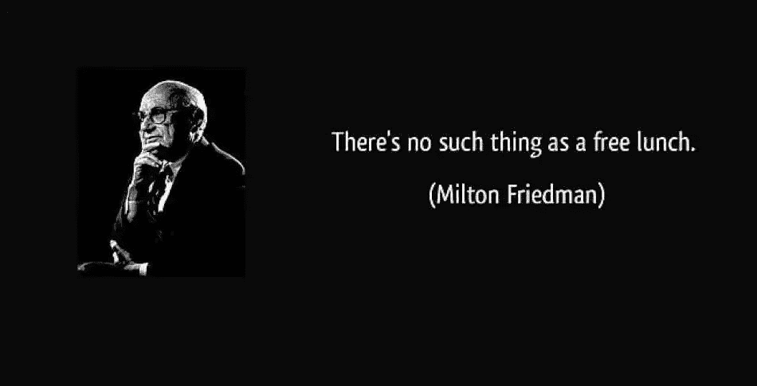
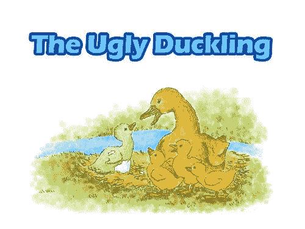
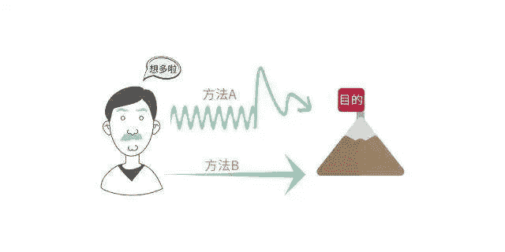
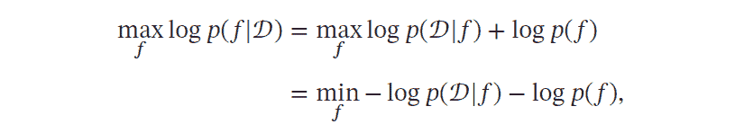
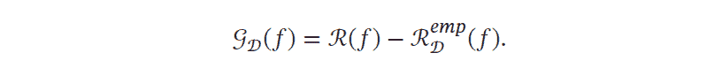
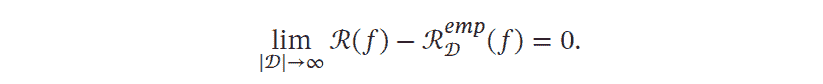
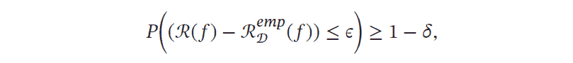
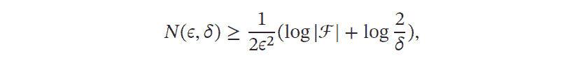

 Datawhale 

****作者：邱锡鹏，复旦大学教授****

寄语：本文对PAC学习理论、没有免费的午餐定理、丑小鸭定理、奥卡姆剃刀原理等机器学习中有名的理论或定理进行了详细的梳理。

在机器学习中，有一些非常有名的理论或定理，这些理论不仅有助于我们从本质理解机器学习特性，更好地学习相关理论，更重要的是可以有助于我们理解很多生活哲学，比如奥卡姆剃刀原理所延伸的极简主义：如无必要，勿增实体的理念，让我们一起细品吧。

## 没有免费午餐定理

没有免费午餐定理（NFL）是由Wolpert 和Macerday在最优化理论中提出的。没有免费午餐定理证明：对于基于迭代的最优化算法，不存在某种算法对所有问题（有限的搜索空间内）都有效。

如果一个算法对某些问题有效，那么它一定在另外一些问题上比纯随机搜索算法更差。也就是说，不能脱离具体问题来谈论算法的优劣，任何算法都有局限性. 必须要“具体问题具体分析”。

没有免费午餐定理对于机器学习算法也同样适用。不存在一种机器学习算法适合于任何领域或任务。 如果有人宣称自己的模型在所有问题上都好于其他模型，那么他肯定是在吹牛。

## 丑小鸭定理

丑小鸭定理（Ugly Duckling Theorem）是1969 年由渡边慧提出的[Watanable,1969]。“丑小鸭与白天鹅之间的区别和两只白天鹅之间的区别一样大”。这个定理初看好像不符合常识，但是仔细思考后是非常有道理的。

因为世界上不存在相似性的客观标准，一切相似性的标准都是主观的。

如果从体型大小或外貌的角度来看，丑小鸭和白天鹅的区别大于两只白天鹅的区别；但是如果从基因的角度来看，丑小鸭与它父母的差别要小于它父母和其他白天鹅之间的差别。

## 奥卡姆剃刀原理

奥卡姆剃刀原理是由14 世纪逻辑学家William of Occam提出的一个解决问题的法则：“如无必要，勿增实体“。

奥卡姆剃刀的思想和机器学习上正则化思想十分类似：简单的模型泛化能力更好。如果有两个性能相近的模型，我们应该选择更简单的模型。

因此，在机器学习的学习准则上，我们经常会引入参数正则化来限制模型能力，避免过拟合。

 奥卡姆剃刀的一种形式化是最小描述长度（Minimum Description Length，MDL）原则，即对一个数据集????，最好的模型???? ∈ ℱ 是会使得数据集的压缩效果最好，即编码长度最小。

最小描述长度也可以通过贝叶斯学习的观点来解释[MacKay, 2003]。模型???? 在数据集???? 上的对数后验概率为       

其中− log ????(????) 和− log ????(????|????) 可以分别看作是模型???? 的编码长度和在该模型下数据集???? 的编码长度。也就是说，我们不但要使得模型???? 可以编码数据集????，也要使得模型???? 尽可能简单。

## PAC 学习理论

当使用机器学习方法来解决某个特定问题时，通常靠经验或者多次试验来选择合适的模型、训练样本数量以及学习算法收敛的速度等。

但是经验判断或多次试验往往成本比较高，也不太可靠，因此希望有一套理论能够分析问题难度、计算模型能力，为学习算法提供理论保证，并指导机器学习模型和学习算法的设计。

这就是计算学习理论， 计算学习理论（Computational Learning Theory）是关于机器学习的理论基础，其中最基础的理论就是可能近似正确（Probably Approximately Correct，PAC）学习理论。

机器学习中一个很关键的问题是期望错误和经验错误之间的差异，称为泛化错误（Generalization Error）。泛化错误可以衡量一个机器学习模型???? 是否可以很好地泛化到未知数据。   

根据大数定律，当训练集大小|????| 趋向于无穷大时，泛化错误趋向于0，即经验风险趋近于期望风险。       

由于我们不知道真实的数据分布????(????, ????)，也不知道真实的目标函数????(????)，因此期望从有限的训练样本上学习到一个期望错误为0 的函数????(????) 是不切实际的。

因此，需要降低对学习算法能力的期望，只要求学习算法可以以一定的概率学习到一个近似正确的假设，即PAC 学习（PAC Learning）。

一个PAC 可学习（PACLearnable）的算法是指该学习算法能够在多项式时间内从合理数量的训练数据中学习到一个近似正确的????(????)。

PAC 学习可以分为两部分：

*   “近似正确”（Approximately Correct）：一个假设???? ∈ ℱ 是“近似正确”的，是指其在泛化错误???????? (????)小于一个界限????。????一般为0到1/2之间的数，0 < ???? < 1/2。如果???????? (????) 比较大，说明模型不能用来做正确的“预测”。

*   “可能”（Probably）：一个学习算法???? 有“可能”以1 − ???? 的概率学习到这样一个“近似正确”的假设。???? 一般为0 到1/2之间的数，0 < ???? < 1/2。

PAC 学习可以下面公式描述：       

其中????,???? 是和样本数量???? 以及假设空间ℱ 相关的变量。如果固定????、????，可以反过来计算出需要的样本数量：       

其中|ℱ| 为假设空间的大小. 从上面公式可以看出，模型越复杂，即假设空间ℱ 越大，模型的泛化能力越差。

要达到相同的泛化能力，越复杂的模型需要的样本数量越多。为了提高模型的泛化能力，通常需要正则化（Regularization）来限制模型复杂度。

PAC 学习理论也可以帮助分析一个机器学习方法在什么条件下可以学习到一个近似正确的分类器。从上述公式可以看出，如果希望模型的假设空间越大，泛化错误越小，其需要的样本数量越多。

## 归纳偏置

在机器学习中，很多学习算法经常会对学习的问题做一些假设，这些假设就称为归纳偏置（Inductive Bias）[Mitchell, 1997]。

比如在最近邻分类器中，我们会假设在特征空间中，一个小的局部区域中的大部分样本都同属一类。

在朴素贝叶斯分类器中，我们会假设每个特征的条件概率是互相独立的。归纳偏置在贝叶斯学习中也经常称为先验（Prior）。

本文摘编自复旦大学邱锡鹏教授的《神经网络与深度学习》，经出版方授权发布。自2016年在复旦大学计算机学院开设了《神经网络与深度学习》这门课程后，邱锡鹏老师的讲义便广为流传。经过4年的打磨，这份让周志华、李航联袂推荐的实体书，值得学习。

**方便学习 后台回复** ***机器学习原理** 可下载PDF*

“为沉迷学习**点赞**↓