 Datawhale推荐 

**机器之心编译**

> 要获得优秀的模型，首先需要清洗数据。这是一篇如何在 Python 中执行数据清洗的分步指南。

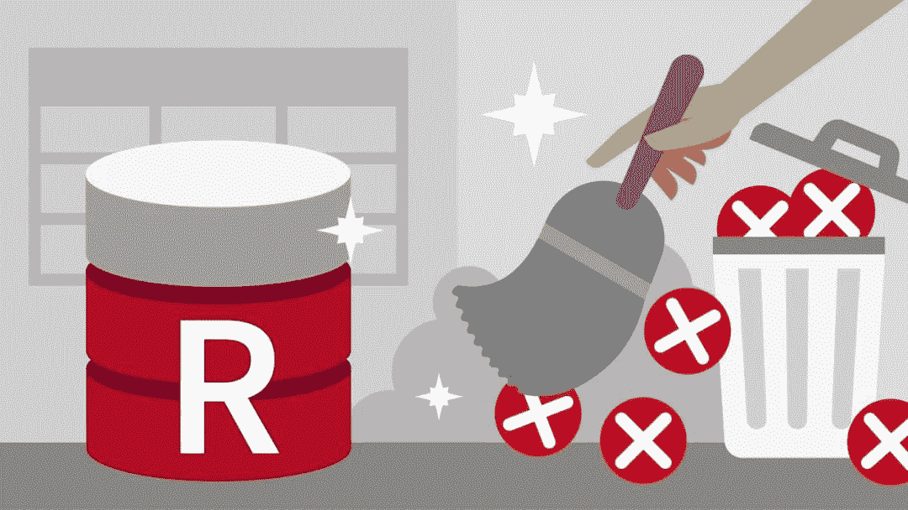

在拟合机器学习或统计模型之前，我们通常需要清洗数据。用杂乱数据训练出的模型无法输出有意义的结果。

> 数据清洗：从记录集、表或数据库中检测和修正（或删除）受损或不准确记录的过程。它识别出数据中不完善、不准确或不相关的部分，并替换、修改或删除这些脏乱的数据。

「数据清洗」光定义就这么长，执行过程肯定既枯燥又耗时。


*图源：**https://www.kdnuggets.com/2017/09/cartoon-machine-learning-class.html*

为了将数据清洗简单化，本文介绍了一种新型完备分步指南，支持在 Python 中执行数据清洗流程。读者可以学习找出并清洗以下数据的方法：

*   缺失数据；

*   不规则数据（异常值）；

*   不必要数据：重复数据（repetitive data）、复制数据（duplicate data）等；

*   不一致数据：大写、地址等；

该指南使用的数据集是 Kaggle 竞赛 Sberbank 俄罗斯房地产价值预测竞赛数据（该项目的目标是预测俄罗斯的房价波动）。本文并未使用全部数据，仅选取了其中的一部分样本。


*本文两位作者 Lianne & Justin。*

在进入数据清洗流程之前，我们先来看一下数据概况。

```
# import packages
import pandas as pd
import numpy as np
import seaborn as sns

import matplotlib.pyplot as plt
import matplotlib.mlab as mlab
import matplotlib
plt.style.use('ggplot')
from matplotlib.pyplot import figure

%matplotlib inline
matplotlib.rcParams['figure.figsize'] = (12,8)

pd.options.mode.chained_assignment = None

# read the data
df = pd.read_csv('sberbank.csv')

# shape and data types of the data
print(df.shape)
print(df.dtypes)

# select numeric columns
df_numeric = df.select_dtypes(include=[np.number])
numeric_cols = df_numeric.columns.values
print(numeric_cols)

# select non numeric columns
df_non_numeric = df.select_dtypes(exclude=[np.number])
non_numeric_cols = df_non_numeric.columns.values
print(non_numeric_cols) 
```

从以上结果中，我们可以看到该数据集共有 30,471 行、292 列，还可以辨别特征属于数值变量还是分类变量。这些都是有用的信息。

现在，我们可以浏览「脏」数据类型检查清单，并一一攻破。

开始吧！

**缺失数据**

处理缺失数据/缺失值是数据清洗中最棘手也最常见的部分。很多模型可以与其他数据问题和平共处，但大多数模型无法接受缺失数据问题。

**如何找出缺失数据？**

本文将介绍三种方法，帮助大家更多地了解数据集中的缺失数据。

方法 1：缺失数据热图

当特征数量较少时，我们可以通过热图对缺失数据进行可视化。

```
cols = df.columns[:30] # first 30 columns
colours = ['#000099', '#ffff00'] # specify the colours - yellow is missing. blue is not missing.
sns.heatmap(df[cols].isnull(), cmap=sns.color_palette(colours)) 
```

下表展示了前 30 个特征的缺失数据模式。横轴表示特征名，纵轴表示观察值/行数，黄色表示缺失数据，蓝色表示非缺失数据。

例如，下图中特征 life_sq 在多个行中存在缺失值。而特征 floor 只在第 7000 行左右出现零星缺失值。

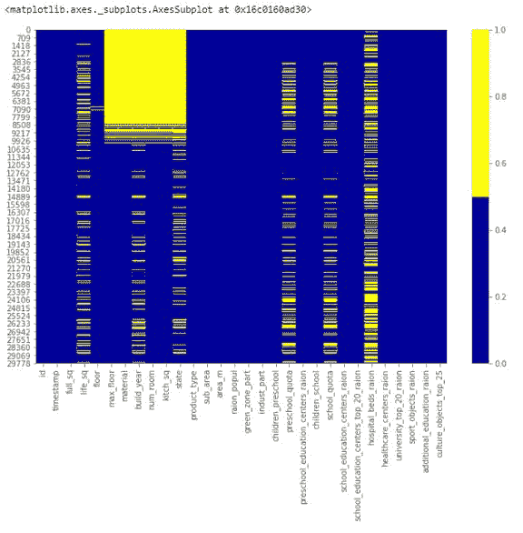*缺失数据热图*

方法 2：缺失数据百分比列表

当数据集中存在很多特征时，我们可以为每个特征列出缺失数据的百分比。

```
# if it's a larger dataset and the visualization takes too long can do this.
# % of missing.
for col in df.columns:
    pct_missing = np.mean(df[col].isnull())
    print('{} - {}%'.format(col, round(pct_missing*100))) 
```

得到如下列表，该表展示了每个特征的缺失值百分比。

具体而言，我们可以从下表中看到特征 life_sq 有 21% 的缺失数据，而特征 floor 仅有 1% 的缺失数据。该列表有效地总结了每个特征的缺失数据百分比情况，是对热图可视化的补充。

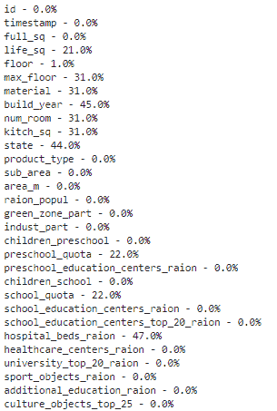

*前 30 个特征的缺失数据百分比列表*

方法 3：缺失数据直方图

在存在很多特征时，缺失数据直方图也不失为一种有效方法。

要想更深入地了解观察值中的缺失值模式，我们可以用直方图的形式进行可视化。

```
# first create missing indicator for features with missing data
for col in df.columns:
    missing = df[col].isnull()
    num_missing = np.sum(missing)

    if num_missing > 0:  
        print('created missing indicator for: {}'.format(col))
        df['{}_ismissing'.format(col)] = missing

# then based on the indicator, plot the histogram of missing values
ismissing_cols = [col for col in df.columns if 'ismissing' in col]
df['num_missing'] = df[ismissing_cols].sum(axis=1)

df['num_missing'].value_counts().reset_index().sort_values(by='index').plot.bar(x='index', y='num_missing') 
```

直方图可以帮助在 30,471 个观察值中识别缺失值状况。

例如，从下图中可以看到，超过 6000 个观察值不存在缺失值，接近 4000 个观察值具备一个缺失值。


*缺失数据直方图*

**如何处理缺失数据？**

这方面没有统一的解决方案。我们必须研究特定特征和数据集，据此决定处理缺失数据的最佳方式。

下面介绍了四种最常用的缺失数据处理方法。不过，如果情况较为复杂，我们需要创造性地使用更复杂的方法，如缺失数据建模。

解决方案 1：丢弃观察值

在统计学中，该方法叫做成列删除（listwise deletion），需要丢弃包含缺失值的整列观察值。

只有在我们确定缺失数据无法提供信息时，才可以执行该操作。否则，我们应当考虑其他解决方案。

此外，还存在其他标准。

例如，从缺失数据直方图中，我们可以看到只有少量观察值的缺失值数量超过 35。因此，我们可以创建一个新的数据集 df_less_missing_rows，该数据集删除了缺失值数量超过 35 的观察值。

```
# drop rows with a lot of missing values.
ind_missing = df[df['num_missing'] > 35].index
df_less_missing_rows = df.drop(ind_missing, axis=0) 
```

解决方案 2：丢弃特征

与解决方案 1 类似，我们只在确定某个特征无法提供有用信息时才丢弃它。

例如，从缺失数据百分比列表中，我们可以看到 hospital_beds_raion 具备较高的缺失值百分比——47%，因此我们丢弃这一整个特征。

```
# hospital_beds_raion has a lot of missing.
# If we want to drop.
cols_to_drop = ['hospital_beds_raion']
df_less_hos_beds_raion = df.drop(cols_to_drop, axis=1) 
```

解决方案 3：填充缺失数据

当特征是数值变量时，执行缺失数据填充。对同一特征的其他非缺失数据取平均值或中位数，用这个值来替换缺失值。

当特征是分类变量时，用众数（最频值）来填充缺失值。

以特征 life_sq 为例，我们可以用特征中位数来替换缺失值。

```
# replace missing values with the median.
med = df['life_sq'].median()
print(med)
df['life_sq'] = df['life_sq'].fillna(med) 
```

此外，我们还可以对所有数值特征一次性应用同样的填充策略。

```
# impute the missing values and create the missing value indicator variables for each numeric column.
df_numeric = df.select_dtypes(include=[np.number])
numeric_cols = df_numeric.columns.values

for col in numeric_cols:
    missing = df[col].isnull()
    num_missing = np.sum(missing)

    if num_missing > 0:  # only do the imputation for the columns that have missing values.
        print('imputing missing values for: {}'.format(col))
        df['{}_ismissing'.format(col)] = missing
        med = df[col].median()
        df[col] = df[col].fillna(med) 
```


很幸运，本文使用的数据集中的分类特征没有缺失值。不然，我们也可以对所有分类特征一次性应用众数填充策略。

```
# impute the missing values and create the missing value indicator variables for each non-numeric column.
df_non_numeric = df.select_dtypes(exclude=[np.number])
non_numeric_cols = df_non_numeric.columns.values

for col in non_numeric_cols:
    missing = df[col].isnull()
    num_missing = np.sum(missing)

    if num_missing > 0:  # only do the imputation for the columns that have missing values.
        print('imputing missing values for: {}'.format(col))
        df['{}_ismissing'.format(col)] = missing

        top = df[col].describe()['top'] # impute with the most frequent value.
        df[col] = df[col].fillna(top) 
```

解决方案 4：替换缺失值

对于分类特征，我们可以添加新的带值类别，如 _MISSING_。对于数值特征，我们可以用特定值（如-999）来替换缺失值。

这样，我们就可以保留缺失值，使之提供有价值的信息。

```
# categorical
df['sub_area'] = df['sub_area'].fillna('_MISSING_')

# numeric
df['life_sq'] = df['life_sq'].fillna(-999) 
```

**不规则数据（异常值）**

异常值指与其他观察值具备显著差异的数据，它们可能是真的异常值也可能是错误。

**如何找出异常值？**

根据特征的属性（数值或分类），使用不同的方法来研究其分布，进而检测异常值。

方法 1：直方图/箱形图

当特征是数值变量时，使用直方图和箱形图来检测异常值。

下图展示了特征 life_sq 的直方图。

```
# histogram of life_sq.
df['life_sq'].hist(bins=100) 
```

由于数据中可能存在异常值，因此下图中数据高度偏斜。

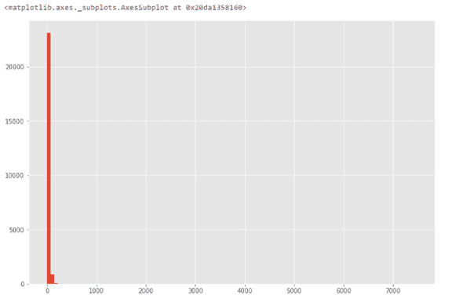

*直方图*

为了进一步研究特征，我们来看一下箱形图。

```
# box plot.
df.boxplot(column=['life_sq']) 
```

从下图中我们可以看到，异常值是一个大于 7000 的数值。

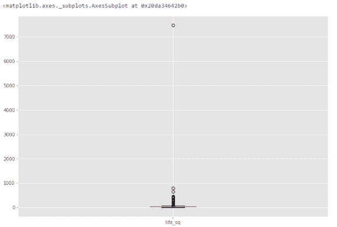

*箱形图*

方法 2：描述统计学

对于数值特征，当异常值过于独特时，箱形图无法显示该值。因此，我们可以查看其描述统计学。

例如，对于特征 life_sq，我们可以看到其最大值是 7478，而上四分位数（数据的第 75 个百分位数据）是 43。因此值 7478 是异常值。

```
df['life_sq'].describe() 
```


方法 3：条形图

当特征是分类变量时，我们可以使用条形图来了解其类别和分布。

例如，特征 ecology 具备合理的分布。但如果某个类别「other」仅有一个值，则它就是异常值。

```
# bar chart -  distribution of a categorical variable
df['ecology'].value_counts().plot.bar() 
```

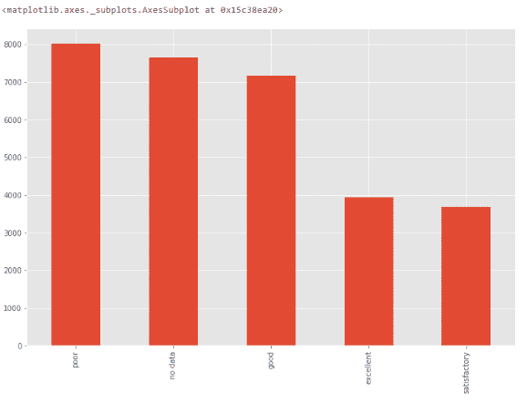

*条形图*

其他方法：还有很多方法可以找出异常值，如散点图、z 分数和聚类，本文不过多探讨全部方法。

**如何处理异常值？**

尽管异常值不难检测，但我们必须选择合适的处理办法。而这高度依赖于数据集和项目目标。

处理异常值的方法与处理缺失值有些类似：要么丢弃，要么修改，要么保留。（读者可以返回上一章节处理缺失值的部分查看相关解决方案。）

**不必要数据**

处理完缺失数据和异常值，现在我们来看不必要数据，处理不必要数据的方法更加直接。

输入到模型中的所有数据应服务于项目目标。不必要数据即无法增加价值的数据。

这里将介绍三种主要的不必要数据类型。

**不必要数据类型 1：信息不足/重复**

有时一个特征不提供信息，是因为它拥有太多具备相同值的行。

如何找出重复数据？

我们可以为具备高比例相同值的特征创建一个列表。

例如，下图展示了 95% 的行是相同值的特征。

```
num_rows = len(df.index)
low_information_cols = [] #

for col in df.columns:
    cnts = df[col].value_counts(dropna=False)
    top_pct = (cnts/num_rows).iloc[0]

    if top_pct > 0.95:
        low_information_cols.append(col)
        print('{0}: {1:.5f}%'.format(col, top_pct*100))
        print(cnts)
        print() 
```

我们可以逐一查看这些变量，确认它们是否提供有用信息。（此处不再详述。）

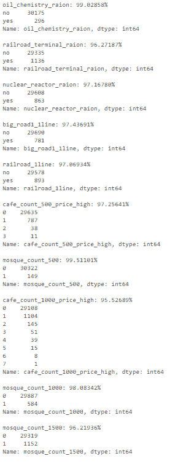

如何处理重复数据？

我们需要了解重复特征背后的原因。当它们的确无法提供有用信息时，我们就可以丢弃它。

**不必要数据类型 2：不相关**

再次强调，数据需要为项目提供有价值的信息。如果特征与项目试图解决的问题无关，则这些特征是不相关数据。

如何找出不相关数据？

浏览特征，找出不相关的数据。

例如，记录多伦多气温的特征无法为俄罗斯房价预测项目提供任何有用信息。

如何处理不相关数据？

当这些特征无法服务于项目目标时，删除之。

**不必要数据类型 3：复制**

复制数据即，观察值存在副本。

复制数据有两个主要类型。

复制数据类型 1：基于所有特征

如何找出基于所有特征的复制数据？

这种复制发生在观察值内所有特征的值均相同的情况下，很容易找出。

我们需要先删除数据集中的唯一标识符 id，然后删除复制数据得到数据集 df_dedupped。对比 df 和 df_dedupped 这两个数据集的形态，找出复制行的数量。

```
# we know that column 'id' is unique, but what if we drop it?
df_dedupped = df.drop('id', axis=1).drop_duplicates()

# there were duplicate rows
print(df.shape)
print(df_dedupped.shape) 
```

我们发现，有 10 行是完全复制的观察值。


如何处理基于所有特征的复制数据？

删除这些复制数据。

复制数据类型 2：基于关键特征

如何找出基于关键特征的复制数据？

有时候，最好的方法是删除基于一组唯一标识符的复制数据。

例如，相同使用面积、相同价格、相同建造年限的两次房产交易同时发生的概率接近零。

我们可以设置一组关键特征作为唯一标识符，比如 timestamp、full_sq、life_sq、floor、build_year、num_room、price_doc。然后基于这些特征检查是否存在复制数据。

```
key = ['timestamp', 'full_sq', 'life_sq', 'floor', 'build_year', 'num_room', 'price_doc']

df.fillna(-999).groupby(key)['id'].count().sort_values(ascending=False).head(20) 
```

基于这组关键特征，我们找到了 16 条复制数据。

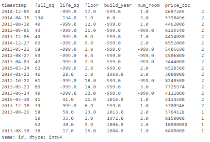

如何处理基于关键特征的复制数据？

删除这些复制数据。

```
# drop duplicates based on an subset of variables.

key = ['timestamp', 'full_sq', 'life_sq', 'floor', 'build_year', 'num_room', 'price_doc']
df_dedupped2 = df.drop_duplicates(subset=key)

print(df.shape)
print(df_dedupped2.shape) 
```

删除 16 条复制数据，得到新数据集 df_dedupped2。


**不一致数据**

在拟合模型时，数据集遵循特定标准也是很重要的一点。我们需要使用不同方式来探索数据，找出不一致数据。大部分情况下，这取决于观察和经验。不存在运行和修复不一致数据的既定代码。

下文介绍了四种不一致数据类型。

**不一致数据类型 1：大写**

在类别值中混用大小写是一种常见的错误。这可能带来一些问题，因为 Python 分析对大小写很敏感。

如何找出大小写不一致的数据？

我们来看特征 sub_area。

```
df['sub_area'].value_counts(dropna=False) 
```

它存储了不同地区的名称，看起来非常标准化。

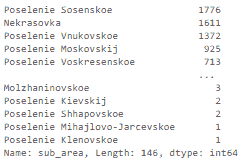

但是，有时候相同特征内存在不一致的大小写使用情况。「Poselenie Sosenskoe」和「pOseleNie sosenskeo」指的是相同的地区。

如何处理大小写不一致的数据？

为了避免这个问题，我们可以将所有字母设置为小写（或大写）。

```
# make everything lower case.
df['sub_area_lower'] = df['sub_area'].str.lower()
df['sub_area_lower'].value_counts(dropna=False) 
```

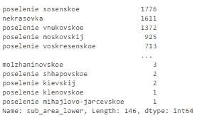

不一致数据类型 2：格式

我们需要执行的另一个标准化是数据格式。比如将特征从字符串格式转换为 DateTime 格式。

如何找出格式不一致的数据？

特征 timestamp 在表示日期时是字符串格式。

```
df 
```


如何处理格式不一致的数据？

使用以下代码进行格式转换，并提取日期或时间值。然后，我们就可以很容易地用年或月的方式分析交易量数据。

```
df['timestamp_dt'] = pd.to_datetime(df['timestamp'], format='%Y-%m-%d')
df['year'] = df['timestamp_dt'].dt.year
df['month'] = df['timestamp_dt'].dt.month
df['weekday'] = df['timestamp_dt'].dt.weekday

print(df['year'].value_counts(dropna=False))
print()
print(df['month'].value_counts(dropna=False)) 
```


相关文章：https://towardsdatascience.com/how-to-manipulate-date-and-time-in-python-like-a-boss-ddea677c6a4d

**不一致数据类型 3：类别值**

分类特征的值数量有限。有时由于拼写错误等原因可能出现其他值。

如何找出类别值不一致的数据？

我们需要观察特征来找出类别值不一致的情况。举例来说：

由于本文使用的房地产数据集不存在这类问题，因此我们创建了一个新的数据集。例如，city 的值被错误输入为「torontoo」和「tronto」，其实二者均表示「toronto」（正确值）。

识别它们的一种简单方式是模糊逻辑（或编辑距离）。该方法可以衡量使一个值匹配另一个值需要更改的字母数量（距离）。

已知这些类别应仅有四个值：「toronto」、「vancouver」、「montreal」和「calgary」。计算所有值与单词「toronto」（和「vancouver」）之间的距离，我们可以看到疑似拼写错误的值与正确值之间的距离较小，因为它们只有几个字母不同。

```
from nltk.metrics import edit_distance

df_city_ex = pd.DataFrame(data={'city': ['torontoo', 'toronto', 'tronto', 'vancouver', 'vancover', 'vancouvr', 'montreal', 'calgary']})

df_city_ex['city_distance_toronto'] = df_city_ex['city'].map(lambda x: edit_distance(x, 'toronto'))
df_city_ex['city_distance_vancouver'] = df_city_ex['city'].map(lambda x: edit_distance(x, 'vancouver'))
df_city_ex 
```

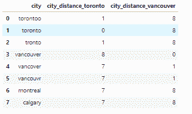

如何处理类别值不一致的数据？

我们可以设置标准将这些拼写错误转换为正确值。例如，下列代码规定所有值与「toronto」的距离在 2 个字母以内。

```
msk = df_city_ex['city_distance_toronto'] <= 2
df_city_ex.loc[msk, 'city'] = 'toronto'

msk = df_city_ex['city_distance_vancouver'] <= 2
df_city_ex.loc[msk, 'city'] = 'vancouver'

df_city_ex 
```

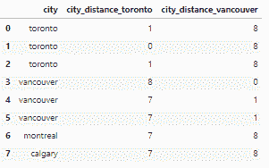

不一致数据类型 4：地址

地址特征对很多人来说是老大难问题。因为人们往数据库中输入数据时通常不会遵循标准格式。

如何找出地址不一致的数据？

用浏览的方式可以找出混乱的地址数据。即便有时我们看不出什么问题，也可以运行代码执行标准化。

出于隐私原因，本文采用的房地产数据集没有地址列。因此我们创建具备地址特征的新数据集 df_add_ex。

```
# no address column in the housing dataset. So create one to show the code.
df_add_ex = pd.DataFrame(['123 MAIN St Apartment 15', '123 Main Street Apt 12   ', '543 FirSt Av', '  876 FIRst Ave.'], columns=['address'])
df_add_ex 
```

我们可以看到，地址特征非常混乱。

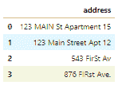

如何处理地址不一致的数据？

运行以下代码将所有字母转为小写，删除空格，删除句号，并将措辞标准化。

```
df_add_ex['address_std'] = df_add_ex['address'].str.lower()
df_add_ex['address_std'] = df_add_ex['address_std'].str.strip() # remove leading and trailing whitespace.
df_add_ex['address_std'] = df_add_ex['address_std'].str.replace('\\.', '') # remove period.
df_add_ex['address_std'] = df_add_ex['address_std'].str.replace('\\bstreet\\b', 'st') # replace street with st.
df_add_ex['address_std'] = df_add_ex['address_std'].str.replace('\\bapartment\\b', 'apt') # replace apartment with apt.
df_add_ex['address_std'] = df_add_ex['address_std'].str.replace('\\bav\\b', 'ave') # replace apartment with apt.

df_add_ex 
```

现在看起来好多了：

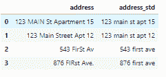

结束了！我们走过了长长的数据清洗旅程。

现在你可以运用本文介绍的方法清洗所有阻碍你拟合模型的「脏」数据了。

**方便学习 后台回复** ***数据清洗** 可下载PDF*


“为沉迷学习**点赞**↓