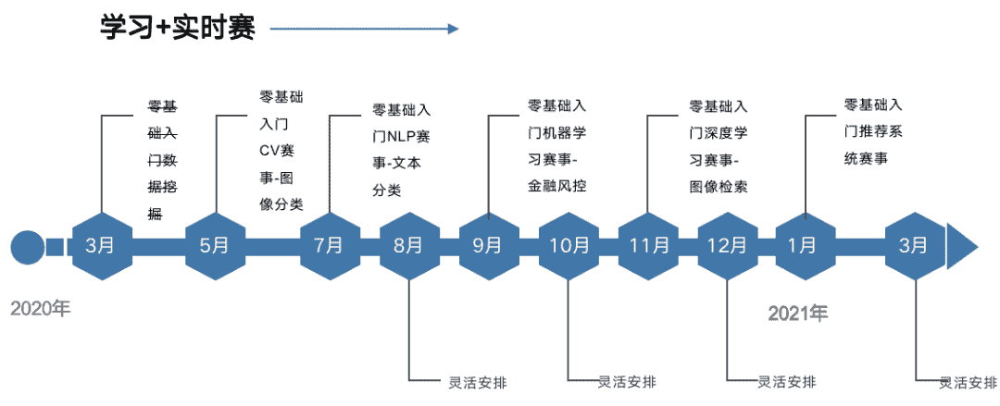
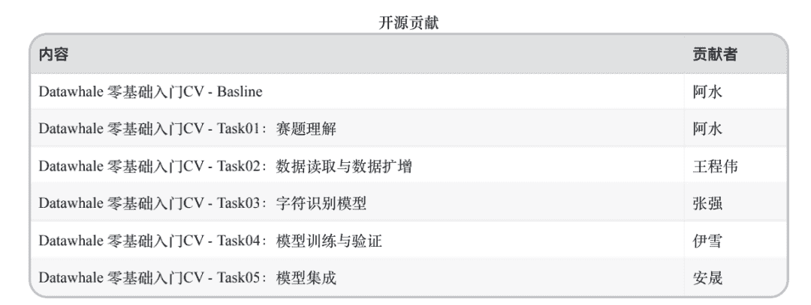
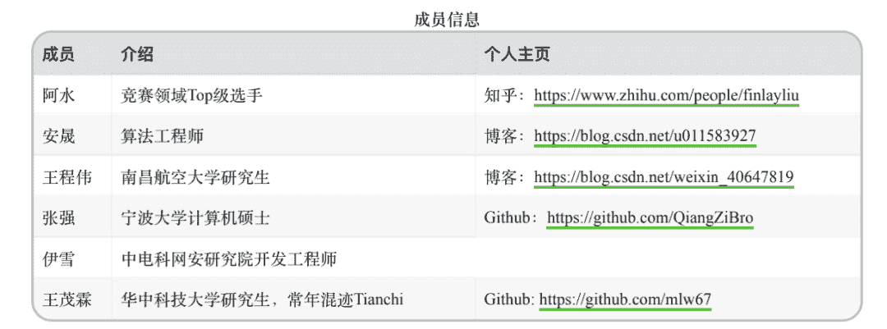
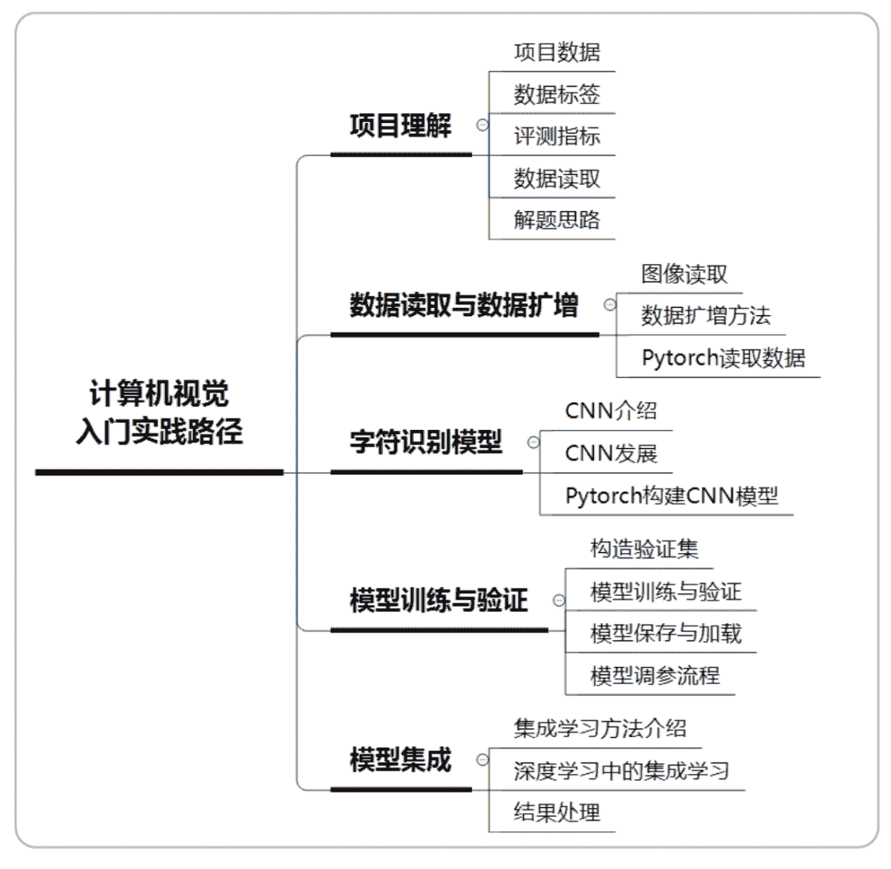
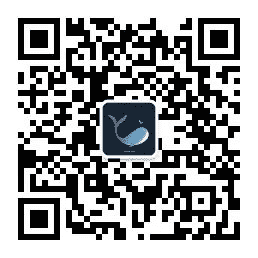
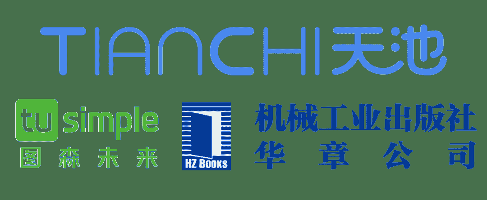

 Datawhale学习 

****联合主办：阿里云天池、图森未来、华章图书****

寄语：本次计算机视觉 (cv) 组队学习，属于零基础实践系列，旨在理论结合实践，帮助学习者对计算机视觉项目的完整流程进行梳理学习。

这是Datawhale联合天池的系列学习（数据挖掘、CV、NLP、机器学习、深度学习、推荐系统）第二场。本次学习以计算机视觉竞赛项目为实践，将会对数据读取、数据扩增、字符识别模型、模型训练、模型验证及模型集成展开学习，让学习者在一起逐步提升。

## 关于开源

**开源目的**：Datawhale作为开源组织，更多是希望营造互促的学习氛围和纯粹的学习环境，所有学习内容和学习规划都将开源在Datawhale Github上，方便大家有监督和无监督学习，从而帮助到更多学习者成长。同时也希望成长后的学习者参与到开源贡献，进行迭代完善，形成良性循环。附：[Datawhale团队第一期录取名单](http://mp.weixin.qq.com/s?__biz=MzIyNjM2MzQyNg%3D%3D&chksm=e8733174df04b8628f780941e288b4158adb7f7111fbbf6b82d78728f4ffaaeba02c8b889bb6&idx=1&mid=2247491641&scene=21&sn=eb98ebb9b13639ca7d22e91b8ad62da6#wechat_redirect)

**开源地址**：

https://github.com/datawhalechina/team-learning

**组队学习**：关于组队学习，顾名思义，就是一群志同道合的小伙伴聚集一起，一起学习，一起讨论，一起组队打boss，一起克服拖延症。其实没有老师，没有教学，有的是一群热爱学习和渴望改变的小伙伴，交流学习，互促共进。

事不宜迟，来看看这次具体有哪些内容吧。

## 开源内容

**开源贡献**：阿水、安晟、王程伟、张强、伊雪、王茂霖

**开源路线**：计算机视觉实践路径

***完整电子版（共50多页）***：在Datawhale后台回复 **CV电子版** 下载

**开源地址**：

https://github.com/datawhalechina/team-learning/tree/master/03 计算机视觉/计算机视觉实践（街景字符编码识别）

**延伸阅读**：

*   《机器学习：使用OpenCV和Python进行智能图像处理》

*   《深度学习与图像识别：原理与实践》

## 学习实践

Datawhale与天池开放了零基础入门CV赛事：「街景字符编码识别」，让学习与实践相结合。同时，对于参与Datawhale学习中的优秀学习者、优秀队长，阿里天池将颁发官方证书和礼品，在这里特别感谢天池爸爸的支持。

*https://tianchi.aliyun.com/competition/entrance/531795/introduction*

## 参与学习

**学习规则**

1\. 组织学习本身非盈利目的，避免非学习占用名额，需交9.9元督促金，完成所有学习后返还；

2\. 需要有一个博客等可以记录学习的公开帐号；

3\. 根据任务安排学习，完成后写学习笔记blog；

4\. 任务截止前在群内打卡，遇到问题一起交流讨论；

5\. 未按时打卡的同学视为自动放弃，流出学习群。

注：组队学习只是提供了好的学习环境，学习内容及资料都已开源在Datawhale Github和开源教程上，未能参加也可以根据开源路线自行学习。

**报名方式**

**5月16日20:00**在Datawhale社群（高校群和在职群）分享本次组队学习入群二维码，学习时长**两周**左右。未在社群的小伙伴，可在公众号后台回复关键词“**高校**”或“**在职**”进Datawhale社群（已在社群的小伙伴请勿重复加入！）回复 **CV电子版** 可下载完整的开源学习教程。

▲长按关注回复

****学习锦鲤****

对于曾经参加过Datawhale学习或者关注Datawhale超过两个月时间以上的你（感谢有你），只要你转发和推荐这篇开源分享，就有资格成为**学习锦鲤****。**我们将抽取**20位**幸运锦鲤。其中第一位将获得：阿里天池提供的**天猫精灵**，**小米充电宝**，**无线鼠标**，图森未来提供的**笔记本电脑包**，**T-恤，**华章价值144元邱锡鹏**《神经网络与深度学习》**一本和一次Datawhale**优先学习机会**。

我是幸运锦鲤，点我抽奖！

## 开源支持

*   **天池**：阿里云旗下大数据竞赛平台，围绕云生态挖掘输送优秀人才，聚集全球顶尖AI开发者，旨在打造“数据众智、众创”平台。

*   **图森未来**：一家专注于L4级无人驾驶卡车技术研发与应用的人工智能企业，为全球物流运输行业赋能，估值超过10亿美元，是无人驾驶货运领域首个独角兽企业。

*   **华章公司**：专注高端IT图书出版25年。华章公司成立于1995年，专注于为计算机、电子工程等IT领域的专业读者提供学习解决方案。

“为沉迷学习**点赞**↓