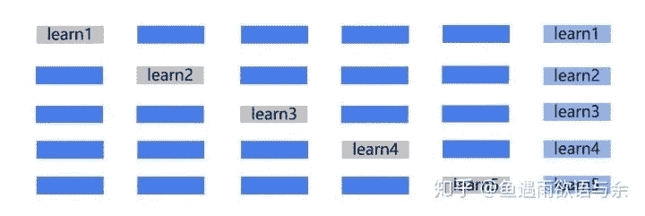

**写在前面**

**期待已久的2020腾讯广告算法大赛终于开始了，本届赛题“广告受众基础属性预估”。本文将给出解题思路，以及最完备的竞赛资料，助力各位取得优异成绩！！！**

**报名链接：****https://algo.qq.com/signup.html?rfisource=DSFISH**

赛题数据刚刚发出，小编作为数据竞赛圈狂热爱好者当然也不会错过这次学习的机会啦，解读数据成为问题建模的第一步，本文将从赛题理解、特征提取和建模思路进行一一分析，希望能对大家带来帮助。同时也要继续关注Coogle，后面会带来更多赛题思路分享。

**赛题数据**

赛题数据其实还是比较干净清爽的，用户基本属性信息只需要我们预测性别和年龄，其余的都是用户点击日志和广告相关信息。初期需要去理解每个变量的含义，比如creative_id广告素材可能由文案、图片和视频组成，一个广告包含多个广告素材，因此广告素材生成的流程也需要加以了解。这也是影响广告投放的重要环节之一，首先结合用户画像和卖点提炼，然后确定使用场景，最后进行素材的筛选和加工。

对数据和业务的基本认识可以帮助我们深入理解赛题，挖掘更多有用信息。

**click_log.csv: **

*   time: 天粒度的时间，整数值，取值范围[1, 91]。 

*   user_id: 从 1 到 N 随机编号生成的不重复的加密的用户 id，其中 N 为用户总数目（训练集和测试集）。

*   creative_id: 用户点击的广告素材的 id，采用类似于 user_id 的方式生成。

*   lick_times: 当天该用户点击该广告素材的次数。

**user.csv: **

*   user_id：用户id

*   age: 分段表示的用户年龄，取值范围[1-10]。 

*   gender：用户性别，取值范围[1,2]。

ad.csv: 

*   creative_id：广告素材id

*   ad_id: 该素材所归属的广告的 id，采用类似于 user_id 的方式生成。每个广告可能包含多个可展示的素材。

*   product_id: 该广告中所宣传的产品的 id，采用类似于 user_id 的方式生成。

*   product_category: 该广告中所宣传的产品的类别 id，采用类似于 user_id 的方式生成。

*   advertiser_id: 广告主的 id，采用类似于 user_id 的方式生成。

*   industry: 广告主所属行业的 id，采用类似于 user_id 的方式生成。

**特征提取**

用户的历史点击行为可以反映其属性特点，比如男性偏爱电子产品、游戏等，女性则更偏爱服饰、化妆品等，所以从点击序列中挖掘信息更为重要，其实也可以看着多值离散特征，对于重复的id问题，需要进一步尝试对比。那么如何挖掘序列信息呢，这里的方法就比较多了，下面逐个介绍。

*   **统计特征**

一般而言，以user_id维主键进行统计序列内的信息统计，如nunique、mean、max、min、std、count等等，对于nunique，用户点击素材id的类型个数，反映用户的兴趣范围。当然去年的一些统计特征也可以用，回忆一下去年的“三刀流”，其中的目标编码能够发挥很大的作用。

一切问题都可以考虑根据目标变量进行有监督的构造特征。此题也不例外，目标变量为用户年龄核性别，那么我们就可以构造与目标有关的特征。然而这会存在一个问题，特别容易过拟合。

有效的办法是采用交叉验证的方式，比如我们将将样本划分为5份，对于其中每一份数据，我们都用另外4份数据来构造。简单来说未知的数据在已知的数据里面取特征。

*   **one-hot/top提取**

直接展开，保留所有信息，300多万维，可以直接放弃了。或者提取top点击的广告，然后再进行统计。

*   **词频统计/TF-IDF**

NLP中常用的做法，将用户点击序列中的creative_id或者ad_id集合看作一篇文档，将每个creative_id或者ad_id视为文档中的文字，然后使用tfidf。当然这也下来维度也非常高，可以通过参数调整来降低维度，比如sklearn中的TfidfVectorizer，可以使用max_df和min_df进行调整。

*   **word2vec/deepwalk/fasttext等等**

把每个点击的creative_id或者ad_id当作一个词，把一个人90天内点击的creative_id或者ad_id列表当作一个句子，使用word2vec来构造creative_id或者ad_id嵌入表示。最后进行简单的统计操作得到用户的向量表示。除此之外还能够通过creative_id被user_id点击的序列来构造user_id向量表示。

建模方案对比

**One-Vs-All：**

在预测中可以将多分类问题看做多个二分类问题（One-Vs-All），选择其中一个类别为正类（Positive），使其他所有类别为负类（Negative）。比如第一步，我们可以将三角形所代表的实例全部视为正类，其他实例全部视为负类。在预测阶段，每个分类器可以根据测试样本，得到当前正类的概率。即 P(y = i / x; θ)，i = 1, 2, 3..10。选择计算结果最高的分类器，其正类就可以作为预测结果。

**One-Vs-One**

相比于 One-Vs-All 由于样本数量可能的偏向性带来的不稳定性，One-Vs-One 是一种相对稳健的扩展方法。对于3分类问题，我们像举行车轮作战一样让不同类别的数据两两组合训练分类器，可以得到 3 个二元分类器。任何一个测试样本都可以通过分类器的投票选举出预测结果，这就是 One-Vs-One 的运行方式。

**Softmax**

我们用 Sigmoid 函数将一个多维数据（一个样本）映射到一个 0 - 1 之间的数值上，那有没有什么方法从数学上让一个样本映射到多个 0 - 1 之间的数值呢？有！我们可以通过 Softmax 函数，使所有概率之和为 1，是对概率分布进行归一化。在处理一些样本可能丛属多个类别的分类问题是，使用 one vs one 或 one vs all 有可能达到更好的效果。Softmax 回归适合处理一个样本尽可能属于一种类别的多分类问题。

**Regression**

年龄是存在数值关系的，处理多分类以为，还可以用回归的方式进行建模，在很多类似问题中都有不错的效果，在具体建模的时候，需要注意结果转为整数（1,2,3...10），对于超出年龄范围的结果需要就近转化。

参考链接

1\. https://weavingwong.github.io/2019/07/HUAWEI-DigiX/

2\. https://www.zhihu.com/people/wang-he-13-93/posts?page=2

**更多学习资料**

历届腾讯赛答辩PPT获取

关注我们并后台回复【**2020腾讯赛**】

“为沉迷学习**点赞**↓