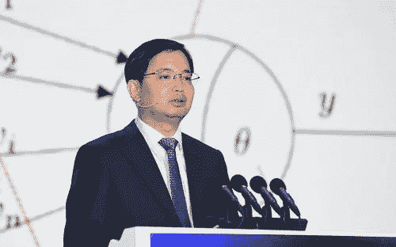
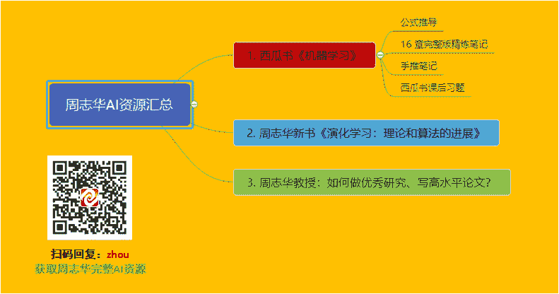
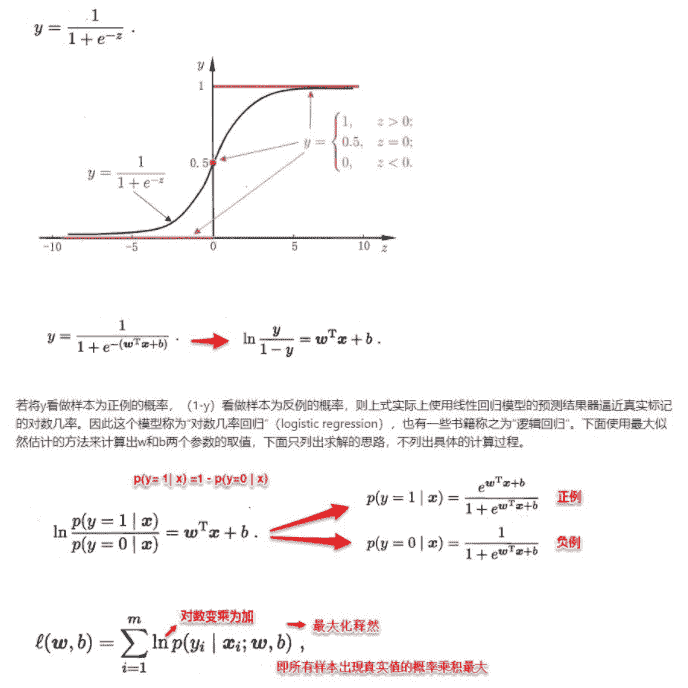
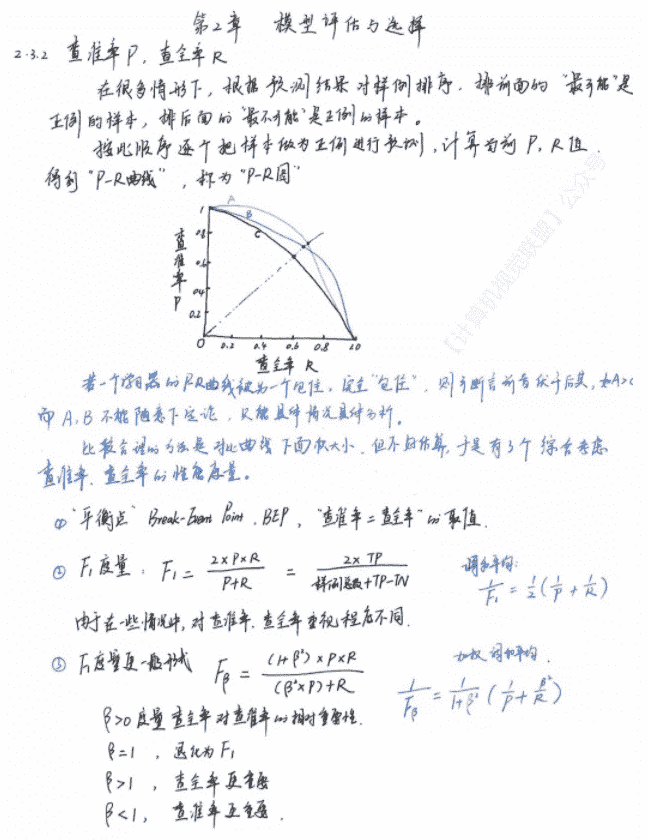
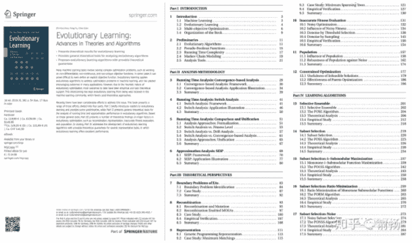
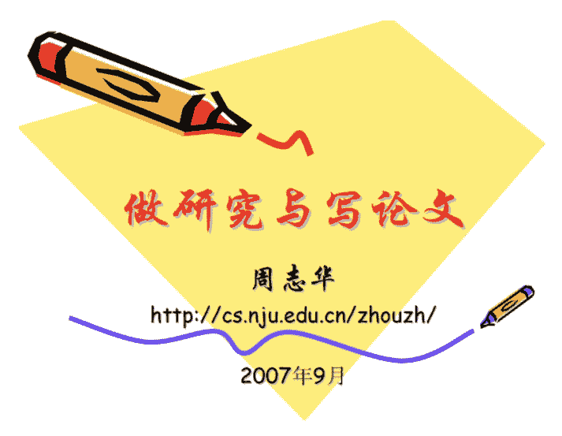

编辑 | Will

出品 | 字节AI

南京大学教授，博士生导师，教育部“长江学者”特聘教授，国家杰出青年基金获得者！周志华老师的头衔太多了！相信每一个从事或爱好机器学习的朋友都知道周志华老师，尤其是他的那本经典巨作《机器学习》，又称为西瓜书。

如果让你推荐两本国内机器学习的入门经典作，你会推荐哪些呢？相信大家同我一样，非周志华的《机器学习》莫属。周志华老师的《机器学习》，自 2016 年 1 月底出版以来，首印 5000 册一周售罄，并在 8 个月内重印 9 次，累计 72000 册。先后登上了亚马逊，京东，当当网等的计算机类畅销书榜首。就我了解，身边学习机器学习的小伙伴可谓是人手一本了。

今天我们将周志华老师经典的机器学习资源进行汇总，并整理出一份较为完备的学习路线，供大家学习。

首先，我们整理了周志华完整 AI 资源的思维导图：

## **1\. 西瓜书《机器学习》**

西瓜书《机器学习》是一本较为全面的书籍，书中详细介绍了机器学习领域不同类型的算法(例如：监督学习、无监督学习、半监督学习、强化学习、集成降维、特征选择等)。

**公式推导：**

西瓜书虽好，但是其中的数学公式推导较为复杂，看起来比较吃力！没关系，开源组织Datawhale  将西瓜书中 1-16 章节的公式进行了整理，对西瓜书中难点公式进行了详解，有跳跃性的公式进行了补充，于是有了《pumpkin-book》南瓜书项目。

《pumpkin-book》GitHub项目链接：

https://github.com/datawhalechina/pumpkin-book

在线阅读地址：

https://datawhalechina.github.io/pumpkin-book/

目前该项目已经高达 11k star 。

**16 章完整版**精炼**笔记：**

优秀的书籍少不了优秀的笔记，推荐一个西瓜书《机器学习》的精炼版笔记。作者 Vay-keen 来自深圳大学，将自己整理的完整版笔记发布在了 GitHub 上。直接放出笔记地址：

https://github.com/Vay-keen/Machine-learning-learning-notes

这份笔记总共包含 17 份 .md 文档，优势在于美分文档集合了图片和公式，清晰明了。这 17 份文档涵盖了西瓜书 16 章的完整内容。

目前该项目已经收到 3.7k star 了。

**手推笔记：**

本笔记是博士 AI 系列手推笔记，作者将西瓜书每章重点知识点进行了手算推导，真是厉害！

项目地址：

https://github.com/Sophia-11/Machine-Learning-Notes

目前该项目已经收到 1.1k star 了。

完整版下载见文末！

**西瓜书课后习题：**

推荐几个不错的西瓜书课后习题资源：

机器学习(周志华西瓜书)参考答案总目录：

https://blog.csdn.net/icefire_tyh/article/details/52064910?depth_1-utm_source=distribute.pc_relevant.none-task-blog-BlogCommendFromBaidu-5&utm_source=distribute.pc_relevant.none-task-blog-BlogCommendFromBaidu-5

《机器学习》周志华西瓜书 笔记/习题答案：

https://blog.csdn.net/TeFuirnever/article/details/96178919

机器学习（周志华）课后习题：

https://zhuanlan.zhihu.com/c_1013850291887845376

## **2\. 周志华新书《演化学习：理论和算法的进展》**

##### 由周志华教授、俞扬教授和钱超研究员共同完成的新书——《Evolutionary Learning: Advances in Theories and Algorithms》堪称“宝藏级”新书，速来收藏。

这本《演化学习：理论和算法的进展》涵盖了许多机器学习任务涉及解决复杂的优化问题，例如处理不可微分，非连续和非唯一的目标函数;在某些情况下，甚至难以定义明确的目标函数。演化学习（ Evolutionary learning ）应用演化算法来解决机器学习中的优化问题，并在许多应用中产生了令人满意的结果。

本书共分为四个部分：

*   **第一部分**：简要向读者介绍演化学习并提供了一些预备知识；

*   **第二部分**：介绍演化算法中运行时间和近似性能分析的一般理论工具；

*   **第三部分**：提出许多关于演化优化中主要因素的理论发现；

*   **第四部分**：讨论了演化学习算法的发展，为几个代表性任务提供了可证明的理论保证。

书籍链接：

https://www.springer.com/cn/book/9789811359552

## **3\. 周志华：如何做优秀研究、写高水平论文？**

本文整理了著名人工智能学者周志华教授《做研究与写论文》的PPT(时间比较早，但方法永远不会过时)。其详细介绍了关于为什么要做研究？如何做研究，选择研究方向、选择研究课题(Topic)，学习领域知识、选期刊投稿、稿件处理过程、写高水平论文的方法与技巧等方面的知识，是一份非常优秀的做研究和写论文指南，值得每个人细读。

完整版下载见文末！

## 资源获取

本文搜集了周志华全网非常详尽的学习资源和优质课程。

本文和上面思维导图整理的所有周志华 AI 资源，我们已经打包整理完毕！需要的可以按照以下方式获取：

**1\. 扫描下方二维码关注****"字节AI"****公众号**

**2\. 公众号后台回复关键词：****zhou**

